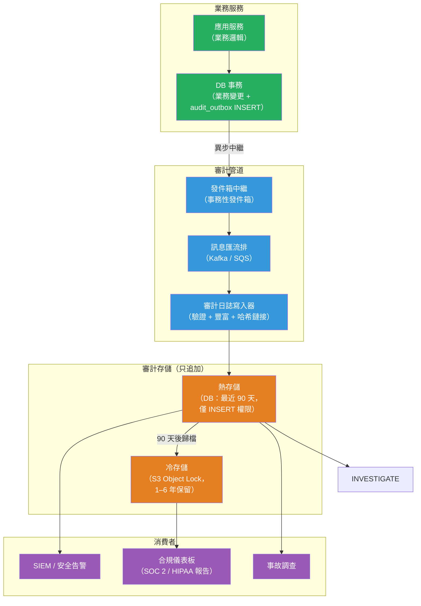

# [BEE-462] 審計日誌架構

:::info
審計日誌是誰在何時對哪個資源執行了什麼操作的只追加、防篡改記錄——服務於合規性、安全調查和問責制，而非運維可觀測性。
:::

## 背景

運維日誌（結構化日誌、追蹤、指標）回答：「系統健康嗎？瓶頸在哪裡？」審計日誌回答不同的問題：「誰存取了這筆病患記錄？誰批准了那筆付款？誰刪除了那個帳戶？」這些面向根本不同的使用者——開發者和 SRE 閱讀運維日誌；合規官、安全團隊和審計師閱讀審計日誌——工程需求也隨之不同。

NIST 特別出版物 800-92（「電腦安全日誌管理指南」，2006 年）建立了基礎框架：審計日誌必須捕獲操作者（誰）、動作（什麼）、資源（對什麼）、時間戳記（何時）和結果（成功還是失敗）。OWASP 日誌速查表在此基礎上提供應用層指導：記錄所有身份驗證事件（成功和失敗）、所有授權失敗、所有高價值交易和所有管理操作。

合規框架形式化了保留和保護需求。PCI-DSS 要求 10 規定審計日誌必須保留 12 個月，最近 3 個月立即可供分析。HIPAA 164.312(b) 要求審計控制和 6 年保留期。GDPR 第 5 條的問責原則要求控制者能夠展示合規性，這在實踐中意味著在監管風險持續期間保留審計證據。SOC 2 CC7 要求集中記錄和監控安全事件。

2011 年 HBGary Federal 的事件——攻擊者在洩露資料後通過刪除伺服器日誌掩蓋痕跡——成為教科書案例，說明了為什麼審計日誌必須與其監控的系統分開存儲、防止修改，理想情況下需要簽名或哈希鏈接，使篡改可被偵測即使無法阻止。

## 設計思維

### 審計日誌 vs. 運維日誌 vs. 應用日誌

三者通常存儲在一起，但服務於不同目的，有不同的需求：

| 屬性 | 運維日誌 | 審計日誌 |
|------|---------|---------|
| 主要使用者 | 開發者、SRE | 合規、安全、審計師 |
| 主要問題 | 「它正常運作嗎？」 | 「誰在何時做了什麼？」 |
| 保留期 | 數天到數週（熱存儲） | 數月到數年（合規驅動） |
| 可變性 | 只追加（實際上） | 只追加（必須如此） |
| 防篡改 | 不要求 | 必須要求 |
| 個人識別資訊 | 最小化 | 包含問責所需的 |
| 搜尋模式 | 時間窗口、錯誤率 | 操作者、資源、動作、時間範圍 |

將審計日誌與運維日誌存儲在同一個 Elasticsearch 集群中是危險的：Elasticsearch 允許文件更新和刪除，這破壞了只追加的保證。審計日誌屬於只追加的存儲：不可變的 S3 儲存桶（帶 Object Lock）、具有無限保留期和受控消費者群組的 Kafka 主題，或具有撤銷 UPDATE/DELETE 權限的只寫資料庫表。

### 完整審計事件的組成

一個完整的審計事件包含：

```json
{
  "event_id":    "uuid-v4",               // 全域唯一，冪等鍵
  "timestamp":   "2024-03-15T10:23:45Z",  // RFC 3339 UTC；伺服器時鐘，非客戶端
  "actor": {
    "id":        "user-42",               // 已驗證的身份
    "type":      "user",                  // user | service | system
    "ip":        "203.0.113.7",           // 來源 IP（IPv4 或 IPv6）
    "session_id":"sess-abc123"            // 用於關聯會話的操作
  },
  "action":      "document.delete",       // namespace:verb 形式
  "resource": {
    "type":      "document",
    "id":        "doc-789",
    "tenant_id": "tenant-5"              // 多租戶系統用
  },
  "outcome":     "success",              // success | failure | error
  "context": {
    "request_id": "req-xyz",             // 分散式追蹤關聯
    "user_agent": "Mozilla/5.0 ...",
    "reason":     "user initiated"       // 可選；用於管理員模擬
  },
  "diff": {                              // 對於更新動作：前後狀態
    "before": {"status": "active"},
    "after":  {"status": "archived"}
  }
}
```

`diff` 欄位記錄了什麼發生了變化，而不僅僅是有變化發生。沒有它，審計師可以確認 user-42 在 10:23 更新了 document-789，但無法確定更改了什麼——這使日誌不足以進行鑑識調查。

### 哈希鏈接的防篡改性

哈希鏈接使事後篡改可被偵測。每個審計事件包含前一個事件的 SHA-256 哈希。驗證鏈的審計師重新計算每個哈希並檢查連續性：空缺、不匹配或亂序的時間戳記表示插入、刪除或修改。

AWS CloudTrail 在生產中實現了這一點：每個每小時摘要文件包含該時期每個日誌文件的 SHA-256 哈希加上前一個摘要的哈希。摘要文件使用 RSA 簽名。這種構造使得加密可驗證：交付和驗證之間沒有日誌文件被刪除或修改。

RFC 6962（憑證透明度，2013 年）使用 Merkle 樹進一步推進了這個想法：可以證明個別憑證存在於日誌中（包含證明），且無需下載每個條目即可驗證樹的一致性（一致性證明）。相同的構造可以應用於應用程式審計日誌。

## 最佳實踐

**必須（MUST）將審計日誌存儲在具有撤銷寫更新刪除權限的只追加存儲中。** 寫入審計事件的應用帳戶必須（MUST）只有對審計表的 INSERT 權限，而非 UPDATE 或 DELETE。對於物件存儲，使用不可變的儲存桶策略（AWS S3 Object Lock 的合規模式、GCS 保留策略）。對於 Kafka，設置 `cleanup.policy=delete` 並有長保留期，並從應用帳戶移除消費者群組管理存取。

**必須不（MUST NOT）在日誌中記錄敏感值。** 密碼、私密金鑰、session 令牌和信用卡號碼必須不（MUST NOT）出現在審計日誌中——如果日誌是不可變的，則事後無法進行修訂。當審計事件涉及憑證更改時，記錄動作和受影響的憑證識別符（例如，`api_key_id: "key-123"`），但不記錄憑證值。超出問責所需（操作者身份、資源身份）的個人識別資訊應該（SHOULD）最小化：記錄使用者 ID，而非姓名或電子郵件地址（當 ID 足以問責時）。

**必須（MUST）從業務邏輯而非資料庫觸發器發出審計事件。** 資料庫觸發器對 `INSERT/UPDATE/DELETE` 產生變更記錄，但缺乏業務上下文：它們在資料層捕獲了什麼發生了變化，卻不知道是哪個業務動作導致的、哪個使用者發起的，或預期的結果是什麼。業務邏輯擁有這些上下文；在動作發生點發出審計事件。使用事件匯流排（Kafka、SQS、發件箱表）將發射與存儲解耦——服務記錄發生了什麼；單獨的審計日誌服務持久地存儲它。

**必須（MUST）為高合規要求的場景實現哈希鏈接。** 對於受 SOC 2、HIPAA 或金融法規約束的系統，計算 `hash = SHA256(event_id + timestamp + actor + action + resource + outcome + prev_hash)` 並與每個事件一起存儲。第一個事件的 `prev_hash` 是已知常數（例如全零）。定期的離線驗證任務檢查鏈的連續性。這不能防止存儲受到損害，但使篡改可被偵測。

**應該（SHOULD）通過訊息匯流排扇出審計事件，而非直接寫入審計存儲。** 從應用程式碼直接寫入審計資料庫會產生耦合和同步故障模式：如果審計資料庫不可用，應用程式必須決定是讓業務操作失敗還是靜默丟失審計事件。發件箱模式（在與業務事件相同的事務中將審計事件寫入 `audit_outbox` 表，然後異步中繼它們）提供至少一次傳遞而無需同步耦合。

**必須（MUST）按合規要求定義保留期並強制執行自動過期。** 在單一存儲中混合具有不同保留要求的審計事件使清除複雜化。按保留類別分區：安全審計事件（身份驗證、授權失敗）保留 1 年；HIPAA 環境中的管理操作保留 6 年；高價值交易事件按適用的金融法規保留。將自動清除實現為計劃任務——手動清除在運維上不可靠且會產生審計空缺。

**應該（SHOULD）使審計日誌可以按操作者、資源和時間範圍搜尋。** 主要查詢模式是：「使用者 X 在過去 30 天的所有動作」、「所有對文件 Y 的存取」、「過去一小時內來自 IP Z 的所有登入失敗嘗試」。對 `(actor_id, timestamp)`、`(resource_type, resource_id, timestamp)` 和 `(action, outcome, timestamp)` 建立索引。不要在沒有全文搜尋引擎的情況下對自由文字欄位（reason、user_agent）建立索引；這些是低基數的存取器。

## 視覺說明



## 範例

**使用發件箱模式發出審計事件（Python）：**

```python
import hashlib
import json
import uuid
from datetime import datetime, timezone
from dataclasses import dataclass

@dataclass
class AuditEvent:
    actor_id: str
    actor_type: str          # "user" | "service" | "system"
    actor_ip: str
    action: str              # namespace:verb，例如 "document.delete"
    resource_type: str
    resource_id: str
    outcome: str             # "success" | "failure"
    tenant_id: str | None = None
    diff: dict | None = None # 更新動作的前後狀態
    request_id: str | None = None

def emit_audit_event(db_conn, event: AuditEvent, prev_hash: str) -> str:
    """
    在呼叫者的事務中將審計事件寫入發件箱表。
    發件箱中繼將其異步傳遞到審計存儲。
    prev_hash 將此事件與前一個連結以進行鏈驗證。
    """
    event_id = str(uuid.uuid4())
    timestamp = datetime.now(timezone.utc).isoformat()

    # 哈希覆蓋所有問責欄位；prev_hash 連結鏈
    payload = json.dumps({
        "event_id": event_id,
        "timestamp": timestamp,
        "actor_id": event.actor_id,
        "action": event.action,
        "resource_type": event.resource_type,
        "resource_id": event.resource_id,
        "outcome": event.outcome,
        "prev_hash": prev_hash,
    }, sort_keys=True)
    event_hash = hashlib.sha256(payload.encode()).hexdigest()

    db_conn.execute(
        """INSERT INTO audit_outbox
               (event_id, timestamp, actor_id, actor_type, actor_ip,
                action, resource_type, resource_id, tenant_id,
                outcome, diff, request_id, event_hash, prev_hash)
           VALUES (%s,%s,%s,%s,%s,%s,%s,%s,%s,%s,%s,%s,%s,%s)""",
        (event_id, timestamp, event.actor_id, event.actor_type, event.actor_ip,
         event.action, event.resource_type, event.resource_id, event.tenant_id,
         event.outcome, json.dumps(event.diff), event.request_id,
         event_hash, prev_hash)
    )
    # 返回哈希，以便呼叫者可以將其作為下一個事件的 prev_hash 傳遞
    return event_hash

# 用法：在業務事務中
def delete_document(conn, user_id: str, doc_id: str, request_id: str):
    with conn.transaction():
        # 1. 記錄前狀態以用於 diff
        doc = conn.fetchone("SELECT * FROM documents WHERE id = %s", (doc_id,))

        # 2. 業務操作
        conn.execute("DELETE FROM documents WHERE id = %s", (doc_id,))

        # 3. 審計事件在相同事務中 — 與業務變更原子性
        prev_hash = get_latest_audit_hash(conn)
        emit_audit_event(conn, AuditEvent(
            actor_id=user_id, actor_type="user", actor_ip=get_request_ip(),
            action="document.delete",
            resource_type="document", resource_id=doc_id,
            outcome="success",
            diff={"before": dict(doc), "after": None},
            request_id=request_id,
        ), prev_hash=prev_hash)
```

**審計日誌表 Schema（應用角色僅有 INSERT 存取）：**

```sql
CREATE TABLE audit_log (
    event_id      UUID PRIMARY KEY,
    timestamp     TIMESTAMPTZ NOT NULL,
    actor_id      TEXT NOT NULL,
    actor_type    TEXT NOT NULL,
    actor_ip      INET,
    action        TEXT NOT NULL,
    resource_type TEXT NOT NULL,
    resource_id   TEXT NOT NULL,
    tenant_id     TEXT,
    outcome       TEXT NOT NULL CHECK (outcome IN ('success', 'failure', 'error')),
    diff          JSONB,
    request_id    TEXT,
    event_hash    TEXT NOT NULL,  -- 此事件欄位 + prev_hash 的 SHA-256
    prev_hash     TEXT NOT NULL,  -- 前一個事件的 SHA-256（鏈接）
    created_at    TIMESTAMPTZ NOT NULL DEFAULT now()
);

-- 三種主要查詢模式的索引
CREATE INDEX idx_audit_actor    ON audit_log (actor_id, timestamp DESC);
CREATE INDEX idx_audit_resource ON audit_log (resource_type, resource_id, timestamp DESC);
CREATE INDEX idx_audit_action   ON audit_log (action, outcome, timestamp DESC);

-- 從應用角色撤銷 UPDATE 和 DELETE
REVOKE UPDATE, DELETE ON audit_log FROM app_role;
```

## 合規參考

| 框架 | 記錄什麼 | 保留期 | 審查頻率 |
|------|---------|--------|---------|
| GDPR 第 5 條 | 處理活動的問責性 | 與目的相稱 | 按需 |
| PCI-DSS 要求 10 | 使用者動作、特權存取、身份驗證事件、變更 | 12 個月（3 個月熱存儲） | 每日 |
| HIPAA 164.312(b) | 對 ePHI 的系統活動 | 6 年 | 按需 |
| SOC 2 CC7 | 安全事件、存取、變更 | 通常 1 年 | 持續（SIEM） |
| NIST 800-92 | 按 AU-2 控制選擇 | 按 AU-11（基於風險） | 按 AU-6 |

## 相關 BEE

- [BEE-321](../Observability/321.md) -- 結構化日誌：運維結構化日誌使用與審計日誌相同的 JSON 格式和工具，但服務於不同的使用者，有不同的保留和可變性要求
- [BEE-144](../Data Modeling and Schema Design/144.md) -- 時序與審計資料設計：涵蓋只追加 Schema 模式和時間分區，這些是審計日誌資料表設計的基礎
- [BEE-460](460.md) -- 軟刪除與資料保留：軟刪除是在需要已刪除記錄的審計追蹤時硬刪除的替代方案；審計日誌補充了這兩種方法
- [BEE-437](437.md) -- 變更資料擷取：CDC 串流可以饋送審計管道，但缺少應用層審計發射所捕獲的業務層上下文（哪個使用者、哪個業務動作）

## 參考資料

- [Logging Cheat Sheet -- OWASP](https://cheatsheetseries.owasp.org/cheatsheets/Logging_Cheat_Sheet.html)
- [Article 5: Principles Relating to Processing of Personal Data -- GDPR](https://gdpr-info.eu/art-5-gdpr/)
- [Guide to Computer Security Log Management (SP 800-92) -- NIST (2006)](https://nvlpubs.nist.gov/nistpubs/legacy/sp/nistspecialpublication800-92.pdf)
- [Log File Integrity Validation -- AWS CloudTrail Documentation](https://docs.aws.amazon.com/awscloudtrail/latest/userguide/cloudtrail-log-file-validation-intro.html)
- [RFC 6962: Certificate Transparency -- IETF (2013)](https://www.rfc-editor.org/rfc/rfc6962.html)
