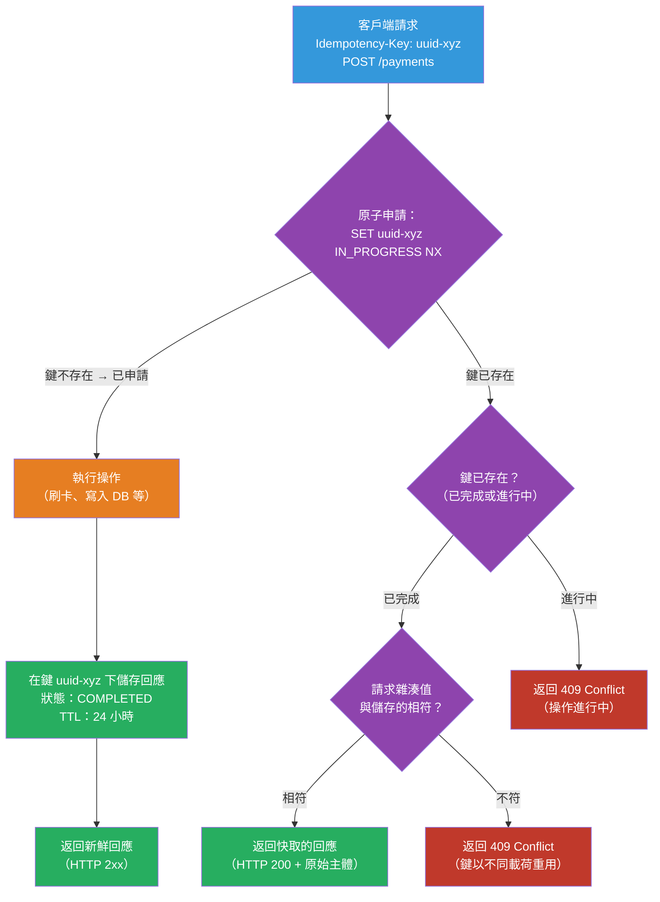

# [BEE-473] 冪等鍵實作模式

:::info
冪等鍵（Idempotency Key）是一個由客戶端提供的令牌，讓伺服器能夠識別重複的請求並返回快取的回應，而非再次處理——將支付收費等本質上不具冪等性的操作轉變為可安全重試的操作。
:::

## 背景

HTTP 在協議層面定義了哪些方法具有冪等性：RFC 9110（HTTP 語義，第 9.2.2 節）明確規定 `GET`、`HEAD`、`PUT`、`DELETE`、`OPTIONS` 和 `TRACE` 是冪等的——客戶端在逾時後可以安全地重試，不會造成重複的副作用。`POST` 明確地被定義為非冪等。然而 `POST` 正是最常用於具有重大副作用的操作：刷卡付款、發送電子郵件、建立訂單。

結果是：當客戶端 `POST` 一個付款請求，並且在收到回應之前網路超時，客戶端不知道收費是否成功。重試可能導致重複收費；不重試可能導致交易被放棄。在支付規模下，這兩種結果都是不可接受的。

冪等鍵模式——由 Stripe 等支付處理商推廣——透過給伺服器足夠的資訊來去重，解決了這個問題。客戶端為每個*邏輯操作*（而非每個 HTTP 請求）生成一個唯一的鍵，並在 `Idempotency-Key` 請求標頭中包含它。伺服器在首次執行時將鍵與回應一起儲存。如果相同的鍵再次到達——來自重試——伺服器返回儲存的回應，而不重新執行操作。從伺服器的角度來看，重複的請求被合並為單一個邏輯操作。

截至 2025 年，IETF 工作組（httpapi）正在積極將 `Idempotency-Key` 標頭格式標準化（draft-ietf-httpapi-idempotency-key-header），顯示業界對此模式的廣泛認可。Stripe、PayPal、Braintree 以及許多金融 API 已實作此模式，通常使用 24 小時的鍵 TTL。

## 設計思考

### 鍵的範圍

冪等鍵只在特定上下文中才有意義。`"abc123"` 對於付款請求是一個不同的邏輯操作，與它對退款請求是不同的。伺服器必須限定鍵的範圍以避免衝突：

- **最小範圍**：`(idempotency_key, endpoint)` — 不同 API 路徑上的相同鍵被視為不同操作
- **推薦範圍**：`(idempotency_key, endpoint, user_id)` — 防止跨客戶的鍵衝突；一個客戶提供的鍵不會與另一個客戶的鍵衝突

### 儲存選項

| | Redis（帶 TTL） | 關聯式資料庫 |
|---|---|---|
| 原子性 | `SET NX EX` — 原子性的「若不存在則設定」 | 在 `(key, endpoint, user_id)` 上的唯一約束 |
| TTL 管理 | 原生支援；鍵自動過期 | 需要定期清理工作 |
| 回應儲存 | 值欄位（JSON，受記憶體限制） | JSONB/TEXT 欄（無限制） |
| 吞吐量 | 非常高 | 中等 |
| 耐久性 | 持久化為可選 | 預設耐久 |
| 最適合 | 高容量 API（支付、訂單） | 需要耐久稽核軌跡的低容量 API |

對於支付 API，Redis 是標準選擇：帶 TTL 的原子性「若不存在則設定」直接對應冪等鍵的生命週期，且吞吐量需求通常超過關聯式資料庫在此模式下的承載能力。

### 請求指紋識別

客戶端應僅對完全相同的請求使用相同的冪等鍵。客戶端錯誤或惡意輸入可能以不同的請求主體重用鍵——這將靜默地返回錯誤的快取回應。

請求指紋識別能夠偵測到這種情況：伺服器對請求主體（也可選擇性地對方法和路徑）進行雜湊，並將雜湊值與冪等記錄一起儲存。在後續具有相同鍵的請求中，比較雜湊值。不一致時返回 `409 Conflict`——鍵存在，但請求參數不同。

### 鍵的生命週期狀態

冪等鍵經歷三個狀態：

1. **進行中（In-progress）**：鍵已被申請；操作正在執行。具有相同鍵的並發請求收到 `409 Conflict` 或應在待處理中等待（帶重試延遲）。
2. **已完成（Completed）**：操作已完成（成功或業務邏輯失敗）。回應已快取；具有相同鍵的後續請求立即返回快取的回應。
3. **已過期（Expired）**：TTL 已過。鍵已不存在；具有相同鍵的新請求被視為全新操作。

「進行中」狀態對於防止競爭條件至關重要——在競爭條件中，兩個並發請求都看不到現有記錄，然後兩者都執行了操作。

## 最佳實踐

**必須（MUST）將冪等鍵的範圍限定至少為 `(key, endpoint)`，最好為 `(key, endpoint, user_id)`。** 不帶端點範圍的裸鍵，在客戶端跨不同 API 路徑重用同一個鍵值時（開發期間常見的疏忽），會導致衝突。

**必須（MUST）使用原子性的「若不存在則設定」操作在執行操作前申請鍵。** 簡單的序列——查詢現有鍵、執行操作、儲存結果——存在競爭條件：兩個並發請求都可能找不到現有記錄，然後都執行操作。在 Redis 中，`SET key placeholder NX EX ttl` 是原子性的。在關聯式資料庫中，使用 `INSERT ... ON CONFLICT DO NOTHING` 並檢查受影響的行數。

**必須（MUST）當請求帶有當前進行中的冪等鍵到達時，返回 `409 Conflict`。** 進行中的狀態表示原始請求仍在執行。返回 `409` 告知客戶端在延遲後重試。不要將操作執行兩次。

**必須（MUST）在重放已完成的冪等鍵時，儲存並返回原始回應。** 儲存的回應必須逐字節相同——相同的狀態碼、相同的主體。不要重新執行操作並返回「新鮮」的回應；即使底層狀態未變化，新鮮的回應也可能不同（例如，不同的時間戳、不同的生成 ID）。

**應該（SHOULD）對請求主體進行指紋識別，並在鍵被以不同的載荷重用時返回 `409 Conflict`。** 若沒有指紋識別，錯誤地將鍵用於不同操作的客戶端會收到錯誤的快取回應，卻沒有任何錯誤提示。在申請時將雜湊值包含在冪等記錄中。

**應該（SHOULD）設定 24–48 小時的 TTL。** TTL 定義了客戶端在網路故障後可以安全重試的時長。較短的 TTL 有在客戶端重試視窗關閉前過期的風險；較長的 TTL 會不必要地消耗儲存空間。Stripe 使用 24 小時，這是業界標準。

**應該（SHOULD）在客戶端以 UUID 的形式生成冪等鍵。** UUID v4（128 位隨機位元）的碰撞概率在實踐中可以忽略不計。不要使用順序 ID（可預測）或短的隨機字串（在高容量下易碰撞）。客戶端在請求之前，而非之後，生成鍵。

**可以（MAY）在需要耐久稽核軌跡時使用資料庫支援的冪等鍵儲存。** 對於財務對帳，將冪等記錄儲存在資料庫中（及相關的交易 ID）可提供特定邏輯操作在特定日期被去重的證明。Redis 預設不提供此功能。

## 視覺化



## 範例

**基於 Redis 的冪等鍵儲存（Python）：**

```python
import hashlib
import json
import uuid
from redis import Redis
from enum import Enum

TTL_SECONDS = 86_400  # 24 小時

class IdempotencyStatus(str, Enum):
    IN_PROGRESS = "in_progress"
    COMPLETED   = "completed"

def make_storage_key(idempotency_key: str, endpoint: str, user_id: str) -> str:
    """限定鍵的範圍以防止跨端點和跨用戶衝突。"""
    return f"idempotency:{user_id}:{endpoint}:{idempotency_key}"

def fingerprint(request_body: bytes) -> str:
    return hashlib.sha256(request_body).hexdigest()

def handle_payment(
    redis: Redis,
    idempotency_key: str,
    user_id: str,
    request_body: bytes,
    charge_fn,
) -> tuple[int, dict]:
    storage_key = make_storage_key(idempotency_key, "/payments", user_id)
    request_fp  = fingerprint(request_body)

    # 步驟 1：原子申請——SET NX 只在鍵不存在時獲取
    placeholder = json.dumps({
        "status": IdempotencyStatus.IN_PROGRESS,
        "fingerprint": request_fp,
    })
    claimed = redis.set(storage_key, placeholder, nx=True, ex=TTL_SECONDS)

    if not claimed:
        # 步驟 2：鍵已存在——獲取它
        existing = json.loads(redis.get(storage_key) or "{}")

        if existing.get("status") == IdempotencyStatus.IN_PROGRESS:
            return 409, {"error": "request_in_progress", "retry_after": 2}

        if existing.get("fingerprint") != request_fp:
            return 409, {"error": "idempotency_key_reused_with_different_params"}

        # 返回快取的回應
        return existing["status_code"], existing["response_body"]

    # 步驟 3：我們持有鍵——執行操作
    try:
        status_code, response_body = charge_fn(json.loads(request_body))
    except Exception as e:
        # 失敗時，釋放鍵以便客戶端可以用新鍵重試
        redis.delete(storage_key)
        raise

    # 步驟 4：儲存已完成的回應並刷新 TTL
    record = json.dumps({
        "status": IdempotencyStatus.COMPLETED,
        "fingerprint": request_fp,
        "status_code": status_code,
        "response_body": response_body,
    })
    redis.set(storage_key, record, ex=TTL_SECONDS)  # 完成後重置 TTL
    return status_code, response_body
```

**資料庫支援的冪等記錄表（PostgreSQL）：**

```sql
CREATE TABLE idempotency_keys (
    id              UUID        PRIMARY KEY DEFAULT gen_random_uuid(),
    idempotency_key VARCHAR(255) NOT NULL,
    endpoint        VARCHAR(255) NOT NULL,
    user_id         BIGINT       NOT NULL,
    request_hash    CHAR(64)     NOT NULL,    -- 請求主體的 SHA-256
    status          VARCHAR(20)  NOT NULL DEFAULT 'in_progress',
    status_code     SMALLINT,
    response_body   JSONB,
    created_at      TIMESTAMPTZ  NOT NULL DEFAULT now(),
    expires_at      TIMESTAMPTZ  NOT NULL DEFAULT now() + INTERVAL '24 hours',

    CONSTRAINT uq_idempotency UNIQUE (idempotency_key, endpoint, user_id)
);

-- 申請步驟：INSERT 並依賴唯一約束來偵測重複
-- 返回插入的行數（1 = 已申請，0 = 已存在）
INSERT INTO idempotency_keys (idempotency_key, endpoint, user_id, request_hash)
VALUES ($1, $2, $3, $4)
ON CONFLICT (idempotency_key, endpoint, user_id) DO NOTHING;

-- 操作完成後更新為已完成狀態
UPDATE idempotency_keys
   SET status = 'completed',
       status_code = $1,
       response_body = $2
 WHERE idempotency_key = $3
   AND endpoint = $4
   AND user_id = $5;

-- 定期清理：移除已過期的鍵（透過 pg_cron 每晚執行）
DELETE FROM idempotency_keys WHERE expires_at < NOW();
```

**客戶端鍵生成與重試迴圈：**

```python
import uuid
import httpx
import time

def charge_with_retry(amount: int, currency: str, max_retries: int = 3) -> dict:
    # 在第一次嘗試之前生成一次——在所有重試中重用
    idempotency_key = str(uuid.uuid4())

    for attempt in range(max_retries):
        try:
            response = httpx.post(
                "https://api.example.com/payments",
                json={"amount": amount, "currency": currency},
                headers={"Idempotency-Key": idempotency_key},
                timeout=10.0,
            )
            # 409 表示進行中：短暫等待後重試
            if response.status_code == 409 and attempt < max_retries - 1:
                time.sleep(2 ** attempt)
                continue
            response.raise_for_status()
            return response.json()
        except httpx.TimeoutException:
            if attempt == max_retries - 1:
                raise
            time.sleep(2 ** attempt)  # 指數退避

    raise RuntimeError("已超過最大重試次數")
```

## 實作說明

**Stripe 的做法**：這是典範的參考實作。Stripe 將鍵範圍限定至已驗證的用戶和 API 路徑。在 `/v1/charges` 上使用的相同 `Idempotency-Key` 值，與在 `/v1/refunds` 上的使用是獨立的。鍵有效期為 24 小時。Stripe 精確地返回原始 HTTP 狀態碼和主體，包括錯誤回應——冪等地重放一個失敗的收費，返回相同的錯誤，而不是新的嘗試。

**Redis 與資料庫的選擇**：對於高容量 API，Redis 的 `SET NX EX` 是實踐上的選擇，因為它在單一命令中執行原子申請和 TTL 管理。主要風險是：若持久化未配置（`appendonly yes`），Redis 在重啟時可能丟失資料。對於冪等記錄是合規文件的支付 API，則將其存入資料庫；接受較高的寫入延遲。

**處理操作失敗**：如果底層操作失敗（例如，卡被拒絕），冪等記錄仍應以 `COMPLETED` 狀態儲存，並包含錯誤回應。重試被拒卡請求的客戶端，應收到相同的 `402 Payment Required`——而非新的收費嘗試。只有在未處理的異常（行程崩潰、基礎設施故障）情況下，操作的結果未知，才應刪除進行中的記錄。

**鍵的過期與客戶端行為**：客戶端不應跨會話或跨天重用冪等鍵。為週一付款嘗試生成的鍵不應在週二的付款中循環使用。將冪等鍵視為一個邏輯客戶端操作期間的一次性使用；為每個新操作生成新的 UUID。

## 相關 BEE

- [BEE-72](../API Design and Communication Protocols/72.md) -- API 中的冪等性：涵蓋哪些 HTTP 方法在協議上是冪等的，以及為何設計冪等 API 很重要；本文涵蓋伺服器端實作機制
- [BEE-164](../Transactions and Consistency/164.md) -- 冪等性與精確一次語義：涵蓋訊息處理層的冪等性；冪等鍵模式是 API 層的等效機制
- [BEE-261](../Resilience and Reliability/261.md) -- 重試策略與指數退避：冪等鍵使客戶端能夠安全重試；重試策略決定何時以及多頻繁地重試

## 參考資料

- [Idempotent Requests — Stripe API 文件](https://docs.stripe.com/api/idempotent_requests)
- [The Idempotency-Key HTTP Header Field — IETF 草案 (draft-ietf-httpapi-idempotency-key-header)](https://datatracker.ietf.org/doc/draft-ietf-httpapi-idempotency-key-header/)
- [RFC 9110: HTTP 語義，第 9.2.2 節 — IETF](https://www.rfc-editor.org/rfc/rfc9110.html)
- [Idempotency — PayPal 開發者文件](https://developer.paypal.com/api/rest/requests/#http-request-headers)
