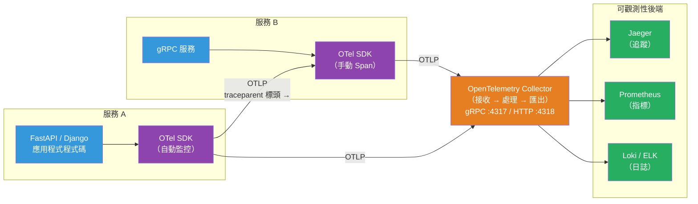

# [BEE-475] OpenTelemetry 可觀測性實作

:::info
OpenTelemetry 是 CNCF 畢業的可觀測性標準，用於從應用程式產生、收集和匯出遙測資料（追蹤、指標、日誌）——提供單一的廠商中立 SDK，取代廠商特定的代理程式，實現與後端無關的可觀測性。
:::

## 背景

在 OpenTelemetry 出現之前，每個可觀測性廠商都提供其專有的代理程式：Datadog 有自己的追蹤器，New Relic 有自己的 SDK，Jaeger 有自己的客戶端函式庫。選擇某個可觀測性後端的工程團隊，就被鎖定在了該廠商的監控程式碼中。切換後端意味著重新對每個服務進行監控埋點。

兩個相互競爭的開源標準相繼出現：OpenTracing（2016 年，CNCF，僅限 API，專注於追蹤）和 OpenCensus（2018 年，Google，帶有追蹤和指標的 SDK）。兩者都有社群採用，但都不夠完整。2019 年，這兩個專案在 CNCF 旗下合併為 OpenTelemetry，融合了 OpenTracing 的 API 抽象與 OpenCensus 的 SDK，並新增了日誌訊號。OpenTelemetry 於 2024 年 1 月 31 日獲得 CNCF 畢業狀態——成為繼 Kubernetes 之後第二活躍的 CNCF 專案。

結果是一個適用於所有主要語言（Go、Java、Python、Node.js、.NET、Rust、PHP、Ruby、Swift、Erlang）的單一 SDK，透過 OTLP（OpenTelemetry Protocol）向任何後端發出追蹤、指標和日誌。W3C TraceContext 規範（自 2021 年起成為 W3C 推薦標準）定義了在服務邊界傳播追蹤上下文的 `traceparent` 和 `tracestate` HTTP 標頭——這是 OTel 實作的標準，所有主要 APM 廠商現在都支援。

實際影響：一次監控埋點，處處匯出。使用 OTel SDK 的應用程式今天可以發送到 Jaeger，明天發送到 Honeycomb，指標發送到 Prometheus/Grafana——只需更改 Collector 設定，而非應用程式程式碼。

## 設計思考

### 三種訊號

OpenTelemetry 定義了三種遙測訊號，截至 2023 年底均已正式發佈（GA）：

| 訊號 | 測量內容 | 主要用途 |
|---|---|---|
| **追蹤（Traces）** | 請求跨服務歷程的 Span 樹 | 延遲除錯、服務依賴關係圖 |
| **指標（Metrics）** | 隨時間變化的聚合數值測量 | 告警、儀表板、SLO |
| **日誌（Logs）** | 帶時間戳的文字 / 結構化記錄 | 詳細除錯、稽核軌跡 |

三者都透過共享的 `trace_id` 相互關聯：在被追蹤的請求期間發出的結構化日誌，可以連結到對應的追蹤，讓你能從慢速追蹤跳轉到解釋原因的日誌行。

### SDK vs 自動監控 vs Collector

三個層次協同工作：

**SDK**：在行程中建立 Span、記錄指標並發出日誌的函式庫。你直接呼叫 SDK API 進行手動監控，或由自動監控自動完成。

**自動監控**：補丁流行框架（FastAPI、Django、SQLAlchemy、gRPC、Express、Spring Boot、JDBC）的函式庫套件，無需更改程式碼即可自動發出 Span。Django 視圖獲得一個根 Span；每個 SQLAlchemy 查詢成為一個子 Span。使用 `opentelemetry-instrument python app.py` 進行零程式碼監控。

**Collector**：一個獨立的代理服務（用 Go 編寫），從應用程式接收 OTLP 遙測資料，處理它（批次、採樣、豐富化、過濾），並匯出到後端。Collector 解耦了應用程式與後端的關係：應用程式始終匯出到 `localhost:4317`（gRPC）或 `localhost:4318`（HTTP）；Collector 處理重試、批次處理，並同時路由到多個後端。

### Span 解析

Span 代表一個工作單位：
- **名稱**：人類可讀的操作名稱（`GET /users/{id}`、`db.query`、`kafka.publish`）
- **Trace ID**：分散式追蹤中所有 Span 共享的 128 位識別符
- **Span ID**：此 Span 唯一的 64 位識別符
- **Parent Span ID**：將此 Span 連結到其父 Span；根 Span 不存在此項
- **開始 / 結束時間戳**：工作的掛鐘時間
- **狀態**：OK、ERROR 或 UNSET
- **屬性**：鍵值對（`http.method`、`db.system`、`net.peer.name`）
- **事件**：Span 持續時間內帶時間戳的日誌訊息
- **連結**：對其他追蹤中 Span 的引用（對非同步訊息傳遞有用）

## 最佳實踐

**必須（MUST）跨服務邊界傳播追蹤上下文。** 上下文傳播是將孤立的 Span 轉換為分散式追蹤的關鍵。對 HTTP 呼叫使用 W3C `traceparent` 標頭；對 Kafka 和其他訊息系統使用訊息屬性 / 標頭。使用監控過的 HTTP 客戶端時，OTel SDK 的傳播器會自動處理注入（向傳出請求添加標頭）和提取（讀取傳入標頭）。

**必須（MUST）在錯誤時記錄 Span 狀態。** `status = UNSET` 的 Span 在追蹤分析工具中看起來像成功。當捕獲到異常或返回非 2xx 回應時，呼叫 `span.set_status(StatusCode.ERROR)` 和 `span.record_exception(exc)`。這使錯誤在追蹤搜索中可見，並允許從追蹤資料計算錯誤率 SLO。

**不得（MUST NOT）每個請求建立一個新的 `Tracer`。** `Tracer` 是一個輕量級的工廠；在啟動時使用 `tracer = get_tracer(__name__)` 建立一次並重複使用。每個請求建立新的 Tracer 會增加開銷並繞過 SDK 快取。

**應該（SHOULD）使用語義慣例來命名屬性。** OpenTelemetry 為常見系統定義了標準屬性名稱：`http.method`、`http.status_code`、`db.system`、`db.statement`、`rpc.system`、`messaging.system`。使用標準名稱能讓理解 OTel 語義慣例的廠商的開箱即用儀表板和告警正常運作。當存在標準名稱時，避免自創屬性名稱。

**應該（SHOULD）部署 OpenTelemetry Collector 而非直接從應用程式匯出到後端。** 從應用程式直接匯出到後端會造成緊密耦合：更換後端需要更改應用程式設定並重新部署。Collector 解決了這個問題：匯出到 `localhost:4317`，配置 Collector 同時分發到多個後端、添加採樣，或過濾敏感屬性——無需修改應用程式程式碼。

**應該（SHOULD）在 Collector 中採樣追蹤，而非在應用程式 SDK 中，以獲得更大的靈活性。** 頭部採樣（在追蹤根處決定是否採樣）在根 Span 在錯誤發生之前啟動時，可能會遺失錯誤追蹤。尾部採樣（在完整追蹤組裝後決定）保留所有錯誤追蹤。OTel Collector 的 `tailsamplingprocessor` 實作了尾部採樣；應用程式端採樣是極端容量情況下的最後手段。

**應該（SHOULD）將業務領域屬性添加到根 Span。** 通用的 HTTP 屬性（`http.method`、`http.route`）告訴你在協議層發生了什麼。添加 `user.id`、`order.id` 或 `tenant.id` 作為 Span 屬性，可以透過業務實體搜索追蹤——「找到訂單 12345 的所有追蹤」——這比「找到 POST /orders 的所有追蹤」有用幾個數量級。

**可以（MAY）使用 Baggage 跨請求範圍傳播不屬於 Span 屬性的值。** OTel Baggage 跨服務邊界傳播鍵值對（類似分散式的執行緒本地儲存）。用於下游服務需要但與個別 Span 不直接相關的值：`tenant.id`、`experiment.variant`、`user.tier`。

## 視覺化



## 範例

**Python——SDK 設定與手動 Span 建立（FastAPI）：**

```python
# otel_setup.py — 在應用程式啟動時初始化一次
from opentelemetry import trace
from opentelemetry.sdk.trace import TracerProvider
from opentelemetry.sdk.trace.export import BatchSpanProcessor
from opentelemetry.exporter.otlp.proto.grpc.trace_exporter import OTLPSpanExporter
from opentelemetry.sdk.resources import Resource
from opentelemetry.instrumentation.fastapi import FastAPIInstrumentor
from opentelemetry.instrumentation.sqlalchemy import SQLAlchemyInstrumentor

def configure_otel(service_name: str) -> None:
    resource = Resource.create({"service.name": service_name})
    provider = TracerProvider(resource=resource)
    # 匯出到本機 Collector；Collector 負責路由到後端
    exporter = OTLPSpanExporter(endpoint="http://localhost:4317", insecure=True)
    provider.add_span_processor(BatchSpanProcessor(exporter))
    trace.set_tracer_provider(provider)

    # 自動監控 FastAPI 路由和 SQLAlchemy 查詢
    FastAPIInstrumentor.instrument()
    SQLAlchemyInstrumentor().instrument()

# app.py
from opentelemetry import trace

tracer = trace.get_tracer(__name__)  # 建立一次；到處重複使用

@app.post("/orders")
async def create_order(order: OrderRequest) -> OrderResponse:
    # 自動監控已為此 HTTP 處理器建立了根 Span
    # 添加業務領域屬性，使此追蹤可被搜索
    span = trace.get_current_span()
    span.set_attribute("customer.id", order.customer_id)

    # 為重要子操作手動建立子 Span
    with tracer.start_as_current_span("charge_payment") as payment_span:
        payment_span.set_attribute("payment.method", order.payment_method)
        payment_span.set_attribute("payment.amount", order.amount_cents)
        try:
            result = await payment_service.charge(order)
            payment_span.set_attribute("payment.charge_id", result.charge_id)
        except PaymentDeclinedException as e:
            payment_span.set_status(trace.StatusCode.ERROR, str(e))
            payment_span.record_exception(e)
            raise

    return OrderResponse(order_id=result.order_id)
```

**零程式碼自動監控（無需更改程式碼）：**

```bash
# 安裝自動監控套件
pip install opentelemetry-distro opentelemetry-exporter-otlp
opentelemetry-bootstrap --action=install  # 安裝框架特定套件

# 使用自動監控執行——監控 Django、SQLAlchemy、requests 等
OTEL_SERVICE_NAME=order-service \
OTEL_EXPORTER_OTLP_ENDPOINT=http://localhost:4317 \
opentelemetry-instrument python manage.py runserver
```

**Go——帶上下文傳播的手動 Span 建立：**

```go
package main

import (
    "context"
    "go.opentelemetry.io/otel"
    "go.opentelemetry.io/otel/attribute"
    "go.opentelemetry.io/otel/codes"
    "go.opentelemetry.io/otel/exporters/otlp/otlptrace/otlptracegrpc"
    sdktrace "go.opentelemetry.io/otel/sdk/trace"
    "go.opentelemetry.io/otel/sdk/resource"
    semconv "go.opentelemetry.io/otel/semconv/v1.21.0"
)

var tracer = otel.Tracer("order-service")

func initOTel(ctx context.Context) (*sdktrace.TracerProvider, error) {
    exporter, err := otlptracegrpc.New(ctx,
        otlptracegrpc.WithInsecure(),
        otlptracegrpc.WithEndpoint("localhost:4317"),
    )
    if err != nil {
        return nil, err
    }
    res, _ := resource.New(ctx,
        resource.WithAttributes(semconv.ServiceName("order-service")),
    )
    tp := sdktrace.NewTracerProvider(
        sdktrace.WithBatcher(exporter),
        sdktrace.WithResource(res),
    )
    otel.SetTracerProvider(tp)
    return tp, nil
}

func processOrder(ctx context.Context, orderID string) error {
    // 啟動子 Span——ctx 從 HTTP 處理器攜帶父 Span
    ctx, span := tracer.Start(ctx, "process_order")
    defer span.End()

    span.SetAttributes(
        attribute.String("order.id", orderID),
        attribute.String("db.system", "postgresql"),
    )

    if err := chargeAndFulfill(ctx, orderID); err != nil {
        span.SetStatus(codes.Error, err.Error())
        span.RecordError(err)
        return err
    }
    return nil
}
```

**OpenTelemetry Collector 設定（`otel-collector-config.yaml`）：**

```yaml
receivers:
  otlp:
    protocols:
      grpc:
        endpoint: 0.0.0.0:4317   # 從應用程式接收
      http:
        endpoint: 0.0.0.0:4318

processors:
  batch:                           # 緩衝並批次處理 Span 以提升效率
    timeout: 1s
    send_batch_size: 1024
  resource:
    attributes:
      - key: deployment.environment
        value: production
        action: upsert
  # 尾部採樣：保留 100% 的錯誤追蹤，10% 的成功追蹤
  tail_sampling:
    decision_wait: 10s
    policies:
      - name: errors-policy
        type: status_code
        status_code: {status_codes: [ERROR]}
      - name: probabilistic-policy
        type: probabilistic
        probabilistic: {sampling_percentage: 10}

exporters:
  otlp/jaeger:
    endpoint: jaeger:4317
    tls:
      insecure: true
  prometheusremotewrite:
    endpoint: http://prometheus:9090/api/v1/write

service:
  pipelines:
    traces:
      receivers: [otlp]
      processors: [batch, tail_sampling]
      exporters: [otlp/jaeger]
    metrics:
      receivers: [otlp]
      processors: [batch]
      exporters: [prometheusremotewrite]
```

## 實作說明

**Python**：`opentelemetry-sdk` 套件提供核心 SDK。`opentelemetry-api` 提供 API（可在函式庫程式碼中匯入，無需重量級 SDK 依賴）。生產環境使用 `BatchSpanProcessor`（非同步、緩衝）；`SimpleSpanProcessor` 僅用於除錯（同步、阻塞）。`opentelemetry-instrument` 的自動監控支援 Flask、Django、FastAPI、aiohttp、SQLAlchemy、psycopg2、Redis、Celery 等。

**Go**：`go.opentelemetry.io/otel` 是 API；`go.opentelemetry.io/otel/sdk` 是 SDK。透過 `otelhttp.NewHandler` 包裝 `http.Handler` 實現 HTTP 監控；透過 `otelgrpc.UnaryServerInterceptor` 實現 gRPC 監控。始終透過呼叫堆疊傳播 `context.Context`——OTel Go 依賴它實現 Span 的父子關係。

**Java / Spring Boot**：`opentelemetry-spring-boot-starter` 透過 Spring Boot 自動配置機制添加自動監控。Java 代理（`opentelemetry-javaagent.jar`）提供零程式碼監控：`java -javaagent:opentelemetry-javaagent.jar -jar app.jar`。

**Node.js**：`@opentelemetry/sdk-node` 提供 NodeSDK。存在用於 Express、HTTP、gRPC、pg、MySQL、Redis 和 AWS SDK 的自動監控套件。在匯入應用程式模組之前初始化 SDK——監控必須在框架載入之前注冊。

**語義慣例**：OTel 在 `opentelemetry-semantic-conventions` 中定義了一組穩定的屬性名稱。對於常見概念，始終優先使用語義慣例（`http.method`、`db.system`、`rpc.service`），而非自訂屬性——這確保與期望標準屬性名稱的廠商儀表板和告警規則的相容性。

## 相關 BEE

- [BEE-320](../Observability/320.md) -- 三大支柱：日誌、指標、追蹤：涵蓋每種訊號類型是什麼以及為何三者缺一不可；OpenTelemetry 是產生所有三種訊號的 SDK
- [BEE-322](../Observability/322.md) -- 分散式追蹤：涵蓋追蹤傳播和 Span 關係的理論；OpenTelemetry 是這些概念的實際實作
- [BEE-321](../Observability/321.md) -- 結構化日誌：OTel 日誌與結構化日誌整合；在被追蹤的請求期間發出的日誌攜帶 Trace ID 以供關聯
- [BEE-324](../Observability/324.md) -- SLO 與錯誤預算：追蹤資料提供延遲和錯誤率 SLI 的原始素材；OTel 指標可直接用於 SLO 計算

## 參考資料

- [OpenTelemetry 文件](https://opentelemetry.io/docs/)
- [OpenTelemetry — CNCF 專案](https://www.cncf.io/projects/opentelemetry/)
- [W3C Trace Context — W3C 推薦標準](https://www.w3.org/TR/trace-context/)
- [OTLP 規範 — OpenTelemetry](https://opentelemetry.io/docs/specs/otlp/)
- [OpenTelemetry Collector 文件](https://opentelemetry.io/docs/collector/)
