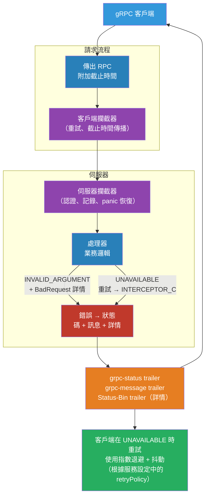

# [BEE-479] gRPC 錯誤處理與狀態碼

:::info
gRPC 定義了 17 個標準狀態碼，取代 RPC 語義中的 HTTP 狀態碼，並提供兩層錯誤模型——基本狀態（碼 + 訊息）和豐富的結構化詳情——使客戶端能夠對錯誤採取程式化的動作，而無需解析純文字訊息。
:::

## 情境

HTTP API 使用廣為人知但粗糙的狀態碼來傳達錯誤：400 告訴客戶端請求有問題，但沒有說明是欄位缺失、超出範圍，還是違反了業務規則。REST 服務通過在回應主體中嵌入結構化錯誤來解決這個問題，但沒有統一標準（Problem Details，RFC 9457，被廣泛採用但並非普遍）。

gRPC 採用不同的方式。每個 RPC 回應都帶有 `grpc-status` trailer（一個數字碼，0–16）和可選的 `grpc-message` trailer（一個 URL 編碼的字串）。這些在 gRPC 核心規範中定義，並在每個 gRPC 執行環境中一致實作——Go、Java、Python、Node.js、C++。17 個狀態碼（0 = OK 到 16 = UNAUTHENTICATED）涵蓋了 RPC 失敗的完整分類。

對於更豐富的錯誤，gRPC 使用 `google.rpc.Status` proto，它增加了一個 `details` 欄位——一個重複的 `google.protobuf.Any`——承載來自 `google/rpc/error_details.proto` 套件的型別化錯誤詳情訊息：用於欄位層級驗證的 `BadRequest`、用於重試延遲的 `RetryInfo`、用於配額違規的 `QuotaFailure` 等。這個模型最初在 Google API 設計指南中描述，是 Google Cloud API 錯誤回應的基礎。

實際效益：gRPC 客戶端可以匹配 `code == UNAVAILABLE` 來重試，提取 `RetryInfo.retry_delay` 以了解等待多久，並向使用者顯示 `BadRequest.FieldViolation`，而無需解析字串。除非所有服務採用相同的錯誤綱要，否則 REST 無法可攜式地做到這一點。

## 設計思維

### 狀態碼分類

17 個碼按原因分為四組：

**客戶端錯誤**（呼叫者必須修正請求）：
- `INVALID_ARGUMENT` (3) — 無效的欄位值、範圍或格式
- `OUT_OF_RANGE` (11) — 值有效但超出可接受範圍（當範圍明確時優先於 INVALID_ARGUMENT）
- `NOT_FOUND` (5) — 資源不存在
- `ALREADY_EXISTS` (6) — 資源已存在（建立時）
- `PERMISSION_DENIED` (7) — 呼叫者缺少操作權限
- `UNAUTHENTICATED` (16) — 未提供有效憑證
- `FAILED_PRECONDITION` (9) — 系統狀態阻止操作（例如，刪除非空的儲存桶）

**暫時性錯誤**（可安全重試）：
- `UNAVAILABLE` (14) — 伺服器暫時不可用；以退避方式重試
- `RESOURCE_EXHAUSTED` (8) — 配額或速率限制；在 `RetryInfo` 的延遲後重試

**逾時 / 取消**：
- `DEADLINE_EXCEEDED` (4) — 操作完成前截止時間已過
- `CANCELLED` (1) — 操作被呼叫者取消

**伺服器錯誤**（不是呼叫者的問題）：
- `INTERNAL` (13) — 不變量被打破；表示伺服器中的錯誤
- `UNKNOWN` (2) — 未映射錯誤的通用代碼
- `DATA_LOSS` (15) — 不可恢復的資料損壞
- `UNIMPLEMENTED` (12) — 方法未實作或已停用

**濫用 / 衝突**：
- `ABORTED` (10) — 操作因衝突而中止（例如，交易衝突）；呼叫者可以在更高層次重試

### 選擇正確的碼

最常見的錯誤是過度使用 `INTERNAL` 和 `UNKNOWN`。這些應該保留給伺服器錯誤。優先使用具體的客戶端錯誤碼：

| 情境 | 正確的碼 |
|---|---|
| 請求欄位 `amount` 為負值 | `INVALID_ARGUMENT` |
| 頁面令牌格式錯誤 | `INVALID_ARGUMENT` |
| 請求欄位 `page_size` 為 10001（最大為 10000） | `OUT_OF_RANGE` |
| 訂單 `ord_123` 未找到 | `NOT_FOUND` |
| 建立已存在的訂單 | `ALREADY_EXISTS` |
| 呼叫者的 JWT 已過期 | `UNAUTHENTICATED` |
| 呼叫者的 JWT 有效但缺少角色 | `PERMISSION_DENIED` |
| 樂觀鎖的交易衝突 | `ABORTED` |
| 嘗試刪除非空的父項 | `FAILED_PRECONDITION` |
| 伺服器處於維護模式 | `UNAVAILABLE` |
| 超過速率限制 | `RESOURCE_EXHAUSTED` |

### 可重試性

沒有固定的通用可重試碼集——這取決於操作。gRPC 規範的關鍵原則：**只有在伺服器尚未開始處理時才重試**。`UNAVAILABLE` 對所有 RPC 都可安全重試。`RESOURCE_EXHAUSTED` 通常可在 `RetryInfo` 中的延遲後重試。`ABORTED` 可在應用程式層重試（重新讀取資源，然後重試）。`DEADLINE_EXCEEDED` 不自動可重試——截止時間已過；呼叫者必須決定是否發出新的請求。

## 最佳實踐

**MUST（必須）選擇最準確描述失敗的最具體碼。** 為缺失的資源或無效引數返回 `UNKNOWN` 或 `INTERNAL` 會強制客戶端解析訊息字串。訊息字串是給人看的；狀態碼是給機器用的。

**MUST NOT（不得）在回應主體中嵌入錯誤並返回 `OK` 狀態。** 一些實作將錯誤物件放在回應訊息中並返回狀態 `OK`。這破壞了 gRPC 錯誤模型：客戶端無法用標準攔截器攔截它，重試不會觸發，流語義也會中斷。始終以非 OK 狀態傳播錯誤。

**MUST（必須）在 `grpc-message` 中填寫開發者可讀的說明，而非面向使用者的說明。** 狀態訊息會被記錄並在堆疊追蹤中顯示。向終端使用者顯示它們不安全。在錯誤詳情中使用 `LocalizedMessage` 提供面向使用者的文字。

**SHOULD（應該）為 `INVALID_ARGUMENT` 錯誤附加 `google.rpc.BadRequest` 詳情。** `BadRequest` 詳情列出每個 `FieldViolation`，包含欄位路徑（點符號：`"order.items[0].quantity"`）和描述。這讓客戶端 SDK 可以向表單顯示每個欄位的錯誤，而無需解析狀態訊息。

**SHOULD（應該）為 `RESOURCE_EXHAUSTED` 回應附加 `google.rpc.RetryInfo`。** `retry_delay` 欄位精確告訴客戶端需要等待多久。沒有它，客戶端需要猜測或使用固定退避。有了它，伺服器強制執行重試節奏，這對配額系統至關重要。

**SHOULD（應該）在 gRPC 服務設定中而非應用程式碼中設定重試策略。** 服務設定重試策略（`retryPolicy.retryableStatusCodes`）自動應用於通過通道的所有呼叫，無需更改應用程式碼。將重試邏輯保持在業務邏輯之外。

**SHOULD（應該）使用攔截器一致地附加錯誤詳情。** 伺服器端攔截器可以捕獲 panic，記錄它們，並返回帶有包含堆疊追蹤的 `DebugInfo` 詳情的 `INTERNAL`——而不需要修改每個處理器。

**MAY（可以）使用 `FAILED_PRECONDITION` vs `ABORTED` 來傳達可重試性意圖。** `FAILED_PRECONDITION` 意味著系統狀態有問題，簡單重試將再次失敗（呼叫者必須先修正狀態）。`ABORTED` 意味著操作本身是正確的，但與並發操作衝突——呼叫者在重新讀取狀態後可以重試。

## 視覺化



## 範例

**返回豐富錯誤詳情——Python 伺服器：**

```python
# errors.py — 建立豐富 gRPC 錯誤的輔助函數
import grpc
from google.rpc import status_pb2, error_details_pb2, code_pb2
from google.protobuf import any_pb2


def invalid_argument(field: str, description: str) -> grpc.RpcError:
    """返回帶有 BadRequest FieldViolation 的 INVALID_ARGUMENT。"""
    detail = error_details_pb2.BadRequest(
        field_violations=[
            error_details_pb2.BadRequest.FieldViolation(
                field=field,
                description=description,
            )
        ]
    )
    any_detail = any_pb2.Any()
    any_detail.Pack(detail)

    rich_status = status_pb2.Status(
        code=code_pb2.INVALID_ARGUMENT,
        message=f"欄位 '{field}' 的值無效：{description}",
        details=[any_detail],
    )
    from grpc_status import rpc_status
    return rpc_status.to_status(rich_status).to_call_rpc_error()


def resource_exhausted(retry_seconds: int) -> grpc.RpcError:
    """返回帶有 RetryInfo 延遲的 RESOURCE_EXHAUSTED。"""
    from google.protobuf.duration_pb2 import Duration
    retry_info = error_details_pb2.RetryInfo(
        retry_delay=Duration(seconds=retry_seconds)
    )
    any_detail = any_pb2.Any()
    any_detail.Pack(retry_info)

    rich_status = status_pb2.Status(
        code=code_pb2.RESOURCE_EXHAUSTED,
        message="超過速率限制。請查看 retry_delay 了解何時重試。",
        details=[any_detail],
    )
    from grpc_status import rpc_status
    return rpc_status.to_status(rich_status).to_call_rpc_error()


# orders_service.py — 使用輔助函數的處理器
class OrdersServicer(orders_pb2_grpc.OrdersServicer):
    def CreateOrder(self, request, context):
        if request.amount_cents <= 0:
            context.abort_with_status(
                invalid_argument("amount_cents", "必須是正整數")
            )

        if self.rate_limiter.is_exceeded(request.customer_id):
            context.abort_with_status(
                resource_exhausted(retry_seconds=30)
            )

        # ... 業務邏輯
```

**讀取錯誤詳情——Python 客戶端：**

```python
# client.py — 從失敗的 RPC 提取豐富錯誤詳情
import grpc
from grpc_status import rpc_status
from google.rpc import error_details_pb2


def create_order(stub, request):
    try:
        return stub.CreateOrder(request)
    except grpc.RpcError as e:
        status = rpc_status.from_call(e)
        if status is None:
            # 沒有豐富詳情；退回到碼 + 訊息
            raise

        for detail in status.details:
            # 解包 BadRequest 以獲取欄位層級驗證錯誤
            if detail.Is(error_details_pb2.BadRequest.DESCRIPTOR):
                bad_request = error_details_pb2.BadRequest()
                detail.Unpack(bad_request)
                for violation in bad_request.field_violations:
                    print(f"欄位 '{violation.field}': {violation.description}")

            # 解包 RetryInfo 以獲取速率限制重試延遲
            elif detail.Is(error_details_pb2.RetryInfo.DESCRIPTOR):
                retry_info = error_details_pb2.RetryInfo()
                detail.Unpack(retry_info)
                print(f"請在 {retry_info.retry_delay.seconds} 秒後重試")
        raise
```

**服務設定重試策略——Go 通道設定：**

```go
// channel.go — 設定在 UNAVAILABLE 時自動重試
import (
    "google.golang.org/grpc"
    "encoding/json"
)

const serviceConfig = `{
    "methodConfig": [{
        "name": [{"service": "orders.OrdersService"}],
        "retryPolicy": {
            "maxAttempts": 4,
            "initialBackoff": "0.1s",
            "maxBackoff": "1s",
            "backoffMultiplier": 2.0,
            "retryableStatusCodes": ["UNAVAILABLE"]
        },
        "timeout": "5s"
    }]
}`

func newOrdersClient(addr string) (orders.OrdersServiceClient, error) {
    conn, err := grpc.Dial(
        addr,
        grpc.WithDefaultServiceConfig(serviceConfig),
        grpc.WithTransportCredentials(credentials.NewTLS(nil)),
    )
    if err != nil {
        return nil, err
    }
    return orders.NewOrdersServiceClient(conn), nil
}
// 重試在 gRPC 通道層透明地發生。
// 應用程式碼只看到成功或在 maxAttempts 後的最終錯誤。
```

**伺服器攔截器實作一致的錯誤包裝：**

```go
// interceptor.go — 將 panic 轉換為 INTERNAL，記錄所有錯誤
func UnaryServerInterceptor() grpc.UnaryServerInterceptor {
    return func(
        ctx context.Context,
        req interface{},
        info *grpc.UnaryServerInfo,
        handler grpc.UnaryHandler,
    ) (resp interface{}, err error) {
        defer func() {
            if r := recover(); r != nil {
                // Panic → INTERNAL 帶有 DebugInfo（堆疊追蹤）
                st, _ := status.New(codes.Internal, "內部伺服器錯誤").
                    WithDetails(&errdetails.DebugInfo{
                        StackEntries: []string{fmt.Sprintf("%v", r)},
                    })
                err = st.Err()
            }
        }()

        resp, err = handler(ctx, req)

        if err != nil {
            s, _ := status.FromError(err)
            // 記錄所有非 OK 回應及其碼
            log.Printf("RPC %s → %s: %s", info.FullMethod, s.Code(), s.Message())
        }
        return
    }
}
```

## 實作注意事項

**HTTP 映射**：當 gRPC 通過 gRPC-Gateway（HTTP/JSON）公開或由沒有 `grpc-status` trailer 的 HTTP 回應的客戶端消費時，碼映射到 HTTP 狀態如下：`NOT_FOUND` → 404、`PERMISSION_DENIED` → 403、`UNAUTHENTICATED` → 401、`UNAVAILABLE` → 503、`RESOURCE_EXHAUSTED` → 429、`INVALID_ARGUMENT` → 400、`UNIMPLEMENTED` → 501。此映射是單向的：伺服器必須始終發送 `grpc-status`，而不是依賴 HTTP 狀態給 gRPC 客戶端。

**gRPC-Web 和 gRPC-Gateway**：兩者都將 gRPC 狀態轉換為瀏覽器客戶端的 HTTP。`grpc-status` 以 trailer-in-body 形式發送（用於 HTTP/1.1）。如果閘道設定為透傳 `google.rpc.Status`，錯誤詳情在轉換中存活。

**截止時間**：`DEADLINE_EXCEEDED` 由 gRPC 執行環境在截止時間過去時生成，無論工作在呼叫鏈的哪個位置。它自動向上游傳播——如果下游服務超過截止時間，上游的 gRPC 呼叫也返回 `DEADLINE_EXCEEDED`。在處理器中開始昂貴的工作之前，先檢查 `ctx.Err()`。

**`grpcio-status` vs `grpcio`**：在 Python 中，`grpcio` 提供基本的狀態碼。`grpcio-status` 套件（單獨安裝）提供 `rpc_status` 工具，用於打包和解包帶有豐富詳情的 `google.rpc.Status`。完整的錯誤模型需要兩者。

**Proto 匯入**：將 `google/rpc/error_details.proto` 和 `google/rpc/status.proto` 從 `github.com/googleapis/googleapis` 加入你的 protoc 包含路徑。在 Go 中，匯入 `google.golang.org/genproto/googleapis/rpc/errdetails`。在 Python 中，安裝 `googleapis-common-protos`。

## 相關 BEE

- [BEE-74](../API Design/74.md) -- GraphQL vs REST vs gRPC：涵蓋何時選擇 gRPC 而非 REST；錯誤處理是 gRPC 的差異化優勢之一
- [BEE-261](../Resilience/261.md) -- 重試策略與指數退避：通用重試理論；gRPC 服務設定在通道層實作了這一點
- [BEE-262](../Resilience/262.md) -- 逾時與截止時間：截止時間傳播與 `DEADLINE_EXCEEDED` 互動；了解截止時間與狀態碼之間的關係
- [BEE-465](../Distributed Systems/465.md) -- gRPC 串流模式：串流 RPC 使用相同的狀態碼模型；串流以單一尾隨狀態終止

## 參考資料

- [狀態碼 — gRPC 文件](https://grpc.io/docs/guides/status-codes/)
- [錯誤處理 — gRPC 文件](https://grpc.io/docs/guides/error/)
- [重試 — gRPC 文件](https://grpc.io/docs/guides/retry/)
- [google/rpc/status.proto — googleapis/googleapis](https://github.com/googleapis/googleapis/blob/master/google/rpc/status.proto)
- [google/rpc/error_details.proto — googleapis/googleapis](https://github.com/googleapis/googleapis/blob/master/google/rpc/error_details.proto)
- [AIP-193：錯誤 — Google API 改進提案](https://google.aip.dev/193)
- [gRPC 重試設計 — 提案 A6](https://github.com/grpc/proposal/blob/master/A6-client-retries.md)
