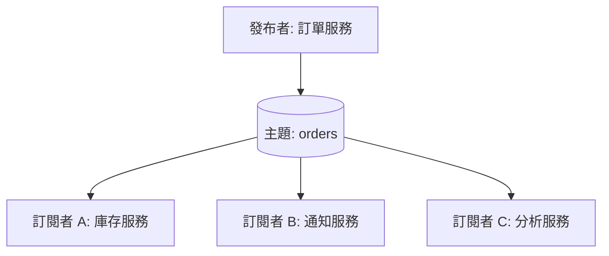

# [BEE-221] 發布-訂閱模式

:::info
Fan-out、主題路由與解耦生產者和消費者 — 發布者發送訊息時，不需要知道誰、或有多少人會接收。
:::

## 背景

在分散式系統中，多個服務往往需要對同一事件做出回應。最直觀的做法是直接串接：訂單服務依序呼叫庫存服務、通知服務和分析服務。每增加一個消費者，就需要修改發布者的程式碼。發布者因此被迫了解整個下游全貌，形成脆弱且高度耦合的設計。

**發布-訂閱（pub/sub）模式**打破了這種耦合。發布者將訊息送至一個**主題（topic）**——一個具名的邏輯頻道——然後即告完成。任意數量的訂閱者各自獨立地接收該訊息的副本。發布者完全不知道誰在訂閱、有多少訂閱者，也不知道訂閱者當下是否可用。

這與點對點佇列（point-to-point queue）不同：佇列中每則訊息只由一個接收者消費。在 pub/sub 中，每個訂閱者各自取得一份副本，此行為通常稱為 **fan-out**（扇出）。

**參考資料：**
- [Publish-Subscribe Channel — Enterprise Integration Patterns](https://www.enterpriseintegrationpatterns.com/patterns/messaging/PublishSubscribeChannel.html)
- [Publisher-Subscriber Pattern — Azure Architecture Center](https://learn.microsoft.com/en-us/azure/architecture/patterns/publisher-subscriber)
- [Application Integration Patterns for Microservices: Fan-Out Strategies — AWS](https://aws.amazon.com/blogs/compute/application-integration-patterns-for-microservices-fan-out-strategies/)

## 原則

**發布者將事件送至主題，無需知道訂閱者的存在。訂閱者宣告興趣並各自收到獨立副本。雙方皆不耦合於對方的存在、部署週期或處理速度。**

## Fan-Out：一則訊息，多個訂閱者

pub/sub 的核心機械特性是 fan-out：一則發布的訊息，會對每個活躍訂閱者各產生一次遞送。



每個訂閱者都收到完整且獨立的訊息副本。訂閱者 A 處理完其副本，對訂閱者 B 的副本毫無影響。緩慢的分析服務不會阻塞庫存預留；崩潰的通知服務也不會阻止分析事件被記錄。

## 訂單建立事件：具體範例

一個訂單建立事件發布至 `orders` 主題，三個服務訂閱此主題。

```
[訂單服務]
    │
    └──publish──> 主題: "orders"
                       │
          ┌────────────┼────────────┐
          │            │            │
  [庫存服務]       [通知服務]    [分析服務]
  預留庫存         發送確認信    記錄指標
```

每個服務各自獨立訂閱，並為自己的目的處理同一事件：

- **庫存服務** — 扣減訂單商品的可用庫存。
- **通知服務** — 寄送訂單確認信給客戶。
- **分析服務** — 記錄轉換事件與營收指標。

這些服務彼此互不知曉。新增第四個訂閱者（例如詐欺偵測服務），不需要修改發布者或任何現有訂閱者。

### 持久性訂閱 vs 非持久性訂閱

當通知服務暫時離線時，行為取決於訂閱類型。

| 情境 | 非持久性訂閱 | 持久性訂閱 |
|---|---|---|
| 通知服務離線時事件發布 | 該訂閱者的訊息遺失 | Broker 持久化保存訊息 |
| 通知服務恢復上線 | 無訊息可處理——事件未被儲存 | Broker 遞送緩衝的訊息 |
| 客戶是否收到確認信 | 永遠不會收到 | 恢復後最終會收到 |

**持久性訂閱**指示 broker 即使訂閱者離線，也保留其訊息。訂閱者恢復後從中斷處繼續處理。這需要 broker 按訂閱者儲存訊息，對儲存與記憶體有額外要求。

**非持久性訂閱**對離線的消費者採取發後不管（fire-and-forget）策略。適用於偶爾遺失訊息可接受的場景，例如只需關注當前值的即時儀表板指標。

## 主題式路由 vs 內容式路由

### 主題式（最常見）

訂閱者透過命名主題來表達興趣。發布至該主題的所有訊息都會遞送給所有訂閱者。

```
subscribe("orders")          → 接收所有訂單事件
subscribe("payments")        → 接收所有付款事件
subscribe("orders.europe")   → 僅接收發布至該子主題的事件
```

主題階層（如 `orders.europe.returns`）允許從粗粒度到細粒度的訂閱控制。這是 Kafka、SNS、Google Cloud Pub/Sub 及大多數 broker 採用的模型。

### 內容式

訂閱者提供針對訊息內容（標頭或 payload 欄位）評估的過濾表達式，只有符合過濾條件的訊息才會被遞送。

```
subscribe(filter: "amount > 10000 AND currency = 'USD'")
```

內容式過濾表達能力更強，但成本更高：broker 必須對每則訊息評估每個活躍訂閱者的過濾條件。此方式用於 Apache ActiveMQ（selectors）、Azure Service Bus（SQL 過濾器）等系統。

對大多數使用情境而言，設計良好的主題階層可以在不增加內容式過濾開銷的情況下達到所需的選擇性。

## 時間解耦（Temporal Decoupling）

pub/sub 引入了**時間解耦**：訂閱者消費訊息時，發布者不需要正在運行；同樣地，發布者發送事件時，訂閱者也不需要正在運行（使用持久性訂閱時）。

這是一個雙刃特性：

- **優點：** 服務可獨立部署、重啟和擴展。發布者永遠不會被阻塞等待訂閱者。
- **風險：** 事件的下游效應並非即時。若需要同步確認（例如「下訂前確認庫存是否足夠」），pub/sub 並非正確工具——應使用同步 RPC 或 request-reply 模式。

pub/sub 適用於**通知性事件**（「某件事已發生」），而非**命令**（「做這件事並告訴我結果」）。

## Pub/Sub vs 點對點

| 特性 | Pub/Sub（主題） | 點對點（佇列） |
|---|---|---|
| 接收者數量 | 所有訂閱者各取一份（fan-out） | 每則訊息僅由一個消費者處理 |
| 發布者對消費者的知識 | 無 | 無 |
| 適用情境 | 廣播、事件通知、事件驅動架構 | 任務分配、工作佇列、命令 |
| 重播 | 取決於 broker；一般有限 | 確認後不支援 |
| 擴展方式 | 新增訂閱者，不需修改發布者 | 新增消費者分擔佇列負載 |

## Pub/Sub 在微服務中的應用（事件驅動架構）

pub/sub 是微服務中事件驅動架構（EDA）的骨幹。每個服務將自己擁有的領域事件發布至主題，其他服務訂閱後作出回應。

使 pub/sub 適合微服務的關鍵特性：

1. **鬆耦合** — 服務僅依賴事件 schema，不依賴彼此的 API 或部署狀態。
2. **獨立擴展** — 每個訂閱者依據自身的處理速率和積壓量獨立擴展。
3. **可擴充性** — 新增功能意味著新增一個訂閱者，不需修改現有服務。
4. **故障隔離** — 一個訂閱者的故障不會傳播至發布者或其他訂閱者。

然而，採用 pub/sub 的 EDA 也引入了**最終一致性**：事件發布後，不同訂閱者在不同時間點才能收斂至一致狀態。系統必須設計成能夠容忍這個不一致的時間窗口。

## Pub/Sub 中的至少一次遞送

大多數生產環境的 pub/sub 系統提供**至少一次遞送（at-least-once delivery）**：broker 保證訊息至少遞送一次，但在網路故障、逾時或 broker 重啟時，可能重複遞送。

影響：
- 訂閱者必須具備**冪等性（idempotency）**——重複處理同一訊息必須產生相同的最終狀態。
- 範例：若庫存預留在每次遞送時都扣減庫存，重複遞送就會造成庫存計算錯誤。請使用去重鍵（deduplication key）或條件式更新。

部分 broker（Kafka transactions、Google Cloud Pub/Sub 搭配排序與去重）可實現恰好一次遞送（exactly-once），但會增加複雜度與延遲。除非有明確需求，否則優先設計為可容忍至少一次遞送。

詳見 BEE-221 的完整遞送保證說明。

## Pub/Sub 中的有序遞送

除非明確設計，pub/sub 本身不保證跨訂閱者，甚至單一訂閱者內的有序遞送。

- **單一訂閱者內：** 若 broker 內部使用多個分區或佇列，除非發布者使用一致的分區鍵，否則訊息可能亂序到達。
- **跨訂閱者：** 訂閱者以各自的速率處理。庫存服務可能在分析服務處理訂單 #41 之前就處理了訂單 #42。每個訂閱者看到的都是自己的遞送順序。
- **排序保證：** Kafka 在消費者群組內保證每個分區的有序性。SNS + SQS FIFO 在訊息群組內提供排序。

不要假設兩個訂閱者接收到相同的事件就會以相同的順序或在相同的時間處理它們。

## 常見錯誤

### 1. 透過共享訊息 Schema 造成緊耦合

pub/sub 在傳輸層解耦，但若所有服務共享一個集中管理的訊息 schema，就在契約層重新引入了耦合。修改 schema 需要協調所有訂閱者同步升級——抵銷了解耦的目的。

使用 schema 演進策略：僅允許新增的變更、版本化的事件類型，或具備相容性檢查的 schema registry。發布者擁有自己的事件 schema，訂閱者自行適應。

### 2. 主題過多（每種事件類型一個主題）

為每種事件類型建立獨立主題（`order.created`、`order.updated`、`order.cancelled`...）會使事件空間碎片化。關注所有訂單生命週期事件的訂閱者必須維護 N 個訂閱。領域變更需要建立新主題並遷移訂閱者。

優先使用**較粗粒度的主題**（例如 `orders`），並在訊息 payload 內包含事件類型欄位。訂閱者在自身邏輯中按事件類型過濾，或在 broker 支援時使用內容式過濾。

### 3. 訂閱者失敗時缺乏死信處理

當訂閱者多次嘗試處理訊息都失敗時，訊息要麼被丟棄（非持久性），要麼無限期阻塞訂閱者的佇列（持久性）。沒有**死信佇列（DLQ）**，失敗的訊息就會靜默遺失或導致消費者卡死。

在每個持久性訂閱上配置 DLQ。將超過重試上限的訊息路由至 DLQ，以便檢查、告警和手動重播。詳見 BEE-221。

### 4. 跨訂閱者的順序假設

不要編寫依賴「訂閱者 A 必須在訂閱者 B 處理同一事件之前完成處理」的業務邏輯。它們獨立且並行運作。若下游流程需要特定順序（例如「確認付款後才能開始出貨」），應將其建模為循序 saga 或使用協調器，而非依賴 pub/sub 的順序假設。

### 5. Pub/Sub 缺乏監控（訂閱者靜默失敗）

只要 broker 接受訊息，發布者即告成功。若訂閱者已關閉、處理緩慢或靜默拋出例外，發布者完全沒有可見性。從發布者的角度看，一切正常。

監控項目：
- **訂閱者消費延遲（consumer lag）** — 每個訂閱者落後多遠？
- **DLQ 深度** — 是否有訊息被拒絕？
- **每個訂閱者的處理錯誤率**
- **端到端延遲** — 從發布到訂閱者確認的時間

沒有訂閱者監控的 pub/sub 拓撲是一個無人觀察的系統。靜默失敗會持續累積，直到某個下游業務功能明顯損壞時才被發現。

## 相關 BEE

- **BEE-220** — 訊息佇列 vs 事件串流：何時選用各模型
- **BEE-221** — 遞送保證：至多一次、至少一次、恰好一次
- **BEE-221** — 死信佇列與毒訊息處理
- **BEE-101** — DDD 領域事件：要發布什麼以及原因
