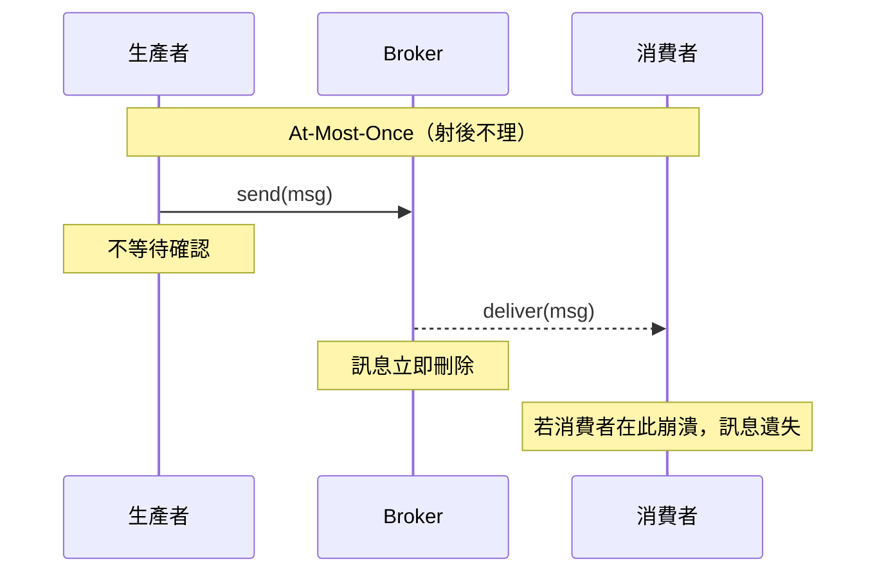
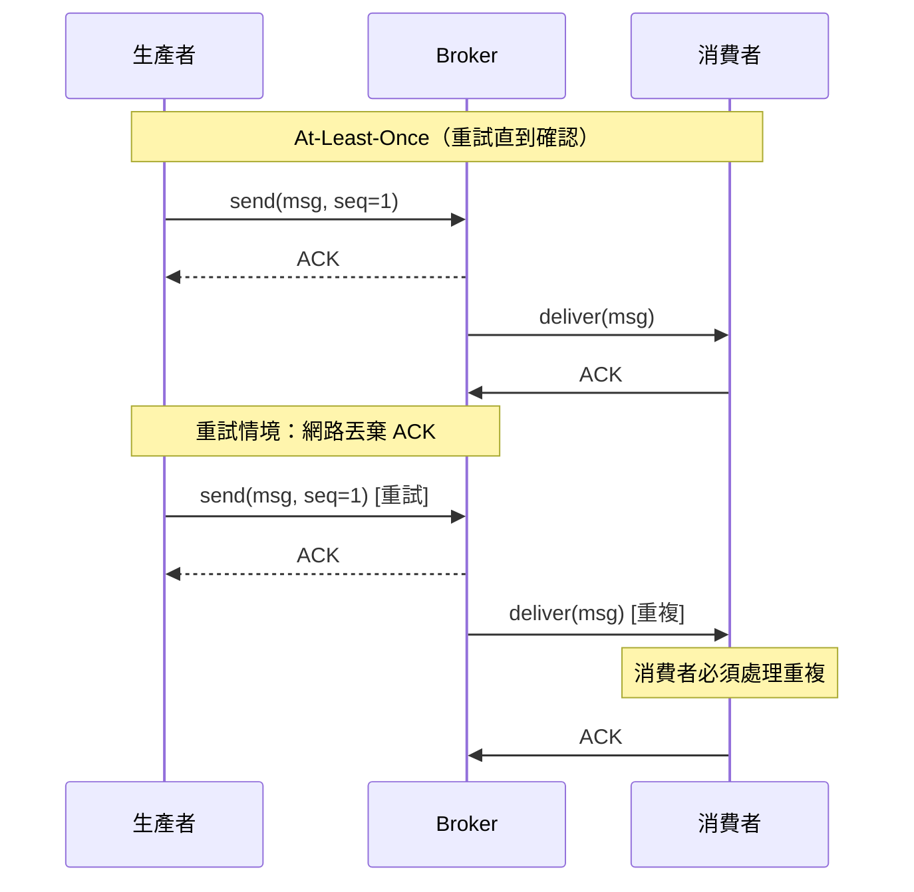
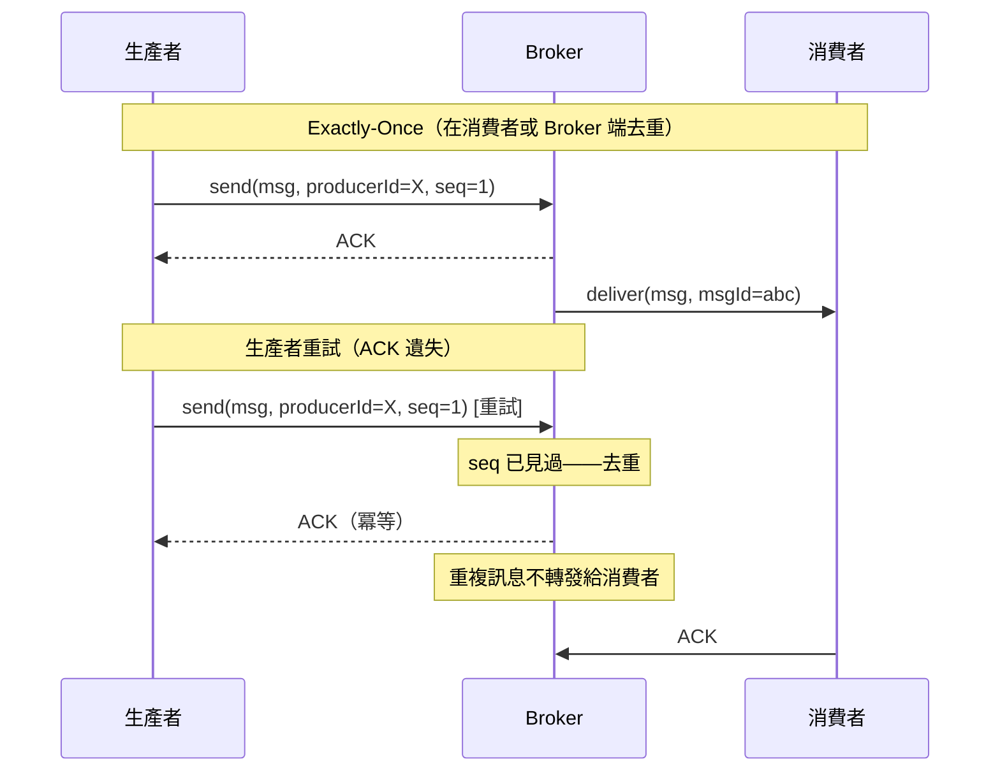

# [BEP-222] 交付保證

:::info
At-most-once、at-least-once 與 exactly-once 語意——各自的成本、適用時機，以及為什麼「恰好一次」比聽起來更微妙。
:::

## 背景

每個訊息系統都對訊息會被傳遞多少次做出承諾。這個承諾稱為**交付保證（delivery guarantee）**，是分散式系統中最關鍵的設計決策之一。

問題本質上來自不確定性：生產者發送訊息後，網路隨時可能丟棄它、broker 可能在持久化前崩潰，或消費者在收到訊息後、完成處理前崩潰。每種失敗模式需要不同的恢復策略，而每種策略都隱含著不同的傳遞次數。

理解交付保證可以避免兩個代價高昂的錯誤：選擇保證太弱導致資料遺失，以及選擇保證太強但沒有考慮冪等性而導致重複的副作用。

**參考資料：**
- [Message Delivery Guarantees for Apache Kafka — Confluent Documentation](https://docs.confluent.io/kafka/design/delivery-semantics.html)
- [You Cannot Have Exactly-Once Delivery — Tyler Treat, Brave New Geek](https://bravenewgeek.com/you-cannot-have-exactly-once-delivery/)
- [Exactly-once Semantics is Possible: Here's How Apache Kafka Does it — Confluent Blog](https://www.confluent.io/blog/exactly-once-semantics-are-possible-heres-how-apache-kafka-does-it/)

## 原則

**根據對遺失的容忍度與重複的代價來選擇交付保證。預設使用 at-least-once 加上冪等消費者。僅在這種組合確實不足時，才考慮 exactly-once 的基礎架構。**

## 三種保證

### At-Most-Once（射後不理）

生產者發送訊息後不等待確認。若訊息遺失，不會重試。

- **傳遞次數：** 0 或 1 次。
- **失敗時：** 訊息被靜默丟棄。
- **成本：** 最低——無需協調、無重試狀態。
- **風險：** 資料遺失。

適用於可以接受遺失、且低延遲或高吞吐量比完整性更重要的場景。遺失一個指標數據點通常無害；遺失一筆付款則截然不同。

### At-Least-Once（重試直到確認）

生產者持續重試直到收到 broker 的成功確認。若確認在傳輸途中遺失（即使 broker 已持久化訊息），生產者會重試，broker 可能收到相同訊息超過一次。

- **傳遞次數：** 1 次或多次。
- **失敗時：** 訊息持續重試直到確認。
- **成本：** 中等——需要重試邏輯、消費者端去重。
- **風險：** 重複傳遞。

這是大多數系統的標準選擇。消費者必須設計為能安全處理重複訊息——透過設計上的冪等性，或依據穩定的訊息 ID 明確去重（見 BEP-226）。

### Exactly-Once（透過去重實現有效一次）

系統確保處理訊息的**效果**恰好發生一次，即使在傳輸層訊息被傳遞超過一次。

- **傳遞次數：** 無論重試多少次，表現上只有 1 次效果。
- **失敗時：** 在 broker 層（冪等生產者）或消費者層（冪等處理）去重。
- **成本：** 最高——需要 broker 層事務（Kafka EOS）或消費者層去重狀態。
- **風險：** 複雜性高、吞吐量降低、運維負擔增加。

這就是為什麼「exactly-once delivery」在技術上存在爭議（見下文）。Kafka 所稱的 exactly-once 語意（EOS）更精確的說法是*在事務性管道內的 exactly-once 處理*——它並非消除了精心設計的需求，而是將去重發生的位置轉移了。

## 為什麼 Exactly-Once 存在爭議

Tyler Treat 的奠基性文章論證了**在分散式系統中，從絕對意義上無法實現 exactly-once delivery**。論證根植於兩將軍問題（Two Generals Problem）：透過不可靠網路通訊的兩方，無法對訊息是否被接收達成有保證的共識。

若生產者發送訊息後網路丟棄了確認，生產者無法知道 broker 是否收到了訊息。從生產者角度，它必須：
- **不重試** → 冒著遺失訊息的風險（at-most-once）。
- **重試** → 冒著傳遞兩次的風險（at-least-once）。

在傳輸層沒有第三個選項。系統所稱的「exactly-once」始終是建立在 at-least-once delivery 之上的應用層保證，使用去重、冪等寫入或分散式事務來實現。Broker 透過為每個生產者分配持久 ID 並追蹤序號來去重重試——但這是去重，不是魔法。

**實務要點：** at-least-once delivery + 冪等消費者 = 有效的 exactly-once 行為。對大多數使用場景，這是正確的架構。Broker 層的 exactly-once（Kafka EOS）在建構消費者端去重狀態不切實際的串流管道中很有價值。

## 序列圖







## 確認模式

消費者確認訊息的方式決定了系統能維持的交付保證。

### Auto-ACK（處理前確認）

Broker 在消費者收到訊息後立即標記為已傳遞，在任何處理發生之前。

```
broker 傳遞 → [自動 ACK 發送] → 消費者處理
                                        ↑
                        在此崩潰 → 訊息遺失
```

這是 at-most-once。消費者可能在收到訊息和處理之間崩潰。訊息不會被重新傳遞。僅在可以接受遺失時使用。

### Manual ACK（處理後確認）

消費者在處理完成後明確確認訊息。

```
broker 傳遞 → 消費者處理 → [手動 ACK 發送]
                    ↑
    在此崩潰 → broker 重新傳遞 → at-least-once
```

這是 at-least-once。在處理後、確認前崩潰會導致重新傳遞。消費者必須容忍重複。

### Negative ACK（NACK）/ 重試至 DLQ

消費者明確拒絕無法處理的訊息。Broker 根據配置的重試次數後，將其重新排隊（重試）或路由到死信佇列（DLQ）。

這是區分暫時性失敗（服務不可用）與永久性失敗（訊息格式錯誤）的正確模式。DLQ 設計見 BEP-224。

## 消費者 Offset 管理

在事件串流（Kafka）中，消費者負責**提交 offset**——即它已處理事件的位置。Offset 管理直接控制有效的交付保證。

### 處理前提交 Offset（At-Most-Once）

```
讀取事件 → 提交 offset → 處理事件
                                ↑
           在此崩潰 → 重啟後事件被跳過
```

Offset 在工作完成前就被推進。重啟後，消費者從已提交位置之後繼續，有效丟棄了進行中的事件。

### 處理後提交 Offset（At-Least-Once）

```
讀取事件 → 處理事件 → 提交 offset
                ↑
  在此崩潰 → offset 未推進 → 重啟後重新處理
```

這是標準模式。崩潰後消費者從最後提交的 offset 重啟，並從那裡重新處理。消費者必須處理重複處理的情況。

### 事務性提交（Kafka 中的 Exactly-Once）

Kafka 的 exactly-once 語意（自 0.11.0 起可用）使用事務性 API，在同一個事務中原子性地提交輸出寫入**和** offset。要麼兩者都成功，要麼都不成功。

這很強大，但有代價：需要冪等生產者、事務協調器，並增加延遲（每次提交通常需要幾十毫秒）。保留給串流管道中應用側去重不切實際的場景。

## 交付保證 vs. 處理保證

這是兩個截然不同的概念，卻經常被混淆。

| 概念 | 範疇 | 範例 |
|---|---|---|
| 交付保證 | Broker 是否將訊息傳遞給消費者 | 訊息到達 0、1 或 N 次 |
| 處理保證 | 消費者的**效果**（DB 寫入、發送 email）是否發生一次 | 冪等寫入、去重表 |

Broker 可以保證 at-least-once delivery，但若消費者在寫入資料庫後、提交 offset 前崩潰，重啟後相同的資料庫寫入可能被嘗試兩次。**Broker 的交付保證不會自動延伸到消費者的副作用。**

這就是為什麼 BEP-164（冪等性）和 BEP-226（冪等處理）需要與交付保證並存——兩個層次都需要。

## 選擇合適的保證

| 使用場景 | 建議保證 | 原因 |
|---|---|---|
| 指標 / 遙測 | At-most-once | 遺失少量資料點可接受；最小化開銷 |
| 推播通知 | At-most-once | 錯過通知是輕微的 UX 問題；重複推播令人惱火 |
| Email / SMS 警報 | At-least-once + 去重 | 遺失可見；透過冪等性鍵處理重複發送 |
| 訂單處理 | At-least-once + 冪等消費者 | 遺失不可接受；透過訂單 ID 去重 |
| 付款處理 | At-least-once + 冪等消費者 | 重複扣款後果嚴重；依付款意圖 ID 去重 |
| 串流處理管道 | Kafka exactly-once（EOS） | 多跳使消費者端去重複雜；Broker 層事務更簡潔 |

## 實例：通知 vs. 付款

### 通知系統 — At-Most-Once

```
[使用者行為服務] ──射後不理──> [topic: user.events]
                                        │
                               [通知服務]
                                 收到即自動 ACK
                                 發送推播通知
```

若通知服務在收到訊息和發送推播之間崩潰，通知不會送達。使用者錯過「您的訂單已出貨」的提醒。

**這是可以接受的。** 使用者預期通知有時會延遲或遺失。保證的代價（重試、去重基礎架構）超過了偶爾遺失的代價。

### 付款處理 — At-Least-Once + 冪等消費者

```
[結帳服務]
  ──發布──> [topic: payment.requests]
            訊息：{ paymentIntentId: "pi_abc123", amount: 99.00 }

[付款服務]
  讀取事件
  檢查：是否已處理「pi_abc123」？（查詢 payments 表）
    是 → 跳過（冪等）
    否 → 向信用卡收費，寫入含 paymentIntentId 的記錄
  提交 offset
```

若付款服務在扣款後、提交前崩潰，事件被重新傳遞。重試時，`paymentIntentId` 查詢找到現有的扣款記錄並跳過。客戶只被收費一次。

**交付保證是 at-least-once。處理保證是 exactly-once，透過冪等性實現。**

對此使用場景而言，這種模式比 Broker 層的 exactly-once 更便宜、更可靠——因為冪等邏輯存在於應用程式中，而應用程式本已能存取 payments 資料庫。

## 常見錯誤

### 1. 對關鍵操作選擇 At-Most-Once

At-most-once 是射後不理。任何崩潰、網路抖動或 broker 重啟都可能靜默丟棄訊息。永遠不要將其用於金融交易、訂單處理、庫存更新，或任何靜默遺失會導致正確性或合規問題的操作。

### 2. At-Least-Once 但沒有冪等消費者

選擇 at-least-once delivery 但未設計重複處理，是最常見的故障模式。若消費者執行 `INSERT INTO orders (id, ...) VALUES (...)` 而沒有去重檢查，重新傳遞的訊息會插入重複的行。始終將 at-least-once delivery 與冪等性配對使用（見 BEP-164、BEP-226）。

### 3. 處理前提交 Offset

在 Kafka 中，在處理工作完成前提交 offset，給出的是 at-most-once 語意，而不是 exactly-once。若消費者在提交後、寫入資料庫前崩潰，重啟後事件被跳過——offset 已經推進到它之後。始終在處理副作用被持久化後才提交。

### 4. 假設 Broker 保證了處理

Broker 保證**傳遞**——訊息到達了消費者。它不保證消費者的下游動作（DB 寫入、外部 API 呼叫、檔案寫入）成功完成。消費者可以收到訊息，卻未能寫入資料庫，但仍然確認了訊息。Broker 認為傳遞成功。處理成功完全是消費者的責任。

### 5. 對 At-Least-Once + 去重就夠的場景過度工程化為 Exactly-Once

Kafka 的事務性 exactly-once API 功能強大，但增加了運維複雜性、延遲開銷，並需要仔細配置。對大多數使用場景，at-least-once delivery 加上應用程式資料庫中的去重鍵，能以更簡單的基礎架構實現相同的正確性保證。將 Broker 層的 EOS 保留給應用側去重不切實際的多跳串流管道。

## 相關 BEP

- **BEP-164** — 冪等性：設計可以安全重複執行的操作
- **BEP-220** — 訊息佇列 vs 事件串流：選擇合適的模型
- **BEP-224** — 死信佇列與有毒訊息
- **BEP-226** — 冪等訊息處理：消費者中的去重模式
