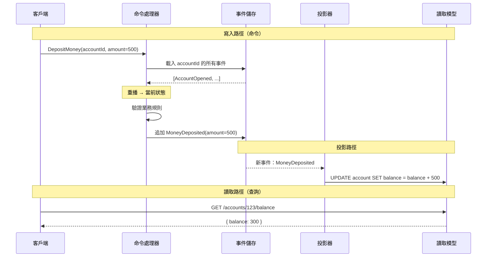
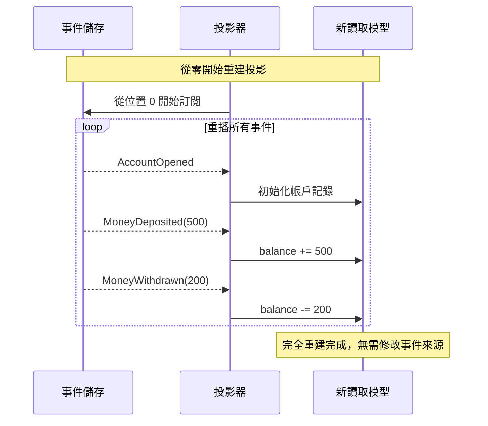

# [BEE-223] 事件溯源

:::info
將狀態儲存為不可變的事件序列，透過重播事件還原當前狀態，並在不修改事件日誌的情況下建立任意數量的投影。
:::

## 背景

大多數系統只儲存實體的*當前狀態*——資料庫中的一筆記錄，每次有變更時就覆寫。這種方式簡單有效，但有個致命缺點：它會摧毀歷史資訊。一旦你將餘額從 500 更新為 300，這筆餘額是如何變成 500 的過程就永遠消失了。

事件溯源採取相反的做法：**將每一次狀態變更以不可變的事件形式儲存，並透過重播這些事件序列來推導當前狀態**。事件日誌是唯一的事實來源（Source of Truth）。任何讀取模型中的「當前狀態」都是可衍生的投影，隨時可以從頭重建。

這個模式由 Martin Fowler 提出，後來 Greg Young 結合 CQRS 一同推廣。它在會計、訂單管理，以及需要嚴格稽核的受監管領域中特別成熟，因為這些領域中變更歷史與當前值同等重要。

**參考資料：**
- [Event Sourcing — Martin Fowler](https://martinfowler.com/eaaDev/EventSourcing.html)
- [Event Sourcing Pattern — Microsoft Azure Architecture Center](https://learn.microsoft.com/en-us/azure/architecture/patterns/event-sourcing)
- [CQRS and Event Sourcing — Greg Young / Kurrent](https://www.kurrent.io/blog/transcript-of-greg-youngs-talk-at-code-on-the-beach-2014-cqrs-and-event-sourcing)

## 原則

**將每一次狀態轉換捕捉為不可變的過去式領域事件。只儲存事件；透過重播事件推導所有當前狀態。永遠不要更新或刪除事件。**

## 核心概念

### 事件即事實

事件是對*已發生之事*的記錄。這有兩個重要屬性：

1. **過去式命名** — `AccountOpened`（帳戶已開立）、`MoneyDeposited`（資金已存入）、`MoneyWithdrawn`（資金已提出），而非 `OpenAccount`（開立帳戶）或 `DepositMoney`（存入資金）。
2. **不可變性** — 事件一旦寫入就無法更改。若發生錯誤，應追加一個新的修正事件，而非修改原始記錄。日誌僅支援追加。

事件是關於世界的事實，表達的是已實現的意圖，而非即將發生的指令。

### 透過重播還原狀態

當前狀態並不直接儲存，而是透過依序讀取並套用某個實體的所有事件來計算：

```
初始狀態（空）
  + AccountOpened(initial=0)       → 餘額: 0
  + MoneyDeposited(amount=500)     → 餘額: 500
  + MoneyWithdrawn(amount=200)     → 餘額: 300
                                   = 當前狀態: { balance: 300 }
```

重播函式是一個純粹的 reducer：給定當前聚合狀態與一個事件，回傳新的狀態。這使得邏輯易於測試。

### 投影（Projections / 物化視圖）

投影（也稱為讀取模型或物化視圖）是透過消費事件流所建立的計算視圖。投影針對讀取進行最佳化，可以採用任何形式，而不影響事件日誌。

核心特性：**投影隨時可重建**。若投影有誤，或需要建立新的投影，只需丟棄它，然後將完整的事件歷史重播一次新的投影邏輯即可。

### 快照（Snapshots）

每次讀取時都重播數千甚至數百萬個事件代價高昂。快照在某個時間點擷取聚合的狀態，重播時只需處理快照*之後*的事件：

```
第 9800 個事件的快照 → 套用第 9801 至 9950 個事件 → 當前狀態
```

快照是效能最佳化手段，不改變正確性模型——快照本身可以隨時從事件日誌重新生成。建議定期建立快照（每 N 個事件，或依時程），而非在每次寫入時建立。

### 事件儲存（Event Store）

事件儲存是僅支援追加的事件日誌，具有以下特性：

- **僅追加寫入** — 不支援更新或刪除。
- **聚合內有序** — 給定實體的事件具有單調遞增的序號。
- **樂觀並發控制** — 寫入時可斷言預期的版本號，以防止更新遺失。
- **流式訂閱** — 消費者可訂閱事件流或流類別，即時接收新事件。

常見實作：EventStoreDB（專用）、Apache Kafka（用作事件儲存）、PostgreSQL 的 `events` 資料表、Azure Cosmos DB 搭配 Change Feed。

### 事件版本控制（Event Versioning）

事件具有長期生命週期。今天定義的 schema 隨著領域演進將需要調整。常見策略：

| 策略 | 說明 | 適用情況 |
|---|---|---|
| **向上轉型（Upcasting）** | 讀取時將舊格式轉換為新格式 | 新增可選欄位 |
| **複製並替換** | 在 v1 旁引入新的 v2 事件類型 | 有破壞性的 schema 變更 |
| **弱 schema** | 以 JSON 儲存，反序列化時採用寬鬆策略 | 領域早期探索階段 |
| **事件遷移** | 將舊事件改寫為新格式（極少使用） | 謹慎評估後確有必要 |

永遠不要默默忽略未知欄位——使用 upcaster 將它們作為未知的元數據向前傳遞。

## 序列圖





## 實例：銀行帳戶

### 傳統做法（儲存當前狀態）

```sql
-- 任何時刻的狀態都只是一筆記錄
INSERT INTO accounts (id, balance) VALUES ('acc-1', 0);
UPDATE accounts SET balance = 500 WHERE id = 'acc-1';  -- 存款
UPDATE accounts SET balance = 300 WHERE id = 'acc-1';  -- 提款

-- 歷史已消失，無法回答：
--   「3月5日的餘額是多少？」
--   「這個月共有幾次存款？」
```

### 事件溯源做法

```
-- 事件儲存（僅追加）
{ stream: "account-acc-1", seq: 1, type: "AccountOpened",    data: { initialBalance: 0   } }
{ stream: "account-acc-1", seq: 2, type: "MoneyDeposited",   data: { amount: 500          } }
{ stream: "account-acc-1", seq: 3, type: "MoneyWithdrawn",   data: { amount: 200          } }

-- 重播函式（純粹的 reducer）
apply(state, AccountOpened)    → { balance: 0 }
apply(state, MoneyDeposited)   → { balance: 500 }
apply(state, MoneyWithdrawn)   → { balance: 300 }
```

當前餘額為 300。所有歷史狀態皆可推導。

### 新增投影，無需修改 Schema

業務方需要月結單報表。在傳統模式下，可能需要 `ALTER TABLE` 或新增追蹤欄位。使用事件溯源，只需新增一個投影器：

```
-- 新投影器：MonthlyStatement（月結單）
on MoneyDeposited  → insert into monthly_credits  (accountId, month, amount)
on MoneyWithdrawn  → insert into monthly_debits   (accountId, month, amount)

-- 對完整事件歷史執行 → 回填完成
-- 無需資料遷移、無需修改 schema、無需停機
```

事件日誌未改變。新投影器從位置 0 開始執行，月結單資料表就從所有歷史事件中自動填入。

## 適用場景

**以下情況適合使用：**

- **稽核紀錄是核心需求** — 金融交易、醫療記錄、合規性日誌。事件日誌本身即是稽核軌跡，無需另外建置。
- **需要時間點查詢** — 「3月3日中午的帳戶餘額是多少？」是一等公民操作。
- **需要偵錯生產問題** — 可重播導致錯誤狀態的確切事件序列。
- **需要多個讀取模型** — 不同的消費者需要對同一資料的不同視圖，每個消費者只需增加一個投影器，不影響其他人。
- **搭配 CQRS（BEE-102）使用** — 事件溯源是 CQRS 讀寫分離中寫入端的自然補充。
- **業務事件是主要語言** — 領域以事件（訂單已下達、貨物已發出、付款已收到）表達，事件溯源使這個模型顯式化。

## 不適用場景

**以下情況應避免使用：**

- **簡單 CRUD 已足夠** — 使用者個人資料、設定頁面、組態資料表。對於沒有重要狀態歷史的領域，事件溯源帶來的複雜度毫無回報。
- **團隊不熟悉此模式** — 事件溯源有陡峭的學習曲線。在未充分理解的情況下導入，反而會使系統更難理解，而非更清晰。
- **主要存取模式是查詢當前狀態** — 如果幾乎不需要歷史，且總是需要當前狀態，關聯式資料庫的一筆記錄更快、更簡單。
- **領域事件不清晰** — 事件溯源需要有凝聚力的通用語言和明確的領域事件。如果你無法以過去式清楚命名事件，代表領域模型尚未就緒。
- **法規要求禁止不可變儲存** — 刪除權（GDPR 第 17 條）與僅追加的日誌相衝突。這個問題可解（加密金鑰刪除、事件標記刪除），但會大幅增加複雜度。

## 常見錯誤

### 1. 對所有系統使用事件溯源

這是最常見的誤用。客戶地址、產品描述、功能開關——大多數資料變更並非有意義的領域事件。全面應用事件溯源，會對毫無收益的系統部分增加基礎設施成本和認知負擔。應選擇性地應用於歷史記錄真正重要的聚合上。

### 2. 可變事件

更新或刪除事件會破壞整個模型。若事件有誤，正確的做法是追加一個補償事件（`PaymentReversed`、`OrderCancelled`），而非修改原始記錄。事件一旦寫入，無論儲存方式為何，都應視為不可變。

### 3. 缺乏快照策略

重播 1000 萬個事件來載入一個聚合是個真實的問題。從小規模事件數量出發並跳過快照設計的系統，最終都會遇到效能瓶頸。盡早定義快照策略——即使不立即啟用——這樣在事件數量增長時就已有基礎設施可用。

### 4. 缺乏事件版本控制策略

當業務第一次在事件類型中新增欄位時，沒有版本控制策略的系統，不是在反序列化舊事件時崩潰，就是默默丟棄新欄位。在第一次生產環境 schema 變更發生之前，就應選定 upcasting 方案，而非事後補救。

### 5. 投影與事件儲存耦合

投影應可獨立重建。若投影邏輯嵌入在事件儲存的 schema 中，或需要投影狀態才能正確解讀事件日誌，重建就會在不停機或資料遺失的情況下變得不可能。投影是讀取端的關注點——保持分離，並將其視為可丟棄的。

### 6. 混淆命令與事件

命令（`DepositMoney`）是一個可能被拒絕的請求；事件（`MoneyDeposited`）是一個已發生的事實。將命令儲存在事件儲存中會模糊這個區別，使日誌更難解讀。只有成功且經過驗證的狀態轉換才會產生事件。

## 相關 BEE

- **BEE-102** — CQRS：讀寫模型分離；事件溯源是寫入端的自然配對
- **BEE-144** — 時態資料：查詢某個時間點的狀態
- **BEE-164** — 冪等性：投影器必須具備冪等性，才能安全地支援重播
- **BEE-220** — 事件流：在生產者與投影器之間傳遞事件的基礎設施層
