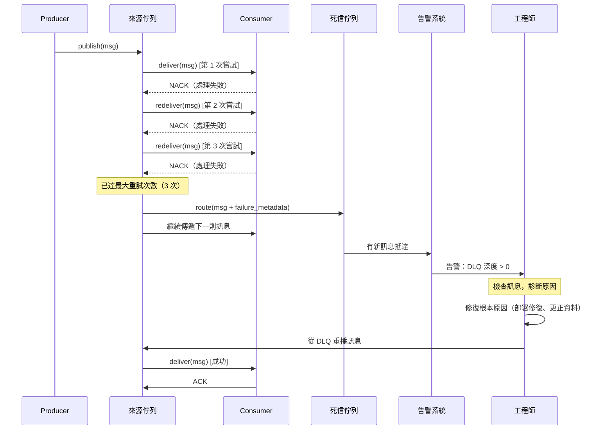

# [BEE-224] 死信佇列與毒訊息

:::info
將無法處理的訊息路由至專用的暫存佇列。持續監控它。主動檢查它。在重播之前先修復根本原因。絕不讓單一問題訊息阻擋所有正常訊息的流動。
:::

## 背景

在任何訊息驅動的系統中，都會有部分訊息無法成功處理。失敗原因可能是暫時性的——例如下游服務暫時不可用——也可能是永久性的——例如訊息格式錯誤、Schema 已變更，或 Consumer 本身有 Bug。對暫時性失敗進行重試是合理的，但對永久性失敗無限重試則毫無意義。

**毒訊息（Poison Message）** 是一種無論重試多少次都無法成功處理的訊息。如果訊息系統沒有隔離機制，一則毒訊息就能讓整個佇列陷入停滯：Consumer 取出訊息、失敗、重新放回佇列、再次取出、再次失敗，如此無限循環，使後續所有訊息無法被處理。

**死信佇列（Dead Letter Queue，DLQ）** 是一個獨立的目標佇列——訊息在耗盡重試次數後會被路由至此。DLQ 不是垃圾桶，而是供人工調查與復原的暫存區。DLQ 中的訊息會被保留，直到工程師進行檢查、釐清失敗原因、修復問題，並決定重播或丟棄這些訊息。

**參考資料：**
- [Using dead-letter queues in Amazon SQS — AWS 文件](https://docs.aws.amazon.com/AWSSimpleQueueService/latest/SQSDeveloperGuide/sqs-dead-letter-queues.html)
- [Service Bus dead-letter queues — Azure Service Bus | Microsoft Learn](https://learn.microsoft.com/en-us/azure/service-bus-messaging/service-bus-dead-letter-queues)
- [Dead letter queue — Wikipedia](https://en.wikipedia.org/wiki/Dead_letter_queue)

## 原則

**為每一條承載業務關鍵訊息的佇列配置 DLQ。設定有限的最大重試次數。在 DLQ 訊息中附加失敗後設資料。監控 DLQ 並在有新訊息時發出告警。在修復根本原因之前，絕不重播 DLQ 中的訊息。**

## 什麼是毒訊息？

毒訊息是指在目前系統狀態下，Consumer 無論嘗試幾次都無法成功處理的訊息。這類失敗是永久性的。

常見原因：

| 原因 | 範例 |
|---|---|
| Schema 不相符 | Producer 以 Protobuf v2 序列化，Consumer 仍期望 v1 格式 |
| 資料無效或缺失 | `product_id` 欄位為 null，Consumer 無法查找對應商品 |
| 違反業務規則 | 訂單金額為負數，驗證永遠失敗 |
| Consumer Bug | 近期部署的程式碼存在 null pointer exception |
| 下游服務永久不可用 | 第三方服務已下線 |
| 訊息過大 | Payload 超過 Broker 大小限制，反序列化永遠失敗 |

與暫時性失敗的關鍵區別：**暫時性失敗在延遲重試後最終會成功；毒訊息在某些外部條件改變之前（例如部署程式碼修復、更正資料、遷移 Schema）永遠不會成功。**

## 為何無限重試有害

沒有 DLQ 的系統通常以無限重試作為失敗的應對方式，這會帶來幾個問題：

1. **佇列飢餓。** Consumer 卡在重試毒訊息時，佇列中後續的所有訊息都被延誤。在有序佇列中，毒訊息後面的所有訊息完全無法被處理。

2. **資源浪費。** CPU、網路呼叫與下游連接被消耗在永遠不會成功的工作上。

3. **告警疲勞。** 若每次重試都產生錯誤日誌或指標，On-call 工程師會被來自單一問題訊息的大量雜訊淹沒。

4. **隱性資料完整性問題。** 在長時間重試後亂序到達的訊息，可能在下游系統已無法預期的狀態下被處理。

正確的模型：以有限次數的退避重試（參見 BEE-261），然後路由至 DLQ 繼續處理後續訊息。

## DLQ 訊息後設資料擴充

當訊息被路由到 DLQ 時，僅保留原始 Payload 通常不足以診斷問題。訊息應在路由時附加以下後設資料：

| 後設資料欄位 | 用途 |
|---|---|
| `source_queue` | 訊息最初來自哪個佇列 |
| `failure_reason` | 最後一次失敗時的例外類型與訊息 |
| `attempt_count` | 嘗試處理的次數 |
| `first_failure_time` | 第一次失敗的時間戳記 |
| `last_failure_time` | 最近一次失敗的時間戳記 |
| `consumer_id` | 處理訊息的 Consumer 實例 |
| `original_message_id` | 連結 DLQ 條目與來源訊息的穩定識別碼 |

許多 Broker（AWS SQS、Azure Service Bus、ActiveMQ）會自動填入部分後設資料。對於不支援自動填入的 Broker，Consumer 應在轉發至 DLQ 前手動包裝訊息。

## 訊息流程



## 最大重試次數

最大重試次數（AWS SQS 中稱為 `maxReceiveCount`，Azure Service Bus 中稱為 `maxDeliveryCount`）是 Broker 在將訊息路由至 DLQ 之前的最大嘗試傳遞次數。

**如何選擇適當的值：**

- **過低（1–2 次）：** 一次短暫的網路抖動就可能讓完全正常的訊息被路由到 DLQ，增加 On-call 負擔。
- **過高（50 次以上）：** 毒訊息會緩慢地消耗完所有重試次數，長時間阻塞佇列。
- **大多數系統的適當範圍：3–5 次**，搭配指數退避（參見 BEE-261）。這樣既能應對短暫中斷，又不會讓無法處理的訊息長時間循環。

對於時效敏感的佇列（如付款處理、庫存鎖定），建議使用較低的最大重試次數搭配較短的退避間隔，讓 DLQ 能快速捕捉永久性失敗。

## DLQ 監控與告警

沒有監控的 DLQ，在操作上等同於丟棄訊息。訊息會默默積累，根本原因逐漸變得陳舊，復原也愈加困難。

**必要的告警：**

1. **DLQ 深度 > 0** — DLQ 中任何訊息都應觸發通知。對於高吞吐量系統，可設定深度超過閾值（例如 5 則）才告警，以避免暫時性尖峰造成告警風暴。
2. **DLQ 深度隨時間增長** — 表示系統性故障而非偶發問題，若深度在多個檢查週期內持續上升，應進行升級。
3. **DLQ 訊息存留超過 SLA** — 若訊息未受檢查的時間超過 SLA（例如 24 小時），應進行升級。

在訊息被路由至 DLQ 時輸出結構化日誌，可啟用基於日誌的告警（參見 BEE-321）：

```json
{
  "level": "error",
  "event": "message.dead_lettered",
  "queue": "order.fulfillment",
  "dlq": "order.fulfillment.dlq",
  "message_id": "msg-abc123",
  "attempt_count": 3,
  "failure_reason": "ValidationException: product_id not found",
  "timestamp": "2024-03-15T14:23:01Z"
}
```

## 人工檢查與重播

當 DLQ 告警觸發時，復原流程如下：

1. **檢查訊息。** 讀取 Payload 與失敗後設資料，了解 Consumer 嘗試執行的操作及失敗原因。
2. **分類失敗原因。** 是資料問題（來自 Producer 的錯誤輸入）、程式碼 Bug（近期部署已修復）、還是基礎設施問題（下游服務已恢復）？
3. **修復根本原因。** 部署程式碼修復、更正上游資料，或確認下游服務已健康。
4. **有選擇地重播。** 若修復具針對性，僅重播受影響的訊息；若修復範圍廣，則重播整個 DLQ 批次。
5. **驗證結果。** 確認重播訊息被成功處理，觀察 Consumer 錯誤率。
6. **無法恢復時丟棄。** 部分訊息無法重播（例如已過時效的事件通知），應記錄後丟棄。

**在修復根本原因之前不要重播。** 重播未修復的訊息會讓它們直接回到 DLQ。

## 自動化與人工 DLQ 處理

在某些系統中，可以將部分 DLQ 處理自動化：

| 模式 | 適用情境 |
|---|---|
| 延遲後自動重播 | 基礎設施中斷：等待恢復後自動重播 |
| 條件式丟棄 | 超過 TTL 的訊息自動丟棄 |
| 獨立的 DLQ Consumer | 專用服務根據錯誤類型檢查並路由訊息 |
| 人工審核介入 | 業務關鍵佇列的預設處理方式，資料完整性優先 |

對於訂單處理、付款與庫存等場景——重播前必須人工審核。對於遙測 Pipeline 和非關鍵通知，適合使用自動重播策略。

## 實際範例：訂單履行

訂單履行服務從 `order.placed` 佇列消費訊息。每則訊息包含一個訂單，其中列有 `product_id`，Consumer 需對照商品目錄進行驗證。

**失敗情境：**

一則訊息包含 `product_id: "PRD-99999"`，該商品不存在於商品目錄中。Consumer 拋出 `ProductNotFoundException`。

```
第 1 次嘗試：ProductNotFoundException — NACK
第 2 次嘗試：ProductNotFoundException — NACK（退避：2 秒）
第 3 次嘗試：ProductNotFoundException — NACK（退避：4 秒）
maxReceiveCount = 3 → 路由至 order.placed.dlq
```

DLQ 訊息附加後設資料後如下：

```json
{
  "original_payload": {
    "order_id": "ORD-88812",
    "customer_id": "CUST-441",
    "items": [
      { "product_id": "PRD-99999", "quantity": 2 }
    ]
  },
  "failure_reason": "ProductNotFoundException: PRD-99999 not found in catalog",
  "attempt_count": 3,
  "source_queue": "order.placed",
  "last_failure_time": "2024-03-15T14:23:01Z"
}
```

告警觸發後，On-call 工程師檢查 DLQ 訊息，查詢商品目錄，發現 `PRD-99999` 在商品目錄遷移時被意外刪除。商品恢復後，工程師從 DLQ 重播訊息，Consumer 成功處理。

## 常見錯誤

### 1. 未配置 DLQ

最危險的錯誤。沒有 DLQ，毒訊息要麼無限期阻塞佇列（有序佇列），要麼被永遠重試，消耗資源、製造雜訊，卻永遠無法取得進展。凡是承載業務關鍵訊息的佇列，都應配置 DLQ。

### 2. DLQ 沒有監控

沒有人監看的 DLQ，在操作上等同於丟棄訊息。DLQ 默默堆積，資料遺失直到後來才被發現（如果有被發現的話），復原的時機也已錯過。每個 DLQ 都必須配備相應的深度 > 0 告警。

### 3. 無限重試卻沒有 DLQ

將 `maxReceiveCount` 設為極大值（或無上限）等同於沒有 DLQ。一則有 1,000 次重試預算的毒訊息，可能在到達 DLQ 之前就已阻塞佇列數小時。應將有限重試次數與指數退避（BEE-261）搭配使用。

### 4. DLQ 訊息缺乏失敗後設資料

將原始 Payload 路由至 DLQ 時不附加失敗原因、嘗試次數或來源佇列，會大幅增加調查難度。當工程師在數小時或數天後檢查訊息時，完全沒有上下文。務必在路由失敗時立即擴充 DLQ 訊息。

### 5. 未修復根本原因就重播

在事故應對的時間壓力下，常見的錯誤是在底層 Bug 或資料問題修復之前就重播 DLQ 訊息，結果讓它們直接回到 DLQ。在啟動重播之前，務必先確認修復已到位。

## 相關 BEE

- **BEE-222** — 傳遞保證：At-most-once、At-least-once 與 Exactly-once 語義
- **BEE-261** — 重試策略：指數退避、抖動與重試預算
- **BEE-321** — 結構化日誌：DLQ 告警與事故關聯的日誌格式
