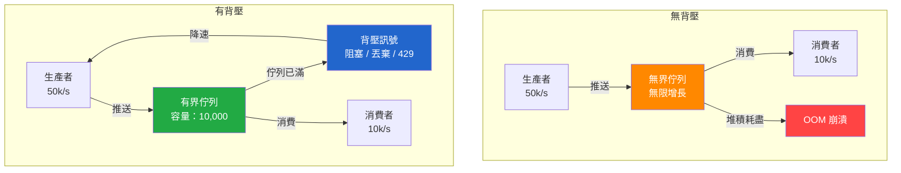

# [BEE-225] 背壓與流量控制

:::info
透過明確的需求訊號與有界緩衝區，防止快速生產者壓垮緩慢的消費者。
:::

## 情境

在任何資料從生產者流向消費者的系統中，兩端鮮少以完全相同的速度運作。生產者可能在每秒爆發 50,000 個事件，而消費者只能維持每秒 10,000 個。若沒有調和這種速率差異的機制，將發生以下幾種故障模式：無界緩衝區填滿導致記憶體耗盡、已排隊的工作越積越久導致延遲飆升、或各服務在負載下相繼崩潰引發串聯故障。

背壓（Backpressure）是一系列技術的統稱，透過這些技術，較慢的下游元件向上游生產者發出訊號，要求其降速、暫停或減載。此詞源自流體力學——當流量超過容量時，管道對來源產生物理阻力。在軟體中，訊號是明確的而非物理性的，但目標相同：維持穩定且可持續的流速。

參考資料：
- [Backpressure in Distributed Systems (DZone)](https://dzone.com/articles/backpressure-in-distributed-systems)
- [Reactive Streams 規範 (reactive-streams.org)](https://www.reactive-streams.org/)
- [TCP 流量控制 (brianstorti.com)](https://www.brianstorti.com/tcp-flow-control/)

## 原則

**系統必須將消費者的需求訊號向上游傳播至生產者。生產者必須遵守這些訊號。兩者之間的緩衝區必須有界。**

背壓在生產系統中不是可選項——它是將理論上無界的緩衝問題轉化為有界資源消耗問題的機制。任何接受資料卻不發出容量限制訊號的元件，等同於隱式選擇無界緩衝，也就是選擇最終 OOM（記憶體不足崩潰）。

## 核心概念

### 什麼是背壓

背壓是向上游流動的回饋訊號。消費者告訴生產者：「我現在最多能再接受 N 個項目。」生產者必須依照商定的策略遵守該訊號，採取降速、暫停、在自身邊界緩衝或丟棄。

訊號的形式可以是：
- **隱式**：TCP 的接收視窗縮減至零，強制暫停傳送端
- **明確**：HTTP 429 回應告訴呼叫方退讓
- **需求型**：Reactive Streams 的訂閱者呼叫 `Subscription.request(n)` 精確拉取 N 個項目
- **閾值型**：佇列深度指標超過閾值，觸發生產者限速

### 無界佇列為何會失敗

無界的記憶體佇列表面上解決了速率差異問題——生產者持續寫入，消費者持續讀取，佇列吸收差額。這在積壓量超過可用堆積之前都能運作。結果是 OOM 崩潰，比緩慢或受背壓的系統更難除錯，因為故障看似突然，卻是由不可見的累積狀態造成。

有界佇列強迫問題公開顯現。當佇列滿了，生產者必須決定：阻塞、丟棄或上升。每一種決策都是可見且可監控的。

### 背壓策略

| 策略 | 行為 | 適用場景 |
|---|---|---|
| **阻塞（有界緩衝區）** | 佇列滿時阻塞生產者 | 不允許資料遺失的處理管線 |
| **丟棄最舊** | 清除最舊項目以騰出空間 | 遙測、指標——新鮮度比完整性更重要 |
| **丟棄最新** | 滿載時拒絕新項目 | 稽核日誌——保留歷史，通知呼叫方重試 |
| **減載** | 拒絕整個請求類別 | API 分級、過載期間的非關鍵工作負載 |
| **訊號降速** | 回傳 429、暫停訂閱 | 外部 API、Reactive Streams、訊息代理消費者 |
| **拉取式** | 消費者驅動需求，永遠不會收到超過請求量的資料 | 批次處理、串流處理框架 |

沒有普遍正確的單一策略。正確的選擇取決於資料遺失是否可接受、是否可以重試，以及壓力源自呼叫圖的哪個位置。

### TCP 流量控制作為天然背壓

TCP 的流量控制機制是硬體強制背壓的經典範例。接收端維護一個接收緩衝區，並在每個 ACK 封包中以**接收視窗**（rwnd）廣告其剩餘容量。當緩衝區填滿時，rwnd 降至零。傳送端必須停止傳輸，直到接收端再次發出可用空間的訊號。

這是傳輸層的需求型拉取：接收端決定能接受多少資料，傳送端在結構上被阻止超過該限制。應用層背壓系統應以相同原則設計——消費者控制流速，生產者無法單方面凌駕該控制。

### Reactive Streams 需求模型

[Reactive Streams 規範](https://www.reactive-streams.org/)為 JVM 非同步串流（Java 9 `Flow`、Project Reactor、RxJava、Akka Streams）形式化了背壓。其核心規則：

> 訂閱者必須透過 `Subscription.request(long n)` 發出需求訊號，才能接收 `onNext` 訊號。

訂閱者決定何時請求更多項目以及數量多少。發布者無法推送訂閱者尚未請求的資料。這是純粹的拉取模型，使佇列界限隱含其中——發布者的飛行中項目數受未完成需求限制。

關鍵特性：Reactive Streams 中背壓是強制性的。實作無法規避它。這與基於回呼或事件發射器的系統形成對比——後者發布者自由推送，背壓需要明確選擇加入。

### 佇列深度作為背壓訊號

佇列深度是背壓壓力的領先指標。持續在 0–10% 容量的佇列是健康的。趨向 80–90% 容量的佇列是即將達到背壓邊界的系統。持續在 100% 的佇列是正在減載、阻塞生產者或即將故障的系統。

將佇列深度監控為主要運維訊號。在飽和前發出警報，而非飽和後。

### 拉取模型 vs 推送模型

| 模型 | 描述 | 背壓 |
|---|---|---|
| **推送** | 生產者在有資料時發送 | 必須明確加入（429、斷路器、rx 需求） |
| **拉取** | 消費者在準備好時請求資料 | 背壓是結構性的——消費者永遠不會收到超過請求量 |

推送模型很常見（Webhook、Kafka、SSE），因為較易實作。拉取模型（資料庫游標、分頁 API、Reactive Streams）在結構上更安全，但需要消費者驅動互動。

混合方式在實務中很常見：Kafka 消費者從代理拉取（對代理是拉取模型），但代理接受生產者推送（推送模型）。Kafka 的設計將背壓責任轉移到分區延遲監控和消費者群組擴展，而非即時需求訊號。

## 背壓傳播缺口問題

在呼叫鏈的某一跳應用背壓保護，並不能保護其他跳。常見的故障模式：

```
API 閘道  →  服務 A  →  服務 B  →  資料庫
  [速率限制]          [無背壓]
```

服務 A 受閘道速率限制，但仍以全速推送給服務 B。服務 B 毫無防護。在負載下，服務 B 耗盡連接池並開始超時。服務 A 的重試邏輯放大了負載。閘道速率限制爭取了時間，但未解決根本問題。

背壓必須端對端設計。呼叫鏈中每一跳都需要一個策略。

## 實作範例：API 事件生產者與分析消費者

考慮一個 API 服務向佇列發布事件，由分析服務消費。

### 情境一：無界佇列（危險）

```
API 服務  →  無界記憶體佇列  →  分析服務
  50k/s           ???              10k/s
```

佇列以每秒 40,000 個項目的速度增長。以典型事件大小（1 KB）計算，佇列以每秒 ~40 MB 的速度消耗堆積。幾秒內，JVM 堆積耗盡。程序崩潰，所有已排隊的事件遺失。

### 情境二：有界佇列搭配阻塞生產者

```
API 服務  →  有界佇列（容量：10,000）  →  分析服務
  50k/s          容量滿時阻塞               10k/s
```

當佇列達到 10,000 個項目時，生產者的 `put()` 呼叫阻塞。API 服務降速至分析服務的 10k/s。API 上的請求延遲增加，這是可觀察的。系統保持穩定且沒有資料遺失，但生產者現在變慢了。

適用場景：資料遺失不可接受且呼叫方重試可行。

### 情境三：拉取式消費者按批次請求

```
API 服務  →  有界佇列（容量：10,000）  →  分析服務
  50k/s                                  每批拉取 500 個項目
```

分析服務每 50 毫秒呼叫一次 `queue.poll(500)`，在請求下一批之前處理完每批。最大飛行中項目數：500。佇列深度保持低位。當佇列達到容量時，生產者丟棄或阻塞，這是可預測且在指標中立即可見的。

適用場景：每批的有界延遲比吞吐量更重要。



## 常見錯誤

### 1. 無界記憶體佇列

最常見的錯誤。沒有容量限制的 `ArrayDeque`、`LinkedList` 或 `ConcurrentLinkedQueue` 會增長直到 OOM。使用 `ArrayBlockingQueue(capacity)` 或等效的有界結構。永遠不要在生產資料路徑中使用無界佇列。

### 2. 靜默丟棄訊息而不記錄指標

減載有時是正確的策略。靜默丟棄訊息永遠不是正確的。每次丟棄必須遞增一個計數器並饋入警報。靜默丟棄會造成資料品質問題，在幾週後的稽核中才被發現。

```java
// 錯誤
if (queue.size() >= MAX) {
    return; // 靜默丟棄
}

// 正確
if (queue.size() >= MAX) {
    metrics.increment("queue.drops");
    log.warn("佇列已滿，丟棄事件 type={}", event.type());
    return;
}
```

### 3. 背壓傳播缺口

保護一跳不等於保護整條鏈。稽核呼叫圖中的每個服務邊界並為每個邊界定義背壓策略。記錄哪些跳沒有背壓以及為何可接受。

### 4. 將超時當作背壓

超時偵測到下游系統很慢。它不能防止下游系統被壓垮。資料庫查詢在 30 秒後返回的超時，並不能阻止呼叫方同時發送 1,000 個並行查詢到該資料庫。背壓是關於在瓶頸上游控制速率，而非在下游偵測故障。

### 5. 不監控佇列深度

如果追蹤佇列深度，背壓問題是可預測的。一個在數小時內趨向飽和的佇列，給了運維人員擴展消費者或減少生產者負載的時間。未監控的佇列在 OOM 崩潰前不給任何警告。為每個有界佇列配備深度與丟棄率指標。

## 微服務中的背壓

### HTTP 429 請求過多

API 層背壓的標準機制。加入 `Retry-After` 標頭告知呼叫方何時重試。呼叫方必須實作指數退避加抖動；觸發立即重試的 429 會放大而非減少負載。

### 斷路器

斷路器（見 BEE-260）在下游錯誤率或延遲超過閾值時開路，阻止對降級服務的請求。這是服務呼叫層面的背壓。它保護呼叫方不把資源浪費在緩慢的下游，但不減少下游的負載——而是重新導向。將斷路器與降級方案配對，而非僅與錯誤配對。

### 佇列深度監控

對於基於訊息佇列的架構，消費者延遲（最新生產偏移量與最新消費偏移量之差）是主要的背壓訊號。當延遲超過閾值時發出警報。當延遲持續上升時擴展消費者。考慮在延遲超過臨界閾值時生產至死信佇列，而非讓主佇列無限堆積。

### 速率限制 vs 背壓

速率限制（見 BEE-266）約束單一客戶端的請求速率。背壓根據下游容量約束資料流速率。它們解決不同的問題：

- 速率限制：「相對於公平使用策略，此客戶端發送得太快」
- 背壓：「無論來源如何，下游系統無法維持當前負載」

當速率限制設定為匹配下游容量時，它是一種粗糙的背壓形式，但缺乏真正背壓提供的動態回饋迴路。在系統設計時設定的固定速率限制，在系統容量改變的那一刻就會變得不正確。

## 相關 BEE

- **BEE-220** — 訊息基礎：背壓整合其中的代理模式
- **BEE-260** — 斷路器：補充背壓的服務層級保護
- **BEE-266** — 速率限制：請求速率控制，一種靜態形式的背壓
- **BEE-305** — 非同步處理：結構上需要背壓的模式
