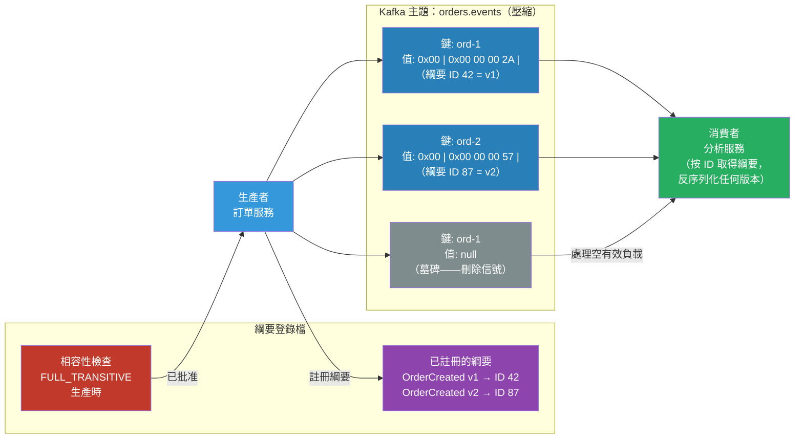

# [BEE-480] 事件綱要設計與版本控制

:::info
事件綱要是事件驅動系統中生產者與消費者之間的契約——從第一天起就要為演進設計，因為每次綱要變更都是一次無法在所有服務間原子協調的分散式部署。
:::

## 情境

在同步 API 中，請求或回應格式的破壞性變更可以透過版本號升級來部署。所有呼叫者都是已知的，且可以協調推出。在事件驅動系統中，生產者和消費者在時間上是解耦的：今天寫入的事件可能被六個月後部署的消費者讀取，或在消費者中斷後從壓縮的 Kafka 主題重播。生產者無法知道誰在讀取、何時讀取，或期望哪個綱要版本。

這種不對稱性使事件的綱要設計從根本上不同於 REST API 的綱要設計。事件綱要是一份僅追加的契約。破壞性變更——重命名欄位、更改其型別、刪除它——實際上是不可能的，除非採用在實踐中很少能實現的協調遷移策略。

將這一紀律正式化的工具是**綱要登錄檔**——由 Confluent Schema Registry（2015 年）和 Apache Kafka 一起推廣。綱要登錄檔集中存儲綱要，為每個版本分配一個數字 ID，並在生產時強制執行相容性規則。序列化線格式將綱要 ID 編碼（1 個魔術位元組 `0x00` + 4 位元組綱要 ID + 有效負載），使消費者始終可以查找用於寫入每條訊息的確切綱要，無論何時生產。

CNCF **CloudEvents** 規範（2024 年 1 月畢業）標準化了事件信封——圍繞業務有效負載的元資料包裝——提供了一種由 AWS EventBridge、Azure Event Grid、Google Cloud Eventarc 和 40 多個其他平台採用的廠商中立格式。

## 設計思維

### 綱要相容性模式

相容性規則定義了綱要版本之間允許哪些變更：

| 模式 | 誰受益 | 允許的變更 |
|---|---|---|
| **BACKWARD** | 使用新綱要的消費者可讀取舊資料 | 添加有預設值的可選欄位；刪除必填欄位 |
| **FORWARD** | 使用舊綱要的消費者可讀取新資料 | 添加欄位（舊讀取者忽略它們）；刪除有預設值的可選欄位 |
| **FULL** | 兩個方向都有效 | 只添加或刪除有預設值的可選欄位 |
| **NONE** | 不執行 | 任何變更（對生產環境危險） |

**BACKWARD_TRANSITIVE** 和 **FORWARD_TRANSITIVE** 將這些檢查擴展到所有先前版本，而不僅僅是緊接在前的版本——對於消費者可能從頭開始重播的 Kafka 壓縮主題是必需的。

大多數事件系統的實際預設值是 **FULL** 或 **BACKWARD**：兩者都保證新消費者可以讀取舊事件（壓縮主題重播），而舊消費者可以讀取在滾動部署期間生產的事件。

### 事件信封模式

將元資料與業務有效負載分離。信封攜帶每個消費者都需要的欄位，無論事件類型如何；有效負載是業務事實。

最小信封欄位（與 CloudEvents v1.0 對齊）：
- `id` — UUID，每個事件唯一（消費者的冪等性鍵）
- `source` — 識別生產者服務的 URI（`/orders-service`）
- `type` — 命名空間的事件類型字串（`com.example.order.created`）
- `specversion` — CloudEvents 版本（`"1.0"`）
- `time` — 事件發生時間的 RFC 3339 時間戳
- `datacontenttype` — 有效負載的媒體類型（`application/json`、`application/avro`）

值得標準化的業務領域添加：
- `correlationid` — 用於分散式追蹤關聯的追蹤 ID
- `tenantid` — 用於多租戶系統

### 版本控制策略

三種方法，不互斥：

**線格式中的綱要登錄檔 ID**：Confluent 線格式在有效負載前編碼 `0x00 + uint32 schema_id`。消費者在反序列化時按 ID 從登錄檔取得綱要。事件本身沒有版本欄位——登錄檔是真實來源。只有在所有生產者和消費者使用相容登錄檔客戶端時才有效。

**基於類型的版本控制**：在事件類型字串中編碼版本：`com.example.order.created.v2`。訂閱 `v1` 主題的舊消費者忽略 `v2` 事件。簡單但會導致主題激增，並需要明確的消費者遷移。

**信封中的綱要版本欄位**：信封元資料中的 `schema_version` 欄位。消費者根據欄位切換反序列化邏輯。靈活但將版本控制邏輯放在每個消費者中。

對於使用 Avro 或 Protobuf 的 Kafka 系統，綱要登錄檔方法是標準的，需要最少的消費者端邏輯。對於 HTTP 傳遞的 webhooks 和 CloudEvents，類型欄位或自訂擴展屬性攜帶版本。

## 最佳實踐

**MUST（必須）從第一個版本開始，將每個事件欄位設計為有預設值的可選欄位。** 沒有預設值的必填欄位在不進行破壞性變更的情況下無法刪除。在 Avro 中，對所有欄位使用聯合類型（`["null", "string"]` 帶 `"default": null`）。在 Protobuf 中，proto3 中的所有欄位預設是可選的；只有在區分缺席和零在語義上重要時，才使用存在性檢測模式（`optional` 關鍵字或 `oneof`）。

**MUST（必須）在生產環境生產事件前在綱要登錄檔中註冊綱要。** 發布未註冊的綱要會破壞執行契約。將綱要登錄檔客戶端配置為在相容性違規時 `FAIL`（而非 `SKIP`）。

**MUST（必須）在 Protobuf 中對已刪除的欄位號和名稱使用 `reserved`。** 重用欄位號會導致線格式歧義：讀取舊欄位的舊消費者讀取新欄位時會靜默產生損壞的資料。`reserved 3, 7; reserved "old_field_name";` 防止在程式碼審查中意外重用。

**MUST NOT（不得）在 Avro 中重命名欄位或更改欄位類型。** 在 Avro 中，欄位身份是按名稱的。重命名欄位是刪除和添加——兩個方向都是破壞性變更。在 Protobuf 中，欄位身份是按號碼的，所以重命名在線格式層面是安全的，但會破壞生成的程式碼 API。使用 Avro 中的 `aliases` 功能（`"aliases": ["old_name"]`）來支援讀取用舊欄位名稱寫入的記錄。

**SHOULD（應該）在壓縮主題的綱要登錄檔中配置 BACKWARD_TRANSITIVE 或 FULL_TRANSITIVE 相容性。** 標準 BACKWARD 僅與上一個版本進行檢查。壓縮主題可以保留任何過去版本的事件；傳遞式檢查確保與所有歷史版本的相容性。

**SHOULD（應該）使用兩階段棄用來刪除事件欄位。** 第一階段：添加 `DEPRECATED` 註解並停止填充該欄位（生產 null/預設值）；部署將該欄位視為缺席的消費者。第二階段：確認所有消費者忽略該欄位後（監控消費者延遲，而非僅部署），從綱要中刪除該欄位並發布新的綱要版本。

**SHOULD（應該）在事件信封中包含關聯 ID。** 產生下游事件的消費者應傳播關聯 ID，從而在事件鏈中實現端到端的追蹤重建，而不需要分散式追蹤 sidecar。

**MAY（可以）在 Kafka 壓縮主題中使用墓碑事件來表示實體刪除。** 墓碑是具有非空鍵和空值的訊息。日誌壓縮最終會刪除該鍵的所有訊息，包括墓碑本身（在 `delete.retention.ms` 後）。消費者必須在不崩潰的情況下處理空有效負載。

## 視覺化



## 範例

**Avro 綱要演進——添加可選欄位（BACKWARD 相容）：**

```json
// v1: order_created_v1.avsc
{
  "type": "record",
  "name": "OrderCreated",
  "namespace": "com.example.orders",
  "fields": [
    {"name": "order_id",    "type": "string"},
    {"name": "customer_id", "type": "string"},
    {"name": "amount_cents","type": "long"}
  ]
}

// v2: order_created_v2.avsc — 添加有預設值的可選欄位
// BACKWARD 相容：新讀取者可以讀取 v1 資料（amount_currency 預設為 null）
// FORWARD 相容：舊讀取者可以讀取 v2 資料（忽略 amount_currency）
{
  "type": "record",
  "name": "OrderCreated",
  "namespace": "com.example.orders",
  "fields": [
    {"name": "order_id",        "type": "string"},
    {"name": "customer_id",     "type": "string"},
    {"name": "amount_cents",    "type": "long"},
    {"name": "amount_currency", "type": ["null", "string"], "default": null}
  ]
}
```

**刪除時的 Protobuf 欄位保留：**

```protobuf
// 之前：OrderCreated 有 `promo_code` 欄位（號碼 4）
// 我們正在刪除它。保留號碼和名稱以防止重用。

syntax = "proto3";
package com.example.orders;

message OrderCreated {
  string order_id     = 1;
  string customer_id  = 2;
  int64  amount_cents = 3;
  // promo_code string = 4;  ← 已刪除

  reserved 4;            // 號碼 4 永遠不得重用
  reserved "promo_code"; // 名稱永遠不得重用
}
```

**CloudEvents 信封——HTTP 上的 JSON：**

```json
{
  "specversion": "1.0",
  "id": "f47ac10b-58cc-4372-a567-0e02b2c3d479",
  "source": "/orders-service",
  "type": "com.example.order.created",
  "time": "2026-04-14T22:00:00Z",
  "datacontenttype": "application/json",
  "correlationid": "3f7e9a12-bc45-4de3-a891-f0123456789a",
  "data": {
    "order_id": "ord-9012",
    "customer_id": "cust-42",
    "amount_cents": 4999,
    "amount_currency": "USD"
  }
}
```

**綱要登錄檔生產者設定——Python：**

```python
# producer.py — 帶綱要登錄檔的 Confluent Avro 生產者
from confluent_kafka import Producer
from confluent_kafka.schema_registry import SchemaRegistryClient
from confluent_kafka.schema_registry.avro import AvroSerializer
from confluent_kafka.serialization import SerializationContext, MessageField

# 綱要登錄檔在註冊時強制執行 FULL_TRANSITIVE 相容性
schema_registry_client = SchemaRegistryClient({"url": "http://schema-registry:8081"})

avro_serializer = AvroSerializer(
    schema_registry_client,
    schema_str=open("order_created_v2.avsc").read(),
    # conf={"auto.register.schemas": False}  # 生產環境更安全：在 CI 中預先註冊綱要
)

producer = Producer({"bootstrap.servers": "kafka:9092"})

def publish_order_created(order: dict) -> None:
    producer.produce(
        topic="orders.events",
        key=order["order_id"],
        value=avro_serializer(
            order,
            SerializationContext("orders.events", MessageField.VALUE),
        ),
    )
    producer.flush()

# 序列化的訊息線格式：
# [0x00][綱要 ID：4 位元組大端序][avro 二進制有效負載]
# 消費者在反序列化時按 ID 取得綱要——每條訊息不捆綁綱要
```

**處理兩個綱要版本和墓碑的消費者：**

```python
# consumer.py — 處理綱要演進和空墓碑值
from confluent_kafka import Consumer, KafkaError
from confluent_kafka.schema_registry.avro import AvroDeserializer

avro_deserializer = AvroDeserializer(schema_registry_client)

consumer = Consumer({
    "bootstrap.servers": "kafka:9092",
    "group.id": "analytics-service",
    "auto.offset.reset": "earliest",
})
consumer.subscribe(["orders.events"])

while True:
    msg = consumer.poll(1.0)
    if msg is None or msg.error():
        continue

    # 墓碑：空值表示實體刪除
    if msg.value() is None:
        handle_order_deleted(msg.key().decode())
        continue

    # 反序列化器按 ID 從登錄檔取得正確的綱要版本
    # v1 和 v2 事件都能正確反序列化——缺失欄位獲得預設值
    order = avro_deserializer(msg.value(), SerializationContext("orders.events", MessageField.VALUE))
    handle_order_created(order)
```

## 實作注意事項

**綱要登錄檔替代方案**：Confluent Schema Registry 是最廣泛部署的，但 Apicurio Registry（Red Hat，Apache 授權）和 AWS Glue Schema Registry 也很常見。三者都支援 Avro、Protobuf 和 JSON Schema，並實作類似的相容性模式。Confluent 線格式是事實標準；Apicurio 和 Glue 支援它以實現互操作性。

**JSON Schema 相容性**：JSON Schema 相容性執行比 Avro 或 Protobuf 弱，因為 JSON 沒有原生聯合類型或預設值——相容性規則是近似的。對於需要跨多個消費者嚴格綱要執行的事件，優先選擇 Avro 或 Protobuf。

**Kafka 標頭 vs 線格式**：Confluent 線格式中的綱要 ID 嵌入在值有效負載中。一些架構改為將綱要 ID 放在 Kafka 訊息標頭中（`Content-Type: application/avro; schema-id=87`），保持值為純 Avro 位元組。兩種方法都有效；標頭方法避免了魔術位元組依賴，但要求所有消費者理解標頭慣例。

**消費者驅動的契約測試（Pact）**：對於事件驅動系統，Pact 支援訊息契約，驗證生產者發布的事件符合消費者的期望。在 CI 中與綱要登錄檔相容性檢查一起運行 Pact，以實現綱要安全的深度防禦方法。

## 相關 BEE

- [BEE-143](../Data Modeling/143.md) -- 編碼與序列化格式：涵蓋格式層面的 Avro、Protobuf 和 JSON；本文涵蓋這些格式之上的綱要演進策略
- [BEE-220](../Messaging/220.md) -- 訊息佇列 vs 事件串流：事件串流（Kafka）具有與訊息佇列不同的綱要需求，因為事件被保留和重播
- [BEE-222](../Messaging/222.md) -- 傳遞保證：精確一次語義與綱要版本控制互動——重試訊息的消費者必須處理原始生產時的綱要版本
- [BEE-472](../Distributed Systems/472.md) -- 發件箱模式與事務性訊息：發件箱事件是綱要演進壓力的主要來源；發件箱表綱要和事件綱要必須一起演進

## 參考資料

- [綱要演進與相容性 — Confluent 文件](https://docs.confluent.io/platform/current/schema-registry/fundamentals/schema-evolution.html)
- [CloudEvents 規範 v1.0 — CNCF](https://github.com/cloudevents/spec/blob/main/cloudevents/spec.md)
- [Protocol Buffers 語言指南（proto3）— Google](https://protobuf.dev/programming-guides/proto3/)
- [日誌壓縮 — Confluent Kafka 文件](https://docs.confluent.io/kafka/design/log_compaction.html)
- [消費者驅動契約 — Martin Fowler（2006 年）](https://martinfowler.com/articles/consumerDrivenContracts.html)
- [Pact 契約測試文件](https://docs.pact.io/)
