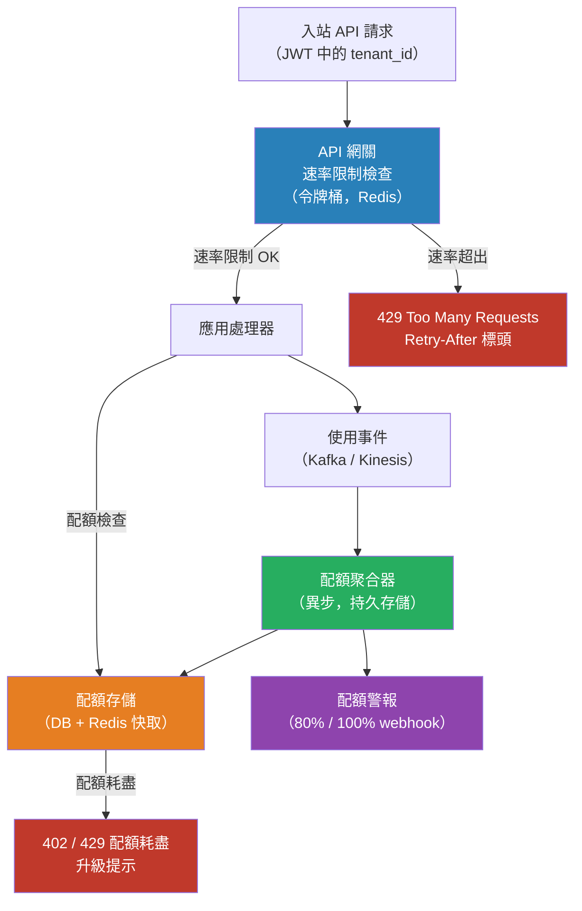

# [BEE-402] 租戶感知的速率限制與配額

:::info
租戶感知的速率限制和配額是限制任何單一租戶可以消耗多少共享系統資源的機制——保護其他租戶免受噪鄰影響、執行商業計劃限制，並為系統提供明確的負載上限以進行設計。
:::

## Context

在共享的多租戶系統中，任何租戶都可能成為噪鄰：批量導入作業、配置錯誤的客戶端重試循環，或突然爆紅的產品都可能消耗不成比例的資源，降低同一基礎架構上所有其他租戶的體驗。未受控制的租戶負載在系統層面也是不可預測的——如果任何給定的請求爆發沒有上限，就無法做容量規劃或設置 SLO。

速率限制和配額是在不同時間維度上運作的不同機制。**速率限制**（節流）是短窗口約束：它限制每秒或每分鐘的請求數。429 Too Many Requests 響應告訴客戶端它現在發送得太快，需要短暫退避。**配額**是較長週期的累積約束：標準計劃的租戶每月最多可發出 1,000,000 次 API 調用。配額耗盡後的 402 或 429 響應告訴客戶端它已消耗了當期分配，而不僅僅是發送得太快。

Amazon 的 builders library 文章「Fairness in Multi-Tenant Systems」精確定義了目標：多租戶系統中的每個客戶端都應獲得單租戶體驗。他們的方法是應用基於速率的准入控制，優先處理計劃使用量範圍內的流量，並對峰值施加反壓——快速返回 HTTP 503（負載卸除），而不是無限期排隊，這樣下游服務就不會過載，而 Auto Scaling 有時間響應。

速率限制最常見的兩種算法是：

**令牌桶（Token Bucket）**：每個租戶有一個容量為 `N` 個令牌的桶。令牌以固定速率 `r` 補充。每個請求消耗一個令牌（或更多，對於昂貴的操作）。如果桶為空，請求被拒絕（硬限制）或排隊。桶模型允許爆發到桶的大小，同時保持長期吞吐量上限。這是實際上大多數 API 速率限制底層的算法——包括 AWS API Gateway 使用的限制。

**滑動窗口（Sliding Window）**：每個租戶維護過去 `W` 秒的請求時間戳日誌。計算窗口中的請求；如果計數超過限制，請求被拒絕。滑動窗口消除了固定窗口計數中的邊緣案例，即租戶可以通過在一個窗口結束時發送 `limit` 個，在下一個窗口開始時發送 `limit` 個，從而發送 `2×limit` 個請求。Redis 有序集合是常見的實現基礎：時間戳作為分數，使用 `ZRANGEBYSCORE` 和 `ZREMRANGEBYSCORE` 原子地計數和過期條目。

## Design Thinking

**速率限制與配額需要不同的執行架構。** 速率限制（每秒、每分鐘）需要在請求路徑上進行亞毫秒級的執行——通常是在進程內或在 API 網關層進行 Redis 支持的計數器檢查。月度配額可以容忍執行更新的幾秒延遲，因為月度計數器中一秒鐘的延遲不會有意義地改變租戶已消耗的分配。配額通常存儲在計費資料庫中，並從使用事件流異步更新。

**軟限制與硬限制**是商業決策，也是技術決策。硬限制在配額耗盡時立即阻止請求——適用於用戶控制自己升級的自助服務計劃。軟限制允許消費在超過配額邊界後繼續，以更高的每單位費率記錄超額，或在期末對賬——適用於服務中斷不可接受且客戶已同意超額條款的企業合同。限制類型應按租戶可配置，而非硬編碼在執行邏輯中。

**配額維度**應反映系統的實際成本驅動因素，而非僅僅是請求計數。所有請求成本相等的系統可以使用簡單的請求/月配額。具有昂貴寫操作、存儲支持查詢或大量計算路徑的系統需要多維配額：請求/秒、存儲 GB、計算秒、出口字節。API 使用量輕但存儲使用量重的租戶應觸及存儲配額，而非請求配額。

**主動告知租戶**是可用性和商業義務。在沒有事先警告的情況下遇到 429 的客戶端會盲目重試，通常使問題更嚴重。在每個 API 響應中通過標頭暴露配額使用情況（`X-RateLimit-Limit`、`X-RateLimit-Remaining`、`X-RateLimit-Reset`）。當租戶達到配額的 80% 和 100% 時發送電子郵件或 webhook 通知，以便他們在硬限制中斷之前可以升級或調整使用模式。

## Best Practices

工程師 MUST（必須）在租戶身份級別應用速率限制，而不僅僅在 IP 地址或用戶級別。IP 級別的速率限制會懲罰共享出口 IP 的租戶（NAT、企業代理），並不能防止單一租戶通過許多用戶消耗不成比例的後端資源。租戶級限制執行商業分配。

工程師 MUST（必須）返回標準 HTTP 響應碼：速率限制違規返回 429 Too Many Requests，帶有 `Retry-After` 標頭指示客戶端何時可以重試。在響應標頭或正文中包含配額限制、當前使用量和重置時間，以便客戶端開發者無需猜測即可實現適當的退避。

工程師 SHOULD（應該）在 API 網關或反向代理層實現速率限制，而不僅僅在應用程式碼中。應用程式碼中的執行仍然為每個被拒絕的請求消耗一個工作線程。網關層執行在過多請求到達應用實例之前將其丟棄，即使被拒絕請求的速率很高，也能保護服務免受過載。

工程師 MUST NOT（不得）在所有租戶之間共享單一全局速率限制計數器。一個噪鄰租戶耗盡全局計數器會阻止所有其他租戶。維護以租戶 ID 為鍵的每租戶計數器。

工程師 SHOULD（應該）按租戶層級區分限制。免費層租戶通常比付費或企業租戶具有更低的每分鐘和每月限制。限制是產品的一部分，而非僅僅是基礎架構問題——它們必須與定價計劃一起建模。

工程師 SHOULD（應該）使用令牌桶進行請求速率執行，使用滑動窗口進行準確性敏感的配額跟蹤。令牌桶計算成本更低，並能優雅地處理合法的爆發流量。滑動窗口更準確，但需要維護每租戶日誌結構。

工程師 MUST（必須）對任何影響計費或合同義務的配額，將消耗持久化存儲（資料庫，而非僅記憶體快取）。Pod 重啟時記憶體中的配額計數器會丟失，使租戶的餘量被錯誤恢復。在 Redis 中快取當前配額值以進行低延遲執行，但異步地將已確認的使用情況寫入持久存儲。

工程師 SHOULD（應該）將計量（計算使用事件）與執行（阻止超出限制的請求）解耦。將使用事件寫入流（Kafka、Kinesis）並異步聚合的計量管道遠比熱路徑上的同步計數器增量更可靠。執行從聚合計數器讀取，可能稍有延遲——對於月度配額可以接受，對於每秒速率限制則不可接受。

工程師 MUST（必須）監控每租戶的配額利用率作為運維指標。配額使用率達到 90% 以上的租戶可能很快就會觸及限制，需要升級對話或可能流失。持續使用率為 0% 的租戶從計劃中沒有獲得價值。兩者都是商業信號。

## Visual



## Example

**Redis 中每租戶的令牌桶（偽代碼）：**

```
// 令牌桶：以速率 r/秒補充令牌，最大容量 N。
// 每個請求消耗 1 個令牌；昂貴的操作可能消耗更多。

function allow_request(tenant_id, cost=1):
    key = "ratelimit:" + tenant_id
    now = current_time_ms()

    // Lua 腳本在 Redis 上原子執行以避免競爭條件
    tokens, last_refill = redis.get(key + ":tokens", key + ":last_refill")

    if tokens is None:
        tokens = BUCKET_CAPACITY     // 第一個請求：滿桶
        last_refill = now

    elapsed_ms = now - last_refill
    refilled = elapsed_ms * REFILL_RATE_PER_MS
    tokens = min(BUCKET_CAPACITY, tokens + refilled)
    last_refill = now

    if tokens >= cost:
        tokens -= cost
        redis.set(key + ":tokens", tokens)
        redis.set(key + ":last_refill", last_refill)
        return ALLOW
    else:
        retry_after_ms = ceil((cost - tokens) / REFILL_RATE_PER_MS)
        return REJECT(retry_after_ms)
```

**配額響應標頭（RFC 6585 / draft-ietf-httpapi-ratelimit-headers）：**

```http
HTTP/1.1 200 OK
X-RateLimit-Limit: 1000        ; 每分鐘允許的請求數
X-RateLimit-Remaining: 342     ; 當前窗口中剩餘的令牌數
X-RateLimit-Reset: 1713225600  ; 窗口重置的 Unix 時間戳
X-Quota-Limit: 1000000         ; 月度配額
X-Quota-Used: 847293           ; 本期已消耗
X-Quota-Reset: 2026-05-01      ; 配額週期重置日期
```

**使用 Redis 有序集合的滑動窗口：**

```
// 滑動窗口：使用有序集合計數過去 W 秒的請求。
// 分數 = 時間戳（毫秒），成員 = 唯一請求 ID。

function sliding_window_allow(tenant_id, window_ms, limit):
    key = "sw:" + tenant_id
    now = current_time_ms()
    window_start = now - window_ms

    // 原子管道：
    redis.multi():
        redis.zremrangebyscore(key, 0, window_start)   // 過期舊條目
        redis.zadd(key, now, uuid())                   // 記錄此請求
        count = redis.zcard(key)                       // 計算窗口中的數量
        redis.expire(key, window_ms / 1000 + 1)       // TTL 清理
    redis.exec()

    if count > limit:
        return REJECT
    return ALLOW
```

## Related BEEs

- [BEE-400](400.md) -- 多租戶架構模型：此配額執行所保護的部署模型
- [BEE-401](401.md) -- 租戶隔離策略：資料隔離；配額是計算和 API 訪問的補充
- [BEE-266](266.md) -- 速率限制與節流：通用速率限制概念和算法；本文將其具體應用於多租戶場景
- [BEE-164](164.md) -- 冪等性與精確一次語義：即使在重試下，配額計數器也必須每個請求精確增加一次

## References

- [Fairness in multi-tenant systems -- Amazon Builders' Library](https://aws.amazon.com/builders-library/fairness-in-multi-tenant-systems/)
- [Throttling a tiered, multi-tenant REST API at scale using API Gateway -- AWS Architecture Blog](https://aws.amazon.com/blogs/architecture/throttling-a-tiered-multi-tenant-rest-api-at-scale-using-api-gateway-part-1/)
- [RateLimit Header Fields for HTTP -- IETF Draft (draft-ietf-httpapi-ratelimit-headers)](https://datatracker.ietf.org/doc/draft-ietf-httpapi-ratelimit-headers/)
- [Token Bucket vs Leaky Bucket: Rate Limiting Algorithms -- API7.ai](https://api7.ai/blog/token-bucket-vs-leaky-best-rate-limiting-algorithm)
- [Best Practices for API Rate Limits and Quotas -- Moesif](https://www.moesif.com/blog/technical/rate-limiting/Best-Practices-for-API-Rate-Limits-and-Quotas-With-Moesif-to-Avoid-Angry-Customers/)
