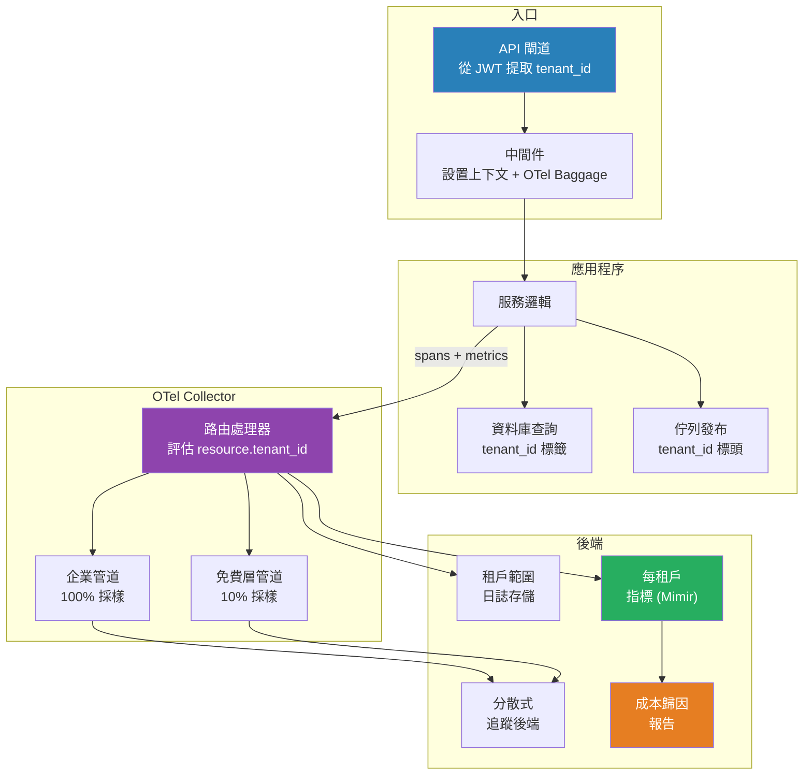

# [BEE-405] 租戶感知可觀測性

:::info
租戶感知可觀測性將租戶識別符視為每個信號——日誌、指標和追蹤——中的一等維度，使運維人員能夠隔離嘈雜的租戶、執行每租戶 SLO、將基礎架構成本歸因於特定客戶，並在不跨租戶邊界聚合遙測數據的情況下滿足數據駐留合規要求。
:::

## Context

標準可觀測性將系統作為整體進行監控。多租戶系統需要額外的層次：按租戶切割每個信號的能力。沒有這個能力，消耗不成比例資源的單個租戶會無形中降低其他人的服務質量，無法計算每租戶的 SLO 燃燒率，成本歸因只能估計而非測量，禁止跨租戶數據混合的合規要求也無法滿足。

基本原則是從身份驗證點——通常是 API 閘道或中間件——向每個下游操作傳播租戶識別符：資料庫查詢、消息佇列生產者和消費者、外部 API 調用、後台任務。在同步路徑中這很直接：租戶 ID 被注入請求上下文，並在發出遙測數據的任何地方讀取。在異步路徑（排隊任務、事件驅動處理）中，租戶 ID 必須明確序列化到消息標頭中，並由消費者重新提取，因為沒有環境請求上下文。

**OpenTelemetry** 為跨服務邊界的上下文傳播提供了標準機制。W3C Baggage 規範允許任意鍵值對——包括 `tenant_id`——與 W3C Trace Context `traceparent` 一起攜帶在 `baggage` HTTP 標頭中。OTel SDK 在入口點提取 baggage，並使其可用於在該追蹤中創建的所有 span。關鍵是，baggage 對屬性提升是可選的：從 baggage 讀取 `tenant_id` 並將其寫入為 span 資源屬性，確保它出現在每個導出的記錄中，而無需每個被監控的函數都具有租戶感知能力。

**OTel Collector** 無需修改應用程序代碼即可實現每租戶遙測路由。路由處理器評估資源屬性（包括 `tenant_id`）並將記錄分發到子管道：租戶範圍的後端、用於合規隔離的獨立存儲桶，或按租戶層級校準的採樣規則。企業租戶可能接受完整採樣；免費層租戶可能接受 10% 的基於頭部的採樣。Collector 配置而非應用程序執行這些策略。

在指標層，租戶 ID 成為每個計數器、直方圖和儀表上的標籤。這使每租戶儀表板、每租戶告警閾值成為可能——最重要的是——每租戶錯誤預算。平台可能承諾企業客戶 99.9% 的可用性，初學者客戶 99.5%；計算這些預算的燃燒率需要租戶範圍的可用性指標，這又需要每個影響可用性的事件都標記發生它的租戶。

**成本歸因**是租戶感知遙測的運維成果。當資料庫查詢時長、消息佇列吞吐量和計算時間都按租戶標記時，計費系統或容量規劃團隊可以將基礎架構成本分配給特定客戶。這使定價決策基於數據，並識別出在當前定價下使用模式不盈利的租戶。

## Best Practices

工程師 MUST（必須）在請求生命周期的最早可能點——通常是身份驗證中間件或 API 閘道——在任何服務調用、資料庫查詢或日誌語句發出之前設置請求上下文中的租戶識別符。晚注入租戶 ID 意味著早期遙測是未標記的，無法用於每租戶分析。

工程師 MUST（必須）通過異步邊界傳播租戶上下文。在排隊後台任務或發布事件時，將租戶 ID 序列化到消息標頭中。消費者 MUST（必須）在任何工作開始之前重新提取它並將其恢復到處理上下文中。在異步邊界丟失租戶上下文會產生無法事後歸因的未標記遙測數據。

工程師 SHOULD（應該）在每個操作上將租戶 ID 同時作為結構化日誌字段和 OpenTelemetry span 屬性發出。僅在一種信號類型中發出它，迫使跨信號類型進行關聯以重建租戶上下文，這既昂貴又容易出錯。

工程師 MUST NOT（不得）允許租戶遙測在合規要求（GDPR、HIPAA、數據駐留）要求隔離的後端中混合。OTel Collector 路由處理器是適當的控制點：在租戶特定記錄到達共享存儲之前將其路由到隔離後端。

工程師 SHOULD（應該）獨立於系統級 SLO 定義和跟蹤每租戶 SLO。0.1% 的系統級錯誤率可能隱藏著特定租戶遭受 5% 錯誤率的情況。每租戶錯誤預算使這一點在 SLA 違規發生之前就可見並可採取行動。

工程師 SHOULD（應該）實施以租戶層級為鍵的自適應採樣策略。對所有租戶統一做出的採樣決策會浪費存儲在免費層流量上，同時可能對最有調試價值的追蹤的企業租戶採樣不足。Collector 中的層級感知採樣無需應用程序更改即可執行此策略。

工程師 SHOULD（應該）防禦性地監控租戶基數。當租戶數量增長到數千時，具有高基數限制的指標後端（例如 Prometheus）可能會降級。使用專用的多租戶指標後端（例如，帶租戶分片的 Thanos、Cortex、Mimir），或在導出之前預聚合每租戶指標，而不是依賴共享後端中基於標籤的基數。

工程師 MAY（可以）使用租戶範圍的成本歸因數據來驅動自動配額執行：根據觀察到的遙測數據（而非估計使用量）對持續超過其預配資源分配的租戶進行速率限制或標記為層級升級候選。

## Visual



## Example

**中間件中的 OpenTelemetry 上下文傳播（Python）：**

```python
from opentelemetry import baggage, context, trace
from opentelemetry.baggage.propagation import W3CBaggagePropagator

tracer = trace.get_tracer(__name__)

def tenant_middleware(request, next_handler):
    # 從已驗證的 JWT 提取租戶——絕不直接從用戶提供的標頭提取
    tenant_id = request.auth.claims["tenant_id"]

    # 設置 W3C Baggage 以便 tenant_id 傳播到下游服務
    ctx = baggage.set_baggage("tenant_id", tenant_id)
    token = context.attach(ctx)

    with tracer.start_as_current_span("handle_request") as span:
        # 將 baggage 提升為 span 資源屬性以供後端索引
        span.set_attribute("tenant.id", tenant_id)
        try:
            return next_handler(request)
        finally:
            context.detach(token)
```

**按租戶層級的 OTel Collector 路由（YAML）：**

```yaml
processors:
  routing:
    from_attribute: "tenant.tier"
    table:
      - value: "enterprise"
        exporters: [otlp/enterprise, prometheus/enterprise]
      - value: "starter"
        exporters: [otlp/sampled]
    default_exporters: [otlp/sampled]

  probabilistic_sampler/starter:
    sampling_percentage: 10

exporters:
  otlp/enterprise:
    endpoint: "https://traces.enterprise.internal:4317"
  otlp/sampled:
    endpoint: "https://traces.shared.internal:4317"
  prometheus/enterprise:
    endpoint: "0.0.0.0:8889"
    namespace: "tenant"
```

**每租戶 SLO 錯誤預算查詢（PromQL）：**

```promql
# 特定租戶在 1 小時窗口內的可用性燃燒率
1 - (
  sum(rate(http_requests_total{tenant_id="t-123",status=~"5.."}[1h]))
  /
  sum(rate(http_requests_total{tenant_id="t-123"}[1h]))
)
```

## Related BEEs

- [BEE-400](400.md) -- 多租戶架構模型：孤島/共享池/橋接——隔離模型決定遙測後端是否可以共享或必須按租戶獨立
- [BEE-401](401.md) -- 租戶隔離策略：數據層隔離（RLS、命名空間）和控制層隔離（本文重點：遙測）
- [BEE-402](402.md) -- 租戶感知速率限制：速率限制決策應作為按租戶標記的配額消耗指標反饋到可觀測性中
- [BEE-320](320.md) -- 三大支柱：日誌、指標、追蹤：基礎可觀測性概念；本文用租戶感知維度加以擴展
- [BEE-324](324.md) -- SLO 和錯誤預算：每租戶 SLO 需要每租戶錯誤率指標作為其輸入信號

## References

- [W3C Baggage 規範 -- W3C](https://www.w3.org/TR/baggage/)
- [OpenTelemetry Baggage -- opentelemetry.io](https://opentelemetry.io/docs/concepts/signals/baggage/)
- [路由處理器 -- OpenTelemetry Collector Contrib](https://github.com/open-telemetry/opentelemetry-collector-contrib/tree/main/processor/routingprocessor)
- [使用 OpenTelemetry 的多租戶可觀測性 -- CNCF Blog](https://www.cncf.io/blog/2023/01/19/multi-tenant-observability-with-opentelemetry/)
- [Cortex：Prometheus 的多租戶長期存儲 -- Grafana Labs](https://grafana.com/oss/cortex/)
- [隱式反饋和用戶建模（Joachims 2005）-- Cornell](https://www.cs.cornell.edu/people/tj/publications/joachims_etal_05a.pdf)
