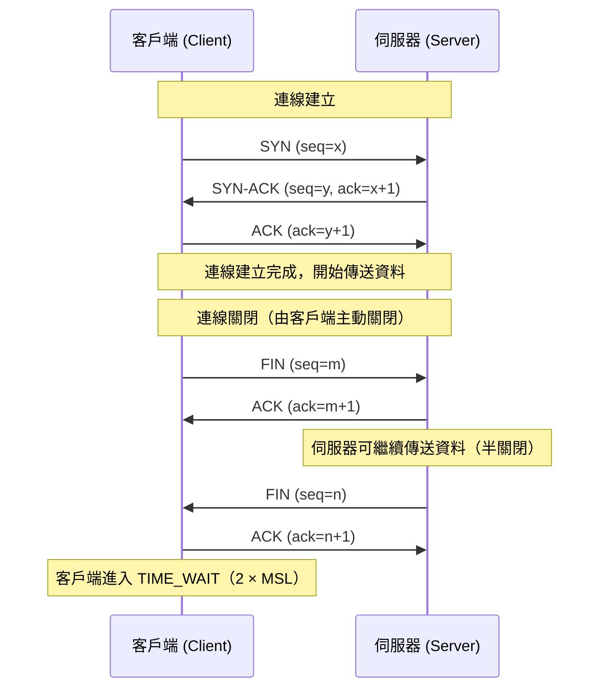

# [BEE-50] TCP/IP 與網路堆疊

## 背景

後端工程師不需要背誦所有 OSI 層，但需要對兩個行程（process）在網路上通訊時發生了什麼事有清晰的心智模型。對網路堆疊的誤解，會導致難以重現的 bug、無法解釋的逾時（timeout），以及只在高負載時才浮現的效能衰退。

本文聚焦在後端程式碼實際會接觸到的層與機制：IP 定址、TCP 可靠性保證、UDP 的取捨、socket（套接字）、port（連接埠），以及連線生命週期。同時涵蓋 TIME_WAIT、Nagle 演算法、keepalive 等在正式環境中頻繁引發事故的邊界情境。

**參考資料：**
- [RFC 791 — Internet Protocol (IPv4)](https://www.rfc-editor.org/rfc/rfc791)
- [RFC 9293 — Transmission Control Protocol (TCP)](https://datatracker.ietf.org/doc/html/rfc9293)（取代 RFC 793）
- [Julia Evans — "Networking! ACK!" zine](https://wizardzines.com/zines/networking/)
- [Marc Brooker — "It's always TCP_NODELAY. Every damn time."](https://brooker.co.za/blog/2024/05/09/nagle.html)

---

## 原則

**理解 TCP 提供的契約與其代價，並根據這些代價來設計 socket 的使用方式。**

TCP 提供兩個端點之間可靠、有序的位元組串流（byte stream）連線。它保證每個位元組按序送達，或是告知你連線已中斷。這個保證是有真實代價的：握手（handshake）、確認（acknowledgement）、重傳（retransmission），以及兩端的狀態機。UDP 不提供任何這些保證，也沒有這些開銷。哪種協議更好，取決於你的應用程式需要什麼。

---

## 重要的幾層

### IP：封包、定址，與盡力傳遞

IP（Internet Protocol，定義於 [RFC 791](https://www.rfc-editor.org/rfc/rfc791)）是無連線（connectionless）、盡力傳遞（best-effort）的協議。它將一段資料包裝成封包（packet），加上標頭（header），然後往目的地位址路由。它不保證封包會抵達、只抵達一次，或按順序抵達。

重點：

- IPv4 位址為 32 bits，IPv6 位址為 128 bits。
- IP 標頭包含來源與目的地位址、TTL（time-to-live，每經過一個 hop 遞減一次）、以及協議欄位（TCP = 6，UDP = 17，ICMP = 1）。
- **MTU（最大傳輸單元）**：乙太網路預設 MTU 為 1500 bytes。超過網段 MTU 的封包會被分片（fragment）。分片開銷大，且可能引發隱性問題；正式環境通常啟用路徑 MTU 探索（PMTU discovery）來避免分片。
- 路由由路由器查閱目的地 IP 並轉發至下一跳（hop）處理。後端工程師鮮少直接設定路由，但需要知道封包可能跨越多個 hop，每個 hop 都增加延遲。

### TCP：可靠、有序的位元組串流傳遞

TCP（[RFC 9293](https://datatracker.ietf.org/doc/html/rfc9293)）位於 IP 之上，提供：

- **可靠傳遞（Reliable delivery）** — 丟失的封包會重傳。
- **有序傳遞（Ordered delivery）** — 位元組按發送順序抵達。
- **流量控制（Flow control）** — 接收方通告接收視窗（receive window），發送方不會淹沒接收方。
- **壅塞控制（Congestion control）** — TCP 偵測到網路壅塞（透過封包丟失或 ECN）時退讓。CUBIC、BBR 等演算法決定探測頻寬的積極程度。
- **全雙工（Full-duplex）** — 雙方可同時傳送資料。

TCP 是**位元組串流**，而非訊息協議。如果你分別送出 100 bytes 和 200 bytes，接收方可能在一次 `recv()` 呼叫中收到 300 bytes，也可能分六次各收到 50 bytes。需要訊息邊界的應用程式必須自行實作分幀（framing）邏輯，例如在每則訊息前加上 4 bytes 的長度前綴。

### UDP：送出即忘

UDP 只提供來源/目的地 port 與校驗和（checksum），別無其他。以下情境適合使用 UDP：

- 低延遲比可靠性更重要（即時音訊/視訊、遊戲）。
- 應用程式在更高層自行實作可靠性（QUIC、DNS 重試）。
- 單次查詢且重試比建立連線更便宜（DNS）。
- 需要多播（multicast）或廣播（broadcast）。

HTTP/3 執行於 QUIC 之上，而 QUIC 執行於 UDP 之上——這證明可靠性可以在應用層重新實作，且比 TCP 更有效率。

### Port 與 Socket

**Socket（套接字）** 是作業系統對網路連線一端的抽象。它由一個五元組（5-tuple）識別：`(協議, 本地 IP, 本地 port, 遠端 IP, 遠端 port)`。

- **知名 port（Well-known ports，0–1023）**：保留。HTTP = 80，HTTPS = 443，SSH = 22。
- **已登記 port（Registered ports，1024–49151）**：由 IANA 分配給應用程式。
- **暫存 port（Ephemeral ports，49152–65535；Linux 預設範圍可調整）**：作業系統為對外連線動態分配。

後端服務連接至資料庫時，OS 核心會挑選一個暫存 port 作為來源 port。每條並發的對外連線都會佔用一個暫存 port，直到連線關閉並釋放（受 TIME_WAIT 影響，詳見下節）。

---

## 連線生命週期

### 三向握手與四次揮手



**握手代價**：在傳送任何資料之前需要一個來回（round-trip）。若服務對每個請求都開啟新連線（而非使用連線池），這個 RTT 就是純粹的延遲開銷。請使用連線池。

**連線關閉**：任一方都可以用 FIN 發起關閉。協議允許半關閉（half-close）：一方可以停止傳送但繼續接收。完整關閉需要四個封包（FIN、ACK、FIN、ACK）。`RST`（重置）是強制關閉——當連線抵達已關閉的 port，或行程帶著開啟的 socket 崩潰時，OS 會送出 RST。

### "Connection Refused" 與 "Connection Timed Out" 的差異

| 錯誤 | 原因 |
|---|---|
| `Connection refused (ECONNREFUSED)` | 遠端主機回傳了 TCP RST。該 IP 有東西在監聽，但那個 port 沒有，或遠端防火牆主動拒絕封包。 |
| `Connection timed out (ETIMEDOUT)` | 在逾時期間內毫無回應。封包可能被防火牆丟棄（狀態防火牆靜默丟包）、主機不可達，或路由黑洞。 |
| `No route to host (EHOSTUNREACH)` | 本地路由表沒有通往目的地的路徑，或收到 ICMP「無法抵達」回應。 |

這些差異對除錯至關重要。Connection refused 指向 port/行程問題；Connection timed out 指向網路或防火牆問題。

---

## 完整請求生命週期範例

後端服務 A 對後端服務 B（`10.0.1.5:5432`）開啟連線時，實際發生了什麼？

```
時間軸：

0 ms    服務 A 呼叫 connect("10.0.1.5", 5432)
        OS 核心：分配暫存 port（例如 54321）
        核心：直接提供 IP 位址，無需 DNS 查詢

        送出 SYN：10.0.0.1:54321 → 10.0.1.5:5432

1 ms    收到來自 10.0.1.5:5432 的 SYN-ACK

1 ms    送出 ACK — TCP 握手完成
        connect() 回傳給應用程式碼

1 ms    應用程式寫入查詢位元組
        TCP 送出資料段（segment）

2 ms    伺服器處理查詢，寫入回應
        TCP 送出回應段

3 ms    應用程式從 socket 讀取回應

        應用程式呼叫 close()（或將連線歸還給連線池）
        送出 FIN → 收到 ACK → 收到 FIN → 送出 ACK
        服務 A 端的 socket 進入 TIME_WAIT
```

若使用服務 B 的 DNS 名稱而非 IP，DNS 查詢（參見 [BEE-51](./51.md)）會在 SYN 之前發生，除非結果已快取，否則多增加一個來回。

---

## 使用 `ss` / `netstat` 讀取連線狀態

`ss` 工具（`netstat` 的後繼者）顯示主機上所有 socket 的目前狀態。

```bash
# 顯示所有 TCP 連線與行程資訊
ss -tnp

# 只顯示監聽中的 socket
ss -tlnp

# 顯示 TIME_WAIT 狀態的 socket（通常很多，可按 port 過濾）
ss -tn state time-wait | grep :5432

# 統計每個狀態的 socket 數量
ss -tn | awk 'NR>1 {print $1}' | sort | uniq -c | sort -rn
```

輸出範例：

```
State   Recv-Q  Send-Q  Local Address:Port   Peer Address:Port  Process
ESTAB   0       0       10.0.0.1:54321       10.0.1.5:5432      users:(("myservice",pid=1234,fd=7))
TIME-WAIT 0     0       10.0.0.1:54322       10.0.1.5:5432
LISTEN  0       128     0.0.0.0:8080         0.0.0.0:*          users:(("myservice",pid=1234,fd=4))
```

關鍵欄位：
- **Recv-Q**：核心已收到但應用程式尚未讀取的位元組數。持續非零代表應用程式讀取速度不夠快。
- **Send-Q**：應用程式已寫入但尚未被遠端確認（ACK）的位元組數。持續非零代表網路或遠端速度緩慢。
- **State**：TCP 狀態機的目前狀態。

---

## TIME_WAIT：是什麼，為何重要

主動關閉方送出最後一個 ACK 後，socket 不會立即消失，而是進入 **TIME_WAIT** 狀態，持續 `2 × MSL`（Maximum Segment Lifetime，最大段生存時間）。Linux 預設 MSL 為 60 秒，所以 TIME_WAIT 最長持續 120 秒。

**TIME_WAIT 存在的原因**：確保已關閉連線的延遲封包在相同五元組被重用前都能被吸收丟棄。若沒有它，一個舊連線的延遲封包可能污染使用相同 port 對的新連線。

**在高負載時為何造成問題**：若服務頻繁開啟和關閉短連線（例如沒有連線池、高請求速率），TIME_WAIT socket 可能耗盡整個暫存 port 範圍（Linux 預設約 28,000 個 port）。新的對外連線會以 `EADDRINUSE` 失敗，或核心靜默等待。

**緩解方式**：

1. **使用連線池** — 最有效的解法。持久連線永遠不會進入 TIME_WAIT。
2. 啟用 `net.ipv4.tcp_tw_reuse = 1` — 允許核心重用 TIME_WAIT socket 建立新對外連線（啟用時間戳記時安全，預設已啟用）。
3. 擴大暫存 port 範圍：`net.ipv4.ip_local_port_range = 1024 65535`。
4. 不要啟用 `tcp_tw_recycle` — 此功能已在 Linux 4.12 中移除，因為它會破壞 NAT 後的連線。

---

## TCP Keepalive

長時間閒置的 TCP 連線，可能被兩端之間的狀態防火牆（stateful firewall）或負載平衡器靜默丟棄。雙方仍認為連線是開著的。下一次寫入會失敗——但可能要等幾分鐘甚至幾小時的逾時後才發現。

**TCP keepalive** 的解法：讓核心在閒置連線上定期送出空探測封包（probe packet）。若探測持續未收到確認，連線即被宣告已死亡。

核心層 keepalive 參數（可全域設定或逐 socket 設定）：

| 參數 | Linux 預設值 | 意義 |
|---|---|---|
| `tcp_keepalive_time` | 7200 秒（2 小時） | 首次探測前的閒置時間 |
| `tcp_keepalive_intvl` | 75 秒 | 探測封包間隔 |
| `tcp_keepalive_probes` | 9 | 放棄前未確認探測的次數 |

核心預設值對大多數後端服務而言太過保守。若後端透過一個 5 分鐘閒置逾時的防火牆連至資料庫，在核心送出任何探測之前，連線早已被靜默丟棄。

在應用程式層設定 socket 層級的 keepalive（或透過資料庫驅動程式／HTTP 客戶端函式庫設定）：

```python
import socket

sock = socket.socket(socket.AF_INET, socket.SOCK_STREAM)
sock.setsockopt(socket.SOL_SOCKET, socket.SO_KEEPALIVE, 1)
sock.setsockopt(socket.IPPROTO_TCP, socket.TCP_KEEPIDLE, 60)   # 閒置 60 秒後送出首次探測
sock.setsockopt(socket.IPPROTO_TCP, socket.TCP_KEEPINTVL, 10)  # 每 10 秒探測一次
sock.setsockopt(socket.IPPROTO_TCP, socket.TCP_KEEPCNT, 5)     # 5 次失敗後放棄
```

應用層心跳（heartbeat）訊息（ping/pong）是另一種替代方案，且可穿越不轉發 TCP 選項的負載平衡器。

---

## Nagle 演算法

預設啟用於 TCP socket 的 Nagle 演算法，會緩衝小批次的輸出寫入，並將它們合併成單一封包。規則是：若有未確認的資料在傳輸中，就暫存新的小寫入，直到累積足夠資料或收到 ACK。

這對大量小寫入的吞吐量有益（例如 SSH 的鍵盤輸入），但對延遲敏感的請求/回應協議有害。Nagle 演算法與**延遲 ACK（Delayed ACK）**（接收方最多等 40 毫秒才確認）的交互作用，可能在每個最後寫入小於 MSS（最大段大小）的請求上造成 40 毫秒的延遲。

**對延遲敏感的服務，請停用 Nagle 演算法：**

```python
sock.setsockopt(socket.IPPROTO_TCP, socket.TCP_NODELAY, 1)
```

大多數注重延遲的資料庫驅動程式和 HTTP 客戶端函式庫預設都啟用 `TCP_NODELAY`。請確認你使用的函式庫。正如 Marc Brooker 在 ["It's always TCP_NODELAY. Every damn time."](https://brooker.co.za/blog/2024/05/09/nagle.html) 中所記錄，這是分散式系統中不明原因延遲最常見的來源之一。

---

## 常見錯誤

### 1. 不理解 TIME_WAIT（耗盡暫存 port）

若後端以 5,000 QPS 的速度為每個資料庫查詢開啟新 TCP 連線，且每條連線在 TIME_WAIT 中停留 60 秒，約 28,000 個預設暫存 port 會在不到 10 秒內耗盡。症狀：`connect: cannot assign requested address`，或建立連線的速率突然降至零。

解法：使用持久連線池。每個執行緒（或固定數量的 N 條連線）完全消除此問題。

### 2. 忽略 TCP Keepalive（無效連線消耗資源）

連線池持有 10 條至資料庫的連線，中間有防火牆在 5 分鐘閒置後關閉連線，會靜默積累無效連線。應用程式的健康檢查可能回傳綠燈（它沒有嘗試使用那些連線），而第一個真實查詢才會失敗。連線池必須啟用 TCP keepalive，或定期傳送測試查詢。

### 3. 設定過高或不設定 Socket 逾時

許多標準函式庫的預設連線與讀取逾時設為「無限」或 30 分鐘等過大的值。沒有適當逾時就呼叫緩慢服務的後端，會在整個等待期間佔住一個執行緒（或 goroutine，或連線）。在負載下，這會層疊成資源耗盡。請設定明確的連線逾時（通常 1–5 秒）和讀取逾時（視應用程式而定，但必須有限）。詳見 [BEE-262](262.md)。

### 4. 未考量大型酬載的 MTU / 分片

若後端傳送大型回應（例如 10 MB 的批量匯出），而網路路徑 MTU 不標準（隧道和 VPN 常見，額外標頭會縮小有效 MTU），就會發生 IP 分片。分片封包必須全部抵達並重組；若任一分片遺失，整個原始封包必須重傳，效能會急劇下降。適時使用路徑 MTU 探索，並在適當處設定 `IP_DONTFRAG` 或 `IPV6_DONTFRAG` socket 選項，或確保應用層分塊符合典型 MTU 限制。

### 5. 假設 TCP 保證訊息邊界

TCP 是位元組串流。單次 `send()` 送出 200 bytes，不保證接收方在單次 `recv()` 中收到 200 bytes——可能收到 200 bytes，也可能是 50+150，或 200 次各 1 byte。應用協議必須定義自己的分幀方式：固定大小標頭加長度欄位、分隔符號，或預先定義的記錄大小。這個錯誤會造成隱性的間歇性 bug，只在高負載時，當核心以不同方式合併或切割段時才浮現。

---

## 相關 BEE

- [BEE-51 — DNS Resolution](./51.md)：TCP 握手前，依主機名稱連線時發生的事。
- [BEE-52 — HTTP/1.1, HTTP/2, HTTP/3](./52.md)：建構於 TCP（及透過 QUIC 的 UDP）之上的應用協議。
- [BEE-53 — TLS/SSL Handshake](./53.md)：位於 TCP 之上的 TLS 層，在資料流通前增加額外的來回次數。
- [BEE-54 — Load Balancers](./54.md)：負載平衡器如何與 TCP 連線互動（L4 vs L7、keepalive 影響）。
- [BEE-262 — Timeouts](262.md)：在分散式系統每一層正確設定逾時。
