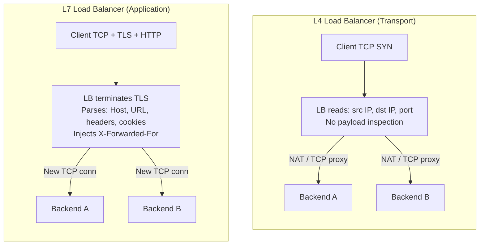

# [BEE-54] 負載平衡器

:::info
L4 vs L7 負載平衡、演算法、健康檢查、連線排除，以及高可用性。
:::

## 背景

每個流量超過單台伺服器負載能力的生產服務，前面都需要一個負載平衡器（load balancer）。但「負載平衡器」涵蓋了廣泛的設計空間：Layer 4 的封包轉發交換器、Layer 7 的完整 HTTP proxy、雲端託管的 ALB，或是 DNS-based round-robin 方案。選錯層級——或設定錯誤——會導致流量分配不均、已宕機的 backend 仍收到請求、部署時 session 資料遺失，以及一個自身就是單點故障（SPOF）的負載平衡器。

**參考資料：**
- NGINX HTTP Load Balancing 文件：<https://docs.nginx.com/nginx/admin-guide/load-balancer/http-load-balancer/>
- NGINX HTTP Health Checks 文件：<https://docs.nginx.com/nginx/admin-guide/load-balancer/http-health-check/>
- HAProxy：Graceful web-server shutdowns：<https://engineering.classdojo.com/2021/07/13/haproxy-graceful-server-shutdowns/>
- Load Balancing Deep Dive — Calmops：<https://calmops.com/network/load-balancing-deep-dive/>

## 原則

**在正確的 OSI 層部署負載平衡器，在上線前設定好健康檢查與連線排除（connection draining），並消除負載平衡層自身的單點故障。**

負載平衡器不只是流量分流器。它是故障隔離的第一道防線、client IP 元資料的持有者、TLS 終止的位置，通常也是 timeout 和重試預算的執行者。從一開始就做對，遠比事後補強 HA 或除錯 client 為何總落在同一個 backend 要便宜得多。

---

## L4 vs L7 負載平衡

最基本的選擇，是負載平衡器運作於哪個 OSI 層。

### Layer 4 — 傳輸層負載平衡

L4 負載平衡器根據 5-tuple（來源 IP、來源 port、目標 IP、目標 port、協定）轉發 TCP 或 UDP 連線。它**不讀取 payload**。每條 TCP 連線被 proxy 或 NAT 轉換到某個 backend，不檢查 HTTP method、URL 或 header。

**特性：**
- 延遲：每跳約 50–100 µs（封包層轉發）
- 吞吐量：每節點 10–40 Gbps 線速
- 除非搭配獨立的 TLS offload 階段，否則無法做 TLS 檢查
- 路由決策依據：IP 位址、port、協定
- Backend 收到原始 TCP 串流；連線追蹤在網路層是有狀態的

**適用時機：**
- 原始吞吐量是首要考量（資料庫、訊息佇列、遊戲伺服器）
- 協定不是 HTTP（SMTP、原始 TCP、UDP-based 協定）
- 需要最低延遲且不需要基於內容的路由

### Layer 7 — 應用層負載平衡

L7 負載平衡器終止來自 client 的 TCP 連線，讀取應用層請求（HTTP、gRPC、WebSocket），再開啟一條新連線到 backend。因為它能看到完整請求，可以根據任何請求屬性進行路由。

**特性：**
- 延遲：每跳約 0.5–3 ms（需完整解析請求）
- 吞吐量：每節點 1–5 Gbps
- 可終止 TLS、檢查 HTTP header、改寫路徑、注入 header（例如 `X-Forwarded-For`）
- 路由決策依據：URL path、Host header、HTTP method、cookie、gRPC service 名稱、query parameter
- 支援 per-request 健康檢查、重試與熔斷

**適用時機：**
- 受益於路徑或 header 路由的 HTTP/HTTPS 流量
- A/B 測試、canary 部署、按比例分流
- Backend 前的 TLS 終止（見 [BEE-53](53.md)）
- WebSocket upgrade 與 HTTP/2 多路複用（見 [BEE-52](52.md)）

### Mermaid 圖：L4 vs L7 檢查點



### 比較表

| 維度 | L4 | L7 |
|---|---|---|
| OSI 層 | 傳輸層（TCP/UDP） | 應用層（HTTP、gRPC） |
| 延遲開銷 | ~50–100 µs | ~0.5–3 ms |
| 最大吞吐量 | 非常高 | 中等 |
| TLS 終止 | 否（或獨立階段） | 是 |
| 基於內容的路由 | 否 | 是 |
| Header 注入 | 否 | 是（`X-Forwarded-For` 等） |
| 連線模型 | 直通或 NAT | 終止並重新發起 |
| 健康檢查精細度 | TCP 連線 | HTTP 狀態碼 |

---

## 負載平衡演算法

### Round Robin（輪詢）

每個新請求（L7）或連線（L4）依序轉發到下一個 backend。

```
Request 1 → Backend A
Request 2 → Backend B
Request 3 → Backend C
Request 4 → Backend A   (循環重複)
```

- 簡單，無狀態
- 適合所有 backend 容量相同且請求成本均勻的情況
- 伺服器異質或請求時間差異大時效果不佳

### Weighted Round Robin（加權輪詢）

每個 backend 被指定一個與其容量成比例的權重。`weight=3` 的 backend 每次接收三個請求，而 `weight=1` 的 backend 只接收一個。

```nginx
upstream api_backends {
    server 10.0.0.1 weight=3;   # 處理 3 倍流量
    server 10.0.0.2 weight=1;
}
```

適用於 backend 硬體規格不同，或在 canary 部署期間漸進式轉移流量的場景。

### Least Connections（最少連線）

下一個請求轉發到當下 active connection 最少的 backend。

```
Active connections: A=10, B=2, C=7
Next request → Backend B
```

- 比 round robin 更適合請求時間差異大的工作負載（例如長時間的 streaming、資料庫查詢、WebSocket 連線）
- 負載平衡器需要追蹤每個 backend 的連線數，增加少量狀態

### IP Hash

client 的來源 IP 被雜湊，只要該 backend 可用，就會一致地對應到同一個 backend。

```
hash(client_ip) % num_backends = backend_index
```

- 提供簡單的 session affinity（工作階段親和性）：同一 client 總是落在同一個 backend
- Backend 集合變更時（新增伺服器改變 `% num_backends`）會影響大量 client
- 在大多數真正需要 affinity 的場景中，已被 consistent hashing 取代

### Consistent Hashing（一致性雜湊）

雜湊函式將 backend 和請求 key（client IP、session ID、user ID）映射到一個概念環（ring）上。每個請求被路由到環上順時針方向最近的 backend。

**關鍵特性：** 新增或移除一個 backend 只會影響 `1/N` 的 key，而非重新映射所有 key。這使其成為快取叢集和有狀態服務的標準演算法。

```
Ring positions（簡化）：
  Backend A: 0–120
  Backend B: 121–240
  Backend C: 241–360

hash(client_ip) = 180 → Backend B
hash(client_ip) = 350 → Backend C
```

當 Backend B 被移除，key 121–240 重新映射到 Backend C。A 和 C 服務的 key 不受影響。

### 演算法選擇指南

| 工作負載 | 建議演算法 |
|---|---|
| 同質伺服器、短請求 | Round Robin |
| 伺服器容量不同 | Weighted Round Robin |
| 長連線（WebSocket、streaming） | Least Connections |
| 快取叢集、有狀態路由 | Consistent Hashing |
| 需要簡單 affinity、池穩定 | IP Hash |

---

## 健康檢查

### 為何健康檢查不可省略

沒有健康檢查，負載平衡器無法知道 backend 已崩潰或失去回應。流量持續流向死掉的 backend，client 看到錯誤。健康檢查是負載平衡器自動將不健康 backend 移出輪換的機制。

### 被動健康檢查（Passive Health Check）

被動檢查從真實流量推斷健康狀態。如果負載平衡器收到連線錯誤、逾時或 5xx 回應，則計入失敗次數。在 `fail_timeout` 秒內發生 `max_fails` 次連續失敗後，將 backend 標記為不健康。

```nginx
# NGINX 被動健康檢查設定
upstream api_backends {
    server 10.0.0.1 max_fails=3 fail_timeout=30s;
    server 10.0.0.2 max_fails=3 fail_timeout=30s;
    server 10.0.0.3 max_fails=3 fail_timeout=30s;
}
```

- 不產生額外流量
- 偵測延遲：在 backend 被移除前，前 `max_fails` 個真實請求會失敗
- 在 NGINX open-source 版本中即可使用

### 主動健康檢查（Active Health Check）

主動檢查按排程向每個 backend 發送合成探測請求，獨立於真實流量。

```nginx
# NGINX Plus 主動健康檢查
upstream api_backends {
    server 10.0.0.1;
    server 10.0.0.2;
    server 10.0.0.3;
}

server {
    location / {
        proxy_pass http://api_backends;
        health_check interval=10s fails=3 passes=2 uri=/healthz;
    }
}
```

此設定說明：
- 每 10 秒對每個 backend 探測 `/healthz`
- 連續 3 次失敗後標記為不健康
- 需要連續 2 次通過才重新標記為健康（避免狀態震盪）

**主動 vs 被動比較：**

| 屬性 | 被動 | 主動 |
|---|---|---|
| 額外流量 | 無 | 有（探測請求） |
| 偵測速度 | 慢（需等真實失敗） | 快（持續探測） |
| 準確性 | 較低 | 較高 |
| 可用性 | 所有負載平衡器 | 通常需付費版本 |

**建議：** 在生產環境使用主動健康檢查。探測流量的開銷相對於將真實請求路由到死亡 backend 的代價微不足道。

### 健康檢查 Endpoint 設計

每個 backend 的 `/healthz` 或 `/health` endpoint 應該：
- 只在程序完全準備好服務請求時回傳 `200 OK`
- 若服務缺少依賴項就無意義，則檢查依賴項（資料庫連線、關鍵快取）
- 快速回應（100 ms 以內）；緩慢的健康檢查本身可能觸發誤判為不健康
- 區分 liveness（程序存活）與 readiness（程序準備好服務）——Kubernetes 區分這兩者；負載平衡器通常使用 readiness

---

## 連線排除（Connection Draining）

Connection draining（也稱為 graceful shutdown，優雅關機）是將 backend 從輪換中移除而不丟棄進行中請求的過程。

### 沒有 Draining 的問題

```
1. 部署：Backend A 需要重啟以發布新版本
2. LB 立即將 Backend A 從池中移除
3. 40 個進行中的 HTTP 請求收到 TCP RST
4. Client 看到 502 或連線錯誤
```

### 正確的順序

```
1. 信號：Backend A 被標記為「draining」（軟移除出池）
2. LB 停止將新請求發送到 Backend A
3. Backend A 上現有連線的進行中請求繼續正常執行
4. Backend A 向其應用程式發送信號，停止接受新連線
5. 等待：所有進行中請求完成（或 drain timeout 到期）
6. Backend A 完全移除並關機
```

在 HAProxy 中，將 backend 的 weight 設為 `0` 可達到步驟 1 的效果：伺服器不參與新的負載平衡決策，但現有的持久連線（keep-alive）維持到自然關閉。

```
# HAProxy：透過 stats socket drain 一個 backend
echo "set weight be_api/10.0.0.1 0%" | socat stdio /var/run/haproxy/admin.sock
```

在 Kubernetes 中，`preStop` lifecycle hook 搭配 `terminationGracePeriodSeconds` 可達到相同效果：Pod 停止從 Service endpoint 收到新流量，等待 hook 時間後退出。

### Drain Timeout

務必設定有限的 drain timeout。若進行中的請求在（例如）30 秒內未完成，強制終止連線。長時間的 WebSocket 或 streaming 連線可能需要更長或獨立的 drain 預算。

---

## Session Affinity（工作階段親和性）／Sticky Sessions

### 什麼是 Sticky Sessions

Session affinity 將特定 client 的所有請求路由到同一個 backend。通常透過以下方式實作：
- **Cookie 注入**：LB 設定 cookie（例如 `SERVERID=backend_A`）；後續請求攜帶該 cookie 並被路由到 `backend_A`
- **IP hash**：如演算法章節所述

### 為何應盡量避免

Sticky sessions 是未正確外部化的伺服器端狀態的症狀。它帶來幾個問題：

1. **不均勻的負載分配**：若某個 client 產生 90% 的流量，sticky sessions 會將其固定在一個 backend，無論其他 backend 多閒置
2. **故障時仍失去狀態**：若固定的 backend 死亡，該 backend 上的所有 session 無論如何都會丟失——affinity 無法防止故障
3. **部署複雜性**：Rolling deployment 變得更複雜，因為在移除 backend 前需要排除 sticky sessions，否則接受 session 遺失
4. **違背水平擴展目的**：多個 backend 的意義在於任何 backend 都可以處理任何請求

**首選替代方案：** 將 session 狀態存儲在共享的外部存儲（Redis、資料庫）中，讓任何 backend 都能服務任何請求，使應用程式在負載平衡器後面真正無狀態。

**Sticky sessions 可接受的情況：**
- 重構 session 存儲不可行的老舊應用程式
- 協定要求與同一個 backend 保持持久連線的 WebSocket 連線（部署時需與 connection draining 配合）
- session 遺失代價很低的極短暫 session

---

## Client IP 保留：X-Forwarded-For

當 L7 負載平衡器終止 client 連線並向 backend 開啟新連線時，backend 看到的是負載平衡器的 IP，而非真實的 client IP。轉發原始 client IP 的標準機制是 `X-Forwarded-For` header（XFF）。

```
Client (1.2.3.4) → LB (10.0.0.100) → Backend

HTTP request to backend:
  X-Forwarded-For: 1.2.3.4
  X-Real-IP: 1.2.3.4
```

在 NGINX 中：
```nginx
proxy_set_header X-Forwarded-For $proxy_add_x_forwarded_for;
proxy_set_header X-Real-IP       $remote_addr;
```

### XFF 安全考量

如果負載平衡器盲目附加而不剝除不受信任的值，`X-Forwarded-For` 可能被 client 偽造。發送 `X-Forwarded-For: 127.0.0.1` 的 client 不應繞過基於 IP 的存取控制。

- 設定負載平衡器**取代**（而非附加）XFF header，或在附加真實來源 IP 前剝除 client 提供的值
- 只信任來自已知可信 proxy（你自己的負載平衡器）的 XFF，不信任任意上游跳躍的值
- 在 AWS 使用 ALB 的 `X-Forwarded-For`；在 Cloudflare 使用 `CF-Connecting-IP`

---

## 高可用性：消除 LB 自身的單點故障

單台負載平衡器本身就是單點故障。如果它宕機，無論 backend 多健康，所有流量都會停止。

### Active-Passive 配對

兩台負載平衡器共享一個虛擬 IP（VIP）。主節點處理所有流量；備節點監控主節點。若主節點故障，備節點晉升並透過 GARP（Gratuitous ARP）或 BGP 宣告 VIP。

```
VIP: 203.0.113.10
  ├── LB-Primary（active，持有 VIP）
  └── LB-Secondary（standby，透過 heartbeat 監控主節點）

主節點故障時：
  LB-Secondary 接管 VIP → 流量流向備節點
```

切換時間：基於 GARP 的 VIP 切換通常 1–5 秒。在此視窗期間，新的 TCP 連線會失敗；現有 TCP 連線能否存活取決於連線狀態是否共享（例如 Linux 中的 `conntrack` 同步）。

工具：Keepalived（VRRP）、Pacemaker/Corosync、雲端供應商 HA 選項（AWS NLB 本身即 HA；GCP forwarding rules 路由到 managed instance group）。

### Active-Active 配對

兩台負載平衡器同時處理流量，通常透過：
- **DNS round-robin**：同一主機名有兩個 A 記錄分別指向 LB-1 和 LB-2
- **Anycast**：兩個節點宣告相同的 BGP prefix；client 路由到最近的節點
- **ECMP（Equal-Cost Multipath）**：路由器將 flow 以雜湊方式分配到兩台 LB

Active-active 可倍增吞吐量並提供冗餘，但要求兩台 LB 對 backend 狀態有一致的視圖（健康檢查結果、least-connections 演算法的連線數）。

### 雲端託管負載平衡器

雲端供應商（AWS ALB/NLB、GCP Load Balancing、Azure Load Balancer）在內部處理 HA。底層叢集是多節點且地理分散的。代價是以較少對低層級行為的控制換取操作簡便性。

---

## Direct Server Return（DSR，直接伺服器回傳）

在標準 L4 負載平衡中，入站和出站流量都通過負載平衡器：

```
Client → LB → Backend → LB → Client   (對稱路徑)
```

在 Direct Server Return（DSR）中，backend **直接**回應 client，繞過負載平衡器的回傳路徑：

```
Client → LB → Backend → Client   (非對稱路徑；回傳繞過 LB)
```

DSR 透過 LB 改寫目標 MAC 位址（而非 IP）來實作，使 backend 收到目標為 VIP 的封包，但直接透過自己的 NIC 回應 client 閘道。

**優點：** 回傳路徑——通常遠大於請求（例如大型檔案下載）——不通過 LB，消除瓶頸並大幅降低 LB CPU 負載。

**限制：**
- 需要 L2 鄰近（LB 和 backend 在同一網段）或 tunneling（IP-in-IP、GRE）
- 操作複雜；DSR 模式下無法使用 L7 功能（header 注入、TLS 終止）
- 主要用於高吞吐量、低延遲場景（CDN origin serving、遊戲、金融交易）

---

## 常見錯誤

### 1. 沒有健康檢查——將流量發送到死亡的 Backend

最常見也最具破壞性的錯誤。沒有健康檢查，backend 崩潰對負載平衡器是不可見的。所有後續請求到該 backend 都會失敗，直到有人手動將其從池中移除。

**修正：** 在上生產環境前設定主動健康檢查。在任何生產就緒審查中，將「未設定健康檢查」視為阻斷性問題。

### 2. Sticky Sessions 違背負載平衡的目的

Sticky sessions 看起來像是解決有狀態性的方案，實際上只是推遲了問題。當固定的 backend 被移除（部署、故障、縮容）時，其上的所有 session 無論如何都會丟失，而且隨著 session 在一個節點上累積，流量分配會變得不均。

**修正：** 外部化 session 狀態。使用 Redis 或資料庫存儲 session。設計為任何 backend 都能處理任何請求。

### 3. 缺少 X-Forwarded-For——遺失 Client IP

Backend 將每個請求的 `10.0.0.100`（LB 位址）記錄為 client IP。速率限制、地理限制和稽核日誌全部失去意義。

**修正：** 在 NGINX 中設定 `proxy_set_header X-Forwarded-For $proxy_add_x_forwarded_for;`（或同等設定）。確認 backend 從 `X-Forwarded-For` 而非 `REMOTE_ADDR` 讀取 client IP。

### 4. 單台負載平衡器作為 SPOF

新增負載平衡以消除 backend SPOF，同時留下單台負載平衡器作為新 SPOF，是常見的架構錯誤。

**修正：** 部署 HA 配對（使用 Keepalived/VRRP 的 active-passive，或使用 DNS/anycast 的 active-active）。在雲端使用預設提供 HA 的託管 LB 產品。

### 5. 在 L4 足夠時使用 L7

L7 負載平衡在每次跳躍時引入完整請求解析。對於不需要基於內容路由的非 HTTP 協定或純基於連線路由的場景，這種開銷是不必要的。

**修正：** 對不需要基於內容路由的 TCP 服務（資料庫 proxy、訊息佇列、原始 TCP 服務）使用 L4。將 L7 保留給受益於 header 路由、TLS 終止或 per-request 重試的 HTTP/gRPC 工作負載。

---

## 相關 BEE

- [BEE-50](50.md) — TCP/IP 與網路堆疊：L4 負載平衡器在 TCP 層運作；理解 TCP 連線狀態（SYN、ESTABLISHED、TIME_WAIT）是推理 connection draining 和健康檢查行為的必要條件
- [BEE-51](51.md) — DNS 解析：DNS-based 負載平衡（多個 A 記錄、GeoDNS）是互補技術；另見 DNS TTL 如何影響 client 偵測失敗 backend 的速度
- [BEE-52](52.md) — HTTP/2 與 HTTP/3：HTTP/2 在一條 TCP 連線上多路複用多個 stream；L7 LB 必須理解多路複用，才能將一條連線的工作分配到多個 backend，而非將所有 stream 固定到一個 backend
- [BEE-53](53.md) — TLS/SSL Handshake：L7 負載平衡器是標準的 TLS 終止點；見 TLS 終止拓撲（邊緣終止、重加密、直通）以及 SNI 如何在 TLS handshake 完成前就實現路由
- [BEE-55](55.md) — Reverse Proxy：reverse proxy 和 L7 負載平衡器有大量重疊；[BEE-55](55.md) 涵蓋支撐 L7 負載平衡行為的 proxy 語義、請求緩衝與上游連線池
