# [BEE-322] 分散式追蹤

:::info
Trace 與 Span 概念、W3C Trace Context 傳播機制、抽樣策略，以及如何對服務進行埋點，確保 Trace 在每個服務邊界都保持完整。
:::

## 背景

2010 年，Google 發表了 Dapper 論文，描述他們如何為一個單一搜尋查詢就可能觸及數千個內部服務的系統建構追蹤基礎設施。這個問題在分散式架構中普遍存在：當請求緩慢或失敗時，如果沒有任何單一服務掌握完整資訊，你怎麼知道是哪個服務出了問題？

Dapper 建立了現代所有追蹤系統都採用的基礎模型：由 Span 組成的 Trace，並透過服務邊界傳播唯一識別碼。OpenTelemetry 現已成為 CNCF 的標準埋點框架，將此模型規範化為廠商中立的 SDK。W3C Trace Context 規範（2021 年）標準化了 Context 傳播的格式，使 Trace 能夠跨服務流轉，無論各團隊使用哪家廠商的後端。

**參考資料：**
- [Google Dapper — 大規模分散式系統追蹤基礎設施（2010）](https://research.google/pubs/dapper-a-large-scale-distributed-systems-tracing-infrastructure/)
- [W3C Trace Context 規範](https://www.w3.org/TR/trace-context/)
- [OpenTelemetry — Traces 概念](https://opentelemetry.io/docs/concepts/signals/traces/)
- [OpenTelemetry — 抽樣策略](https://opentelemetry.io/docs/concepts/sampling/)

## 原則

**對每個服務進行埋點以建立 Span、跨每個服務邊界（包括訊息佇列）傳播 W3C `traceparent` Header，並透過抽樣保留真正重要的 Trace：錯誤、慢請求，以及正常流量的統計基準線。**

## 核心概念

### Trace

**Trace** 是單一請求在系統中完整旅程的記錄。由該請求觸發的每個操作——跨越每個服務、資料庫查詢和外部呼叫——都屬於同一個 Trace。Trace 以全域唯一的 128 位元 **trace ID** 識別。

### Span

**Span** 是 Trace 中的一個計時工作單元。Span 記錄：

- 唯一的 **span ID**（64 位元）
- 所屬的 **trace ID**
- **parent span ID**（若為根 Span 則無）
- 開始時間與持續時間
- 狀態（OK、Error、Unset）
- **Attributes** — 提供 Context 的鍵值對（HTTP method、DB statement、user ID）
- **Events** — Span 生命週期中重要時刻的帶時間戳記錄（例如：Cache miss、重試嘗試）

一個結帳請求的單一 Trace 可能包含 15–20 個 Span：API Gateway 的一個根 Span、每個下游服務呼叫的子 Span，以及資料庫查詢和 Cache 查詢的孫 Span。

### 父子關係

Span 形成一棵樹。當服務 A 呼叫服務 B 時，服務 A 為外出呼叫建立一個子 Span，服務 B 為自身處理建立一個獨立的子 Span——兩者都連結到服務 A 中相同的父 Span。這種父子結構讓追蹤檢視器能夠渲染出瀑布圖，精確顯示時間花費在哪裡。

```
Trace: a3ce929d0e0e47364bf92f3577b34da6
│
├── [api-gateway] 根 Span                0ms ──────────────── 310ms
│   ├── [order-service]                 12ms ──────────────── 305ms
│   │   ├── [inventory-service]         15ms ──── 60ms
│   │   ├── [payment-service]           15ms ──────────────── 300ms  ← 緩慢
│   │   │   └── [stripe-api] 外部呼叫   20ms ──────────────── 295ms  ← 非常緩慢
│   │   └── [db: INSERT orders]        301ms ─── 305ms
```

## Context 傳播

連接跨服務 Span 的機制是 **Context 傳播**：trace ID、parent span ID 和抽樣決策透過 HTTP Header 隨請求一起傳遞。

### W3C traceparent Header

W3C Trace Context 規範定義了標準的 `traceparent` Header 格式：

```
traceparent: 00-4bf92f3577b34da6a3ce929d0e0e4736-b7ad6b7169203331-01
              ^  ^                                ^                ^
              |  |                                |                |
           版本  trace-id（128 位元 hex）    parent-span-id   trace-flags
                                               （64 位元 hex） 01=已抽樣
```

| 欄位 | 長度 | 說明 |
|---|---|---|
| `version` | 2 個 hex 字元 | 目前規範中始終為 `00` |
| `trace-id` | 32 個 hex 字元 | 整個 Trace 的全域唯一 ID |
| `parent-id` | 16 個 hex 字元 | 呼叫方當前 Span 的 Span ID |
| `trace-flags` | 2 個 hex 字元 | `01` = 已抽樣，`00` = 未抽樣 |

每個接收請求的服務必須：
1. 提取 `traceparent` Header
2. 使用接收到的 `trace-id` 和 `parent-id` 建立新的子 Span
3. 在所有外出呼叫中轉發 Header（以自身的 span ID 作為新的 `parent-id`）

當傳入請求不帶 `traceparent` 時，該服務成為根節點並生成新的 `trace-id`。

### 非同步操作：訊息佇列

Context 傳播必須延伸至 HTTP 之外。當服務向 Kafka、RabbitMQ 或其他佇列發布訊息時，`traceparent` 值必須包含在訊息的 metadata/headers 中。消費者讀取後建立帶有連結到生產者 Span 的子 Span。若缺少這一步，Trace 在每個非同步邊界都會中斷——這是追蹤覆蓋率中常見且痛苦的缺口。

## Span Attributes 與 Events

只有計時資料的 Span 告訴你某件事花了*多長時間*。Attributes 和 Events 告訴你*為什麼*。

**Attributes** 是在 Span 建立時或其生命週期中設定的鍵值對：

```
http.method = "POST"
http.route = "/orders"
http.status_code = 200
db.system = "postgresql"
db.statement = "INSERT INTO orders ..."
order.id = "ORD-4492"
user.id = "8821"
```

OpenTelemetry 為常見的 Attributes 定義了語義慣例（HTTP、資料庫、訊息），讓後端無需自訂設定即可渲染有意義的 UI。

**Events** 是 Span 內的帶時間戳記發生事件——適用於記錄重試嘗試、Cache miss 或重要的中間狀態：

```
span.addEvent("cache_miss", { "cache.key": "cart:8821" })
span.addEvent("retry_attempt", { "retry.count": 2, "retry.reason": "timeout" })
```

## 抽樣策略

對高吞吐量的每個請求進行完整追蹤成本過高。抽樣在降低資料量的同時保持可觀測性。

### Head Sampling（概率抽樣）

抽樣決策在 Trace **開始時**做出，在收集任何 Span 資料之前。保留固定百分比的 Trace。

- **優點：** 實作簡單、開銷低、抽樣率一致。
- **缺點：** 無法基於 Trace 結果做決策。1% 的抽樣率會將 99% 的慢請求和錯誤 Trace 與快速請求一起丟棄。

### Tail Sampling

抽樣決策在 Trace 完成（或基本完成）**後**做出，基於實際的 Trace 資料。

- 保留 100% 包含錯誤 Span 的 Trace
- 保留 100% 超過延遲閾值的 Trace（例如 p99 > 2 秒）
- 對其他（成功、快速）的 Trace 保留 1–5% 的樣本

- **優點：** 保證永遠不會丟棄最重要的 Trace。
- **缺點：** 需要收集器元件（OpenTelemetry Collector）在做出保留/丟棄決策前緩衝 Span；基礎設施複雜度較高。

### 建議策略

在開發期間及低流量服務中使用 **Head Sampling**。對於承受大量流量的生產系統，透過 OpenTelemetry Collector 部署 **Tail Sampling**。無論採用哪種策略，始終對 100% 的錯誤 Trace 進行抽樣。

| 策略 | 保留率 | 適用場景 |
|---|---|---|
| Head（始終開啟） | 100% | 開發/測試、低流量服務 |
| Head（概率） | 1–10% | 高流量、均勻流量 |
| Tail（偏重錯誤） | 100% 錯誤 + 1–5% 成功 | 需要控制成本且不能有盲點的生產系統 |

## Trace 視覺化

追蹤後端（Jaeger、Zipkin、Grafana Tempo、Honeycomb、Datadog APM）將 Trace 渲染為**瀑布圖**：Span 是時間軸上的水平條形，以縮排顯示父子關係。這讓你立即看到哪個服務消耗了請求總時長的最多部分。

```mermaid
gantt
    title 結帳請求 — Trace 瀑布圖（總計：310ms）
    dateFormat  x
    axisFormat %Lms

    section api-gateway
    api-gateway（根 Span）  :0, 310

    section order-service
    order-service           :12, 293

    section 並行工作
    inventory-service       :15, 45
    payment-service         :15, 285

    section payment 詳情
    stripe-api（外部）      :20, 275

    section db
    db INSERT orders        :301, 4
```



瀑布圖立即顯示 `stripe-api` 消耗了總計 310ms 中的 275ms——沒有這個 Trace，工程師只能猜測延遲源自哪裡。

## 埋點方式

### 自動埋點

OpenTelemetry 提供特定語言的自動埋點 Agent，無需任何程式碼變更即可掛鉤到流行的框架和函式庫（Express、Spring、Django、Rails、gRPC、JDBC、Redis 客戶端）。自動埋點處理：

- 從傳入請求提取 `traceparent`
- 為入站 HTTP 請求建立 Span
- 為出站 HTTP 呼叫和資料庫查詢建立子 Span
- 將 `traceparent` 注入出站請求

從這裡開始。自動埋點以零應用程式碼變更覆蓋 80% 的需求。

### 手動埋點

使用手動埋點添加自動埋點無法提供的業務層 Context：

```python
from opentelemetry import trace

tracer = trace.get_tracer("order-service")

def process_checkout(order_id: str, user_id: str):
    with tracer.start_as_current_span("checkout.process") as span:
        span.set_attribute("order.id", order_id)
        span.set_attribute("user.id", user_id)

        items = fetch_cart(user_id)
        span.set_attribute("cart.item_count", len(items))

        span.add_event("inventory_check_start")
        check_inventory(items)
        span.add_event("inventory_check_complete")

        charge_result = charge_payment(order_id)
        if not charge_result.success:
            span.set_status(trace.StatusCode.ERROR, charge_result.error)
            span.set_attribute("payment.failure_reason", charge_result.error)
```

若 Span 上沒有 `order.id` 和 `user.id`，你只知道結帳很慢——但不知道是哪個用戶或哪筆訂單。

## 電商結帳範例

用戶提交結帳。請求流經四個服務。

**步驟 1 — API Gateway 接收請求。沒有 `traceparent`，因此它生成新的 Trace：**

```
traceparent: 00-a3ce929d0e0e47364bf92f3577b34da6-c2b9e3d8f6a10421-01
```

**步驟 2 — API Gateway 呼叫 Order Service，以自身 span ID 作為新的 parent 轉發 Header：**

```
traceparent: 00-a3ce929d0e0e47364bf92f3577b34da6-f8a2c41b7e930562-01
```

**步驟 3 — Order Service 並行扇出至 Inventory Service 和 Payment Service，為每個外出呼叫建立子 Span：**

```
# 到 Inventory Service
traceparent: 00-a3ce929d0e0e47364bf92f3577b34da6-3d91e7a042b8c650-01

# 到 Payment Service
traceparent: 00-a3ce929d0e0e47364bf92f3577b34da6-7a04b2f19c3e8d71-01
```

**結果瀑布圖：**

```
[api-gateway]       ├──────────────────────────────────────┤  0–310ms
  [order-service]     ├────────────────────────────────┤    12–305ms
    [inventory-svc]     ├──────┤                             15–60ms
    [payment-svc]       ├──────────────────────────────┤    15–300ms
      [stripe-api]        ├───────────────────────────┤     20–295ms
    [db:INSERT]                                    ├──┤     301–305ms
```

Trace 立即揭示：結帳緩慢是因為 `stripe-api` 花了 275ms。Inventory 在 45ms 內完成。資料庫寫入很快。無需翻找日誌。

## 常見錯誤

### 1. 未傳播 Trace Context

在第一個服務邊界就中斷的 Trace 對於分散式除錯毫無用處。最常見的失敗點是自訂 HTTP 客戶端封裝器沒有轉發 `traceparent` Header。明確測試這一點：在你的堆疊中執行一個請求，並在追蹤後端中驗證 Trace Span 是否跨越所有服務端到端。

### 2. 在生產環境只使用 Head Sampling

以 1% 的 Head Sampling，99% 的錯誤和延遲 Trace 在你看到之前就被丟棄了。影響 0.5% 請求的新型事故幾乎是不可見的。在生產環境使用 Tail Sampling，確保始終保留錯誤和慢請求。

### 3. 過多 Span

對每個函式呼叫或迴圈疊代進行埋點會產生每個 Trace 數千個 Span。結果是使 Trace 難以閱讀的雜訊，並大幅增加儲存成本。在有意義的邊界建立 Span：服務呼叫、外部 API 呼叫、資料庫查詢、Cache 操作和重要的業務操作。不要對單個工具函式建立 Span。

### 4. 沒有 Span Attributes

只有名稱和計時資料的 Span 只能回答「這花了多長時間？」——什麼都回答不了。附加能回答下一個問題的 Attributes：`order.id`、`db.statement`、`http.status_code`、`payment.provider`。調查在 Trace 就結束，而不需要後續的日誌查詢。

### 5. 只追蹤 HTTP，不追蹤訊息佇列跳轉

許多後端有非同步階段——Kafka 消費者、SQS Worker、Celery Task。如果 Trace Context 沒有透過訊息 metadata 傳播，Trace 看起來在生產者處就結束了。消費者的工作是不可見的。始終在訊息 Headers 中包含 `traceparent`，並讓消費者提取它以建立子 Span。

## 相關 BEE

- **BEE-320** — 三大支柱：Trace 如何與 Metrics 和 Logs 相互關聯
- **BEE-321** — 結構化日誌：在日誌條目中嵌入 `trace_id` 和 `span_id`
- **BEE-105** — Service Mesh：Mesh 層追蹤如何補充應用層埋點
