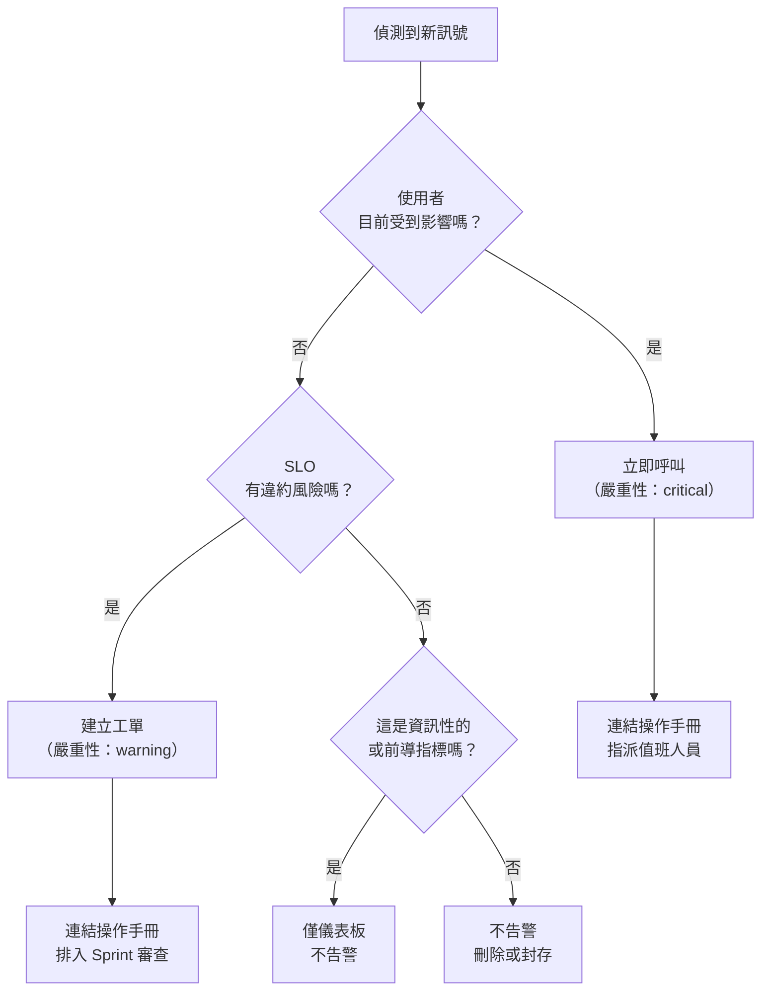

# [BEE-323] 告警哲學

:::info
以症狀為基礎的告警與以原因為基礎的告警、告警疲勞、SLO 燃燒率告警，以及維持值班輪換健全的紀律。
:::

## 背景

2012 年，Rob Ewaschuk 根據他在 Google 擔任 SRE（網站可靠性工程師）的經驗，發表了《我的告警哲學》（My Philosophy on Alerting）。核心論點看似簡單：每一次呼叫（page）都應該需要人類智慧才能處理，且每次呼叫都應代表正在發生或即將發生的使用者影響。以原因為基礎的告警——針對 CPU、記憶體、佇列深度等內部系統狀態觸發——違反了這兩項原則。它對可能永遠不會影響使用者的條件發出告警，且回應方式是腳本化的，不需要任何智慧判斷。

Google SRE 書籍（第 6 章：監控分散式系統）將此概念濃縮為每個告警應具備的四個屬性：**緊急、重要、可採取行動、且真實存在**。SRE 工作手冊（第 5 章：基於 SLO 的告警）進一步擴展此模型，展示如何使用多視窗、多燃燒率方式，直接從 SLO 燃燒率推導告警——這項技術現已成為生產告警的業界標準。

**參考資料：**
- [Rob Ewaschuk — 我的告警哲學（Google Docs）](https://docs.google.com/document/d/199PqyG3UsyXlwieHaqbGiWVa8eMWi8zzAn0YfcApr8Q/preview)
- [Google SRE 書籍 — 監控分散式系統](https://sre.google/sre-book/monitoring-distributed-systems/)
- [Google SRE 工作手冊 — 基於 SLO 的告警（多視窗、多燃燒率）](https://sre.google/workbook/alerting-on-slos/)

## 原則

**以症狀告警——可觀測的使用者影響——而非以原因告警。每個告警都必須緊急、可採取行動，並連結到操作手冊（Runbook）。從 SLO 燃燒率推導生產呼叫，而非從跨越指標閾值觸發。**

## 以症狀告警 vs 以原因告警

監控系統需要回答兩個問題：*什麼東西壞了？* 以及 *為什麼？* 「什麼」是症狀——使用者的體驗。「為什麼」是原因——導致症狀的內部系統狀態。

**以症狀告警。將原因放在儀表板上。**

### 為什麼以原因告警會失敗

複雜系統有數百種故障模式，無法提前全部列舉。以原因告警有兩種失敗模式：

1. **誤報（False positive）**：CPU 達到 80%，告警觸發，但服務正常處理請求。值班工程師調查，發現沒有問題，標記為雜訊。重複幾次後，他們開始忽略所有類似的告警。
2. **漏報（False negative）**：一種新的故障模式透過你從未想到要監控的程式碼路徑造成高錯誤率。沒有設定閾值；告警未觸發；使用者受影響長達 45 分鐘，直到有人注意到。

以症狀告警解決了這兩個問題。如果使用者未受影響，告警不會觸發。如果使用者受影響——無論是什麼原因——告警就會觸發。

### 實際對比

**差的告警——以原因為基礎：**
```
FIRING: CPU 使用率過高
  主機: host-17
  cpu_usage: 82%
  閾值: 80%
```

為何失敗：
- 在這個工作負載下，82% 的 CPU 對這台主機來說可能是正常的。
- 完全未說明使用者是否受到影響。
- 「修復」方式不明確——應該擴容？重啟？調查？聯絡 DB 團隊？
- 沒有操作手冊，因為沒有明確的行動。

**好的告警——以症狀為基礎：**
```
FIRING: order-service SLO 燃燒率危急
  error_rate_5m: 2.3%
  slo_target: 99.5%（0.5% 錯誤預算）
  burn_rate_1h: 10.2x
  burn_rate_5m: 12.8x
  runbook: https://wiki.internal/runbooks/order-service-error-rate
```

為何有效：
- 明確告知使用者現在正受到影響。
- 燃燒率量化了緊迫性：10x 表示月度錯誤預算在 3 天內耗盡。
- 操作手冊連結提供了立即的起點。
- 在錯誤率升高但仍在 SLO 範圍內時，不會觸發告警。

## 告警決策樹



## SLO 燃燒率告警

直接針對 SLO 燃燒率告警，是確保呼叫反映真實使用者影響同時最小化雜訊的最可靠方式。完整的 SLO 機制請參見 [BEE-321](321.md)；以下是告警應用的摘要。

### 什麼是燃燒率？

燃燒率是你的服務相對於 SLO 合規期間消耗錯誤預算的速度。燃燒率 1.0 表示你以恰好在月底耗盡預算的速度消耗。10x 的燃燒率表示預算在 1/10 的時間內耗盡——對月度預算而言，約為 3 天。

### 多視窗、多燃燒率

單一視窗的燃燒率告警有一個根本問題：短暫的尖峰會產生瞬間高燃燒率，呼叫值班工程師，然後自行恢復。工程師醒來後發現什麼問題都沒有。

多視窗方式要求燃燒率同時在**長視窗**和**短視窗**都升高。長視窗偵測持續問題；短視窗確認問題是當前存在的而非歷史遺留。

Google 建議針對 99.5% 月度 SLO 設定四條告警規則：

| 嚴重性 | 燃燒率 | 長視窗 | 短視窗 | 預算耗盡時間 |
|---|---|---|---|---|
| Critical（呼叫） | 14.4x | 1 小時 | 5 分鐘 | 2 天 |
| Critical（呼叫） | 6x | 6 小時 | 30 分鐘 | 5 天 |
| Warning（工單） | 3x | 1 天 | 2 小時 | 10 天 |
| Warning（工單） | 1x | 3 天 | 6 小時 | 30 天 |

兩條 critical 規則立即呼叫值班人員。兩條 warning 規則在下一個工作日建立工單。低於這些閾值的任何情況都不應觸發呼叫。

**Prometheus 範例（1 小時 / 5 分鐘視窗，14.4x 燃燒率）：**
```yaml
- alert: OrderServiceErrorBudgetCritical
  expr: |
    (
      rate(http_requests_total{service="order-service",status=~"5.."}[1h])
      / rate(http_requests_total{service="order-service"}[1h])
    ) > (14.4 * 0.005)
    and
    (
      rate(http_requests_total{service="order-service",status=~"5.."}[5m])
      / rate(http_requests_total{service="order-service"}[5m])
    ) > (14.4 * 0.005)
  for: 2m
  labels:
    severity: critical
  annotations:
    summary: "order-service 錯誤預算燃燒速率危急"
    runbook: "https://wiki.internal/runbooks/order-service-error-rate"
```

## 告警嚴重性等級

每個告警都必須被指派一個嚴重性，以決定如何路由及需要何種回應。

| 嚴重性 | 路由方式 | 定義 | 回應時間 |
|---|---|---|---|
| **Critical（呼叫）** | PagerDuty / 值班人員 | 使用者現在受到影響，SLO 違約迫在眉睫 | 立即（全天候） |
| **Warning（工單）** | Jira / Slack | SLO 面臨風險，尚未違約 | 下一個工作日 |
| **Info** | 僅儀表板 | 調查時的背景資訊 | 無需回應 |

**最常見的錯誤**：將所有告警都視為呼叫。當所有事情都呼叫時，就沒有任何事情是重要的。嚴重性膨脹會摧毀訊號。只在確認的使用者影響時才呼叫。其他所有情況都是工單或儀表板。

規則：如果不需要在凌晨 2 點叫醒某人，就不是呼叫。

## 告警疲勞

告警疲勞是指告警量大到工程師停止積極回應的狀態。這不是感知問題，而是系統性的安全隱患。被忽視的告警意味著真實事故無法被偵測。

**警告跡象：**
- 值班工程師例行確認告警但不調查。
- 告警在某些時段被預設靜音。
- 平均確認時間（MTTA）每季持續上升。
- 工程師描述值班週非常疲憊，即使在低事故期間也是如此。

**發生原因：**
1. 團隊為所有能想到的指標閾值添加告警。
2. 每個個別告警看起來都合理。
3. 總量無法持續承受。
4. 訊噪比崩潰。
5. 真實事故被遺漏。

**修復方式：** 將告警數量視為指標來追蹤。追蹤每個值班週的呼叫次數。任何有超過 5 次呼叫但不需要採取行動的週，都需要告警審查。定期清理從未觸發、或觸發後不需要回應的告警。

## 操作手冊：每個告警都必須有一份

沒有操作手冊的告警，是在壓力下必然被錯誤處理的告警。

操作手冊是直接從告警連結的文件，告訴回應者：

1. **告警的含義** — 正在發生什麼使用者影響？哪個 SLI 正在被違反？
2. **初步分類** — 最初應執行的三個檢查是什麼？（例如：按端點檢查錯誤率、檢查最近的部署、檢查下游依賴。）
3. **升級路徑** — 如果初步調查無法定論，應聯絡誰。
4. **已知緩解措施** — 回滾程序、熔斷器開關、速率限制提升。
5. **事後分析連結** — 在哪裡提交事後分析。

如果為告警撰寫操作手冊很困難，這就是告警不應該存在的訊號。無法採取行動的告警應該被刪除。

## 告警抑制與分組

原始告警工具在每次發生時，為每條告警規則發送一個通知。在真實事故中，單一根本原因會在許多服務中觸發數十個告警。每個告警分別呼叫值班工程師。值班工程師在 90 秒內收到 40 次呼叫，無法處理任何一個。

**分組（Grouping）** 將相關告警合併為單一通知。Alertmanager（Prometheus）和 PagerDuty 都支援按 `service`、`cluster` 或 `team` 等標籤進行分組。一個事故，一個通知。

**抑制（Suppression / Inhibition）** 防止子告警在父告警已啟用時觸發。如果 `database-primary-down` 正在觸發，抑制所有由此引起的下游 `service-error-rate` 告警。值班人員的注意力集中在根本原因上。

從一開始就設定好這兩項。在告警風暴後再追加分組，比初始設定時就做對要困難得多。

## 值班負擔

值班只有在可預測且有限的情況下才是可持續的。Google SRE 的建議：每 12 小時值班輪次不超過 2 次需要主動介入的呼叫。超過這個數量，輪換就無法維持高品質的回應。

**減少值班負擔：**
- 每季審計告警。刪除過去 90 天內觸發但不需要採取行動的告警。
- 將一致以相同方式處理的警告降級為工單或儀表板。
- 為已知的操作手冊步驟添加自動化。如果操作手冊說「重啟 Pod」，就將其自動化。
- 在足夠多的工程師之間輪換值班，使個人值班頻率不超過每 4-6 週一次。

## 告警測試：消防演習

從未在生產環境中觸發過的告警是不可信任的。操作手冊可能有誤，路由可能已損壞，或者告警條件可能從未實際觸發它設計要捕捉的故障模式。

**消防演習協議：**
1. 在非尖峰流量時段安排時間。
2. 注入故障（例如：提高合成錯誤率、降低依賴項效能）以觸發告警。
3. 驗證告警是否透過正確渠道路由到正確的團隊。
4. 驗證操作手冊是否準確，並導向正確的補救步驟。
5. 記錄發現的差距，更新告警或操作手冊。

對於 critical 告警，至少每季進行一次消防演習，並在任何重大基礎設施變更後進行。

## 常見錯誤

### 1. 對每個指標閾值都設定告警

為系統中的每個指標添加閾值告警，是通往告警疲勞最直接的道路。正確的問題不是「我可以對此告警嗎？」而是「此指標是否直接對應到使用者影響？」如果答案是否，該指標屬於儀表板，而非告警規則。

### 2. 沒有症狀關聯的原因告警

對 `disk_usage > 85%` 告警，而不詢問磁碟填滿是否會造成使用者影響（以及在什麼時間軸上），會產生需要調查但很少需要立即行動的呼叫。一個在目前增長率下還有 10 天空間的 85% 磁碟，是工單，不是呼叫。

### 3. 無操作手冊連結

告警在凌晨 2 點觸發。值班工程師點擊告警，看到閾值違反，不知道該怎麼辦。他們要麼叫醒資深工程師詢問，要麼猜測。兩種結果都很糟糕。每個告警在上線前都必須連結操作手冊。

### 4. 所有事情都用相同嚴重性

如果每個告警都是 critical，就沒有任何東西是 critical。嚴重性膨脹摧毀訊號。只在確認的使用者影響時呼叫。其他所有事情都是工單或儀表板。

### 5. 從不審查或清理告警

告警庫會不斷增長。舊服務被替換；它們的告警留了下來。新的微服務添加了自己的告警。18 個月後，告警庫的一半是過時的或重複的。過時的告警在沒有人理解的條件下觸發，製造雜訊，並侵蝕對告警系統的信任。將每季告警審查排程為團隊例行儀式。

## 相關 BEE

- [BEE-320](320.md) — 三大支柱：日誌、指標、追蹤——告警建立其上的訊號基礎
- [BEE-321](321.md) — SLO 與錯誤預算：定義可靠性目標並推導燃燒率告警
- [BEE-325](325.md) — 健康檢查與就緒探針：存活性/就緒性作為告警的輸入
