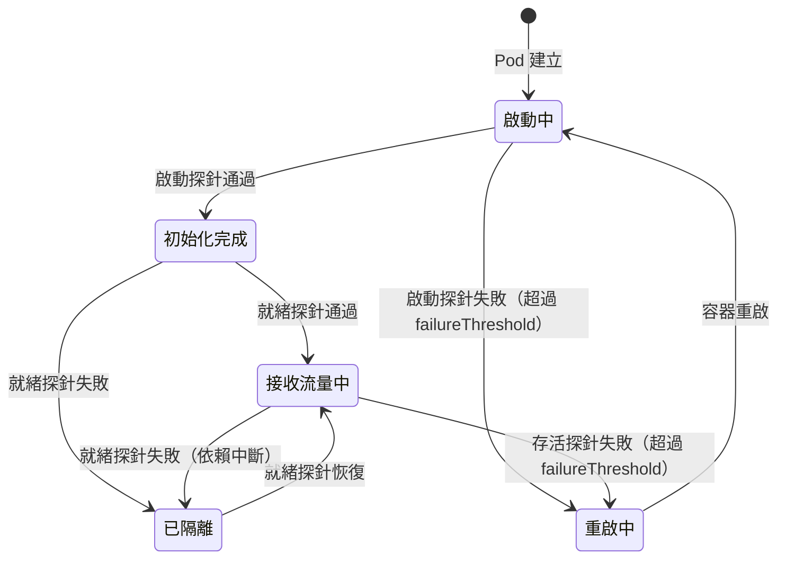

# [BEE-325] 健康檢查與就緒探針

:::info
存活探針、就緒探針與啟動探針各有不同用途。用錯探針就會造成連鎖重啟、流量中斷或故障無從察覺。
:::

## 背景

程序在運行不代表它是健康的。服務可以是「活著」的——消耗 CPU、持有開啟的檔案描述符——卻完全無法服務請求，原因可能是資料庫連線池耗盡、初始化程序從未完成，或是陷入死鎖。

Kubernetes 和現代負載平衡器提供三種探針類型來區分這些情況。Kubernetes 的權威參考是 [Liveness, Readiness, and Startup Probes](https://kubernetes.io/docs/concepts/configuration/liveness-readiness-startup-probes/)。Google 的 [Kubernetes 最佳實踐：設定健康檢查](https://cloud.google.com/blog/products/containers-kubernetes/kubernetes-best-practices-setting-up-health-checks-with-readiness-and-liveness-probes) 說明了每種探針的設計意圖。Microsoft 的[健康端點監控模式](https://learn.microsoft.com/en-us/azure/architecture/patterns/health-endpoint-monitoring)將更廣泛的健康檢查端點模式系統化。[microservices.io 健康檢查 API 模式](https://microservices.io/patterns/observability/health-check-api.html)則描述如何在服務層面應用這個模式。

## 原則

**用三個獨立的健康端點回答三個不同的問題。存活檢查程序是否活著且應繼續運行；就緒檢查程序是否準備好立即服務流量；啟動檢查初始化是否已完成。絕對不要讓存活探針去檢查外部依賴。**

## 三種探針類型

### 存活探針（Liveness Probe）

**問題：** 程序是否存活且能夠繼續執行？

若存活探針失敗，Kubernetes 會殺掉容器並啟動新的。只在程序無法自行恢復的情況下使用這個探針——例如死鎖、無限迴圈、不可恢復的內部錯誤。

存活探針絕對不能依賴外部系統。若存活探針去查詢資料庫，而資料庫當機，所有 Pod 會同時重啟，將資料庫中斷事故升級為完整的服務中斷。存活探針只檢查程序本身，而非其環境。

**檢查內容：** 程序是否有回應？事件迴圈是否存活？是否有內部死鎖？

**端點：** `GET /live` — 程序存活時回傳 200。

### 就緒探針（Readiness Probe）

**問題：** 這個 Pod 目前是否能安全地接收流量？

若就緒探針失敗，Kubernetes 會將 Pod 從 Service 的端點清單中移除，流量停止路由到該 Pod。Pod 不會被重啟——它只是被隔離，直到恢復就緒狀態。這才是檢查外部依賴的正確位置：若資料庫無法連線，就將 Pod 標記為未就緒，停止向其發送請求。

**檢查內容：** 所有必要依賴是否可達？連線池是否健康？快取是否已預熱？

**端點：** `GET /ready` — 只有在所有依賴可達且 Pod 能夠服務請求時，才回傳 200。

### 啟動探針（Startup Probe）

**問題：** 初始化是否已完成？

許多服務啟動需要大量時間：載入設定、執行資料庫遷移、預熱快取、編譯路由規則。若存活或就緒探針在初始化完成前就開始執行，它們會失敗並觸發不必要的重啟或路由錯誤。

啟動探針最先執行。在它通過之前，Kubernetes 不會執行存活或就緒探針。一旦通過，它就完成使命——啟動探針在成功後不再執行。

**檢查內容：** 應用程式是否完成了初始化序列？

**端點：** `GET /health/started`，或以較大的 `failureThreshold` 共用 `/ready`。

## Pod 生命週期與探針狀態轉換



關鍵區別：就緒探針失敗會隔離 Pod 但保持其存活；存活探針失敗則會殺掉並重啟容器。

## 健康端點設計

暴露三個職責明確的端點。

### /live — 淺層檢查

若程序存活且能回應請求，回傳 200。這個檢查的成本應接近於零——絕對不能查詢資料庫或外部服務。

```http
GET /live HTTP/1.1
```

```json
HTTP/1.1 200 OK
Content-Type: application/json

{
  "status": "ok"
}
```

只有在真正的程序層級故障（不可恢復的內部狀態）時，才回傳 `503 Service Unavailable`。

### /ready — 深層檢查

只有在所有必要依賴均可達時才回傳 200；若有任何必要依賴中斷則回傳 503。

```http
GET /ready HTTP/1.1
```

```json
HTTP/1.1 200 OK
Content-Type: application/json

{
  "status": "ok",
  "components": {
    "database": { "status": "ok", "latency_ms": 3 },
    "cache":    { "status": "ok", "latency_ms": 1 }
  }
}
```

當有依賴中斷時：

```json
HTTP/1.1 503 Service Unavailable
Content-Type: application/json

{
  "status": "degraded",
  "components": {
    "database": { "status": "ok",    "latency_ms": 4 },
    "cache":    { "status": "error", "error": "connection refused" }
  }
}
```

### /health — 可選的聚合端點

有些團隊會暴露單一的 `/health` 端點供人工查看和監控儀表板使用。這個端點可以聚合淺層與深層狀態，並包含額外的診斷資訊。Kubernetes 探針不直接使用它——探針指向 `/live` 和 `/ready`。

## 淺層與深層健康檢查

| 類型     | 範圍                       | 使用方           | 成本      |
|----------|----------------------------|------------------|-----------|
| 淺層     | 僅程序                     | 存活探針         | 接近於零  |
| 深層     | 程序 + 所有依賴             | 就緒探針         | 低        |
| 聚合     | 所有元件 + 元資料           | 儀表板、人工查看 | 不固定    |

深層檢查驗證的是連通性，而非正確性。對資料庫的就緒探針應開啟連線並執行輕量級的 ping 查詢（`SELECT 1`），而非執行業務邏輯查詢。目標是在 100ms 內偵測到無法連線的依賴。

## 與熔斷器的協作

健康檢查與熔斷器（參見 [BEE-260](260.md)）都共享依賴健康狀態的資訊，但服務的消費方不同。

當熔斷器對某個依賴開路時，就緒探針應反映這個狀態：

```
依賴無法連線
  → 熔斷器開路
  → /ready 回傳 503
  → Pod 從負載平衡器中移除
  → 不再有新請求到達該依賴
  → 熔斷器有時間恢復
  → /ready 重新回傳 200
  → Pod 重新加入負載平衡器
```

這才是正確的循環。它防止降級的 Pod 繼續接收——並失敗——請求，同時讓依賴有時間恢復。

不要將存活探針與熔斷器耦合。熔斷器開路不代表程序已失敗；它代表依賴中斷了。重啟程序不會修復依賴。

## 優雅關閉整合

當 Kubernetes 發送 `SIGTERM` 時，Pod 進入終止序列。此時就緒探針應立即開始失敗，讓負載平衡器在 Pod 關閉連線之前就停止向其路由新請求。完整的優雅降級序列請參見 [BEE-261](261.md)。

最簡化的關閉處理：

```
收到 SIGTERM
  → 將就緒狀態設為「關閉中」
  → /ready 開始回傳 503
  → 等待進行中的請求完成（排空期）
  → 關閉資料庫連線和監聽器
  → 程序退出
```

Pod spec 中的 `terminationGracePeriodSeconds` 必須長於排空期。若寬限期在排空完成前到期，Kubernetes 會發送 `SIGKILL`，進行中的請求將被強制中斷。

## 負載平衡器健康檢查整合

Kubernetes 之外的負載平衡器——ALB、NGINX、HAProxy——同樣需要健康檢查設定。負載平衡器健康檢查的細節請參見 [BEE-51](51.md)。

關鍵對齊要點：
- 負載平衡器的健康檢查 URL 應指向 `/ready`，而非 `/live`。
- 負載平衡器的間隔和逾時設定應與同一 Pod 的 Kubernetes 探針設定保持一致。
- 不健康閾值（連續失敗多少次才移除後端）應考慮到負載下的短暫延遲，避免在壓力下誤移除健康的後端。

## 常見錯誤

**1. 存活探針檢查外部依賴**

這是最危險的錯誤。若資料庫中斷，所有 Pod 的存活探針同時失敗，所有 Pod 同時重啟，重啟風暴可能導致即使資料庫恢復後服務也無法復原。存活探針只能檢查程序本身。

**2. 健康端點過於昂貴**

若 `/ready` 在每次探針呼叫時都對資料庫執行複雜查詢，恰恰是在資料庫最吃力的時候增加負載。使用輕量級 ping（`SELECT 1`）。考慮將健康結果快取短暫時間（1–2 秒），避免來自多個 Kubernetes 節點的同時探針觸發同時的資料庫往返。

**3. 未設定就緒探針**

若沒有就緒探針，Kubernetes 會在容器啟動後立即向 Pod 發送流量。若應用程式需要 10 秒初始化，最初 10 秒的流量會打到未就緒的程序並失敗。務必設定就緒探針。

**4. 存活與就緒使用相同端點**

使用 `/health` 同時作為兩種探針，意味著：(a) 探針檢查依賴，這讓它作為存活探針很危險；或 (b) 探針是淺層的，意味著就緒探針永遠偵測不到依賴故障。它們語義不同，必須是獨立的端點。

**5. 健康檢查逾時設定過短**

在壓力下，即使是健康的資料庫也可能需要 200ms 才能回應 ping。若探針的 `timeoutSeconds` 設為 1 秒，但健康檢查在正常負載下的 p99 延遲是 800ms，你就會看到間歇性的假失敗。將逾時設定為正常負載下健康檢查預期 p99 延遲的至少 3 倍。

**6. 啟動緩慢的服務缺少啟動探針**

若沒有啟動探針，存活探針會立即開始執行。若服務需要 30 秒初始化，存活探針會在它完成啟動之前就殺掉容器。對啟動緩慢的服務，使用啟動探針並設定足夠高的 `failureThreshold`。

## Kubernetes 探針設定參考

```yaml
livenessProbe:
  httpGet:
    path: /live
    port: 8080
  initialDelaySeconds: 10
  periodSeconds: 10
  timeoutSeconds: 5
  failureThreshold: 3

readinessProbe:
  httpGet:
    path: /ready
    port: 8080
  initialDelaySeconds: 5
  periodSeconds: 5
  timeoutSeconds: 5
  failureThreshold: 3

startupProbe:
  httpGet:
    path: /ready
    port: 8080
  failureThreshold: 30   # 30 × 10s = 5 分鐘啟動時間
  periodSeconds: 10
```

`failureThreshold × periodSeconds` 是探針允許持續失敗的最長時間，超過後才會採取行動。對於啟動探針，應將此設定為服務最壞情況下的初始化時間。

## 相關 BEE

- [BEE-51](51.md) — 負載平衡器健康檢查：在負載平衡器層面設定健康檢查間隔和閾值。
- [BEE-260](260.md) — 熔斷器：開路的熔斷器應如何影響就緒狀態。
- [BEE-261](261.md) — 優雅降級：協調關閉期間 SIGTERM 處理與就緒探針狀態。

## 參考資料

- [Kubernetes — Liveness, Readiness, and Startup Probes](https://kubernetes.io/docs/concepts/configuration/liveness-readiness-startup-probes/)
- [Google Cloud Blog — Kubernetes 最佳實踐：設定健康檢查](https://cloud.google.com/blog/products/containers-kubernetes/kubernetes-best-practices-setting-up-health-checks-with-readiness-and-liveness-probes)
- [Microsoft Azure Architecture Center — 健康端點監控模式](https://learn.microsoft.com/en-us/azure/architecture/patterns/health-endpoint-monitoring)
- [microservices.io — 健康檢查 API 模式](https://microservices.io/patterns/observability/health-check-api.html)
- Colin Breck，[Kubernetes Liveness and Readiness Probes: How to Avoid Shooting Yourself in the Foot](https://blog.colinbreck.com/kubernetes-liveness-and-readiness-probes-how-to-avoid-shooting-yourself-in-the-foot/)
