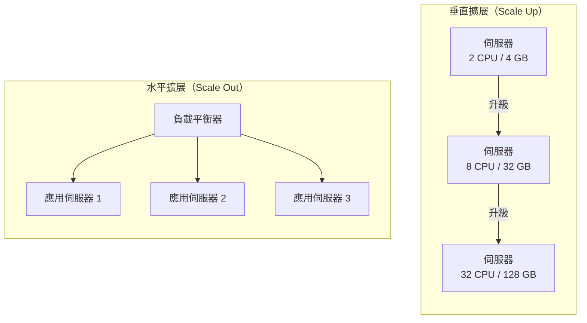

# [BEE-301] 水平 vs 垂直擴展

:::info
垂直擴展更簡單——優先選擇它。水平擴展更強大——但需要無狀態設計才能正確運作。
:::

## 背景

每個系統終究都會面臨這個問題：系統承受著負載，需要更多容量。此時有兩個選擇。你可以讓單一機器變得更大（垂直擴展，"Scale Up"），或是新增更多機器並將負載分散在它們之間（水平擴展，"Scale Out"）。這個選擇會影響成本、運維複雜度、故障模式，以及你的軟體架構是否需要改變。

Alex Xu 的《系統設計面試》（第一章，「從零擴展至數百萬用戶」）記錄了標準的演進路徑：從單一伺服器開始，耗盡垂直擴展空間，再走向水平擴展。真實系統也遵循類似的路徑。

**參考資料：**
- [Horizontal vs Vertical Scaling: Design Strategies](https://blogs.realworldbooks.academy/horizontal-vs-vertical-scaling/)
- [Shared-Nothing Architecture — Wikipedia](https://en.wikipedia.org/wiki/Shared-nothing_architecture)
- [System Design Interview Ch.1 — trunin.com](https://trunin.com/en/2022/11/system-design-interview-01-scale-from-zero-to-millions-of-users/)

## 原則

**先做垂直擴展。只有在必要時才轉向水平擴展——但從一開始就將應用設計為無狀態，確保水平擴展始終是可行的選項。**

---

## 垂直擴展

垂直擴展意味著為現有機器添加更多 CPU、RAM 或更快的磁碟。軟體不需要改變，部署方式也不需要改變，只是換一台更大的機器。

**優點：**

- 不需要任何應用程式變更。
- 無分散式系統複雜性（不需要負載平衡器、不需要考慮 session 共享問題）。
- 易於理解：單一程序、單一記憶體空間。
- 運維成本低——只需監控、修補和備份一台伺服器。

**限制：**

- 硬體上限不可突破：即使是最大的雲端實例，其 CPU 和 RAM 也有限制。
- 單點故障：一台機器宕機即意味著完全中斷服務。
- 在頂端規格時成本非線性增長——最大型實例的費用相當昂貴。
- 調整規格時可能需要停機（取決於雲端供應商和作業系統）。

垂直擴展並非死路。對許多生產環境的工作負載來說——內部工具、中等流量的 API、批次作業——一台規格合適的單一伺服器才是正確的長期答案。在耗盡更簡單的方案之前，不要急於逃往水平擴展的複雜性。

## 水平擴展

水平擴展意味著在負載平衡器後面新增更多應用程式實例。每個實例處理一部分請求。

**優點：**

- 容量幾近無限：新增廉價的商用節點，而不是為昂貴的高端硬體買單。
- 容錯性：一個節點故障不會拖垮整個系統。
- 滾動部署和零停機升級變得自然。
- 自動擴展成為可能：按需供應容量，閒置時釋放它。

**成本模型：** 個別節點便宜。在大規模下，水平擴展比垂直更經濟。但水平擴展帶來了運維開銷（服務發現、健康檢查、分散式追蹤），最關鍵的是需要無狀態的應用設計。

## 視覺化差異



## 無狀態設計：水平擴展的前提條件

如果來自同一用戶的兩個請求可能落在不同伺服器上，這些伺服器就必須能產生等效的結果。只有當伺服器本身不儲存任何相關狀態時，這才成為可能。

**「無狀態」在實踐中的意義：**

- 不在程序內部維護以用戶為鍵的 session 物件。
- 不寫入由某個請求產生、供下一個請求讀取的本地檔案。
- 不維護跨實例必須保持一致的記憶體計數器或快取。

**狀態要放到哪裡：**

| 狀態類型 | 外部化至 |
|---|---|
| Session / 驗證 Token | Redis 或 Memcached（共享快取叢集） |
| 用戶上傳 / 生成的檔案 | 物件儲存（S3、GCS） |
| 應用程式資料 | 資料庫 |
| 分散式鎖 / 協調 | Redis、ZooKeeper 或 etcd |

將狀態外部化後，每個應用伺服器都變得相同且可互換。負載平衡器可以將任何請求路由到任何實例。一個故障的實例可以靜默地被替換。這就是**無共享架構（Shared-Nothing Architecture）**：每個節點只通過網路與外部資料存儲相連；應用節點之間不共享記憶體，不共享磁碟。

**如果跳過這一步**，水平擴展就會失效：黏性 Session（Sticky Session）可以掩蓋問題，但會製造路由依賴，削弱容錯性，使自動擴展複雜化，並讓部署更加困難。

## 資料庫擴展：另一半問題

在不解決資料庫問題的情況下擴展應用層，只是把瓶頸轉移了。資料庫擴展也有自己的水平/垂直軸：

| 技術 | 方向 | 解決的問題 |
|---|---|---|
| 升級到更大的 DB 實例 | 垂直 | 所有負載，直到硬體上限 |
| 讀取副本 | 水平（讀） | 高讀取量——副本提供 SELECT 查詢服務 |
| 分片（Sharding） | 水平（寫） | 寫入吞吐量及超出單機的總資料量 |
| 連線池（PgBouncer、ProxySQL） | 運維優化 | 降低連線開銷，不是擴展策略 |

讀取副本解決了讀多於寫 10:1 或更多的常見模式。每個副本是完整的資料副本；查詢在副本間分散。寫入操作仍然流向主節點——詳見 [BEE-121](/zh-tw/Data%20Management/121) 的複製細節。

分片將資料分區至多個獨立的資料庫節點。每個分片擁有一個資料子集（按用戶 ID 範圍、哈希或地理位置劃分）。因為寫入被分散，所以寫入可以擴展。讀取需要路由到正確的分片。詳見 [BEE-123](/zh-tw/Data%20Management/123) 的分片機制。

## 擴展之旅：Web 應用範例

這是 Web 應用從原型成長到高流量的標準路徑：

```
階段 1：單一伺服器（垂直）
  - 一台機器：Web 應用 + 資料庫在同一主機
  - 適用於中等流量前
  - 進入下一階段的觸發點：CPU 或 RAM 持續高使用率

階段 2：分離應用伺服器與資料庫（垂直，分離關注點）
  - 應用伺服器和 DB 分別在獨立機器上，各自獨立調整規格
  - 進入下一階段的觸發點：讀查詢主導；SELECT 負載使 DB CPU 飆升

階段 3：新增讀取副本（水平讀）
  - 主 DB 處理寫入；N 個副本處理讀取
  - 應用連接到讀取副本池進行 SELECT 查詢
  - 進入下一階段的觸發點：應用伺服器 CPU 成為瓶頸

階段 4：在負載平衡器後面部署多台應用伺服器（水平計算）
  - 需要無狀態應用設計（Session 存於 Redis，檔案存於物件儲存）
  - Auto-Scaling 群組根據 CPU 或請求速率自動擴縮
  - 進入下一階段的觸發點：寫入吞吐量或總資料量使主 DB 達到瓶頸

階段 5：對資料庫進行分片（水平寫）
  - 資料分區至多個 DB 主節點
  - 每個分片獨立複製
  - 運維複雜度高——推遲至資料有充分證據要求時再實施
```

每個階段的觸發點都是被測量出來的，而非預判的。不要因為看起來更專業就跳到階段 4；要在階段 3 明顯不夠用時才升級。

## 自動擴展

水平擴展使自動擴展成為可能：在高負載下自動新增實例，負載下降時移除它們。

自動擴展正確運作的條件：

1. **無狀態應用** — 新實例無需預熱狀態，立即可用。
2. **快速啟動時間** — 一個需要 90 秒才能啟動的實例，對流量尖峰毫無幫助。
3. **正確的擴展指標** — CPU 很常見但可能不是最佳選擇。以請求佇列深度或回應延遲為基礎的觸發條件通常更準確。詳見 [BEE-300](/zh-tw/Performance%20and%20Scalability/300) 的容量估算和負載測試。
4. **經過負載測試的觸發閾值** — 未經實測資料設定的閾值，要麼過早擴展（浪費金錢），要麼過晚擴展（用戶已在承受降級服務）。

## 成本比較

| 維度 | 垂直 | 水平 |
|---|---|---|
| 單位成本 | 頂端規格昂貴；大型實例有顯著溢價 | 商用規格；多個小實例每單位算力更便宜 |
| 故障成本 | 故障即全面中斷 | 部分降級；負載平衡器繞過故障節點 |
| 運維成本 | 低（一台伺服器） | 較高（機群管理、負載平衡器、分散式追蹤） |
| 擴展速度 | 分鐘級（調整規格 + 重啟） | 秒級（在 LB 後啟動新實例） |
| 適合規模 | 小至中型工作負載 | 中至超大型工作負載 |

## 常見錯誤

**1. 在有狀態的伺服器上做水平擴展。**
儲存在應用記憶體中的 Session，在第二個實例出現時就會失效。用戶會隨機被登出。解法不是黏性 Session——而是在擴展前先將 Session 狀態外部化。

**2. 過早的水平擴展。**
當一台規格合適的伺服器就已足夠時，新增負載平衡器和兩台應用伺服器只會引入不必要的複雜性——需要監控兩台伺服器、維護負載平衡器、設置分散式追蹤。先測量，再決定。

**3. 擴展應用層而不考慮資料庫。**
應用伺服器擴展到十個實例；單一資料庫成為新的瓶頸。需同時規劃應用層和資料層的擴展。

**4. 未經負載測試就設置自動擴展。**
將 CPU 閾值設為 70%，但從未了解 70% CPU 對應什麼水準的用戶側延遲，這只是猜測。進行負載測試，找到延遲開始下降的點，再設定閾值。

**5. 水平實例間共享可變狀態。**
程序內快取、本地速率限制計數器和記憶體內佇列，在實例增多時都必須外部化或重新設計。每個實例各自維護一個計數器，意味著整體行為是不正確的。

## 總結

| 決策 | 指導方針 |
|---|---|
| 初期 | 垂直優先——更簡單、足夠用、無需架構變更 |
| 應用設計 | 從一開始就無狀態——讓水平擴展日後成為可能 |
| Session 儲存 | 外部快取（Redis/Memcached），絕不放在程序內部 |
| 資料庫讀取 | 在新增更多應用伺服器前，先建立讀取副本 |
| 資料庫寫入 | 只有在主節點寫入吞吐量被實測確認為瓶頸時，才進行分片 |
| 自動擴展 | 負載測試之後才設定；只在無狀態應用層時才啟用 |

## 相關 BEE

- [BEE-51 — 負載平衡器](/zh-tw/Infrastructure/51)：在水平實例間路由流量
- [BEE-121 — 複製](/zh-tw/Data%20Management/121)：資料層的水平讀取擴展
- [BEE-123 — 分片](/zh-tw/Data%20Management/123)：資料層的水平寫入擴展
- [BEE-300 — 估算](/zh-tw/Performance%20and%20Scalability/300)：了解何時需要擴展
