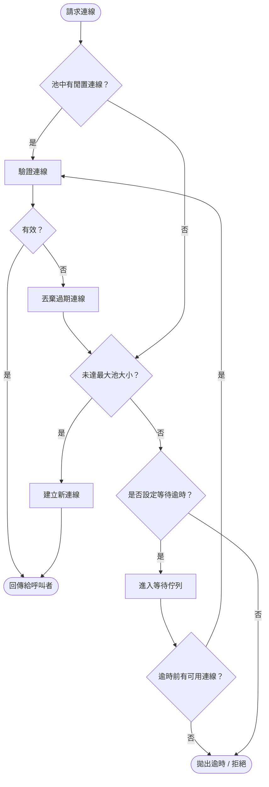

# [BEE-302] 連線池與資源管理

:::info
每一條連線都是資源。妥善地用池管理它，否則下游系統會替你發現問題。
:::

## 背景

建立一條資料庫或網路連線代價高昂：TCP 握手、TLS 協商、認證、伺服器端狀態配置，加總起來可能需要數十到數百毫秒。連線池藉由維護一組可用連線並按需借出，分攤這些開銷。

當連線池設定不當——過大、過小，或發生洩漏——症狀會在下游顯現：逾時、connection refused、OOM Kill，或跨服務的連鎖故障。正確地定義大小、驗證連線、並監控連線池，是後端工程師的核心能力。

## 原則

**為每一個資源池設定適當大小，將所有副本納入計算，使用前驗證連線，並確保在任何路徑（包含錯誤路徑）下都能歸還資源。**

## 連線池生命週期



每條連線的生命週期分五個階段：

| 階段 | 說明 |
|------|------|
| **建立 (Create)** | 建立 TCP、TLS、完成認證。在池啟動時或按需執行一次。 |
| **驗證 (Validate)** | 借出前以測試查詢或 TCP keepalive 確認連線仍有效。 |
| **使用 (Use)** | 呼叫者持有連線並執行工作。 |
| **歸還 (Return)** | 呼叫者將連線歸還至池（在 `finally` 或 `try-with-resources` 中執行）。 |
| **逐出 (Evict)** | 池淘汰超過 `maxLifetime` 或閒置過久的連線。 |

## 池大小設定

### HikariCP 公式

[HikariCP 池大小設定指南](https://github.com/brettwooldridge/HikariCP/wiki/About-Pool-Sizing)——源自 PostgreSQL 專案與 Oracle 的研究——提供了實用的起始公式：

```
connections = (core_count × 2) + effective_spindle_count
```

以 4 核心伺服器、資料主要存於 SSD（spindle count ≈ 0–1）為例：

```
connections = (4 × 2) + 1 = 9
```

核心洞見：一旦執行緒數超過 CPU 核心數，額外執行緒就會競爭 CPU 時間。I/O 等待（磁碟、網路）創造了其他執行緒可以運行的短暫視窗，這就是為什麼比核心數略多的小型池優於「每個請求執行緒一條連線」的直觀做法。Oracle 的 Real-world Performance Group 曾展示，將連線池從數百條縮減至約 96 條，回應時間從 ~100ms 降至 ~2ms——提升 50 倍。

**實務建議：**
- 以公式結果為起點，再進行壓力測試並調整。
- 優先使用固定大小的池（HikariCP 中設 `minimumIdle = maximumPoolSize`），避免突增負載下連線建立所帶來的延遲峰值。
- 始終將 `maxLifetime` 設定為比資料庫或負載平衡器連線逾時短幾秒。

### 多副本問題

池大小必須基於所有運行副本的總量計算，而非單一 Pod：

```
DB 總連線數 = Pod 數量 × 每 Pod 池大小
```

**範例——問題所在：**

```
20 個 Pod × 池大小 10 = 200 條連線到資料庫
資料庫 max_connections = 100
```

資料庫被超額訂閱 2 倍。在滿載下，每個 Pod 都在搶奪同樣的 100 條連線。資料庫開始拒絕新連線；應用程式 Pod 看到 `FATAL: remaining connection slots are reserved` 或逾時錯誤。

**解法：從 DB 限制反推。**

```
保留空間：留 10% 給管理 / 監控 = 可用 90 條連線
每 Pod 池大小 = floor(90 / 20) = 4
```

若這樣讓每個 Pod 連線數不足（每個查詢都深度排隊），答案不是加大池——而是引入外部連線池化器。

### 外部池化器（PgBouncer）

當 Pod 數量多或可變（自動擴縮）時，使用 [PgBouncer](https://www.pgbouncer.org/config.html) 等 sidecar 或共享外部池化器，可將應用程式並發度與資料庫連線數解耦：

```
20 個 Pod × 50 條客戶端連線到 PgBouncer
PgBouncer → 20 條伺服器連線到 Postgres
```

PgBouncer 在**交易模式（transaction mode）**下，可將大量客戶端連線多工至小型伺服器連線池。資料庫只看到 PgBouncer 的 `default_pool_size` 條連線。關鍵參數：

| 參數 | 用途 |
|------|------|
| `max_client_conn` | 最大前端（應用程式到 PgBouncer）連線數 |
| `default_pool_size` | 每個 (user, database) 對的伺服器連線數 |
| `reserve_pool_size` | 突增時的額外伺服器連線 |

:::warning
PgBouncer 交易模式會破壞 prepared statements 和 advisory locks。切換前請驗證應用程式相容性。
:::

## 執行緒池

執行緒池遵循相同的資源限制邏輯。差異在於執行緒是純粹的 CPU / 記憶體資源，而連線池是對外部系統的存取閘道。

大小設定指引：

- **CPU 密集型工作**：池大小 ≈ 可用 CPU 核心數。
- **I/O 密集型工作**（大多數後端服務）：池大小 ≈ `core_count × (1 + wait_time / compute_time)`。對於 90% 時間花在等待 I/O 的工作負載，池大小 ≈ 10 × 核心數。
- 無界執行緒池（Java 的 `Executors.newCachedThreadPool()`、不加控制的 goroutine 生成）對突增工作負載危險：在高負載下可能創建數千條執行緒，導致 OOM 或排程器抖動。

更多執行緒池設計細節，請參閱 [BEE-244](244.md)。

## 檔案描述符限制

每個開啟的 socket、檔案或管道都會消耗一個檔案描述符（FD）。代理伺服器、API 閘道、WebSocket 伺服器等高連線服務，很快就會耗盡 OS 預設限制。

Linux 常見預設值：
- 每行程軟限制（`ulimit -n`）：**1024**
- 每行程硬限制：**4096** 或 **65536**（視發行版而定）
- 系統全域（`fs.file-max`）：通常數百萬，鮮少成為瓶頸

對於維持 10,000 條並發連線的服務，預設軟限制 1024 明顯不足。症狀：`Too many open files` 錯誤，即使連線池有容量也無法建立新連線。

**設定方式：**

```bash
# 暫時（僅當前 session）
ulimit -n 65535

# 永久 — /etc/security/limits.conf
* soft nofile 65535
* hard nofile 65535

# systemd 服務單元
[Service]
LimitNOFILE=65535
```

容器化服務在容器規格中設定：

```yaml
# Kubernetes pod spec
# 透過容器執行時層設定 FD 限制
# (Docker: --ulimit nofile=65535:65535)
```

估算所需 FD 數的實用公式：

```
required_fds = max_connections + open_files + sockets_in_use + 緩衝空間
```

其中緩衝空間通常為計算峰值的 20–25%。

## 記憶體預算

池中每條閒置連線在應用程式端和資料庫伺服器端都會消耗記憶體：

- **PostgreSQL**：每個 backend process 約 5–10 MB（視 work_mem、shared buffers 而定）
- **MySQL/MariaDB**：每連線開銷較低，但在規模化時仍不可忽視
- **應用程式端**：HikariCP 每個連線槽保留一個連線物件 + I/O 緩衝

200 條 Postgres 連線在查詢工作記憶體配置之前，就可能在資料庫伺服器端佔用 1–2 GB 記憶體。

**預算經驗法則**：`total_pool_memory = pool_size × per_connection_memory × replica_count`。在容量規劃中，此值必須同時納入資料庫伺服器和應用程式 Pod 的資源計算。

## 資源耗盡症狀

| 症狀 | 可能原因 |
|------|----------|
| `Connection refused` | 池已耗盡，拒絕新連線；或 DB `max_connections` 已達上限 |
| 連線逾時 / 池取得逾時 | 池已耗盡，執行緒排隊時間超過 `connectionTimeout` |
| OOM Kill | 池過大（每連線記憶體 × 池大小超出容器限制） |
| `Too many open files` | FD 限制已觸及 |
| DB 空閒但查詢緩慢 | 使用了過期 / 斷線的連線，缺乏驗證機制 |
| 連線數持續攀升 | 連線洩漏——錯誤路徑未歸還連線 |

## 連線洩漏偵測

連線洩漏發生在應用程式從池取得連線後未歸還——通常發生在跳過 `finally` 或 `try-with-resources` 清理的錯誤路徑中。

**偵測機制：**

1. **HikariCP `leakDetectionThreshold`**：當連線被持有超過閾值時記錄警告。對大多數 OLTP 工作負載，設定為 2–5 秒。
2. **池指標：`active` 連線數單調遞增**而吞吐量持平——是強烈的洩漏訊號。
3. **資料庫端**：`pg_stat_activity` 顯示連線長時間處於 `idle in transaction`。

**防範模式（Java）：**

```java
// 永遠使用 try-with-resources — 即使拋出例外也能歸還連線
try (Connection conn = dataSource.getConnection()) {
    // 使用 conn
}
```

## 閒置連線管理

閒置連線在雙端佔用資源。管理策略：

- 設定 `idleTimeout`（HikariCP 預設：10 分鐘）以逐出超過閾值的閒置連線。
- 設定 `maxLifetime`（HikariCP 預設：30 分鐘）以在資料庫或網路代理強制關閉前主動回收連線，防止「過期連線」故障（飛行中的查詢碰到已關閉的 socket）。
- 資料庫端：`tcp_keepalives_idle` / `tcp_keepalives_interval` 可回收無回應的死連線。
- 對於 HTTP 和 gRPC 連線池，`keepAliveTime` 和閒置逐出設定應與上游代理 / 負載平衡器的逾時對稱配置。

## 容器化環境中的資源限制

容器在 cgroups 內運行，施加了獨立於 OS 層的記憶體和 CPU 限制。關鍵互動：

- **CPU 節流**：若 Pod 的 CPU 限制較低（例如 250m = 0.25 核心），HikariCP 公式的計算基礎應是 cgroup CPU 配額，而非節點的實體核心數。
- **記憶體限制**：在容器記憶體 request/limit 中納入每連線記憶體開銷。20 條連線每條使用 2 MB 緩衝，就會在 Pod 基礎記憶體需求上再加 40 MB。
- **暫態連線湧增**：Kubernetes 搭配 HPA 時，新 Pod 以空池啟動。在擴容期間，短暫的連線湧增可能超過 `max_connections`。以啟動探針（startup probe）將就緒狀態延遲至池初始化完成，並搭配 `minimumIdle` 預熱池來緩解此問題。

## 監控資源使用率

每個連線池應發出的關鍵指標：

| 指標 | 警報閾值 |
|------|----------|
| `pool.active`（使用中連線） | > `maximumPoolSize` 的 80% |
| `pool.pending`（等待連線的執行緒） | 持續一段時間 > 0 |
| `pool.acquisition_time_ms` | > 設定的 `connectionTimeout` × 50% |
| `pool.creation_errors_total` | 任何非零速率 |
| `fd_open_count` | > `LimitNOFILE` 的 80% |
| `db.max_connections_used` | > `max_connections` 的 80% |

建立一個顯示每個 Pod 的 `pool.active / maximumPoolSize` 的儀表板。若該值持平在 100%，代表池是瓶頸；若接近 0% 但延遲高，代表下游是瓶頸。

## 常見錯誤

1. **池過大**：更多連線不代表更高吞吐量。它意味著資料庫端更多競爭、兩端更多記憶體消耗、以及對所有人更慢的查詢。從小開始，量測後再調整。

2. **無連線驗證**：在缺乏 `testQuery` 或 `keepaliveTime` 檢查的情況下使用過期連線，會在防火牆或代理靜默關閉閒置連線時產生難以排查的錯誤。

3. **錯誤路徑中的連線洩漏**：只在正常路徑歸還連線的程式碼，會在每次例外時洩漏連線。無條件使用 `try-with-resources` 或等效機制。

4. **未計算副本數量**：對單一 Pod 看起來合理的池大小，乘以 50 個自動擴縮副本後可能造成災難。部署前務必計算 `total_connections = pool_size × max_replicas`。

5. **預設 FD 限制過低**：新服務通常在低負載下運行正常，在規模化後才神秘地失敗，原因是沒有人提高 `LimitNOFILE`。在服務建立時就加入部署清單。

## 相關 BEE

- [BEE-125](125.md) — 資料庫特定的連線池與查詢優化
- [BEE-244](244.md) — Worker 與執行緒池設計
- [BEE-262](262.md) — 逾時設定，包含池取得逾時

## 參考資料

- [HikariCP: About Pool Sizing](https://github.com/brettwooldridge/HikariCP/wiki/About-Pool-Sizing)
- [Vlad Mihalcea: The best way to determine the optimal connection pool size](https://vladmihalcea.com/optimal-connection-pool-size/)
- [PgBouncer Configuration Reference](https://www.pgbouncer.org/config.html)
- [Microsoft Azure: Connection pooling best practices for PostgreSQL](https://learn.microsoft.com/en-us/azure/postgresql/connectivity/concepts-connection-pooling-best-practices)
- [Linux file descriptor limits — nixCraft](https://www.cyberciti.biz/faq/linux-increase-the-maximum-number-of-open-files/)
- [Baeldung: Limits on the Number of Linux File Descriptors](https://www.baeldung.com/linux/limit-file-descriptors)
