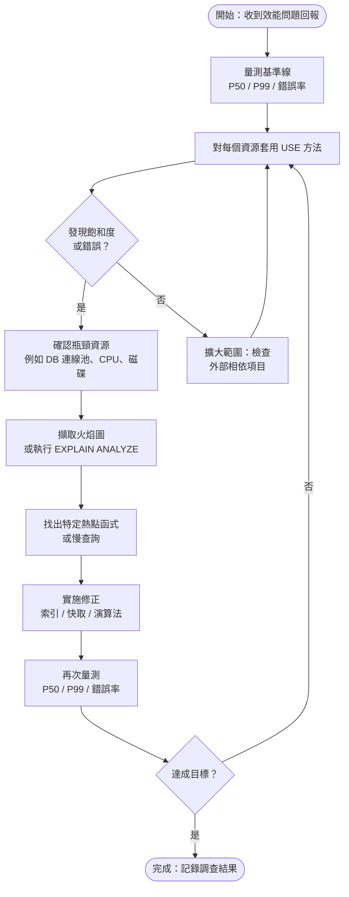

# [BEP-303] 效能剖析與瓶頸辨識

:::info
先測量，再剖析正確的對象，最後修正真正的瓶頸。
:::

## 背景

效能問題鮮少出現在你預期的地方。開發者常常將時間花在優化不到整體延遲 1% 的程式碼路徑上，而真正的瓶頸——飽和的資料庫連線池、缺少索引、阻塞的鎖——卻被忽視。

效能剖析與瓶頸辨識的目的，就是用量測取代猜測。它提供一套系統化的流程：建立基準線、找出瓶頸、以剖析工具確認、修正、驗證改善結果。

## 原則

**優化之前先測量。在動手修改任何程式碼之前，先精確地找出瓶頸所在。**

未指向真正瓶頸的優化行為，不會產生任何可觀察到的改善——這是 Amdahl's Law（阿姆達爾定律）的核心含義。

## 核心概念

### CPU 密集型 vs. I/O 密集型

當服務變慢時，首先要做的分類：

| 特徵 | CPU 密集型 | I/O 密集型 |
|---|---|---|
| CPU 使用率 | 高（接近 100%） | 低到中等 |
| 執行緒狀態 | 可執行 / 執行中 | 等待（阻塞於 I/O） |
| 常見原因 | 計算、序列化、正規表達式、加密 | 磁碟讀寫、網路呼叫、資料庫查詢 |
| 優化方向 | 演算法改進、平行化 | 快取、非同步 I/O、連線池、索引 |

一個服務可能同時具有兩種特性：熱路徑可能是 CPU 密集型，而背景工作可能是 I/O 密集型。需分別進行剖析。

### USE 方法

Brendan Gregg 提出的 **USE 方法**（[brendangregg.com/usemethod](https://www.brendangregg.com/usemethod.html)）提供了一套系統性的檢查清單，用於從基礎設施層面找出瓶頸。

對**每一個資源**（CPU、記憶體、磁碟、網路、資料庫連線池、執行緒池）：

- **使用率（Utilization）** — 資源處理工作的時間百分比？
  - 範例：資料庫連線池使用率 95%（20 條連線中有 19 條在使用）
  - 高使用率本身不是問題，但代表風險存在
- **飽和度（Saturation）** — 是否有工作因資源無法消化而在排隊？
  - 範例：新的資料庫請求開始排隊，平均等待時間達 400 ms
  - 任何非零的飽和度都是問題
- **錯誤（Errors）** — 是否有錯誤事件發生？
  - 範例：連線池拋出 `timeout acquiring connection` 例外
  - 錯誤通常在指標尚未反映之前，就已經悄悄揭示飽和的存在

由上而下逐一套用 USE 清單（CPU → 記憶體 → 儲存 I/O → 網路 → 應用程式資源），找到第一個出現非零飽和度或錯誤的資源，那就是瓶頸所在。

### 火焰圖（Flame Graph）

火焰圖（[brendangregg.com/flamegraphs](https://www.brendangregg.com/flamegraphs.html)）是堆疊追蹤樣本的視覺化呈現。剖析工具每秒中斷程式數千次，擷取呼叫堆疊，再彙總結果。

**如何閱讀火焰圖：**

- **X 軸**代表彙總的樣本數量（寬度 ∝ 耗費時間），並非依時間順序由左至右排列。
- **Y 軸**代表呼叫堆疊深度，底部是入口點，上方是被呼叫者。
- **寬條**就是熱點。塔頂的寬條代表該函式在剖析期間直接佔用 CPU 的時間比例高；中間的寬條代表其下層呼叫的累積時間很寬。
- 調查方法：找到最寬的頂層條，放大，向下閱讀呼叫鏈，了解為何該段程式碼如此熱門。

Gregg 在 ACM Queue 的文章詳細說明了這項技術：[queue.acm.org/detail.cfm?id=2927301](https://queue.acm.org/detail.cfm?id=2927301)。

### 剖析類型

| 類型 | 量測內容 | 工具範例 |
|---|---|---|
| CPU 剖析 | 程式碼執行耗時（On-CPU） | async-profiler（JVM）、pprof（Go）、py-spy（Python）、perf（Linux） |
| 記憶體 / 堆積剖析 | 記憶體分配速率、存活物件大小、GC 壓力 | async-profiler heap 模式、Valgrind、Go pprof heap |
| I/O 剖析 | 磁碟讀寫延遲與吞吐量 | iostat、eBPF、strace |
| 鎖競爭剖析 | 執行緒等待鎖定/互斥鎖的時間 | async-profiler lock 模式、jstack、執行緒 dump 分析 |
| Off-CPU 剖析 | 阻塞時間（非執行中） | eBPF off-CPU 分析、async-profiler wall-clock 模式 |

### 取樣剖析 vs. 插樁剖析

**取樣剖析（Sampling）** 以固定間隔（例如 99 Hz）中斷程式，擷取堆疊，再彙總。額外負擔低（通常 < 2%），可安全用於正式環境。代價是統計性的：可能遺漏極短暫的函式呼叫。

**插樁剖析（Instrumentation）** 在每個函式進入與離開時插入探針，能取得精確的呼叫次數與執行時間，但額外負擔可高達 10 倍。適用於預演環境，不適合正式環境。

實用準則：先在正式環境以取樣剖析找到大方向，再切換至預演環境以插樁剖析取得精確數據。

### 慢查詢分析

對於以關聯式資料庫為後端的 I/O 密集型服務，慢查詢是最常見的瓶頸。調查流程：

1. **找出慢查詢** — 啟用慢查詢日誌（MySQL：`slow_query_log`；PostgreSQL：`log_min_duration_statement`），或查詢 `pg_stat_statements` / Performance Schema。
2. **分析執行計畫** — 執行 `EXPLAIN ANALYZE <query>`，查看實際執行計畫，比對列數估計與實際值及各節點耗時。
3. **尋找全表掃描** — 在大型資料表上出現 `Seq Scan` 而非索引掃描，代表缺少索引或索引未被使用。
4. **檢查 N+1 問題** — 一次 API 呼叫觸發數百次查詢是結構性問題，不是索引問題。
5. **新增或修正索引** — 索引策略詳見 [BEP-121](../Data Management/121.md)。

### 百分位分析：P50 vs. P99

分析延遲時，必須使用百分位分布，而非平均值。

| 指標 | 含義 | 影響對象 |
|---|---|---|
| P50（中位數） | 一半的請求比此更快完成 | 「典型」使用者 |
| P95 | 95% 的請求比此更快完成 | 進階使用者、批次工作 |
| P99 | 99% 的請求比此更快完成 | 受影響最嚴重的 1% |
| P99.9 | 「尾端」—— 0.1% 的請求 | 常與重試風暴及連鎖障礙相關 |

**優化 P50 卻忽略 P99 是一個常見且危險的錯誤。** P50 為 50 ms 但 P99 為 5 秒，意味著 1% 的使用者——每小時可能多達數千人——正在經歷服務失效。

基於百分位目標的 SLO 定義，詳見 [BEP-321](../Reliability and Observability/321.md)。

### Amdahl's Law（阿姆達爾定律）

Amdahl's Law 指出，優化系統某一部分所能達到的加速，受限於該部分在整體執行時間中所佔的比例。

> 若某個元件佔整體請求時間的 5%，即使讓它快到無限快，整體效能最多只提升 5.3%。

實務含義：永遠先剖析，找出對整體延遲（P99）貢獻最大的元件，再針對該元件進行優化。優化其他元件的努力基本上是徒勞的。

## 瓶頸辨識工作流程



## 實際範例：P99 退化調查

**症狀：** 某次部署後，API 端點 `/api/orders` 的 P99 從 80 ms 上升至 2000 ms，但 P50 維持在 45 ms 不變。

**第一步 — 套用 USE 方法**

| 資源 | 使用率 | 飽和度 | 錯誤 |
|---|---|---|---|
| CPU | 30% | 無 | 無 |
| DB 連線池 | 95% | 等待佇列深度：12 | 偶發 timeout |
| 記憶體 | 55% | 無 | 無 |
| 網路 | 15% | 無 | 無 |

發現：DB 連線池呈現飽和狀態。瓶頸在資料庫，不在 CPU。

**第二步 — 找出慢查詢**

查詢 `pg_stat_statements` 並依 `mean_exec_time DESC` 排序。查詢 `SELECT * FROM order_items WHERE customer_id = $1 AND status = 'pending'` 出現，平均執行時間 1800 ms，索引掃描次數為 0。

**第三步 — 分析執行計畫**

```sql
EXPLAIN ANALYZE
SELECT * FROM order_items
WHERE customer_id = 42 AND status = 'pending';
```

輸出顯示 `Seq Scan on order_items (cost=0.00..98000 rows=850000)`。`order_items` 資料表有 850,000 筆資料，且在 `(customer_id, status)` 上沒有索引。

**第四步 — 新增索引**

```sql
CREATE INDEX CONCURRENTLY idx_order_items_customer_status
ON order_items (customer_id, status);
```

**第五步 — 再次量測**

| 指標 | 修正前 | 修正後 |
|---|---|---|
| P50 | 45 ms | 40 ms |
| P99 | 2000 ms | 95 ms |
| DB 連線池使用率 | 95% | 35% |

缺少的複合索引就是瓶頸。對 CPU 進行的任何優化都不會有可量測的效果。

## 常見錯誤

1. **未量測就優化** — 開發者憑直覺猜測瓶頸並優化了錯誤的地方。務必先測量；瓶頸幾乎不在你直覺認為的位置。

2. **優化 P50 卻忽略 P99** — 改善中位數同時忽視尾端延遲，製造了效能改善的假象。SLO 與使用者體驗是由尾端延遲決定的。

3. **只在開發環境剖析，不在正式環境剖析** — 開發環境的工作負載（小資料集、單一使用者、無並發）與正式環境有根本上的差異，瓶頸也截然不同。應使用具代表性的正式流量進行剖析。

4. **忽視 Amdahl's Law** — 花兩週時間讓一個只佔整體延遲 3% 的元件快 10 倍，最多只能帶來 3% 的改善。永遠優化貢獻最大的瓶頸。

5. **一次性剖析而非持續監控** — 今天修好的瓶頸，隨著資料量增長或流量模式改變，可能明天再度出現。持續剖析（例如 Pyroscope、Elastic APM、Datadog Continuous Profiler）提供持續的可見性。

## 相關 BEP

- [BEP-121](../Data Management/121.md) — 查詢優化的索引策略
- [BEP-125](../Data Management/125.md) — 查詢優化原則
- [BEP-320](../Reliability and Observability/320.md) — 可觀測性指標設計
- [BEP-321](../Reliability and Observability/321.md) — SLO 定義與百分位目標

## 參考資料

- Brendan Gregg, [Flame Graphs](https://www.brendangregg.com/flamegraphs.html)
- Brendan Gregg, [The USE Method](https://www.brendangregg.com/usemethod.html)
- Brendan Gregg, [The Flame Graph — ACM Queue](https://queue.acm.org/detail.cfm?id=2927301)
- Apica, [Profiling vs Tracing in OpenTelemetry](https://www.apica.io/blog/profiling-vs-tracing-in-opentelemetry/)
- Grafana, [How profiling and tracing work together](https://grafana.com/docs/grafana/latest/datasources/pyroscope/profiling-and-tracing/)
