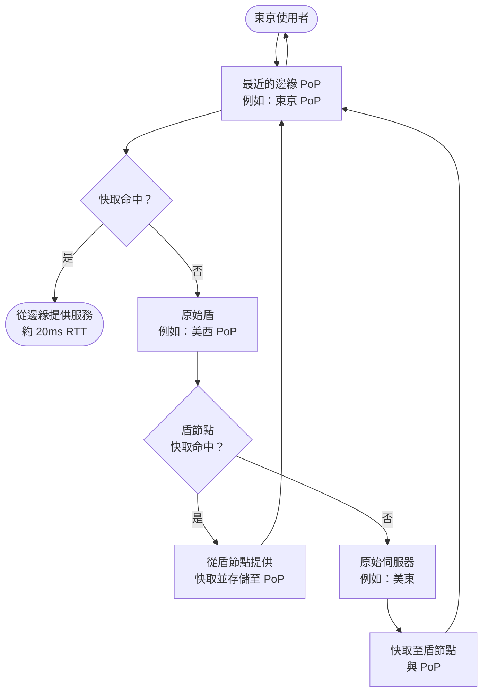

# [BEE-304] 內容傳遞與邊緣運算

:::info
將內容與運算推送至邊緣節點。縮短往返距離。盡可能從快取提供服務。
:::

## 背景

部署在單一區域的後端服務，對所有距離該區域較遠的使用者都有固定的延遲下限。從東京發出的請求前往美國東岸的原始伺服器，需要跨越約 11,000 公里。即使以光速傳播，這段往返至少需要 70 ms 的純粹傳播延遲，應用程式邏輯甚至還沒開始執行。實際上，加上 TLS 握手、排隊等待和 TCP 慢啟動，從亞洲到美國原始伺服器的冷請求往往需要 200–400 ms。

內容傳遞網路（CDN）的存在就是為了解決可快取內容的這個問題。邊緣運算進一步延伸了這個概念：不只是快取回應，而是可以在最靠近使用者的邊緣節點上執行應用程式邏輯。這兩種技術都是將工作移向使用者、遠離中央化的原始伺服器。

本原則涵蓋 CDN 的運作方式、何時有效、何時不足，以及邊緣運算如何為動態工作負載擴展其能力。

## 原則

**從最靠近使用者的網路位置提供內容。在邊緣積極快取，只有當往返原始伺服器的成本過高時，才在邊緣執行邏輯。**

## 核心概念

### CDN 架構：原始伺服器 → 邊緣 PoP → 使用者

CDN 是一個地理分散的快取伺服器網路。基本組成元件如下：

| 元件 | 職責 |
|---|---|
| **原始伺服器（Origin server）** | 內容的權威來源。所有內容均源自此處。 |
| **邊緣 PoP（接入點）** | 一個容納 CDN 邊緣伺服器的資料中心，部署在靠近終端使用者的地點。主要 CDN 在全球擁有數百個 PoP。 |
| **邊緣伺服器** | PoP 內的快取伺服器。處理使用者請求；快取命中時直接從快取提供服務；快取未命中時從原始伺服器（或原始盾）取得內容。 |
| **原始盾（Origin shield）** | 邊緣 PoP 與原始伺服器之間可選的中間快取層。將來自多個 PoP 的快取未命中請求合併為單一上游請求。 |

DNS 路由將每個使用者的請求導向地理位置最近的 PoP。該 PoP 的邊緣伺服器若有有效的快取副本（快取命中），則直接提供服務；若無有效副本（快取未命中），則向上游取得新副本。

### 快取命中與快取未命中

**快取命中（Cache hit）**：邊緣伺服器擁有有效的快取副本，立即提供服務，不需接觸原始伺服器。延遲取決於使用者到 PoP 的距離，而非使用者到原始伺服器的距離。

**快取未命中（Cache miss）**：邊緣伺服器沒有有效副本。它從原始盾（若已設定）或直接從原始伺服器取得內容，儲存後再提供服務。任何 PoP 的第一個請求必然是未命中；之後來自同一 PoP 的請求則為命中。

針對靜態內容設定良好的 CDN，**快取命中率可達 95–99%**，這意味著不到 5% 的請求會到達原始伺服器，大幅降低原始伺服器負載與流量費用。

快取存活時間由原始伺服器回應中設定的 `Cache-Control` 標頭控制。`max-age=86400` 告知 CDN（及使用者瀏覽器）在 24 小時內將該回應視為有效。

### 原始盾（Origin Shielding）

若沒有原始盾，任何 PoP 的快取未命中都會直接向原始伺服器發出請求。若 CDN 有 200 個 PoP，且有新內容發布，短時間內最多可有 200 個獨立的快取填充請求打到原始伺服器——這就是快取填充時的「雷鳴群（thundering herd）」問題。

**原始盾**在 PoP 層與原始伺服器之間插入一個指定的中間節點。所有 PoP 的快取未命中請求都通過這個單一盾節點路由。若盾節點有內容，直接提供；否則只有一個請求到達原始伺服器。這將原始伺服器負載降低的倍數大致等於 PoP 數量。

Cloudflare 將此功能稱為 **Tiered Cache** 與 **Smart Shield**；AWS CloudFront 稱之為 **Origin Shield**。各供應商的原理相同。

### CDN 用於動態內容與 API 加速

CDN 最明顯的用途是靜態資源（圖片、CSS、JS bundle、影片），但對動態內容同樣有益：

- **短期快取**：對所有使用者在 5 秒內相同的 API 回應，可設定 `Cache-Control: public, max-age=5` 讓邊緣快取。以每秒 10,000 個請求計算，可大幅減少原始伺服器呼叫次數。
- **連線重用**：CDN 與原始伺服器維持持久且預熱的 TCP 和 TLS 連線。使用者連接到最近的 PoP（低延遲 TLS 握手），CDN 則重用其長期存在的原始伺服器連線，從使用者角度消除了 TLS 建立成本。
- **協定升級**：許多 CDN 接受舊版客戶端的 HTTP/1.1，並透過 HTTP/2 或 HTTP/3 轉送請求至原始伺服器，改善原始伺服器端的多工處理與標頭壓縮。
- **壓縮與圖片優化**：部分 CDN 平台在邊緣套用 Brotli 壓縮或圖片格式轉換（WebP、AVIF），將 CPU 工作從原始伺服器卸載。

### CDN 與 TLS 終止

當 CDN 位於原始伺服器前方時，TLS 在邊緣 PoP 終止。使用者的 TLS 握手在最近的 PoP 完成（通常 < 20 ms），而非在原始伺服器完成（可能 > 200 ms）。CDN 再透過獨立的 TLS 會話連接至原始伺服器，通常使用預先建立的連線。

這意味著：
- 無論原始伺服器位置在哪，使用者都能獲得快速的 TLS 握手。
- CDN 的 TLS 憑證呈現給使用者。請確保 CDN 到原始伺服器的連線同樣加密（不要在 PoP 終止 TLS 後以明文轉送至原始伺服器）。
- 憑證輪換與密碼套件管理在 CDN 層處理。

### 邊緣運算：在邊緣執行邏輯

邊緣運算將 CDN 模型從「儲存並提供」擴展為「運算並回應」。邊緣運算平台讓你可以在 PoP 上執行程式碼，而不只是回傳快取檔案。

| 能力 | CDN（僅快取） | 邊緣運算 |
|---|---|---|
| 提供靜態檔案 | 是 | 是 |
| 短期回應快取 | 是 | 是 |
| A/B 測試 / 請求路由 | 有限 | 是（在邊緣執行路由邏輯） |
| JWT 驗證 / 認證 | 否 | 是（無需往返原始伺服器驗證 token） |
| 個人化回應 | 否 | 是（依使用者屬性在邊緣生成） |
| 即時資料聚合 | 否 | 是（有狀態的邊緣 Worker） |

範例：Cloudflare Workers、AWS Lambda@Edge、Fastly Compute@Edge。由於執行環境（V8 隔離、Wasm）在每個 PoP 都已預熱，邊緣 Worker 的冷啟動延遲通常低於 5 ms。

### 快取失效與清除

在 CDN 快取內容會帶來過期內容的問題。當你部署新版本的檔案時，現有的 CDN 快取可能持續提供舊版本，直到 `max-age` 到期為止。

處理策略：

1. **透過版本化 URL 進行快取清除（Cache busting）**：在 URL 中嵌入內容雜湊或建置版本（例如 `app.v3f2a.js`）。每次部署時 URL 都會改變，CDN 視其為新內容。舊 URL 的快取自然到期。這是靜態資源的首選方式。

2. **可變資源使用短 TTL**：對有固定更新週期的內容（例如新聞摘要），設定符合可接受過期時間視窗的 TTL。`max-age=60` 表示最多 60 秒的過期內容。

3. **CDN 清除 API**：所有主要 CDN 都提供 API，可依 URL、前綴或標籤明確使快取物件失效。在部署後對無法使用版本化 URL 的內容（例如 HTML 頁面）使用此方式。清除操作在幾秒內傳播至所有 PoP。

4. **替代金鑰 / 快取標籤**：為一組快取回應加上標籤（例如所有與某產品 ID 相關的回應）。當該產品變更時，發出單一的按標籤清除請求，同時使所有 PoP 上的相關快取回應失效。

### 多 CDN 策略

依賴單一 CDN 會造成供應商可用性依賴。CDN 中斷或降級可能導致整個面向使用者的服務下線。多 CDN 可解決此問題：

- 與兩個以上的 CDN 供應商簽訂合約。
- 使用 DNS 流量管理（例如 Route 53 健康檢查、NS1）或 CDN 協調層，即時將流量路由到效能最佳或可用性最高的 CDN。
- 監控每個 CDN 的快取命中率、錯誤率和 TTFB（首字節時間）。當某一 CDN 降級時自動切換。

多 CDN 增加了運維複雜度。最適合具有全球受眾且有嚴格可用性 SLO（> 99.99%）的服務。

## CDN 請求流程

## 實際案例：靜態網站服務全球使用者

**情境：** 一個文件網站，部署於美國東岸的單一原始伺服器，靜態資源（HTML、CSS、JS）向全球提供服務。

### 沒有 CDN

無論使用者位置，所有請求都前往美國東岸的原始伺服器。

| 使用者位置 | 往返延遲 | 備註 |
|---|---|---|
| 紐約 | ~30 ms | 靠近原始伺服器 |
| 倫敦 | ~90 ms | 跨越大西洋 |
| 東京 | ~180–220 ms | 跨越太平洋 |
| 雪梨 | ~200–250 ms | 跨越太平洋 + 路由 |

每日 10,000 個不重複訪客，70% 在北美以外 → 約 7,000 個請求/天延遲偏高。每次頁面載入觸發 20–30 個子資源請求。每日到達原始伺服器的請求總數：超過 210,000 次。

### 使用 CDN（快取命中率 97%）

東京、雪梨、法蘭克福、新加坡等地的 CDN PoP 提供快取回應。

| 使用者位置 | CDN PoP | 往返延遲 | 備註 |
|---|---|---|---|
| 紐約 | 紐瓦克 PoP | ~8 ms | 從邊緣提供 |
| 倫敦 | 倫敦 PoP | ~10 ms | 從邊緣提供 |
| 東京 | 東京 PoP | ~12 ms | 從邊緣提供 |
| 雪梨 | 雪梨 PoP | ~15 ms | 從邊緣提供 |

**延遲計算：**
- 東京（無 CDN）：200 ms × 30 個子資源 = 每次頁面載入 6,000 ms 的阻塞時間
- 東京（有 CDN）：12 ms × 30 個子資源 = 每次頁面載入 360 ms 的阻塞時間
- **改善效果：亞洲使用者頁面載入速度提升約 16 倍**

**原始伺服器負載降低：**
- 210,000 請求/天 × 3% 快取未命中 = 6,300 個請求到達原始伺服器（從 210,000 大幅降低）
- 原始伺服器流量費用同比例下降

## 常見錯誤

1. **在 CDN 快取個人化或私密內容** — 若含有使用者特定資料（帳號資訊、session token、付款明細）的回應在未設定 `Cache-Control: private` 的情況下被快取，CDN 可能將某使用者的私密資料提供給另一使用者。對於需要認證或個人化的回應，務必設定 `Cache-Control: private, no-store`，以及當回應因使用者而異時設定 `Vary: Cookie` 或 `Vary: Authorization`。

2. **沒有快取失效策略** — 在沒有版本化 URL 或清除策略的情況下部署更新內容，意味著使用者在 TTL 到期前都會收到過期的檔案。靜態資源必須使用內容雜湊檔名；HTML 頁面需要部署時清除。

3. **對所有端點不分青紅皂白地使用 CDN** — 將不可快取的高動態 API 呼叫路由經過 CDN，會增加延遲（一個額外的網路跳點），卻沒有任何快取效益，還增加費用。識別哪些端點產生可快取的回應，只對這些端點啟用 CDN 快取。對於動態端點，CDN 的透傳（Proxy）模式仍可帶來連線重用和 TLS 加速的好處，但不要對含有 `Cache-Control: no-store` 的內容支付 CDN 快取儲存費用。

4. **未設定正確的 Cache-Control 標頭** — 沒有明確的 `Cache-Control` 標頭，CDN 行為是不確定的。有些 CDN 預設積極快取（視缺少 `no-cache` 為可快取的許可）；有些則拒絕快取。務必對每個回應設定明確的 `Cache-Control` 標頭：可快取內容使用 `public, max-age=N`，敏感內容使用 `private, no-store`。

5. **單一 CDN 沒有備援方案** — CDN 現在是基礎設施的關鍵元件。單一 CDN 架構意味著 CDN 中斷就會導致網站下線。實作健康監控，針對高可用性需求考慮多 CDN，並確保原始伺服器在 CDN 被繞過時能承擔全部流量。

## 相關 BEE

- [BEE-55](55.md) — 反向代理模式
- [BEE-200](200.md) — 快取原則
- [BEE-205](205.md) — HTTP 快取標頭
- [BEE-301](301.md) — 水平與垂直擴展

## 參考資料

- Cloudflare, [Content Delivery Network (CDN) Reference Architecture](https://developers.cloudflare.com/reference-architecture/architectures/cdn/)
- Cloudflare, [What is a CDN edge server?](https://www.cloudflare.com/learning/cdn/glossary/edge-server/)
- Cloudflare, [Smart Shield — Origin shielding](https://www.cloudflare.com/application-services/products/smart-shield/)
- Bunny.net, [What Is CDN Caching and Cache HIT Ratio?](https://bunny.net/academy/cdn/what-is-cdn-caching-and-cache-hit-ratio/)
- Fastly, [Serving Dynamic Content with a Modern CDN](https://www.fastly.com/blog/serving-truly-dynamic-content-with-a-modern-cdn-and-edge-first-delivery)
- Gcore, [CDN Evolution: From Static Content to Edge Computing](https://gcore.com/blog/cdn-evolution)
- Wikipedia, [Content delivery network](https://en.wikipedia.org/wiki/Content_delivery_network)
