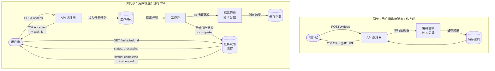

# [BEP-305] 非同步處理與工作佇列

:::info
將耗費資源的操作移出請求路徑。立即回應，在背景執行，讓用戶端能夠觀察進度。
:::

## 背景

每個 HTTP 請求從抵達的那一刻起，直到回應送出為止，都會佔用一個執行緒（或一個 goroutine、一個連線槽）。對於在 100 ms 以內完成的請求，這沒有問題——執行緒很快就會被釋放，可供下一個請求使用。但對於觸發長時間執行工作的請求——編碼影片、產生 PDF、傳送 50,000 封電子郵件、執行機器學習推論任務——讓用戶端等待會造成嚴重問題。

上傳影片的使用者不應該對著旋轉圓圈等待五分鐘，等待編碼管線完成。處理批次匯入的伺服器不應該讓 HTTP 連線維持開啟達十分鐘。發送電子郵件的 API 不應該在逐一連接 50 台 SMTP 伺服器時，讓呼叫端服務一直等待。

非同步處理透過解耦「接受工作」的時刻與「執行工作」的時刻來解決這個問題。伺服器立即確認請求，將工作放入佇列，然後釋放連線。一個或多個背景工作者（worker）獨立於 HTTP 請求生命週期之外，從佇列取出並執行工作。

本文涵蓋何時選擇非同步而非同步、核心工作佇列模式、任務類型、狀態追蹤、優先級排序、延遲執行、重試、冪等性、扇出（fan-out）模式，以及請求—回覆輪詢模式。

## 原則

**卸載不需要在回應送出前完成的工作。同步接受工作；非同步執行工作；給用戶端一種觀察結果的方式。**

## 核心概念

### 同步 vs. 非同步請求處理

在同步處理中，伺服器在 HTTP 請求的同一流程中完成所有工作。用戶端在整個過程中等待。

在非同步處理中，伺服器驗證請求、將任務描述符持久化到佇列，然後立即回傳——通常是 HTTP `202 Accepted` 加上一個 `task_id`。用戶端可以透過輪詢任務端點，或在工作完成時接收 webhook 回呼，來確認狀態。

| 維度 | 同步 | 非同步 |
|---|---|---|
| 回應時間 | 長（阻塞於所有工作） | 短（接受後立即回傳） |
| 執行緒使用率 | 執行緒在整個任務期間被佔用 | 執行緒立即釋放 |
| 長任務的 UX | 旋轉圓圈，有逾時風險 | 進度輪詢或通知 |
| 錯誤可見性 | 錯誤顯示在 HTTP 回應中 | 錯誤顯示在任務狀態中 |
| 冪等性需求 | 視操作而定 | 必須（重試會發生） |

對快速操作（用戶端立即需要結果）使用同步處理，例如使用者認證、商品查詢、加入購物車。對緩慢、資源密集或依賴外部服務的操作使用非同步處理，因為這些情況下維持連線開啟並不合理。

### 工作佇列模式

基本構成單元是**生產者—佇列—消費者**模型：

1. **生產者**（API 處理器）驗證傳入的請求，並將任務描述符加入佇列：一個小型的可序列化記錄，包含工作者需要的所有資訊（任務類型、參數、詮釋資料、唯一冪等性金鑰）。
2. **佇列**（持久化訊息代理器：Redis、RabbitMQ、SQS 或資料庫支援的佇列表）儲存任務，並確保至少一次傳遞給且僅一個消費者。
3. **消費者 / 工作者**（獨立的程序或執行緒池）從佇列取出任務、執行它們，並記錄結果。

生產者和消費者是解耦的。生產者不知道哪個工作者會執行任務，也不知道何時執行。工作者不知道是哪個生產者將任務加入佇列。這種解耦允許獨立擴展生產者和消費者。

### 任務類型

| 類型 | 描述 | 範例 |
|---|---|---|
| **Fire-and-forget（發後不管）** | 呼叫端不需要知道結果 | 傳送歡迎電子郵件 |
| **附輪詢** | 呼叫端可以透過任務端點查詢狀態 | 影片編碼任務 |
| **附回呼** | 伺服器在完成時推送結果至 webhook | Stripe 付款 webhook |
| **排程 / 延遲** | 任務在未來某個時間或依週期執行 | 在註冊 24 小時後傳送提醒 |

大多數工作佇列系統支援所有四種類型。輪詢是最普遍適用的，因為它不需要用戶端公開回呼端點。

### 任務狀態追蹤

對於純 fire-and-forget 以外的任何任務類型，系統都必須記錄並公開任務狀態。用戶端需要區分「等待中」、「處理中」、「已完成」和「失敗」。

最小任務記錄結構：

| 欄位 | 類型 | 用途 |
|---|---|---|
| `task_id` | UUID | 回傳給呼叫端的唯一識別碼 |
| `type` | string | 任務類型（如 `video.encode`） |
| `status` | enum | `pending`、`processing`、`completed`、`failed` |
| `created_at` | timestamp | 任務被接受的時間 |
| `updated_at` | timestamp | 最後狀態轉換時間 |
| `result` | JSON | 成功時的輸出資料 |
| `error` | string | 失敗時的錯誤訊息 |
| `attempts` | integer | 執行嘗試次數 |

用戶端輪詢 `GET /tasks/{task_id}`，直到 `status` 達到終止狀態（`completed` 或 `failed`）。對輪詢間隔使用指數退避，以避免頻繁打狀態端點。

### 任務優先級排序

並非所有任務的緊急程度都相同。對所有工作一視同仁的佇列，會讓低優先級的批次任務排擠掉時間敏感的操作。任務優先級排序透過為每個優先等級維護獨立佇列，並優先引導工作者至較高優先級佇列來實現。

常見的優先等級：

- **關鍵**：即時操作。密碼重設電子郵件、雙因素認證碼。目標延遲：秒級。
- **高**：使用者主動觸發的互動工作。報表產生、文件匯出。目標延遲：數十秒。
- **一般**：背景處理。圖片縮放、資料豐富化。目標延遲：分鐘級。
- **低**：批量或大批次工作。分析聚合、批次匯出。目標延遲：可接受數小時。

工作者按優先級順序輪詢佇列：先檢查關鍵佇列；若為空，再檢查高優先級佇列；依此類推。這確保大量低優先級任務不會延誤關鍵任務。

### 延遲與排程任務

有些工作不應立即執行，而是在指定的未來時間執行。例如：在註冊 3 天後傳送後續追蹤郵件；在 30 分鐘後重試失敗的 API 呼叫；每天 02:00 UTC 執行清理任務。

兩種常見實作方式：

1. **延遲可見性**：任務以 `not_before` 時間戳記加入佇列。代理器在該時間之前讓它保持不可見，之後才使其對工作者可用。SQS 訊息延遲和 Celery 的 `eta` 參數就是這樣運作的。
2. **排程器程序**：一個獨立的排程器程序（類似 cron）在設定的時間將任務發送到佇列。佇列工作者在取出任務後立即執行。對於週期性任務，這種方式更容易理解。

### 重試與冪等性

工作者會失敗。網路呼叫會逾時。下游服務會回傳 503。一個健壯的任務佇列必須支援帶有退避的自動重試。

**重試策略：**

- 失敗時，將任務標記為可重試，並以指數增長的延遲重新加入佇列：30 秒、2 分鐘、8 分鐘、30 分鐘、2 小時。
- 設定最大重試次數（如 5 次）。耗盡重試次數的任務移至**死信佇列（DLQ）**。
- 為重試間隔加入隨機抖動（jitter），以防止多個任務同時失敗時產生重試風暴。

**對於重試的任務，冪等性是必要條件。** 如果工作者執行了一個任務，成功完成了工作，但在確認佇列之前崩潰——佇列將重新傳遞該任務。工作者必須能夠處理重複執行而不產生副作用。

設計冪等任務的方式：

- 使用唯一的 `idempotency_key`（從原始請求衍生）來偵測並跳過重複執行。
- 將副作用設計為 upsert（更新插入）而非 insert（插入）。
- 在修改狀態之前檢查前提條件（如「若尚未完成編碼」）。

### 死信佇列

DLQ 是一個獨立的佇列，任務在耗盡所有重試次數後會進入這裡。它的用途有幾個：

- 防止永久失敗的任務阻塞佇列容量。
- 為所有失敗提供持久化記錄，用於審計和事件調查。
- 在修復底層問題後，允許手動檢查、重播或丟棄失敗的任務。

將 DLQ 深度作為警報訊號來監控。不斷增長的 DLQ 代表存在系統性的錯誤或無法使用的下游依賴。

### 扇出：一個任務觸發多個

有些操作需要對許多工作單元進行平行處理。單一的「發送電子報」請求不應該在一個任務中處理 10 萬個訂閱者。取而代之的是使用**扇出**模式：

1. 為高層級操作加入一個協調器任務（如 `newsletter.dispatch`，batch_id: 42）。
2. 協調器取出任務、讀取目標列表，並為每個目標（或每個小批次）加入一個子任務。
3. 獨立的工作者平行處理子任務。
4. 一個可選的聚合器任務收集結果，並將父任務標記為完成。

扇出提供自然的平行性，隔離各項目的失敗（一個訂閱者的電子郵件失敗可以重試，不會影響其他人），並將負載分散到所有可用的工作者。

### 背壓與佇列上限

如果生產者將任務加入佇列的速度超過工作者的處理速度，佇列會無限增長。在記憶體支援的佇列中（如程序內的任務佇列，或無限制的 Redis 列表），這會導致記憶體耗盡崩潰或串聯式失敗。

透過以下方式施加背壓：

- 設定最大佇列深度。當佇列已滿時，向生產者回傳 `HTTP 503 Service Unavailable`，並附帶 `Retry-After` 標頭，而非接受無法處理的工作。
- 監控佇列深度和工作者使用率。當深度超過閾值時，佈建額外的工作者（自動擴展）。
- 使用持久化的外部代理器（Redis、SQS、RabbitMQ）而非程序內佇列，以確保程序重啟不會遺失所有已排隊的工作。

請參閱 [BEP-225](../Resilience and Reliability/225.md) 了解背壓模式。

## 同步 vs. 非同步處理流程



## 實際範例：影片上傳 API

**情境：** 使用者上傳影片。根據長度和解析度，編碼需要 2–8 分鐘。API 必須保持回應能力。

### 同步（不應這樣做）

```
POST /videos
→ [使用者等待 5 分鐘]
→ 200 OK { "url": "https://cdn.example.com/v/abc123.mp4" }
```

問題：nginx 預設 60 秒後 HTTP 逾時。連線槽被佔用 5 分鐘。沒有進度可見性。如果工作者在編碼中途崩潰，用戶端收到 500 且無法恢復。

### 非同步（正確做法）

**步驟 1 — 提交**

```
POST /videos
Content-Type: multipart/form-data
[影片檔案位元組]

→ 202 Accepted
{
  "task_id": "t_7kXm2p9q",
  "status": "pending",
  "poll_url": "/tasks/t_7kXm2p9q"
}
```

API 處理器驗證上傳內容、儲存原始檔案，並將一個 `video.encode` 任務加入佇列。在 200 ms 以內回傳。

**步驟 2 — 輪詢（提交後立即）**

```
GET /tasks/t_7kXm2p9q

→ 200 OK
{
  "task_id": "t_7kXm2p9q",
  "status": "processing",
  "progress": 34,
  "created_at": "2026-04-07T10:00:00Z",
  "updated_at": "2026-04-07T10:02:14Z"
}
```

**步驟 3 — 輪詢（幾分鐘後）**

```
GET /tasks/t_7kXm2p9q

→ 200 OK
{
  "task_id": "t_7kXm2p9q",
  "status": "completed",
  "result": {
    "url": "https://cdn.example.com/v/abc123.mp4",
    "duration_s": 182,
    "resolution": "1920x1080"
  },
  "created_at": "2026-04-07T10:00:00Z",
  "updated_at": "2026-04-07T10:05:47Z"
}
```

**步驟 4 — 失敗情況**

```
GET /tasks/t_7kXm2p9q

→ 200 OK
{
  "task_id": "t_7kXm2p9q",
  "status": "failed",
  "error": "Unsupported codec: av1 with HDR requires ffmpeg >= 6.0",
  "attempts": 3,
  "created_at": "2026-04-07T10:00:00Z",
  "updated_at": "2026-04-07T10:08:01Z"
}
```

用戶端可以向使用者呈現有意義的錯誤並提供重試選項。

### 工作者實作（偽程式碼）

```python
def process_video_encode_task(task):
    # 冪等性檢查
    if video_already_encoded(task.idempotency_key):
        mark_task_completed(task.id, existing_result)
        return

    # 更新狀態為處理中
    update_task_status(task.id, "processing")

    try:
        # 執行工作
        output_url = encode_video(task.args.raw_file_path)
        store_output(task.args.video_id, output_url)

        # 標記完成
        mark_task_completed(task.id, {"url": output_url})

    except RetryableError as e:
        # 以退避重新加入佇列；尚不標記為失敗
        schedule_retry(task, delay=backoff(task.attempts))

    except PermanentError as e:
        # 耗盡重試次數或無法恢復——標記失敗
        mark_task_failed(task.id, str(e))
        send_to_dlq(task)
```

## 常見錯誤

1. **讓所有事情都非同步** — 非同步為快樂路徑增加了延遲（輪詢往返），增加了系統複雜度，並使除錯變得更困難。快速操作（< 500 ms）且用戶端立即需要結果的，應維持同步。將非同步保留給真正緩慢、資源密集或依賴外部服務的工作。

2. **沒有任務狀態可見性** — 回傳 `202 Accepted` 但不提供檢查結果的方式，讓用戶端無法偵測失敗或對結果採取行動。用戶端關心的每個非同步操作都必須有可查詢的狀態端點。Fire-and-forget 只適用於真正單向的通知（如分析事件、稽核日誌）。

3. **任務佇列沒有死信處理** — 沒有 DLQ，耗盡所有重試次數的任務會無聲無息地消失。沒有稽核記錄、沒有警報，也沒有辦法在修復問題後重播它們。請務必將耗盡的任務路由到 DLQ，並對 DLQ 深度設置警報。

4. **任務不具冪等性** — 至少一次傳遞是工作佇列的常態：如果工作者在處理後、確認前崩潰，任務可能被傳遞超過一次。如果你的任務不具冪等性（例如，無條件插入一列資料或向信用卡收費），每次重複傳遞都會產生重複的副作用。請設計任務，使其能夠以相同的輸入安全地執行多次。

5. **無限制的佇列深度** — 如果工作者池無法跟上生產者的速度，佇列會無限增長。記憶體佇列會填滿並使程序崩潰；外部佇列會累積大量積壓。監控佇列深度。當深度超過可接受的閾值時，施加背壓（拒絕或減慢生產者）。需要持續吞吐量時，擴展出更多工作者。

## 相關 BEP

- [BEP-220](../Messaging and Event-Driven/220.md) — 訊息傳遞與事件驅動架構
- [BEP-221](../Messaging and Event-Driven/221.md) — 死信佇列
- [BEP-225](../Resilience and Reliability/225.md) — 背壓模式
- [BEP-241](../Concurrency and Async/241.md) — 工作者池

## 參考資料

- Microsoft Azure, [Best Practices for Background Jobs](https://learn.microsoft.com/en-us/azure/architecture/best-practices/background-jobs)
- Microsoft Azure Well-Architected Framework, [Recommendations for developing background jobs](https://learn.microsoft.com/en-us/azure/well-architected/design-guides/background-jobs)
- Full Stack Python, [Task Queues](https://www.fullstackpython.com/task-queues.html)
- Celery Project, [Tasks — Celery documentation](https://docs.celeryq.dev/en/stable/userguide/tasks.html)
- LittleHorse, [Integration Patterns IV: Retries and Dead-Letter Queues](https://littlehorse.io/blog/retries-and-dlq)
- DEV Community, [Queue-Based Exponential Backoff: A Resilient Retry Pattern for Distributed Systems](https://dev.to/andreparis/queue-based-exponential-backoff-a-resilient-retry-pattern-for-distributed-systems-37f3)
- DEV Community, [Designing a Job Queue System: Sidekiq and Background Processing](https://dev.to/sgchris/designing-a-job-queue-system-sidekiq-and-background-processing-2oln)
