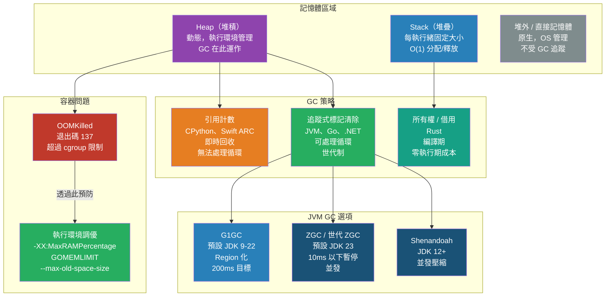

# [BEE-495] 記憶體管理與垃圾回收

:::info
每個後端執行環境都透過以下三種策略之一回收記憶體：引用計數、追蹤回收或編譯期所有權；每種方式在吞吐量、延遲與可維運性上都有截然不同的代價，其重要性不亞於演算法的選擇。
:::

## 背景

記憶體管理的問題往往在出現之前都是隱形的。一個 Java 服務在 full GC 期間暫停 400 ms、一個 Go binary 在流量高峰後堆積翻倍且永遠不歸還給 OS、一個 Python 進程因引用循環而洩漏記憶體——這些都不是理論問題，而是 Kubernetes 生產環境中導致非預期延遲尖峰與 OOMKilled 的最主要原因。

這個問題從早期高階語言就已存在。John McCarthy 在 1960 年的 Lisp 論文中描述了第一個標記清除（mark-and-sweep）回收器；引用計數則出現在早期的 ALGOL 衍生語言中。此後六十年間，這個領域產出了大量理論成果，並集大成於 Richard Jones、Antony Hosking 與 Eliot Moss 合著的《The Garbage Collection Handbook》（2011 年，2023 年第二版），是從業者的權威參考。

現代後端工程師通常使用三種在設計上根本不同的執行環境：JVM（追蹤式、世代制，有長期影響生產環境的 GC 暫停歷史）、Go（三色並發標記清除，目標是次毫秒級的 STW）、CPython（引用計數加輔助循環回收器）。Rust 則透過編譯期所有權完全消除了 GC。這些選擇不僅影響峰值吞吐量，更影響尾延遲、容器配置與生產可觀測性。

OOMKilled（Linux OOM killer，退出碼 137）是與記憶體相關的最常見生產故障，發生在容器超過 cgroup 記憶體限制時。理解所使用執行環境的分配與回收生命週期，是防止這類問題的前提。

## 記憶體區域

每個進程主要有兩個記憶體區域：

**Stack（堆疊）**：每個執行緒固定大小（通常 1–8 MB），由 CPU 以 LIFO 方式管理，存放堆疊框架、區域變數與返回位址。分配與釋放為 O(1) 指標運算。Stack overflow（無限遞迴）會導致進程立即崩潰。

**Heap（堆積）**：動態大小，由執行環境或分配器管理，存放生命週期超出單一函式呼叫的物件。Heap 分配較慢，且執行環境需追蹤物件存活狀態。所有 GC 策略都作用於 Heap。

Go 的 goroutine 初始堆疊僅 2–8 KB 並可動態伸縮，這也是 Go 能支援數百萬並發 goroutine 而執行緒做不到的關鍵原因。

## GC 策略家族

### 引用計數（Reference Counting）

每個物件維護一個指向它的引用計數器，當計數器歸零時立即釋放記憶體。

**使用者**：CPython、Swift（ARC）、PHP、Perl

**優點**：可預測的增量式回收；暫停時間低；物件可即時析構。

**根本限制**：無法回收循環引用。若 A 引用 B、B 引用 A，即使兩者都無法從程式根節點抵達，計數器也永遠不會歸零。CPython 為此加入輔助的循環 GC（三代制），當分配數減去釋放數超過閾值時觸發（可透過 `gc.set_threshold` 設定）。

CPython 3.12 引入四代循環回收器，並為常用常數加入「immortal」物件類別，降低多執行緒程式中不必要的引用計數變動。CPython 3.13 新增實驗性無 GIL 模式，需要不同的引用計數策略。

```python
import gc

# 查看 CPython GC 閾值（每代觸發的新物件數量差值）
print(gc.get_threshold())  # 預設：(700, 10, 10)

# 強制執行完整循環 GC
gc.collect()

# 診斷洩漏：存活多次回收的第 2 代物件
print(len(gc.get_objects(generation=2)))
```

### 追蹤式（Tracing / Mark-and-Sweep）

回收器週期性地從根節點集合（堆疊變數、全域變數、暫存器）遍歷物件圖，標記所有可達物件，再清除不可達的物件。循環引用可自然處理，因為可達性而非引用計數決定存活狀態。

**使用者**：JVM、Go、.NET CLR、V8（Node.js）、Ruby（YJIT 時代）

**世代假說**：大多數物件都死得年輕。將 Heap 分為年輕代（短命物件，頻繁回收）與老年代（長命物件，偶爾回收）可大幅降低回收開銷。JVM 的世代設計（Eden → Survivor → Old）正是此假說的體現。

#### JVM GC 演進

| 回收器 | 預設版本 | 暫停模型 | 目標場景 |
|---|---|---|---|
| Serial GC | JDK 1 | 全暫停（Stop-the-world） | 單核、嵌入式 |
| CMS | JDK 6 | 大多並發 | 低延遲（JDK 9 棄用，JDK 14 移除） |
| G1GC | JDK 9 | Region 化、有界暫停 | 通用（預設 JDK 9–22） |
| ZGC | JDK 21（穩定） | 目標 10ms 以下；世代 ZGC | 低延遲、大堆積 |
| Shenandoah | JDK 12 | 10ms 以下、並發壓縮 | Red Hat 的 ZGC 替代方案 |

**G1GC** 將 Heap 分成等大的 Region（1–32 MB），優先回收垃圾最多的 Region（"Garbage First"），透過 `-XX:MaxGCPauseMillis` 控制暫停目標（預設 200 ms），是目前大多數服務的實務預設選擇。

**世代 ZGC**（JDK 23 預設）透過幾乎完全與應用執行緒並發的方式進行回收，達到 10ms 以下暫停。Load barrier 攔截指標讀取，確保 mutator 始終看到一致的 Heap 狀態。ACM 的 GC Guide（Dann Fröberg 與 Mikael Vidstedt，2022）顯示 ZGC 在大堆積工作負載上比 G1GC 降低 p99 暫停時間達 75%。

```bash
# G1GC 調優（合理的起始點）
-XX:+UseG1GC
-XX:MaxGCPauseMillis=100
-XX:G1HeapRegionSize=16m
-Xms4g -Xmx4g          # 相等的最小/最大值，避免 Heap 調整暫停
-XX:MaxRAMPercentage=75.0   # 容器感知：使用 cgroup 限制的 75%

# 啟用 GC 日誌以供生產可觀測性使用
-Xlog:gc*:file=/var/log/app/gc.log:time,uptime:filecount=5,filesize=20m
```

LinkedIn Engineering（Cuong Chi 與 Mingfeng Zhou，2013）記錄了透過從 CMS 遷移至 G1GC 並針對物件大小分布進行 Region 大小調優，將服務層 p99.9 延遲從 100 ms 降至 60 ms 的過程。

#### Go GC

Go 使用三色並發標記清除回收器。三色不變式（白色 = 未知、灰色 = 已發現但子節點尚未掃描、黑色 = 已完整掃描）允許回收器在不完全暫停應用的情況下並發執行。Stop-the-world 階段存在，但僅限於堆疊掃描，通常在微秒級別。

**`GOGC`**（預設 100）控制 GC 觸發條件：當存活 Heap 從上次回收後成長了 `GOGC%` 時觸發下一次 GC。`GOGC=50` 使觸發閾值減半（更頻繁的 GC，較低峰值記憶體）；`GOGC=200` 使其加倍（較少 GC，較高峰值記憶體，較高吞吐量）。

**`GOMEMLIMIT`**（Go 1.19+，容器中至關重要）設定軟性記憶體上限。GC 會在 OOM killer 介入前更積極地執行，以維持在上限以內。設為容器記憶體限制的約 90%：

```bash
# Dockerfile / Kubernetes 環境變數
GOMEMLIMIT=1800MiB   # 對於 2 GiB 容器限制
GOGC=100             # 保持預設觸發條件
```

Go 的逃逸分析（escape analysis）在編譯期決定變數應留在 Stack 還是必須分配至 Heap。逃逸的變數（函式返回後仍被引用、被閉包捕獲、存入介面）會分配至 Heap。使用 `go build -gcflags="-m"` 檢查逃逸決策，減少不必要的 Heap 壓力。

```bash
# 診斷 Go Heap 使用
go tool pprof http://localhost:6060/debug/pprof/heap

# 查看分配熱點
go tool pprof -alloc_space http://localhost:6060/debug/pprof/alloc
```

### 編譯期所有權（Rust）

Rust 透過所有權與借用檢查器在編譯期強制記憶體安全——無 GC、無引用計數（除非明確使用 `Rc<T>` / `Arc<T>`）、無執行期開銷。

每個值有且僅有一個擁有者（owner）。當擁有者離開作用域時，值被丟棄（釋放）。借用（引用）具有編譯器靜態驗證的生命週期。編譯器拒絕包含 use-after-free、double-free 或資料競態（data race）模式的程式。

結果是確定性的零開銷記憶體管理——代價是更陡峭的學習曲線與嚴格的編譯關卡。Rust 適用於 GC 暫停不可接受的延遲敏感服務。

## 堆外記憶體（Off-Heap）與直接記憶體

某些工作負載在 GC 管理的 Heap 之外分配記憶體：

- **Java `ByteBuffer.allocateDirect()`**：分配原生記憶體（native memory），不被 Heap 追蹤。Netty 的 `PooledByteBufAllocator` 將其用於 I/O 緩衝。不受 GC 管理，當關聯的 `Cleaner` 執行時才釋放。直接記憶體洩漏不會出現在 Heap 指標中，只能透過原生記憶體工具（`NativeMemoryTracking`、`jcmd`）發現。
- **Go `cgo` 分配**：透過 C 程式庫分配的記憶體不受 Go GC 追蹤。
- **mmap**：檔案映射記憶體由 OS 分頁快取管理，不受語言執行環境管理。

堆外分配繞過了 GC 開銷，但需要手動管理生命週期。直接記憶體洩漏可在 Heap 使用量看似正常的情況下導致容器被 OOMKilled。

## 容器配置與 OOMKilled

`OOMKilled`（退出碼 137）發生於 Linux OOM killer 終止超過 cgroup 記憶體限制的進程。這是 Kubernetes 環境中最常見的記憶體生產故障。

**MUST（必須）為所有容器設定記憶體限制。** 若無限制，記憶體洩漏或調優不當的服務可能耗盡節點記憶體，引發連鎖驅逐。

**MUST（必須）配置執行環境以感知容器：**

| 執行環境 | 配置 | 建議 |
|---|---|---|
| JVM | `-XX:MaxRAMPercentage=75.0` | 使用 cgroup 限制的 75% 作為 Heap；其餘用於 Metaspace、堆外記憶體、OS |
| Go | `GOMEMLIMIT=<限制的 90%>` | 軟性上限；Go GC 會在 OOM 前積極執行 |
| Node.js | `--max-old-space-size=<MB>` | 設為容器限制的約 75% |
| Python | 無執行期旗標；使用記憶體分析 | `tracemalloc`、`memory_profiler` |

**MUST NOT（不得）在容器中依賴 JVM 預設 Heap 配置。** Java 8u191 / Java 10 之前，JVM 讀取主機總記憶體（`/proc/meminfo`）而非 cgroup 限制，可能嘗試分配超過容器限制的 Heap，在啟動或首次 GC 週期時立即觸發 OOMKilled。務必設定 `-XX:MaxRAMPercentage=75.0` 或明確的 `-Xmx`。

## 視覺化



## 常見錯誤

**在容器中執行 JVM 服務時未設定 `-XX:MaxRAMPercentage`**。JVM 預設依據主機記憶體配置 Heap。在一台 128 GiB 主機上的 2 GiB 容器限制中，JVM 可能嘗試分配 32 GiB Heap，立即觸發 OOMKilled。務必設定 `-XX:MaxRAMPercentage=75.0` 或明確的 `-Xmx`。

**設定相等的 `-Xms` 與 `-Xmx` 卻不理解其含義**。相等的最小/最大值可避免 Heap 調整暫停（這是有效的生產優化），但意味著 JVM 在啟動時即從 OS 申請所有記憶體，即使工作負載閒置也是如此。在記憶體受限的環境中，較低的 `-Xms` 可能更合適，但需承受啟動期間的調整暫停。

**在 Go 服務中忽略 `GOMEMLIMIT`**。Go 在沒有記憶體限制的情況下，預設允許 Heap 無限增長直至 OS 耗盡資源。在容器中，這意味著 OOM killer 在 GC 有機會回收前就會介入。`GOMEMLIMIT` 是安全網——為所有部署在容器中的 Go 服務設定其為容器限制的 90%。

**以為 Heap 記憶體指標就是全貌**。直接記憶體（Java NIO、Netty）、映射檔案、執行緒堆疊與原生程式庫分配都會消耗 RSS，卻不出現在 Heap 指標中。容器可能在 Heap 使用量看似正常的情況下被 OOMKilled。在生產環境中監控 RSS，而非只看 Heap。

**在沒有先分析的情況下調優 GC 參數**。在建立 GC 日誌與分析資料的基準線之前就修改 `-XX:MaxGCPauseMillis`、`GOGC` 或 GC 世代大小，只是猜測。先測量 GC 暫停時間與分配速率，再帶著明確目標進行調優。

**建立過多 goroutine 或執行緒**。Goroutine 雖然輕量（初始堆疊 2 KB），但建立數百萬個持有閉包捕獲的長命 goroutine，會因堆疊記憶體與閉包物件而造成 Heap 壓力。使用 Worker Pool（BEE-244）來限制並發數量。

## 相關 BEE

- [BEE-240](../Concurrency/240.md) -- 執行緒 vs 進程 vs 協程：goroutine 與執行緒的記憶體成本；OS 執行緒堆疊 vs goroutine 堆疊
- [BEE-244](../Concurrency/244.md) -- 生產者-消費者與 Worker Pool 模式：透過限制 goroutine/執行緒數量控制記憶體壓力
- [BEE-303](303.md) -- 分析與瓶頸識別：pprof、async-profiler、py-spy 用於 Heap 與分配分析
- [BEE-364](../CI,CD and DevOps/364.md) -- 容器基礎：cgroup 記憶體限制、OOMKilled、容器資源模型

## 參考資料

- [Dann Fröberg and Mikael Vidstedt. ZGC: The Next Generation Low-Latency Garbage Collector — ACM SIGPLAN (2022)](https://dl.acm.org/doi/10.1145/3538532)
- [Cuong Chi and Mingfeng Zhou. Garbage Collection Optimization for High-Throughput and Low-Latency Java Applications — LinkedIn Engineering (2013)](https://engineering.linkedin.com/garbage-collection/garbage-collection-optimization-high-throughput-and-low-latency-java-applications)
- [A Guide to the Go Garbage Collector — Go Team](https://tip.golang.org/doc/gc-guide)
- [Richard Jones, Antony Hosking, Eliot Moss. The Garbage Collection Handbook — Chapman & Hall/CRC (2011)](https://www.gchandbook.org)
- [The Rust Programming Language: Understanding Ownership — rust-lang.org](https://doc.rust-lang.org/book/ch04-01-what-is-ownership.html)
- [OOMKilled in Kubernetes: The Hidden Memory Leaks You're Missing — UnixArena (2025)](https://unixarena.com/2025/04/oomkilled-in-kubernetes-the-hidden-memory-leaks-youre-missing.html)
