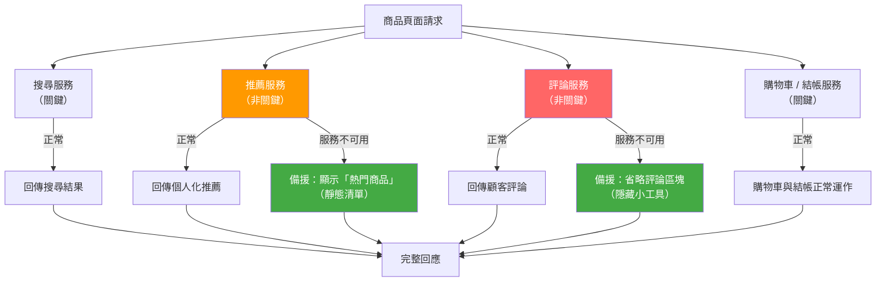

# [BEP-264] 優雅降級

:::info
當元件發生故障時，提供縮減但仍有用的功能。識別關鍵與非關鍵功能，為每項功能定義備援方案，讓系統優雅地降級而非全面失敗。
:::

## 背景

生產系統從來不是「完全正常」或「完全故障」兩種極端。真實的故障模式是局部的：某個依賴服務變慢、某個外部 API 回傳錯誤、某個資料庫副本落後於主節點。系統如何回應這些局部故障，決定了使用者是感受到輕微不便，還是遭遇完全服務中斷。

最直觀的做法是全有全無：只要頁面需要的任何依賴無法使用，就回傳 503。這種做法實作簡單、邏輯清楚，但會讓每個頁面和其最不可靠的依賴一樣脆弱。在一個商品頁面同時依賴推薦、評論、庫存查詢和結帳服務的系統中，評論服務的短暫故障會導致所有商品頁面失敗——即使對沒有往下捲到評論區的使用者也是如此。

優雅降級的原則是：**當元件故障時，系統應繼續提供縮減但仍有用的功能**，而非完全失敗。這需要有意識的設計：清楚哪些功能是關鍵的（缺少它們，頁面就無法完成其目的），哪些功能是非關鍵的（有了更好，但使用者可以在沒有它們的情況下繼續），以及每項非關鍵功能的備援方案是什麼。

Microsoft Azure Well-Architected Framework 在[自我修復與自我保護架構策略](https://learn.microsoft.com/en-us/azure/well-architected/reliability/self-preservation)中描述了此模式。Netflix 多年來在大規模系統中應用優雅降級：當個人化服務無法使用時，他們改為顯示全域熱門片單而非回傳錯誤——詳見 [Netflix Tech Blog](https://netflixtechblog.com/a-microscope-on-microservices-923b906103f4)。

## 原則

**將服務的每項功能分類為關鍵或非關鍵。為每項非關鍵功能定義具體的備援方案。當依賴故障時，提供備援而非讓整個回應失敗。讓降級狀態對呼叫方和維運人員可見。**

## 降級層級

設計優雅降級的第一步，是為你的服務建立降級層級：依重要性排序的功能清單。

| 層級 | 說明 | 故障行為 |
|---|---|---|
| 關鍵 | 沒有此功能，回應即無法達成其目的。 | 故障時對呼叫方回傳錯誤。 |
| 重要 | 顯著提升回應品質；使用者會察覺其缺失。 | 提供過期的快取資料或降低品質的版本。 |
| 非關鍵 | 增加價值；大多數使用者仍可繼續操作。 | 提供靜態預設值或完全省略。 |
| 盡力而為 | 錦上添花；缺席不影響使用者。 | 在任何壓力下靜默丟棄。 |

降級層級是產品與工程共同的決策，而非純技術決策。以電商商品頁為例：商品名稱、價格及加入購物車功能是**關鍵**的；庫存數量是**重要**的（使用者想知道是否有貨，但快取或近似數值仍優於無資料）；顧客評論是**非關鍵**的（使用者不需要讀評論也能購買）；個人化推薦是**盡力而為**的（屬於商品行銷功能，而非核心功能）。

明確記錄此層級清單。它將指導斷路器備援方案（BEP-260）、艙壁分區大小（BEP-263）以及待命值班的分流決策。

## 降級策略

### 提供過期或快取資料

當即時資料來源無法使用時，從快取回傳最後一次已知正確的值，並附上 TTL 過期資訊。這是品質最高的備援方案：資料是真實的，只是可能過時。

在 header 或回應欄位中標示資料的過期狀態，讓呼叫方可以決定如何呈現。若商品頁面顯示的是 4 小時前的庫存數量，理想情況下應顯示「有庫存（數小時前更新）」，而非未加說明的「有庫存」。

### 靜態備援

回傳安全的硬編碼預設值。推薦小工具降級為每天計算一次並靜態儲存的「前 10 大熱門商品」。使用者個人簡介降級為通用的「歡迎回來」訊息。備援方案個人化程度較低，但資料是正確的。

### 停用功能

若非關鍵功能沒有合理的備援方案，則完全從回應中省略。無法載入的評論區塊應從頁面 HTML 中缺席——而非被一個阻礙版面的轉圈動畫或錯誤訊息取代。當評論服務停止回應時，商品的 API 回應可以直接省略 `reviews` 欄位；API 消費方應被設計為能優雅處理選填欄位缺失的情況。

### 降低品質

回傳較低精確度的版本。無法產生個人化縮圖的圖片服務，回傳標準解析度的預設圖片。高負載下的搜尋服務回傳前 20 筆結果而非 100 筆。即時定價服務在計算能力不足時，回傳上次計算的價格而不做即時匯率換算。

### 部分回應

回傳可取得的資料，並標注缺少的部分。呼叫四個服務的聚合 API，在其中一個服務無法使用時，可回傳部分回應，而非讓整個呼叫失敗。

```json
{
  "product": { ... },
  "inventory": { "count": 12, "stale": true, "stale_age_seconds": 3600 },
  "reviews": null,
  "recommendations": { "items": [...], "source": "popular_fallback" },
  "_degraded": ["reviews"],
  "_degraded_reason": { "reviews": "reviews_service_unavailable" }
}
```

部分回應要求消費方能處理降級後的資料結構。請在 API 規格中定義部分回應的契約；不要在執行期間讓消費方感到意外。

## 降級流程



當推薦服務降級時，使用者看到的是熱門商品而非個人化推薦——品質下降，但非錯誤。當評論服務完全無法使用時，評論小工具被隱藏。搜尋和結帳作為關鍵功能，不受任何一項故障影響。

## 功能旗標作為即時關閉開關

功能旗標（見 BEP-363）是優雅降級的操作槓桿。相較於需要重新部署才能在高負載下停用非關鍵功能，關閉開關旗標讓維運人員可以在幾秒內停用功能。

```
feature.recommendations.enabled = false
feature.reviews.enabled = false
feature.live_inventory.enabled = false   # 降級為快取庫存數量
```

關閉開關與 A/B 測試旗標不同。其目的不是實驗，而是受控的緊急降級。在非關鍵功能上線至生產環境**之前**，就應設計好關閉開關。

Netflix 的動態設定系統正是採用此方法——屬性值在執行期間從分散式設定存放區輪詢取得，屬性變更時觸發回呼，實現近乎即時的降級而無需重啟服務。

## 主動降級：負載削減

在持續過載的情況下，被動降級（依賴故障時提供備援）是不夠的。**負載削減**是主動降級：刻意拒絕或降低低優先權工作的處理量，以保護高優先權工作。

依優先權分類入站請求：

| 優先權 | 範例 | 高負載行為 |
|---|---|---|
| 關鍵 | 結帳、身份驗證 | 絕不削減；必要時回傳 429 |
| 重要 | 搜尋、商品瀏覽 | 僅在極端負載下削減 |
| 非關鍵 | 推薦更新、分析資料寫入 | 優先削減 |
| 背景 | 報表產生、重新索引任務 | 立即削減；稍後重試 |

當服務偵測到請求佇列深度或錯誤率超過閾值時，開始以 HTTP 429 或適當的應用程式錯誤碼拒絕非關鍵請求，並在可能的情況下回傳 `Retry-After` header。關鍵請求繼續被正常服務。

## 實際案例

**場景：** 電商商品頁面服務，每次請求需聚合四個下游服務的資料。

| 功能 | 服務 | 重要性 | 備援方案 |
|---|---|---|---|
| 商品資訊（名稱、價格、圖片） | 商品目錄 | 關鍵 | 無——讓頁面失敗 |
| 庫存數量 | 庫存服務 | 重要 | 最後快取數量（TTL：1 小時） |
| 顧客評論 | 評論服務 | 非關鍵 | 省略評論區塊 |
| 個人化推薦 | 推薦服務 | 盡力而為 | 靜態「前 10 大熱門商品」 |

**正常運作時：** 四個服務全部回應；完整頁面渲染。

**評論服務停止回應：**

- 商品資訊：正常回傳。
- 庫存數量：正常回傳。
- 評論：斷路器（BEP-260）開路；觸發備援；評論區塊從回應中省略。回應 metadata 加入 `_degraded: ["reviews"]`。
- 推薦：正常回傳。
- 結果：使用者看到商品資訊、庫存和推薦。沒有評論區塊，但也沒有錯誤。頁面主要使用者行為（購買）完全正常。

**高負載時（CPU 和佇列深度上升）：**

- 維運人員啟用關閉開關 `feature.recommendations.enabled = false`。
- 即時庫存查詢改用快取數量；啟用 `feature.live_inventory.enabled = false`。
- 評論服務已停止；無變動。
- 結果：每次請求減少兩個對外呼叫，服務恢復穩定。使用者看到商品資訊和快取庫存。推薦和評論均缺席。

## 優雅降級 vs. 優雅關機

兩者名稱相似但概念不同。

| 概念 | 適用時機 | 發生什麼 |
|---|---|---|
| 優雅降級 | 元件在執行期間局部故障 | 服務以縮減功能繼續運作 |
| 優雅關機 | 服務程序正在被停止 | 服務在退出前排空進行中的請求 |

優雅關機（BEP-278）確保部署或重啟期間進行中的請求被完整完成或安全移交。優雅降級確保運行中的服務在局部依賴故障時不會引發級聯失敗。兩者都是必要的，互不替代。

## 常見錯誤

### 1. 全有全無的故障處理

只要任何依賴故障就回傳 503，等同於把所有功能都視為關鍵，失去了非關鍵功能隔離的優勢。結果是評論服務停機導致商品頁面全部失敗。

### 2. 沒有降級層級

若團隊未事先決定哪些功能是關鍵的、哪些是非關鍵的，每位工程師在事故中會做出不同的判斷。一位工程師的「跳過推薦呼叫後繼續」是另一位工程師的「拋出例外並讓請求失敗」。在事故發生之前就應明確記錄降級層級。

### 3. 降級從未被測試

備援程式碼路徑在正常運作中很少被執行。備援邏輯中的錯誤只在真實事故中才會被發現——恰好是系統已經承受壓力的時候。在整合測試和混沌工程演練中（BEP-265）測試每條備援路徑。模擬評論服務停機；確認評論區塊是缺席的，而不是損壞的。

### 4. 過期資料在沒有標注的情況下提供

在沒有說明資料年齡的情況下提供快取庫存數量，會誤導使用者。看到基於六小時前資料的「庫存 23 件」的使用者，可能和看到「庫存 23 件（快取中）」的使用者做出不同的購買決策。在回應中標注降級資料。UI 如何呈現此標注是產品決策；對 API 消費方隱瞞此資訊則不可接受。

### 5. 備援方案本身有依賴

呼叫另一個服務的備援方案引入了第二個故障點。查詢「熱門商品」資料庫服務的推薦備援方案，其可用性僅等同於該資料庫的可用性。盡可能設計無依賴的備援方案：記憶體中的靜態資料、本地檔案，或嵌入在設定中的值。

## 相關 BEP

- **BEP-260**（斷路器模式）——斷路器在依賴故障時觸發降級；BEP-264 定義備援方案的內容
- **BEP-263**（艙壁模式）——艙壁按依賴隔離資源；當分區滿載時，優雅降級決定回傳什麼
- **BEP-266**（速率限制與節流）——速率限制作為入站流量的負載削減形式
- **BEP-363**（功能旗標）——降級期間用於停用非關鍵功能的即時關閉開關

## 參考資料

- Microsoft Azure Well-Architected Framework, *Architecture strategies for self-healing and self-preservation*, learn.microsoft.com/en-us/azure/well-architected/reliability/self-preservation
- RisingStack Engineering, *Designing a Microservices Architecture for Failure*, blog.risingstack.com/designing-microservices-architecture-for-failure/
- Netflix Technology Blog, *A Microscope on Microservices*, netflixtechblog.com/a-microscope-on-microservices-923b906103f4
- Michael Nygard, *Release It! Design and Deploy Production-Ready Software*, 2nd ed., Pragmatic Programmers (2018) — Chapter 4: Stability Patterns
- Google SRE Book, *Handling Overload*, sre.google/sre-book/handling-overload/
