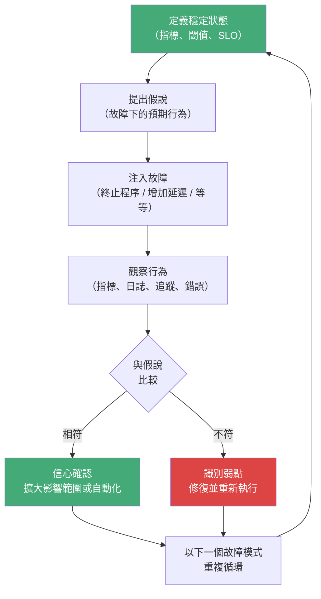

# [BEE-265] 混沌工程原則

:::info
透過主動注入故障來建立對系統韌性的信心。定義穩定狀態、提出假說、注入故障、觀察系統行為，並根據所學採取行動。
:::

## 背景

分散式系統的故障方式難以預測。兩個資料中心之間的網路分割、緩慢的資料庫副本、開始回傳 500 錯誤的第三方相依服務——這些都不會出現在單元測試中，大多數也不會顯現，直到系統在真實使用者的生產負載下運行為止。在生產事故中第一次發現這些故障模式的團隊毫無準備：他們從未演練過該故障、不知道系統的影響範圍，也未驗證監控是否能顯示正確的訊號。

傳統的因應方式是撰寫更多測試並加強告警。兩者都必要，但不夠充分。測試在已知條件下驗證行為；生產環境在未知條件下失敗。告警是在事情已經出錯之後才通知你。

**混沌工程**是一門在真實事故發生前，透過主動向系統注入受控故障，以建立對系統韌性的實證信心的學科。與其寄望系統能在副本故障中存活，混沌實驗能證明它確實可以——或揭示它無法做到，而且是在受控的環境中，讓工程師能夠在影響範圍有限時觀察並回應。

這個詞彙由 Netflix 在 2010 年遷移至 AWS 後正式確立，當時他們需要驗證系統能否在 AWS 大規模環境中常見的基礎設施故障中存活。他們的工具 [Chaos Monkey](https://netflix.github.io/chaosmonkey/) 會在生產環境中隨機終止 EC2 執行個體，確保每個服務都被設計為能承受執行個體遺失。這份工作的原則後來被整理在 [principlesofchaos.org](https://principlesofchaos.org/)。

Gremlin 描述這門學科為「在故障演變成停機之前，透過受控的故障注入與系統觀察，主動識別潛在故障的紀律性方法」。疫苗的比喻很貼切：你引入一個弱化版本的故障，讓系統——以及操作它的團隊——建立免疫力。

## 原則

**在生產環境告訴你系統脆弱之前，混沌工程先告訴你。定義正常狀態、假設系統在故障下應有的行為、刻意注入該故障、觀察實際發生的情況，並修補假說與現實之間的落差。**

## 四大核心原則

出自 [principlesofchaos.org](https://principlesofchaos.org/)：

### 1. 圍繞穩定狀態行為建立假說

實驗從「正常」的定義開始。穩定狀態不是沒有錯誤——它是一個可測量、可觀察的輸出，表明系統正在實現其目的：請求成功率高於 99.9%、p99 延遲低於 200ms、訂單處理吞吐量超過每分鐘 500 筆。你衡量的不是內部元件是否健康；你衡量的是系統是否對使用者提供了價值。

沒有穩定狀態的定義，就沒有實驗——只有隨機的破壞。如果你沒有定義「沒有問題」是什麼樣子，你就無法判斷注入故障是否造成了問題。

### 2. 模擬真實世界的事件

混沌實驗應模擬在生產環境中實際發生的故障。不是理論上可能的故障——而是統計上可能發生的故障。依影響程度與頻率排定優先順序：

- 基礎設施：執行個體終止、可用區故障、容器 OOM 強制終止
- 網路：延遲注入（50ms、200ms、1000ms）、封包遺失、連線中斷、DNS 故障
- 應用程式：程序終止、執行緒耗盡、相依服務逾時、回傳損壞資料
- 資源：CPU 飽和、磁碟已滿、記憶體壓力、檔案描述子耗盡
- 時間：節點間的時鐘偏移（會破壞分散式共識與 JWT 驗證）

從你實際遭遇過的故障開始。如果事後分析歷史顯示過去一年有三次資料庫容錯移轉事件，那就是第一個要設計的實驗。

### 3. 在生產環境中執行實驗

只在測試或 QA 環境中執行的混沌實驗價值有限。測試環境的流量是合成的；生產環境的流量是真實的。生產環境有測試環境沒有的狀態：熱快取、活躍連線、真實使用者的工作階段、上季與測試環境配置已發生差異的部署設定。真正重要的故障模式是在真實條件下才浮現的那些。

這並不意味著要魯莽地在生產環境執行混沌實驗。從受控的影響範圍開始。識別哪些小比例的生產流量或哪些非關鍵環境（單一區域、金絲雀部署、特定租戶）可以承受實驗。隨著信心增長，逐漸擴大範圍。

### 4. 自動化實驗並持續執行

手動混沌實驗會退化成每季一次、產出遞減的混沌演練日。系統會改變——新服務被加入、相依關係改變、設定漂移。一月份證明韌性的實驗，可能無法反映系統七月的當前拓撲。

自動化實驗以排程執行。Netflix 在生產環境中持續運行 Chaos Monkey。這門學科從「我們舉辦了一次混沌演練日」演進為「系統持續受到驗證」。當自動化實驗失敗時，它會在問題演變成生產事故之前，先行浮現一個退化情況。

## 穩定狀態假說

穩定狀態假說是混沌實驗的核心產出物。它必須在實驗執行前就寫好，而不是事後推斷。

一個完整的假說包含三個部分：

1. **正常的衡量指標**：「在正常條件下，使用者個人檔案服務的 p99 讀取延遲低於 80ms，成功率高於 99.95%。」
2. **注入的條件**：「三個資料庫讀取副本中的一個被終止。」
3. **預期行為**：「讀取流量在 5 秒內重新分配至剩餘的兩個副本。延遲短暫上升，但在 30 秒內恢復到 80ms 以下。在容錯移轉期間及之後，API 呼叫方不會出現錯誤。」

如果觀察到的行為符合假說，實驗就增加了你對系統的信心。如果不符合——如果延遲持續偏高、出現錯誤，或者容錯移轉花了 90 秒而不是 5 秒——實驗就揭示了一個真實的弱點，應在生產環境真正失敗之前修復。

## 影響範圍控制

影響範圍（Blast Radius）是混沌實驗在情況比預期更糟時可能產生的影響範圍。控制它是讓混沌工程足夠安全以在生產環境執行的實踐。

| 階段 | 影響範圍 | 使用時機 |
|---|---|---|
| 沙盒 | 隔離的測試環境，無真實流量 | 學習工具、初次實驗 |
| 金絲雀 | 1–5% 的生產流量，單一執行個體 | 第一次生產實驗 |
| 區域 | 單一可用區或區域 | 金絲雀實驗穩定後 |
| 全生產 | 所有流量、所有區域 | 僅用於成熟的自動化實驗 |

從能產生有意義訊號的最小影響範圍開始。僅在以下情況時擴大：

- 實驗在當前範圍已穩定執行多次
- 確認監控能捕捉到被測試的故障模式
- 已備妥並測試過回滾或中止機制

中止機制不是可選的。每個混沌實驗都需要一個停止條件：一個可觀察的訊號（錯誤率超過 1%、p99 延遲超過 500ms），在實驗演變成真實事故之前自動停止它。

## 故障注入的類型

### 程序層級

- **終止程序**：向服務程序或容器發送 SIGKILL 或 SIGTERM
- **CPU 壓力**：在節點上消耗 80–100% 的 CPU，模擬失控的程序
- **記憶體壓力**：分配記憶體直到觸發 OOM 強制終止，或主機開始使用交換空間

### 網路層級

- **延遲注入**：為網路呼叫添加人工延遲（tc netem、Toxiproxy）
- **封包遺失**：丟棄網路介面上一定比例的封包
- **頻寬限速**：限制吞吐量以模擬飽和的網路連結
- **DNS 故障**：對服務探索查詢回傳 NXDOMAIN

### 相依服務層級

- **相依服務逾時**：導致下游服務回應緩慢或完全不回應
- **相依服務錯誤**：導致下游服務回傳 500 回應
- **損壞資料**：回傳語法正確但語義錯誤的回應

### 基礎設施層級

- **磁碟已滿**：填滿可用磁碟空間，觸發日誌輪替故障、寫入錯誤
- **時鐘偏移**：將系統時鐘前進或後退，以破壞分散式鎖定、令牌過期或領導者選舉
- **執行個體終止**：在不排清連線的情況下，從池中移除 VM 或容器

## 混沌工程循環

這個循環不是一次性的演練。每次迭代要麼確認信心，要麼揭示弱點。兩種結果都有價值。

## 混沌演練日（Game Day）

混沌演練日是一種計畫性、有引導的混沌演練，跨職能團隊——工程師、SRE、產品經理——共同參與注入故障並觀察系統。混沌演練日的目的與自動化實驗不同：

- **團隊學習**：待命工程師演練他們在生產環境中從未見過的故障場景
- **流程驗證**：在接近真實的條件下測試操作手冊、升級路徑和事故回應程序
- **溝通對齊**：產品與工程團隊就哪些降級可以接受、什麼構成事故達成一致
- **複雜場景**：難以自動化的多服務故障場景（例如跨三個服務的級聯故障）可以透過人工協調執行

混沌演練日不能取代自動化實驗，自動化實驗也不能取代混沌演練日。先從混沌演練日開始建立團隊熟悉度，然後將演練日揭示為最具持續執行價值的實驗自動化。

## 混沌工程成熟度模型

| 等級 | 描述 | 特徵 |
|---|---|---|
| 0 — 臨時 | 無結構化的混沌實踐 | 故障只在生產事故中被發現 |
| 1 — 手動 | 偶爾進行手動實驗 | 混沌演練日、手動故障注入、有限的文件記錄 |
| 2 — 定義 | 可重複的實驗流程 | 穩定狀態假說已記錄、影響範圍受控、結果有記錄 |
| 3 — 自動化 | 實驗按排程執行 | CI/CD 整合、自動化穩定狀態監控、實驗庫 |
| 4 — 持續 | 混沌作為正常運營的一部分 | 生產混沌持續開啟、退化偵測、與 SLO 監控整合 |

大多數團隊從第 1 級開始，應在啟動後 12–18 個月內以第 3 級為目標。第 4 級適合具有完善 SLO 實踐的成熟平台團隊（[BEE-321](321.md)）。

## 實際範例

**假說**：「如果三個 PostgreSQL 讀取副本中的一個被終止，讀取流量將在 5 秒內轉移到剩餘的副本。在容錯移轉期間，讀取延遲會上升，但 p99 仍保持在 150ms 以下。API 呼叫方的錯誤率仍低於 0.1%。」

**實驗設定**：
- 影響範圍：非生產區域中承擔 10% 讀取流量的一個資料庫副本
- 監控：Datadog 儀表板顯示 p99 延遲、錯誤率、副本連線數
- 停止條件：錯誤率 > 1% 觸發自動實驗中止
- 參與者：兩位工程師觀察，一位有權限中止

**執行**：於 14:02:00 透過雲端控制台終止 replica-3。

**觀察結果**：
- 14:02:01 — PgBouncer 健康檢查將 replica-3 從連線池中移除
- 14:02:03 — p99 讀取延遲飆升至 210ms（超過假說閾值 150ms）
- 14:02:08 — 隨著連線重新分配，p99 延遲恢復至 65ms
- 14:02:00 – 14:02:15 — 錯誤率：0.04%（在假說閾值內）
- API 呼叫方未出現錯誤

**發現**：容錯移轉在 8 秒內完成（假說說 5 秒）。延遲峰值超過了 150ms 的假說閾值。系統恢復正常，但延遲 SLO 短暫被違反。行動方案：調查連線池排清時間是否可以縮短，並更新假說以反映觀察到的 8 秒容錯移轉窗口。

**結果**：系統在錯誤率方面通過；在延遲閾值方面未通過。識別到弱點（連線池排清速度），已排定修復計畫。假說更新後，實驗晉升為每週自動執行。

## 常見錯誤

### 1. 生產環境的混沌實驗沒有影響範圍控制

第一次嘗試就對所有生產流量執行實驗。當範圍受控時，混沌工程是安全的。從單一執行個體、金絲雀部署或低流量時間窗口開始。在執行前確立停止條件。只在有證據支持時才擴大範圍。

### 2. 沒有穩定狀態的定義

在沒有先定義「健康」是什麼樣子的情況下注入故障，會產生雜訊，而不是訊號。如果你在實驗前無法用量化的方式描述預期行為，你就無法客觀地評估結果。永遠要先定義穩定狀態。

### 3. 沒有監控的混沌

在你的監控無法觀察到其效果時注入故障，比沒有混沌工程更糟——它會帶來虛假的信心。在執行任何實驗之前，驗證你的儀表板、告警和追蹤能夠捕捉到你正在注入的特定故障模式。如果磁碟填滿而沒有告警觸發，這是一個需要先修復的監控缺口。

### 4. 在混沌演練日之前急於自動化混沌

在沒有人工理解故障模式的情況下自動化混沌，會造成停機，而不是學習。先舉辦混沌演練日。建立團隊對故障如何傳播的直覺。記錄你觀察到的情況。將團隊充分理解、能夠自動評估的實驗自動化。

### 5. 不修復混沌所揭示的問題

識別出弱點卻沒有產生任何行動項目的混沌實驗，只是表演。混沌工程的價值在於回饋循環：實驗揭示弱點、弱點被修復、重新執行實驗確認修復、實驗晉升到自動化套件。如果實驗被執行但發現結果未被採取行動，這個實踐就失去了可信度，團隊也會失去繼續的動力。

## 相關 BEE

- [BEE-260](260.md)（斷路器模式）— 斷路器透過終止下游相依服務的混沌實驗來驗證：斷路器是否打開？流量是否切換到備援方案？
- [BEE-261](261.md)（優雅降級）— 降級的備援路徑需要被測試；混沌實驗確認當相依服務故障時，備援路徑能正確啟用
- [BEE-321](321.md)（基於 SLO 的告警）— SLO 提供使混沌假說精確的量化穩定狀態定義；錯誤預算定義在生產環境執行實驗的可接受成本

## 參考資料

- Principles of Chaos Engineering，*principlesofchaos.org*，https://principlesofchaos.org/
- Netflix，*Chaos Monkey*，https://netflix.github.io/chaosmonkey/
- Gremlin，*Chaos Engineering Guide*，https://www.gremlin.com/chaos-engineering/
- Casey Rosenthal 與 Nora Jones，*Chaos Engineering: System Resiliency in Practice*，O'Reilly Media（2020）
- Netflix Technology Blog，*5 Lessons We've Learned Using AWS*，netflixtechblog.com/5-lessons-weve-learned-using-aws-1f2a28588e4c
