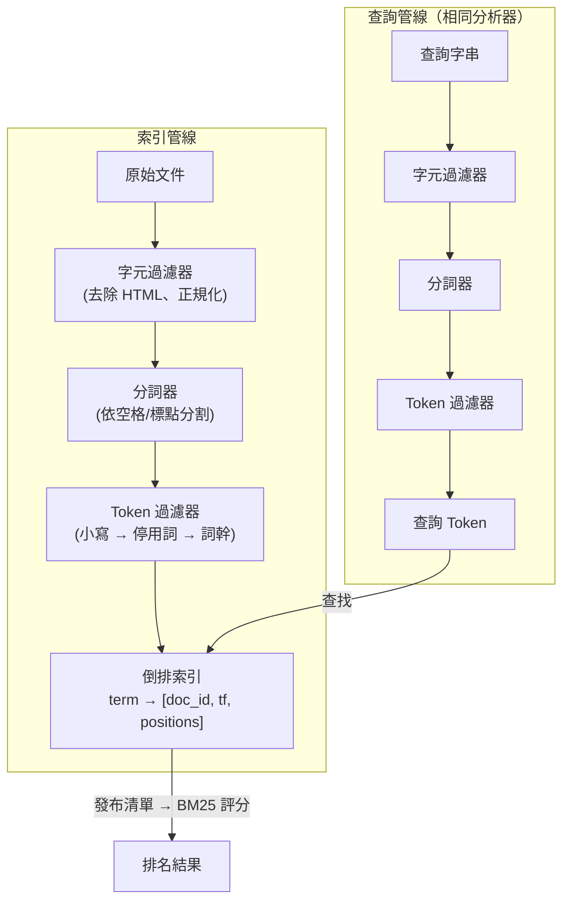

# [BEE-380] 全文搜尋基礎

:::info
全文搜尋引擎如何將原始文件轉換為倒排索引、使用 BM25 對結果評分，以及為何 SQL `LIKE` 不適合用於相關性排名搜尋。
:::

## 情境

幾乎每個應用程式最終都需要讓使用者在文字中搜尋：商品描述、支援票單、文章、使用者生成內容。直覺反應是使用 SQL 的 `LIKE '%keyword%'`。這在幾百筆資料時還能應付，但當資料量有意義地增長，或使用者期望結果依相關性排列而非插入順序時，就會徹底崩潰。

全文搜尋（Full-Text Search，FTS）是一套有效率地索引和查詢自然語言文字的技術體系。其核心抽象——倒排索引、分析管線和相關性評分——出現在每一個嚴肅的搜尋系統中，從基於 Lucene 的引擎（Elasticsearch、OpenSearch、Solr）到資料庫內建 FTS（PostgreSQL、SQLite FTS5）。理解這些基礎，能讓你在所有這些系統之間做出有根據的取捨決策。

## 原則

**為何 `LIKE` 不夠用**

`LIKE '%keyword%'` 查詢會執行循序掃描：讀取每一筆資料列並套用模式比對。它無法使用 B-tree 索引，對詞彙邊界和詞形變化毫無感知，且不以任何有意義的順序回傳結果。它找到的是包含該位元組序列的資料列，而非與概念相關的文件。

全文搜尋解決了 `LIKE` 的三個根本限制：

| 限制 | `LIKE '%...%'` | 全文搜尋 |
|---|---|---|
| 效能 | 全循序掃描；O(n) | 倒排索引查詢；次線性 |
| 語言支援 | 僅精確位元組比對 | 詞幹提取、停用詞、同義詞 |
| 相關性排名 | 無（任意順序） | 依詞頻、IDF、文件長度評分 |

**倒排索引**

倒排索引（Inverted Index）是全文搜尋的核心資料結構。它將語料庫中每個唯一詞彙（token）映射到包含該詞彙的文件清單：

```
詞彙         → 發布清單
"database"   → [doc:3, doc:7, doc:12]
"index"      → [doc:1, doc:3, doc:9, doc:12]
"search"     → [doc:1, doc:7]
```

發布清單（posting list）中的每個條目通常儲存文件 ID、該詞彙在文件中的出現頻率，以及可選的位置資訊（片語搜尋和鄰近排名所必需）。這個結構讓引擎能在微秒內回答「哪些文件包含詞彙 X」，而不需要掃描每份文件。

倒排索引在離線（索引時）建構，在查詢時查閱。寫入比讀取更昂貴——這種不對稱性是關鍵的設計約束。

**分析管線**

文件在進入倒排索引之前，會通過分析管線（analysis pipeline）。查詢文字也經過同一管線，確保索引與查詢的 token 可以比對。

管線分為三個階段：

1. **字元過濾器**（Character Filter，可選）：在分詞前預處理原始字元流。例如：去除 HTML 標籤、展開連字（fi → fi）、正規化 Unicode。
2. **分詞器**（Tokenizer）：將字元流分割為 token，通常以空格和標點為分隔。標準分詞器對 `"full-text search"` 產生 `["full", "text", "search"]`。
3. **Token 過濾器**（Token Filter，可一或多個串聯）：對各別 token 進行轉換。常見過濾器包括：
   - **小寫化**：`"Database"` → `"database"`
   - **停用詞移除**：丟棄高頻、低資訊量的詞（`"the"`、`"a"`、`"is"`）
   - **詞幹提取 / 詞形還原**：將變形詞還原為詞根（`"running"` → `"run"`、`"databases"` → `"database"`）
   - **同義詞展開**：在索引時同時收錄 `"DB"` 與 `"database"`

不同欄位需要不同的分析器。商品名稱欄位可能跳過停用詞移除；程式碼搜尋欄位可能將 `.`、`_` 和 `-` 視為 token 邊界而非分割符號。

Lucene、Elasticsearch、OpenSearch 等引擎 MUST（必須）在索引時和查詢時套用相同的分析器。不一致（例如索引時有詞幹提取，查詢時沒有）會造成靜默的錯誤結果。

**相關性評分：TF-IDF 與 BM25**

有了倒排索引，引擎必須決定哪些匹配文件最具相關性。兩種主流模型為 TF-IDF 及其後繼者 BM25。

*TF-IDF*

TF-IDF 透過兩個信號對文件評分：

- **詞頻（Term Frequency，TF）**：查詢詞彙在文件中出現的次數。出現越多 → 分數越高。
- **逆文件頻率（Inverse Document Frequency，IDF）**：詞彙在整個語料庫中的稀有程度。常見詞（`"the"`）貢獻很少；罕見詞（`"speleothem"`）貢獻很多。

```
score(D, t) = TF(t, D) × IDF(t)

IDF(t) = log(N / df(t))
  N    = 文件總數
  df(t) = 包含詞彙 t 的文件數
```

TF-IDF 有一個關鍵缺陷：原始 TF 線性增長且未依文件長度正規化。提到某詞彙十次的長文件，與具有相同原始計數的短文件得到同等分數，即使該詞彙在短文件中比例上更為顯著。

*BM25（Okapi BM25）*

BM25（Best Matching 25，最佳匹配 25），由 Stephen E. Robertson、Karen Spärck Jones 及倫敦城市大學的同事在 1980 至 1990 年代開發，解決了 TF-IDF 的兩個弱點：

```
score(D, Q) = Σ IDF(qᵢ) × [f(qᵢ, D) × (k₁ + 1)] / [f(qᵢ, D) + k₁ × (1 - b + b × |D| / avgdl)]

  f(qᵢ, D) = 查詢詞彙 qᵢ 在文件 D 中的詞頻
  |D|       = 文件 D 的長度（以 token 計）
  avgdl     = 語料庫中文件的平均長度
  k₁        = 詞頻飽和度（通常為 1.2–2.0；Lucene 預設：1.2）
  b         = 長度正規化（0 = 停用，1 = 完全正規化；預設：0.75）
```

相較於 TF-IDF 的兩項改進：

1. **TF 飽和**：`k₁` 參數對詞頻套用遞減回報曲線。詞彙第 10 次出現對分數的貢獻遠低於第 1 次。TF-IDF 分數無限增長；BM25 分數趨於穩定。
2. **長度正規化**：`b` 參數懲罰長文件。詞彙在 10 字文件中出現 5 次，比在 500 字文件中出現 5 次更具意義。BM25 為此進行調整。

BM25 自 Lucene 6.0 版（2016 年）起成為預設相似度函式（Elasticsearch 亦隨之採用）。它也是許多其他系統的預設值，被廣泛視為關鍵字搜尋相關性的標準基準線。

**何時使用資料庫內建 FTS 與專用搜尋引擎**

資料庫內建 FTS（PostgreSQL 的 `tsvector`/`tsquery` 搭配 GIN 索引；SQLite FTS5）適用於以下情況：

- 文件語料庫規模適中（數百萬筆，而非數十億）
- 搜尋是事務性查詢之外的次要功能
- 運維簡單性很重要——少維護一個系統
- 需要索引資料與儲存資料之間的強一致性

專用搜尋引擎（Elasticsearch、OpenSearch、Solr）適用於以下情況：

- 相關性調整很重要：自訂分析器、欄位加權、函式評分
- 需要進階查詢功能：模糊比對、地理空間搜尋、聚合、分面搜尋
- 語料庫非常龐大，或查詢速率高到需要水平擴展
- 近即時索引延遲是產品需求

工程師 MUST NOT（絕對不能）對每個文字搜尋需求都預設使用專用搜尋引擎。Elasticsearch 叢集的運維負擔相當可觀：JVM 調優、分片規劃、快照策略、升級管理。先用現有資料庫的 FTS 功能；在出現具體能力缺口時再遷移至專用引擎。

工程師 SHOULD（應該）明確評估以下取捨：所需的查詢複雜度、語料庫大小、寫入至可搜尋的延遲要求，以及團隊的運維能力。

工程師 MAY（可以）在資料庫和搜尋引擎中同時索引資料，以滿足既需要事務完整性又需要進階搜尋的應用程式，但 MUST（必須）考量此方案引入的同步延遲和一致性窗口。

## 視覺化

下圖呈現資料流經的兩條路徑：索引管線（上方）和查詢管線（下方），兩者都產生 token，最終在倒排索引中交會。



## 範例

以下虛擬碼以語言中立的方式說明全文搜尋系統的三個階段：

```
// --- 索引階段 ---

function analyze(text, analyzer):
    tokens = analyzer.charFilter(text)
    tokens = analyzer.tokenize(tokens)
    tokens = analyzer.tokenFilter(tokens)   // 小寫、詞幹、停用詞
    return tokens

function indexDocument(docId, text, index):
    tokens = analyze(text, defaultAnalyzer)
    for each token in tokens:
        index[token].postingList.add({
            docId:     docId,
            frequency: count(token, tokens),
            positions: positionsOf(token, tokens)
        })

// --- 查詢階段 ---

function search(queryText, index, corpus):
    queryTokens = analyze(queryText, defaultAnalyzer)  // 相同分析器！
    candidates  = intersect(index[t].postingList for t in queryTokens)
    scored      = []

    N     = corpus.documentCount
    avgdl = corpus.averageDocumentLength
    k1    = 1.2
    b     = 0.75

    for each docId in candidates:
        score = 0
        for each term in queryTokens:
            tf  = index[term][docId].frequency
            df  = index[term].postingList.length
            idf = log((N - df + 0.5) / (df + 0.5) + 1)
            dl  = corpus.documentLength(docId)

            score += idf * (tf * (k1 + 1)) / (tf + k1 * (1 - b + b * dl / avgdl))

        scored.append({docId, score})

    return sortDescending(scored)
```

**PostgreSQL FTS 範例**

```sql
-- 在 tsvector 欄位上建立 GIN 索引
ALTER TABLE articles ADD COLUMN search_vector tsvector;

UPDATE articles
SET search_vector = to_tsvector('english', title || ' ' || body);

CREATE INDEX articles_fts_idx ON articles USING GIN (search_vector);

-- 帶排名的查詢
SELECT title, ts_rank(search_vector, query) AS rank
FROM articles, to_tsquery('english', 'database & index') query
WHERE search_vector @@ query
ORDER BY rank DESC
LIMIT 10;
```

## 常見錯誤

1. **查詢時使用錯誤的分析器。** 若索引時有詞幹提取（`"running"` → `"run"`）但查詢時沒有，查詢詞彙 `"running"` 將無法匹配索引 token `"run"`。務必確保索引路徑和查詢路徑套用相同的分析器。

2. **將 `LIKE '%term%'` 當作 FTS 替代品。** 模式比對無法使用索引（前置萬用字元會強制循序掃描），不回傳相關性分數，且不處理詞形變化。超出精確子字串比對需求時，請使用適當的 FTS 機制。

3. **所有欄位使用同一個通用分析器。** 程式碼搜尋、法律文件語料庫和商品目錄有不同的分詞需求。對所有欄位使用一個分析器會降低精確度。應投入時間為每個欄位選擇適合其內容類型的分析器。

4. **忽略索引至可搜尋的延遲。** 倒排索引是非同步建構的。在 Elasticsearch 中，新索引的文件只有在 refresh 之後才可見（預設間隔：1 秒）。在 PostgreSQL 中，`tsvector` 欄位必須明確更新（透過觸發器或應用程式邏輯），新內容才能被搜尋到。預設 FTS 是近即時的，而非同步的。

5. **尚未充分利用內建選項就新增專用搜尋引擎。** Elasticsearch 叢集有真實的運維負擔：JVM 調優、分片規劃、快照策略、升級管理。若你的工作負載符合 PostgreSQL FTS 或 SQLite FTS5 的能力範圍，更簡單的路徑幾乎總是更好的選擇。

6. **需要片語搜尋時未儲存位置資訊。** 倒排索引的發布清單可以省略位置資料以節省空間。沒有位置資訊，片語查詢（`"credit card"` 必須相鄰出現）就無法實現。請及早決定片語搜尋是否為需求，並據此設定索引。

## 相關 BEE

- [BEE-100](../Data Storage and Database Fundamentals/100.md) -- 資料庫基礎：儲存引擎與索引結構，是關聯式系統和搜尋系統的共同基礎。
- [BEE-300](../Architecture Patterns/300.md) -- 架構模式概覽：搜尋引擎在更廣泛系統設計中的定位。

## 參考資料

- [How full-text search works -- Elastic Docs](https://www.elastic.co/docs/solutions/search/full-text/how-full-text-works)
- [Practical BM25 Part 2: The BM25 Algorithm and its Variables -- Elastic Blog](https://www.elastic.co/blog/practical-bm25-part-2-the-bm25-algorithm-and-its-variables)
- [Okapi BM25 -- Wikipedia](https://en.wikipedia.org/wiki/Okapi_BM25)
- [PostgreSQL Full-Text Search Introduction -- PostgreSQL Docs](https://www.postgresql.org/docs/current/textsearch-intro.html)
- [Preferred Index Types for Text Search -- PostgreSQL Docs](https://www.postgresql.org/docs/current/textsearch-indexes.html)
- [org.apache.lucene.analysis package -- Apache Lucene 8.0.0 API](https://lucene.apache.org/core/8_0_0/core/org/apache/lucene/analysis/package-summary.html)
- [SQLite FTS5 Extension -- SQLite.org](https://www.sqlite.org/fts5.html)
