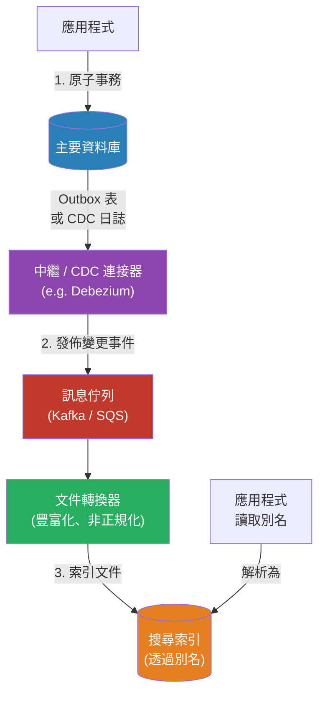

# [BEE-384] 搜尋索引管道與資料同步

:::info
保持搜尋索引與其權威資料來源的一致性需要深思熟慮的同步策略——天真的雙重寫入在部分失敗時會丟失資料，而健全的管道則以一些一致性來換取可靠性。
:::

## Context

搜尋索引是一種衍生的資料結構：它從主要資料存儲（關聯式資料庫、文件存儲、事件日誌）構建，並且必須隨著來源的變化保持同步。索引管道是將變更從真相來源移動到搜尋索引的機制。

這聽起來很簡單，但隱藏了一個困難的問題：來源資料庫和搜尋索引是兩個獨立的系統。以原子方式寫入兩者——就好像它們是單一系統一樣——是不可能的。這就是*雙重寫入問題*，由 Confluent 等公司在資料庫和訊息代理的背景下詳細描述。如果應用程式先寫入資料庫，然後寫入搜尋索引，則兩次寫入之間的崩潰會使它們不一致。如果顺序颠倒，失敗的資料庫寫入仍然可能產生一個沒有支撐記錄的已索引文件。

後果從過時的搜尋結果（輕微的不便）到搜尋中指向已刪除資料的幽靈記錄（面向用戶的錯誤），再到存在於資料庫中但對搜尋不可見的缺失記錄（功能喪失的錯誤）。

四種同步模式在複雜性-可靠性曲線的不同點上解決這個問題：應用程式層面的雙重寫入、事務性 Outbox 模式、變更資料捕獲（CDC）和定期輪詢。每種都有其適用場合，為系統的規模和一致性要求選擇了錯誤的方式是生產事故的常見來源。

除了同步之外，管道還必須處理*文件轉換*：資料庫中的資料形狀（正規化的列、外鍵關係）與搜尋索引中所需的形狀（非正規化、預先連接的文件）不同。這種轉換為每個管道增加了延遲和複雜性。

## Design Thinking

將搜尋索引視為一個*讀取模型*（類似於 CQRS 架構的讀取端——參見 BEE-102）。它的存在是為了有效地服務查詢；權威狀態存在於其他地方。這種框架有兩個含義：

1. **一致性在設計上是最終一致的。** 接受從寫入來源到其在搜尋中可見之間會有一個窗口——以毫秒到秒計量。相應地設計產品 UX。如果用戶創建了一條記錄並立即搜索它，該記錄可能尚未出現。這是正常的，應該清楚地傳達而不是隱藏。

2. **管道應該是冪等的。** 重新處理相同的變更事件——無論是由於重試、重新傳遞還是完整的重新索引——必須產生相同的結果。大多數搜尋引擎中的索引操作在文件 ID 穩定的情況下預設是冪等的：以相同的 ID 兩次索引同一個文件會用第二個替換第一個。刪除需要更多的注意。

同步模式的選擇主要取決於兩個變數：可以容忍多少索引延遲，以及團隊可以維護多少操作複雜性。

## Best Practices

### 同步策略選擇

工程師 MUST NOT（不得）在任何一致性重要的生產系統中使用天真的應用程式層面雙重寫入（在同一個請求處理器中寫入資料庫，然後寫入搜尋索引）。當第一次寫入成功後第二次寫入失敗時，沒有恢復路徑。

工程師 SHOULD（應該）在真相來源是事務性 SQL 資料庫且不需要亞秒級索引延遲時使用**事務性 Outbox 模式**。Outbox 模式在與業務寫入相同的事務中將變更事件寫入 `outbox` 表，保證事件存在當且僅當業務記錄存在時。一個單獨的中繼進程讀取 outbox 並發佈到搜尋索引。

工程師 SHOULD（應該）在需要非常低的索引延遲（低於一秒），或來源資料庫的事務日誌可以被追蹤（PostgreSQL 邏輯複製、MySQL binlog、MongoDB 變更流），或向 schema 添加 outbox 表不可行時，使用**變更資料捕獲（CDC）**。Debezium 等 CDC 工具直接從事務日誌讀取，使所有已提交的變更對下游消費者可見，而無需修改應用程式代碼。代價是顯著的操作複雜性：CDC 需要運行專用的連接器進程、管理複製槽或 binlog 位置，以及處理連接器延遲和故障轉移。

工程師 MAY（可以）使用**輪詢**——定期查詢來源資料庫以獲取自上次輪詢以來修改的記錄（使用 `updated_at` 時間戳）——僅當來源缺乏 CDC 支援且 Outbox 模式過於侵入時。輪詢引入了等於輪詢間隔的固有延遲，無法檢測硬刪除（刪除的行不留下 `updated_at`），並為資料庫增加了定期查詢負載。它適用於小型語料庫或低頻更新工作負載。

### 文件轉換

工程師 MUST（必須）在構建管道之前明確定義搜尋索引的文件形狀。索引文件通常是跨多個表的非正規化連接（例如，一個包含類別名稱、賣家名稱和庫存數量的產品文件，這些都來自不同的表）。對這些表中任何一個的更改都必須觸發受影響文件的重新索引。

工程師 SHOULD（應該）將轉換邏輯從同步層中分離出來。將*事件*（某行發生了更改）與*豐富化*（獲取相關資料並構建完整文件）分開。這種分離使管道可測試：轉換器可以獨立進行單元測試。

工程師 MUST（必須）優雅地處理部分豐富化失敗。如果轉換器無法獲取所需的相關記錄（因為它被並發刪除，或因為豐富化服務不可用），管道 MUST NOT（不得）靜默丟棄事件。使用退避策略重試，或路由到死信佇列進行手動檢查。

### Schema 演進與零停機重新索引

工程師 MUST（必須）避免將應用程式代碼直接指向命名索引。使用別名（在基於 Lucene 的引擎中）或可以重新映射的邏輯名稱。這將應用程式與物理索引解耦，實現零停機的 schema 遷移。

當映射更改需要完整的重新索引時（例如，更改欄位的資料類型，添加必須應用於所有現有文件的新分析欄位），工程師 SHOULD（應該）遵循別名交換模式：
1. 使用更新的映射創建新索引。
2. 開始將新事件同時寫入舊索引和新索引（雙重寫入窗口）。
3. 使用後台任務將所有歷史文件重新索引到新索引。
4. 以原子方式將別名從舊索引切換到新索引。
5. 停止寫入舊索引；短期保留它作為回滾目標。

工程師 MUST NOT（不得）在更改不向後兼容時就地修改現有索引映射。許多搜尋引擎允許動態添加新欄位，但不允許更改現有欄位類型。嘗試這樣做將產生映射衝突錯誤。

### 監控

工程師 MUST（必須）監控索引延遲——從寫入來源到其出現在搜尋結果中的時間。當延遲超過產品聲明的一致性窗口時發出警報。

工程師 SHOULD（應該）運行定期一致性檢查：比較來源資料庫和搜尋索引之間的文件計數和記錄樣本。靜默漂移——管道看起來健康但文件缺失或過時——是常見的失敗模式。

## Visual



## Example

**Outbox 模式 schema（PostgreSQL）：**

```sql
-- 業務表
CREATE TABLE products (
    id         UUID PRIMARY KEY,
    name       TEXT NOT NULL,
    price      NUMERIC(10,2),
    updated_at TIMESTAMPTZ DEFAULT now()
);

-- 同一資料庫中的 Outbox 表
CREATE TABLE search_outbox (
    id          UUID PRIMARY KEY DEFAULT gen_random_uuid(),
    entity_type TEXT NOT NULL,           -- 'product'
    entity_id   UUID NOT NULL,
    operation   TEXT NOT NULL,           -- 'upsert' | 'delete'
    created_at  TIMESTAMPTZ DEFAULT now()
);

-- 在單一事務中寫入兩者：
BEGIN;
UPDATE products SET name = 'Widget Pro', updated_at = now() WHERE id = $1;
INSERT INTO search_outbox (entity_type, entity_id, operation)
    VALUES ('product', $1, 'upsert');
COMMIT;
-- 如果任何一個失敗，兩者都會回滾。沒有孤立的 outbox 事件。
```

**中繼進程（偽程式碼）：**

```
loop:
    events = db.query("SELECT * FROM search_outbox ORDER BY created_at LIMIT 100 FOR UPDATE SKIP LOCKED")
    for event in events:
        if event.operation == 'upsert':
            record = db.query("SELECT p.*, c.name AS category FROM products p
                               JOIN categories c ON p.category_id = c.id
                               WHERE p.id = $1", event.entity_id)
            if record is None:
                // 在 outbox 寫入和中繼之間被刪除——視為刪除
                searchIndex.delete(event.entity_id)
            else:
                searchIndex.upsert(buildDocument(record))
        elif event.operation == 'delete':
            searchIndex.delete(event.entity_id)

        db.query("DELETE FROM search_outbox WHERE id = $1", event.id)
    sleep(500ms)
```

**零停機別名交換：**

```
// 使用更新的映射創建新索引
PUT /products_v2 { "mappings": { ... } }

// 後台重新索引（從 v1 讀取，寫入 v2）
POST /_reindex { "source": { "index": "products_v1" }, "dest": { "index": "products_v2" } }

// 重新索引期間：將新事件雙重寫入 v1 和 v2
// （在轉換器中處理——檢查當前別名目標，寫入兩者）

// 重新索引完成後，原子地交換別名
POST /_aliases {
    "actions": [
        { "remove": { "index": "products_v1", "alias": "products" } },
        { "add":    { "index": "products_v2", "alias": "products" } }
    ]
}

// 應用程式通過別名 "products" 讀取——不會感受到任何中斷
```

## Related BEEs

- [BEE-102](../Architecture Patterns/102.md) -- CQRS：搜尋索引是 CQRS 讀取模型的典型範例，通過事件管道從寫入模型同步
- [BEE-163](../Transactions and Data Integrity/163.md) -- Saga 模式：outbox 中繼是一個 saga 步驟——由本地事務加非同步補償保證的分散式操作
- [BEE-222](../Messaging and Event-Driven/222.md) -- 傳遞保證：outbox 到佇列的步驟必須提供至少一次傳遞；轉換器必須是冪等的
- [BEE-380](380.md) -- 全文搜尋基礎：管道正在填充的倒排索引結構
- [BEE-383](383.md) -- 向量搜尋與語意搜尋：嵌入生成屬於同一管道的轉換器階段

## References

- [Dual-Write Problem -- Confluent](https://www.confluent.io/blog/dual-write-problem/)
- [Transactional Outbox Pattern -- AWS Prescriptive Guidance](https://docs.aws.amazon.com/prescriptive-guidance/latest/cloud-design-patterns/transactional-outbox.html)
- [How to Use Change Data Capture (CDC) with Elasticsearch -- Datacater](https://datacater.io/blog/2021-09-15/how-to-use-cdc-with-elasticsearch.html)
- [Changing Mapping with Zero Downtime -- Elastic Blog](https://www.elastic.co/blog/changing-mapping-with-zero-downtime)
- [Zero Downtime Reindex in Elasticsearch -- tuleism.github.io](https://tuleism.github.io/blog/2021/elasticsearch-zero-downtime-reindex/)
- [Kleppmann, M. (2017). Designing Data-Intensive Applications. O'Reilly. Chapter 11: Stream Processing](https://www.oreilly.com/library/view/designing-data-intensive-applications/9781491903063/)
