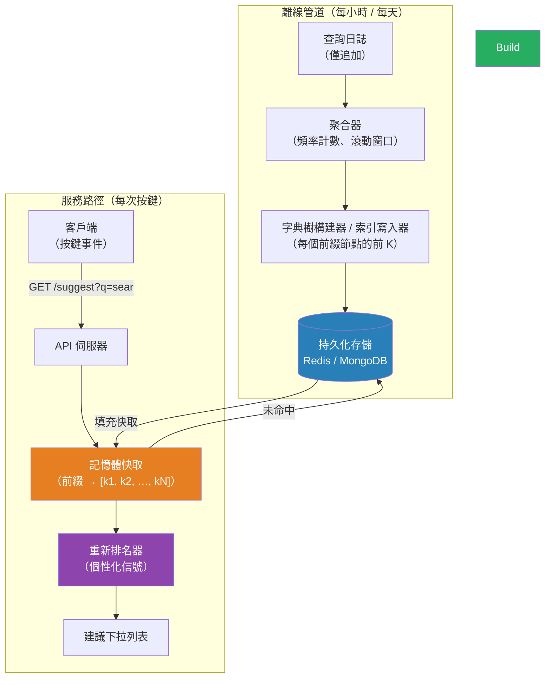

# [BEE-385] 自動完成與預輸入搜尋

:::info
自動完成在 100ms 以內返回排名好的前綴匹配建議——這個延遲預算如此緊迫，單純依靠執行時字典樹遍歷無法滿足，需要在每個前綴節點預先計算並快取前 K 個結果。
:::

## Context

自動完成（也稱為預輸入）是當用戶輸入每個字元時顯示候選完成項目下拉列表的功能。它出現在搜尋框、地址欄位、命令面板，以及任何幫助用戶構建查詢的地方。用戶視之為便利；對後端工程師來說，它是搜尋基礎設施中最困難的延遲問題之一。

挑戰在於預算：建議必須在用戶察覺到延遲之前出現，根據經驗性的 UX 研究，這大約是從按鍵到呈現結果的 100ms。這個預算涵蓋了往返網路時間、伺服器處理和客戶端渲染。伺服器大約只有 30–50ms 可以響應。

在這個預算下，天真的方法——掃描所有文件尋找標題以輸入前綴開頭的文件——立即就行不通了。即使是從根到前綴節點遍歷然後迭代所有葉子後代的記憶體中字典樹遍歷，當字典樹有數百萬個節點且前 K 個結果必須在查詢時按分數排序時，也可能太慢。

Alex Xu 在《System Design Interview》（2020 年，第 13 章）中描述並在 Prefixy 等系統中實現的典型解決方案是：在每個前綴節點預先計算並快取前 K 個建議。對前綴「sear」的查詢不會觸發任何遍歷或排序——它是一次單一的鍵查找，返回一個預先排名的列表。所有複雜性從查詢時間移動到索引構建時間。

## Design Thinking

自動完成設計有三個可分離的關注點：

1. **資料收集**：候選建議和其流行度分數如何得出？通常來自查詢日誌：用戶提交的每次搜尋都被記錄、批量聚合（每小時或每天），並用於更新建議分數。即時評分是可能的但成本高；批量聚合是標準方法。

2. **索引結構**：建議如何存儲使得前綴查詢是 O(1) 查找？兩種主要方法：
   - *每個節點帶快取前 K 的字典樹*：前綴樹中的每個節點存儲其下方得分最高的完成項目的有界列表。字典樹定期從新的聚合資料重建並加載到記憶體中。
   - *前綴哈希映射*：將每個前綴（最大長度 L）映射到預先排序的前 K 個完成項目列表的平坦哈希表。以空間換取保證的 O(1) 訪問和更簡單的實現。

3. **服務層**：索引必須在記憶體中才能滿足延遲預算。Redis 有序集合或進程內字典樹是兩種常見選擇。CDN 或邊緣快取可以在不到達來源的情況下為全球最常見的前綴提供建議服務。

K（每個前綴的建議數量）和 L（索引的最大前綴長度）的選擇是決定記憶體佔用的兩個參數。Prefixy 的生產經驗發現 K=50 和 L=20 是個好的平衡：足夠的候選項用於準確排名，且有界以使總存儲與詞彙量成比例，而非組合爆炸。

## Best Practices

工程師 MUST（必須）在每個前綴節點預先計算前 K 個結果並將其存儲在索引中。在熱路徑中執行排名——按分數對候選項排序——在規模化時無法滿足 100ms 預算。

工程師 MUST（必須）限制 K（每個前綴存儲的建議數量）和 L（索引的最大前綴長度）。在沒有限制的情況下索引每個可能查詢的每個可能前綴會使索引無限增長。L=20–25 個字元涵蓋了幾乎所有現實的用戶輸入；K=10–20 對大多數 UI 就足夠了。

工程師 SHOULD（應該）將建議索引與全文搜尋索引（BEE-380）解耦。兩者的更新模式和查詢形狀不同。自動完成是讀取密集、延遲關鍵、最終一致的系統；全文搜尋需要近即時的索引和相關性評分。在獨立的基礎設施上運行它們允許獨立的擴展和調優。

工程師 SHOULD（應該）從聚合的查詢日誌而非直接從文件語料庫構建自動完成索引。按流行度排名的建議（「其他用戶輸入此前綴時搜索了什麼？」）比按字母順序排序的文件標題作為建議表現更好。聚合管道計算滾動窗口（24 小時、7 天）內的頻率計數並將其合併到建議分數中。

工程師 MUST（必須）過濾建議索引中的冒犯性和違反政策的內容。自動完成在用戶提交查詢之前主動呈現內容，這使其成為比結果集更高關注度的審核面。在構建或更新索引時維護一個作為後處理步驟應用的黑名單，以便刪除不需要完整重建。

工程師 SHOULD（應該）將個性化作為全局前 K 列表之上的重新排名層來處理，而非作為每個用戶的獨立索引。計算完整的每用戶前綴索引代價過高。相反，檢索全局前 K，然後應用輕量級的重新排名信號（用戶的最近搜尋、語言、位置）在返回之前重新排序列表。

工程師 SHOULD（應該）實現優雅降級：如果記憶體中的建議快取不可用，則回退到對持久化存儲的較慢但仍然正確的查找，而非返回空的下拉列表。

工程師 MUST（必須）分別測量和警報自動完成端點的 p99 延遲，而非主要搜尋延遲。用戶在每次按鍵時都會體驗自動完成；此處的延遲退化是立即可感知的，並且對整體搜尋品質的感知影響不成比例地大。

## Visual



## Example

**帶快取前 K 的字典樹節點（語言中立的偽程式碼）：**

```
struct TrieNode:
    children: Map<char, TrieNode>
    topK: List<Suggestion>     // 按分數降序預先排序；最多 K 個條目

struct Suggestion:
    text:  string
    score: float               // 聚合查詢頻率

// --- 構建（離線）---

function buildTrie(aggregatedQueries: List<(text, score)>) -> TrieNode:
    root = new TrieNode()
    for (text, score) in aggregatedQueries:
        node = root
        for char in text[0..min(len(text), MAX_PREFIX_LEN)]:
            node = node.children.getOrCreate(char)
            // 在此前綴節點插入到有界前 K 列表中
            node.topK = insertAndBound(node.topK, Suggestion(text, score), K)
    return root

function insertAndBound(list, item, K) -> List<Suggestion>:
    list.insertSorted(item)    // 按分數降序
    if len(list) > K:
        list.removeLast()      // 驅逐最低分的條目
    return list

// --- 查詢（線上，快取命中後 O(1)）---

function suggest(prefix: string, trie: TrieNode) -> List<Suggestion>:
    node = trie
    for char in prefix:
        if char not in node.children:
            return []          // 此前綴沒有完成項目
        node = node.children[char]
    return node.topK           // 預先計算——無需排序
```

**前綴哈希映射替代方案（平坦鍵值存儲）：**

```
// 構建：對每個查詢 q 的每個前綴 p（len(p) ≤ L）：
for query in aggregatedQueries:
    for i in range(1, min(len(query.text), MAX_L) + 1):
        prefix = query.text[:i]
        sortedSets[prefix].add(query.text, score=query.score)
        sortedSets[prefix].keepTopK(K)

// 查詢：單一鍵查找——O(1)
suggestions = sortedSets.get(userInput) ?? []
```

## Related BEEs

- [BEE-200](../Caching/200.md) -- 快取基礎：記憶體中的建議快取是關鍵路徑；快取未命中處理和驅逐策略直接影響自動完成延遲
- [BEE-204](../Caching/204.md) -- 快取雪崩與驚群效應：高流量的自動完成端點在熱門前綴同時過期時容易出現雪崩
- [BEE-380](380.md) -- 全文搜尋基礎：為自動完成入口點後面的結果集提供動力的倒排索引
- [BEE-381](381.md) -- 搜尋相關性調優：用於結果排名的相同評分信號為每個前綴節點的建議分數提供信息

## References

- [Xu, A. (2020). System Design Interview: An Insider's Guide, Chapter 13: Design A Search Autocomplete System. ByteByteGo Press.](https://bytebytego.com/)
- [How We Built Prefixy: A Scalable Prefix Search Service for Powering Autocomplete -- Prefixy Team](https://medium.com/@prefixyteam/how-we-built-prefixy-a-scalable-prefix-search-service-for-powering-autocomplete-c20f98e2eff1)
- [Auto-complete Feature Using Trie -- GeeksforGeeks](https://www.geeksforgeeks.org/dsa/auto-complete-feature-using-trie/)
- [Design Typeahead (Autocomplete) System -- System Design School](https://systemdesignschool.io/problems/typeahead/solution)
- [Redis Sorted Sets -- Redis Documentation](https://redis.io/docs/data-types/sorted-sets/)
