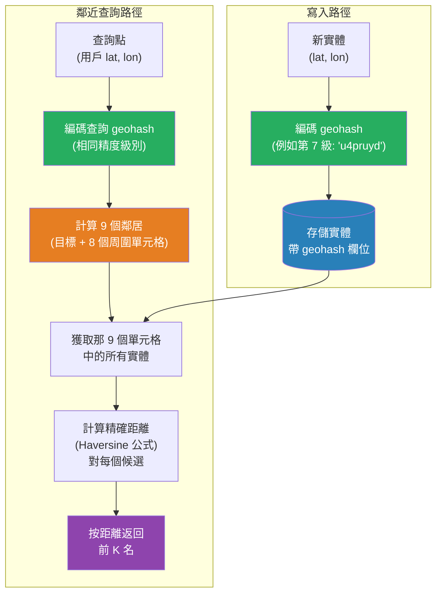

# [BEE-386] 地理空間搜尋與鄰近查詢

:::info
地理空間搜尋尋找某一點附近、某個形狀內或沿某條路線的記錄——這些問題無法用標準 B-tree 索引解決，需要能夠對二維空間進行分區的空間索引結構。
:::

## Context

標準關聯式索引是一維的：它在一條直線上對值排序，並執行快速的前綴查找。緯度和經度是二維的：一個點存在於一個表面上，鄰近意味著在兩個方向上同時接近。天真地將緯度和經度索引為獨立欄位並查詢 `WHERE lat BETWEEN ? AND ? AND lon BETWEEN ? AND ?` 確實可行，但會產生一個矩形邊界框而非圓形，並且需要資料庫掃描該矩形內的所有列，在執行時計算精確距離——在數百萬行時代價過高。

空間索引通過將二維坐標轉換為一維索引結構可以處理的形式來解決這個問題。三種方法在生產系統中占主導地位：

**Geohash** 由 Gustavo Niemeyer 於 2008 年發明。它通過遞歸地將地圖分成兩半，將由此產生的緯度和經度位元交錯成一個單一的二進制序列（莫頓曲線 / Z 階曲線），並以 Base32 編碼結果，將（緯度、經度）對編碼成一個短的字母數字字串。共享更長公共前綴的字串表示在地理上接近的單元格——大多數時候。邊緣問題：geohash 邊界兩側的單元格在物理上可能相鄰，但哈希字串卻完全不同。標準解決方法是查詢目標單元格及其八個直接鄰居，覆蓋邊緣情況。

**S2 幾何**，由 Google 於 2017 年開源，並在 Google Maps 內部使用，通過兩項改進解決了 geohash 的弱點。它將地球投影到一個立方體的六個面上（與 geohash 使用的等矩形投影相比減少了失真），並使用希爾伯特空間填充曲線代替 Z 階曲線。希爾伯特曲線提供了更好的空間局部性：更一致地使附近的單元格在 1D 索引順序中保持接近，降低了邊緣問題的嚴重性。單元格由 64 位整數而非字串標識，使比較更快。S2 被 Uber、Lyft 和其他位置密集型系統使用。

**R-tree** 是資料庫引擎的經典空間索引。R-tree 不是將坐標映射到 1D 鍵，而是將附近的形狀分組到以樹狀排列的最小邊界矩形（MBR）中，使資料庫能夠在樹的每一層修剪大部分資料集。PostGIS（PostgreSQL 空間擴展）和大多數 GIS 資料庫在內部使用基於 GiST 的 R-tree 索引。R-tree 原生處理任意幾何體（多邊形、線條、圓形），是當工作負載涉及形狀交叉、包含檢查或路由查詢而非簡單的點鄰近時的正確選擇。

地理空間搜尋出現在各類廣泛的應用中：叫車（找到最近的可用司機）、外賣配送（找到配送範圍內的餐廳）、房地產（找到某個社區邊界內的房源）、社交應用（找到 N 公里範圍內的用戶）和物流（找到能夠服務某個郵政編碼的倉庫）。

## Design Thinking

選擇空間索引策略取決於三個變數：

1. **查詢類型**：點對點鄰近（「找到離我位置最近的 10 家餐廳」）偏向 geohash 或 S2，因為前綴查詢在鍵值存儲和標準 SQL 資料庫中很快。形狀包含（「這個點是否在這個配送區域多邊形內？」）偏向 R-tree 和 PostGIS。

2. **規模和延遲預算**：在數百萬個點和單位毫秒要求下，記憶體空間索引（S2 單元格、四叉樹）或 Redis Geo 索引（內部使用 geohash）優於基於磁碟的 R-tree。带有 GiST 索引的 PostGIS 能處理數億行，查詢時間為 50–200ms，適合批量或分析工作負載。

3. **現有基礎設施**：如果您已經運行 PostgreSQL，PostGIS 可以添加空間功能而無需新系統。如果您已經運行 Elasticsearch，其 `geo_distance` 查詢和 `geo_point` 類型涵蓋了大多數鄰近用例。為了一個可由擴展處理的功能引入專用空間資料庫通常是不合理的。

經驗法則：從現有資料庫的空間功能開始。當查詢複雜性或規模超過資料庫空間擴展所能良好處理的範圍時，再考慮專用空間系統。

## Best Practices

工程師 MUST（必須）使用空間索引索引地理空間資料，而非在緯度和經度上分別建立數值欄位索引。在 `lat` 上的單獨索引和在 `lon` 上的單獨索引無法被查詢規劃器組合以有效回答鄰近查詢。

工程師 SHOULD（應該）使用 geohash 或 S2 進行鍵值存儲鄰近搜尋（Redis、DynamoDB、Cassandra）。以適當的精度級別（城市規模鄰近使用第 6 級 ≈ 4.9 km 單元格；社區級別使用第 8 級 ≈ 152 m）存儲每個實體的 geohash 字串。在查詢時，計算目標 geohash，擴展到 9 個單元格鄰域，並檢索那些單元格中的所有實體。使用 Haversine 公式對結果集按精確距離過濾，以產生最終的排名列表。

工程師 MUST（必須）在目標單元格加上所有 8 個鄰居中查詢 geohash 單元格，以避免邊緣遺漏。如果只查詢目標單元格，位於單元格邊界另一側的實體將會被遺漏。這是基於 geohash 的鄰近搜尋中最常見的實現錯誤。

工程師 SHOULD（應該）對需要形狀包含、多邊形交叉或路由的工作負載使用帶有 GiST 索引的 PostGIS。帶有 ST_DWithin（查找給定距離內的點）和 ST_Distance 的標準 SQL 準確、支持任意幾何體，並通過適當的索引擴展到數億行。

工程師 MUST（必須）使用 Haversine 公式（或其更精確的後繼者 Vincenty 公式）計算球形地球上的距離。緯度-經度空間中的歐幾里得距離是不正確的，因為一個經度的度數向極點方向縮小：在 60° 緯度，一度經度大約是赤道處距離的一半。對於短距離（低於約 10 km），平面近似是可接受的；對於較長距離或靠近極點的位置，使用適當的球形公式。

工程師 SHOULD（應該）在寫入時預先計算 geohash 或 S2 單元格值，而非在查詢時計算。將編碼後的單元格標識符與原始緯度和經度一起存儲。這使得鄰近查詢成為一個簡單的前綴查找，而非每行計算。

工程師 MUST（必須）將反子午線（180°/-180° 經度邊界）和極點作為邊緣情況處理。跨越反子午線的邊界框查詢需要分成兩個單獨的範圍。大多數空間函式庫會自動處理這個問題；手工實現經常不會。

## Visual



## Example

**基於 Geohash 的鄰近搜尋（語言中立偽程式碼）：**

```
// --- 寫入 ---

entity.geohash = geohash.encode(entity.lat, entity.lon, precision=7)
// 精度 7 ≈ 1.2 km 單元格；2 km 以內的實體將共享第 6 級前綴
db.store(entity)

// --- 查詢：在用戶 2 km 範圍內找到餐廳 ---

SEARCH_RADIUS_KM = 2.0
user_hash = geohash.encode(user.lat, user.lon, precision=6)   // 第 6 級 ≈ 4.9 km 覆蓋 2 km 半徑
cells_to_query = [user_hash] + geohash.neighbors(user_hash)   // 共 9 個單元格

// 步驟 1：廉價前綴獲取（使用索引）
candidates = db.query(
    "SELECT * FROM restaurants WHERE geohash LIKE ?",
    prefix=user_hash[:6]        // 獲取所有第 6 級匹配實體
).filter(c => cells_to_query.contains(c.geohash[:6]))

// 步驟 2：精確距離過濾（Haversine，在小型候選集上運行）
function haversine(lat1, lon1, lat2, lon2):
    R = 6371                    // 地球半徑（公里）
    dlat = radians(lat2 - lat1)
    dlon = radians(lon2 - lon1)
    a = sin(dlat/2)^2 + cos(radians(lat1)) * cos(radians(lat2)) * sin(dlon/2)^2
    return R * 2 * asin(sqrt(a))

results = candidates
    .map(c => { entity: c, distance: haversine(user.lat, user.lon, c.lat, c.lon) })
    .filter(r => r.distance <= SEARCH_RADIUS_KM)
    .sortBy(r => r.distance)
    .take(10)
```

**PostGIS 等效（SQL）：**

```sql
-- 創建空間索引（一次性運行）
CREATE INDEX restaurants_location_idx ON restaurants USING GIST (location);
-- location 是 GEOGRAPHY 欄位：CREATE TABLE ... (location GEOGRAPHY(POINT, 4326))

-- 在用戶 2km 範圍內找到 10 家最近的餐廳
SELECT
    id,
    name,
    ST_Distance(location, ST_MakePoint(-73.9857, 40.7484)::geography) AS distance_m
FROM restaurants
WHERE ST_DWithin(
    location,
    ST_MakePoint(-73.9857, 40.7484)::geography,  -- 用戶 lon, lat
    2000                                           -- 半徑（公尺）
)
ORDER BY distance_m
LIMIT 10;
-- ST_DWithin 使用 GiST 索引；ST_Distance 僅對過濾後的集合計算
```

## Implementation Notes

**Redis Geo 命令**（`GEOADD`、`GEODIST`、`GEOSEARCH`）將點存儲為 geohash 編碼的有序集合成員。`GEOSEARCH` 返回半徑或邊界框內的成員，並按距離排序。這是當實體適合放在記憶體中且由簡單鍵標識時，最快的鄰近搜尋方法。Redis 在內部使用 geohash 但提供了一個清晰的鄰近 API，自動處理鄰居擴展。

**PostgreSQL + PostGIS** 是處理複雜幾何體的最有能力的選項：多邊形包含、線緩衝查詢（找到道路 100m 以內的所有實體）和多形狀交叉。對存儲真實世界坐標的欄位使用 `GEOGRAPHY`（而非 `GEOMETRY`）類型，以獲得自動的球形距離計算。`GEOGRAPHY` 欄位上的 GiST 索引使用 `USING GIST` 創建。

**Elasticsearch** 支援 `geo_point` 欄位上的 `geo_distance` 過濾器和 `geo_bounding_box` 查詢。它在內部以 geohash 存儲，但透明地處理鄰居擴展。最適合當鄰近查詢與全文過濾器結合時（「我附近匹配「披薩」的餐廳」），因為它在單一查詢中高效地連接了空間和文字索引。

**DynamoDB + S2** 是 AWS 的 geo 函式庫和幾個大規模移動應用（WhatsApp 位置分享、Tinder 式附近匹配）使用的模式。將適當級別的 S2 單元格 ID 存儲為排序鍵，在更粗糙的單元格級別上分區，並跨覆蓋單元格集查詢。這避免了當所有附近實體共享相同分區鍵時出現的熱點分區問題。

## Related BEEs

- [BEE-121](../Data Storage and Database Fundamentals/121.md) -- 索引深度解析：支撐資料庫級別空間索引的 B-tree 和 GiST 索引結構
- [BEE-123](../Data Storage and Database Fundamentals/123.md) -- 分區與分片：按 geohash 或 S2 單元格進行空間分區是對位置密集型資料集進行分片的常見策略
- [BEE-200](../Caching/200.md) -- 快取基礎：熱門位置（城市中心、地標）的鄰近查詢結果是強大的快取候選
- [BEE-380](380.md) -- 全文搜尋基礎：地理空間和文字過濾器經常被結合（「我附近的咖啡店」）

## References

- [Geospatial Indexing Explained: Geohash, S2, and H3 -- Ben Feifke](https://benfeifke.com/posts/geospatial-indexing-explained/)
- [GeoHashing: How It Works and Real-World Applications -- AlgoMaster](https://blog.algomaster.io/p/geohashing)
- [Geo queries -- Elasticsearch Reference](https://www.elastic.co/docs/reference/query-languages/query-dsl/geo-queries)
- [PostGIS Reference: ST_DWithin](https://postgis.net/docs/ST_DWithin.html)
- [PostGIS Reference: ST_Distance](https://postgis.net/docs/ST_Distance.html)
- [Redis GEOSEARCH command -- Redis Documentation](https://redis.io/docs/latest/commands/geosearch/)
- [S2 Geometry Library -- Google](https://s2geometry.io/)
