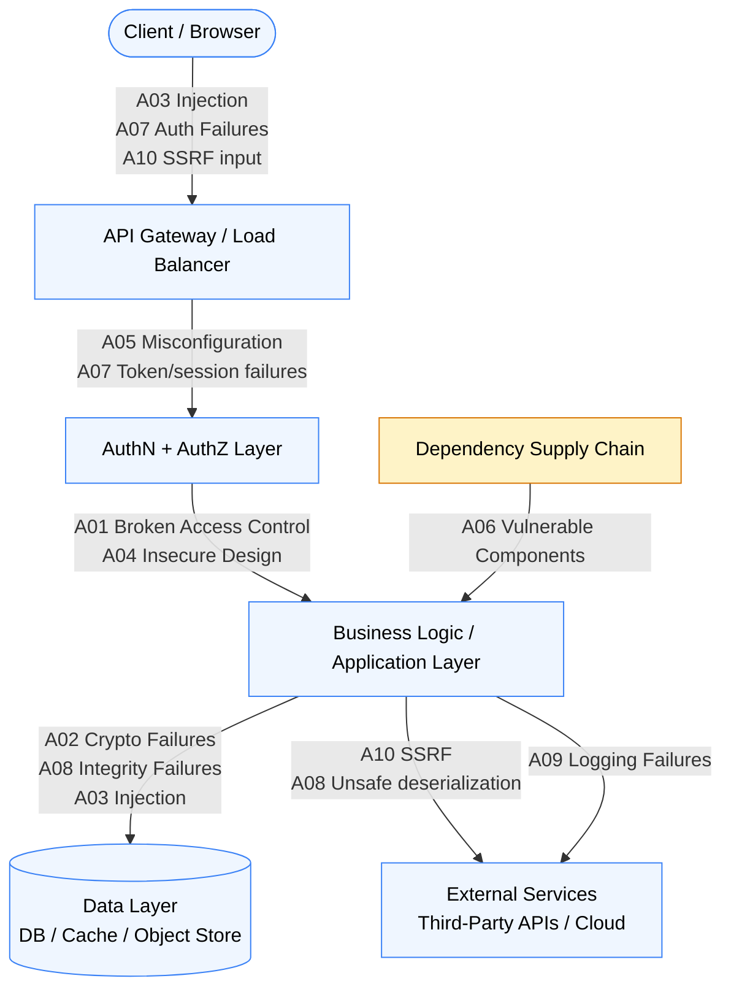

# [BEP-30] 後端的 OWASP Top 10

:::info
OWASP Top 10 是業界公認的最關鍵 Web 應用程式安全風險目錄。每位後端工程師都應了解各類別的含義、它在典型系統中的攻擊點，以及第一道防線應為何。
:::

## 背景

安全漏洞並非隨機意外。相同類別的弱點幾十年來反覆出現在生產系統中，因為它們反映了設計、實作與運維上可預測的錯誤。OWASP（Open Web Application Security Project）定期彙整數千份真實評估資料，發布影響力最高的漏洞類別排行榜。

三份互補的清單構成實務基礎：

- **OWASP Top 10（2021 版）** — 排列最關鍵的 Web 應用程式漏洞。https://owasp.org/Top10/
- **OWASP API Security Top 10（2023 版）** — 聚焦於與 Web Top 10 不同或延伸的 API 特定風險。https://owasp.org/API-Security/editions/2023/en/0x00-header/
- **CWE/SANS Top 25（2023）** — 列舉程式碼層面最危險的軟體弱點，由 MITRE 維護。https://cwe.mitre.org/top25/archive/2023/2023_top25_list.html

這些清單不是一次性的勾選清單。它們描述攻擊面的「形狀」，理解形狀才能建立縱深防禦（defense-in-depth），而非只針對個別症狀打補丁。

## 原則

**安全是層次，不是一道閘門。** 沒有任何單一控制能阻止所有攻擊。縱深防禦在每一層部署獨立的安全控制——輸入驗證、身分驗證（AuthN）、授權（AuthZ）、加密、相依套件管理、日誌記錄——使得單一層的失敗不會自動等於資料外洩。

安全也是持續的過程，而非一次性稽核。威脅建模（threat modeling）、安全程式碼審查、自動掃描與執行時期監控，都必須整合進日常開發生命週期。

## OWASP Top 10（2021）：後端相關性

### A01 — 存取控制失效（Broken Access Control）

存取控制確保已驗證身分的使用者只能執行被明確授權的操作，並只能存取被允許的資料。常見失效情形：

- 透過竄改 URL 中的物件 ID 存取他人資料（IDOR — Insecure Direct Object Reference，不安全的直接物件參考）
- 修改 JWT 中的角色（role）聲明，以存取管理員功能——而伺服器端未驗證
- 直接呼叫 API 端點繞過存取控制（伺服器端缺乏強制執行）

後端相關性：存取控制必須在每個請求的伺服器端強制執行。參見 BEP-10。

### A02 — 加密機制失效（Cryptographic Failures）

敏感資料——密碼、令牌（token）、個人識別資訊（PII）、財務資料——因弱加密或缺乏加密而外洩。常見原因：

- 透過 HTTP（而非 HTTPS）傳輸資料
- 使用弱雜湊或無鹽雜湊（unsalted hash）儲存密碼（MD5、SHA-1）
- 使用已棄用的演算法（3DES、RC4）或過短的金鑰長度
- 使用非加密級亂數產生器（PRNG）產生加密材料

後端相關性：靜態資料（data-at-rest）與傳輸中資料（data-in-transit）的每個決策都涉及加密。參見 BEP-34。

### A03 — 注入（Injection）

使用者提供的輸入被下游直譯器（SQL、NoSQL、LDAP、OS shell、表達式語言）解釋為程式碼或命令。直譯器無法區分攻擊者控制的資料與受信任的命令。

常見形式：SQL injection、NoSQL injection、command injection、LDAP injection、template injection。

後端相關性：注入攻擊鎖定資料層，以及任何從輸入建構命令字串的系統呼叫。參見 BEP-31。

### A04 — 不安全設計（Insecure Design）

2021 年新增的類別，捕捉架構層面的失效——這類問題無論實作多強化都無法修復。例如：

- 密碼重設流程允許攻擊者預測重設令牌
- 業務邏輯允許無限次重試而無速率限制
- 設計上讓所有微服務（microservice）共用同一個管理員憑證

後端相關性：在設計階段（程式碼撰寫前）進行威脅建模，是此類別的唯一控制手段。

### A05 — 安全設定錯誤（Security Misconfiguration）

預設憑證、過於寬鬆的 CORS 政策、含有堆疊追蹤的詳細錯誤訊息、已啟用的除錯端點、未關閉的不必要功能——皆屬此類。設定錯誤是 Web Top 10 中最普遍的類別。

後端相關性：設定必須按環境稽核；正式環境（production）與開發環境（development）的設定必須有所不同。CORS 細節參見 BEP-33。

### A06 — 易受攻擊與過時的元件（Vulnerable and Outdated Components）

應用程式引入數十個第三方函式庫（library）。其中任何一個存在已知漏洞，就代表你的應用程式有可被利用的漏洞，即便你自己的程式碼完美無缺。Log4Shell（CVE-2021-44228）是典型案例：廣泛使用的 Java 日誌函式庫中存在嚴重的 JNDI injection。

後端相關性：相依套件清單（dependency inventory）、自動漏洞掃描與及時修補，是不可忽視的必要工作。參見 BEP-35。

### A07 — 身分識別與驗證失效（Identification and Authentication Failures）

弱身分驗證機制讓攻擊者得以入侵憑證或 session 令牌：

- 因無速率限制或帳號鎖定機制而允許暴力破解
- 接受弱密碼或常用密碼
- 使用不安全的 session ID 產生方式，或將令牌儲存在不安全的位置
- 登出時未在伺服器端使 session 失效

後端相關性：身分驗證是第一道安全閘門；此處的失效繞過所有後續控制。

### A08 — 軟體與資料完整性失效（Software and Data Integrity Failures）

2021 年新增。涵蓋未驗證軟體更新、關鍵資料及 CI/CD 流水線工件（artifact）完整性的失效。包含不安全的反序列化（insecure deserialization）——應用程式從不可信來源反序列化攻擊者控制的資料，可能導致遠端程式碼執行（RCE）。

後端相關性：簽署並驗證建置工件；不對不可信資料進行物件反序列化；保護 CI/CD 流水線。

### A09 — 安全日誌與監控失效（Security Logging and Monitoring Failures）

若缺乏完善的日誌記錄，安全事件便無從察覺。若缺乏監控，即便有豐富的日誌也等於無效。常見失效：

- 未記錄身分驗證事件（成功與失敗）
- 未記錄存取控制失效
- 日誌只儲存於本地（攻擊者可刪除）
- 未針對可偵測的攻擊模式設定告警

後端相關性：日誌是事件回應（incident response）的原始材料。若入侵發生數週後才被發現——或根本未被發現——通常是因為日誌記錄不足。

### A10 — 伺服器端請求偽造（Server-Side Request Forgery，SSRF）

應用程式使用使用者提供或影響的 URL 去擷取遠端資源，而未驗證目標位址。攻擊者將伺服器的對外請求重導至：

- 未對外公開的內部服務（例如：`http://169.254.169.254/`，雲端 metadata 端點）
- 防火牆後的其他後端微服務
- 在某些 URL 處理函式庫中的本地檔案系統路徑

SSRF 在雲端環境中尤為危險，因為 metadata 端點包含 IAM 憑證。

## 視覺化：攻擊面地圖

下圖展示 OWASP Top 10 各類別鎖定典型後端架構的哪個位置。



沒有任何漏洞類別只鎖定單一層。例如存取控制失效，可在 API 閘道（缺少驗證）、業務邏輯層（無所有權檢查）或資料層（缺少行層級安全性）被利用。

## 範例：最關鍵的 5 個項目

### A01 — 存取控制失效（IDOR）

**攻擊情境：** 使用者呼叫 `GET /invoices/1042` 取得自己的發票。透過將 ID 改為 `1041`，即可取得他人的發票——伺服器未驗證所有權。

```
# 有漏洞的版本
function get_invoice(request):
    invoice_id = request.params["id"]
    invoice = db.query("SELECT * FROM invoices WHERE id = ?", invoice_id)
    return invoice   # 未進行所有權檢查

# 防禦：在查詢時強制綁定所有者
function get_invoice(request):
    principal = require_authenticated_principal(request)  # 未驗證時回傳 401
    invoice_id = request.params["id"]
    invoice = db.query(
        "SELECT * FROM invoices WHERE id = ? AND owner_id = ?",
        invoice_id,
        principal.user_id
    )
    if invoice is null:
        return response(404, "Not found")   # 不存在與無授權回傳相同訊息
    return invoice
```

防禦方式是將資源查詢與已驗證的主體（principal）綁定。對「不存在」和「屬於他人」都回傳 404，以避免洩漏資源存在性資訊。

### A02 — 加密機制失效（明文密碼儲存）

**攻擊情境：** 資料庫遭到入侵。密碼雜湊以 MD5 儲存，攻擊者在數小時內即可破解所有常用密碼。

```
# 有漏洞的版本
function register(username, password):
    hash = md5(password)
    db.insert("INSERT INTO users (username, password_hash) VALUES (?, ?)", username, hash)

# 防禦：使用專為密碼設計的雜湊演算法
function register(username, password):
    # bcrypt / argon2id / scrypt — 皆為刻意設計的慢速演算法，且包含鹽值（salt）
    hash = argon2id.hash(password, memory=65536, iterations=3, parallelism=4)
    db.insert("INSERT INTO users (username, password_hash) VALUES (?, ?)", username, hash)

function verify_password(username, candidate_password):
    row = db.query("SELECT password_hash FROM users WHERE username = ?", username)
    if row is null:
        argon2id.hash(candidate_password)  # 固定時間的虛擬運算，防止時序 oracle 攻擊
        return false
    return argon2id.verify(row.password_hash, candidate_password)
```

### A03 — 注入（SQL Injection）

**攻擊情境：** 攻擊者在 username 欄位傳入 `' OR '1'='1`，導致查詢回傳所有使用者。

```
# 有漏洞的版本
function find_user(username):
    query = "SELECT * FROM users WHERE username = '" + username + "'"
    return db.raw_query(query)

# 防禦：使用參數化查詢（prepared statement）
function find_user(username):
    return db.query("SELECT * FROM users WHERE username = ?", username)
    # 驅動程式（driver）將查詢與資料分開傳送。
    # 資料庫將參數視為資料，而非 SQL 語法。
```

相同原則適用於 NoSQL injection、LDAP injection 和 OS command injection——永遠不要將使用者輸入拼接到命令字串中。

### A05 — 安全設定錯誤（詳細錯誤洩漏）

**攻擊情境：** 未處理的例外回傳完整的堆疊追蹤（stack trace）在 HTTP 回應本體中，向攻擊者揭露內部檔案路徑、函式庫版本與資料庫查詢結構。

```
# 有漏洞的版本
function handle(request):
    try:
        result = process(request)
        return response(200, result)
    except Exception as e:
        return response(500, str(e))   # 堆疊追蹤送給用戶端

# 防禦：內部記錄日誌，對外回傳通用訊息
function handle(request):
    try:
        result = process(request)
        return response(200, result)
    except Exception as e:
        error_id = generate_uuid()
        logger.error("Unhandled exception", error_id=error_id, exception=e, request=request)
        return response(500, {"error": "Internal error", "trace_id": error_id})
        # trace_id 讓維運人員可關聯日誌；攻擊者得不到任何有用資訊
```

### A10 — 伺服器端請求偽造（SSRF）

**攻擊情境：** 一個圖片代理（proxy）端點接受 URL 參數並在伺服器端擷取內容。攻擊者傳入 `http://169.254.169.254/latest/meta-data/iam/security-credentials/` 以取得雲端 IAM 憑證。

```
# 有漏洞的版本
function proxy_image(request):
    url = request.params["url"]
    content = http.get(url)
    return response(200, content, content_type="image/png")

# 防禦：以允許清單（allowlist）限制 scheme、主機名稱
ALLOWED_IMAGE_HOSTS = {"images.example.com", "cdn.partner.com"}

function proxy_image(request):
    raw_url = request.params["url"]
    parsed  = url.parse(raw_url)

    if parsed.scheme not in ("https",):
        return response(400, "Only HTTPS URLs are allowed")

    if parsed.hostname not in ALLOWED_IMAGE_HOSTS:
        return response(400, "Host not permitted")

    # 在連線前解析主機名稱，防止 DNS rebinding 攻擊
    ip = dns.resolve(parsed.hostname)
    if is_private_or_loopback(ip):
        return response(400, "Private addresses not permitted")

    content = http.get(raw_url, timeout=5)
    return response(200, content, content_type="image/png")
```

## 安全是持續的過程

擊敗 OWASP Top 10 無法靠單一衝刺完成。以下實務必須整合進日常工程工作：

| 實務 | 頻率 | 目的 |
|---|---|---|
| 威脅建模（Threat modeling） | 每次重大設計變更時 | 在程式碼撰寫前識別 A04 類設計缺陷 |
| 安全程式碼審查（Secure code review） | 每個 PR | 在程式碼中捕捉 A01、A02、A03、A08 |
| 靜態分析（SAST） | 每次 CI 建置 | 自動偵測 injection、加密與反序列化模式 |
| 相依套件稽核（SCA） | 每日 / 每次建置 | 捕捉 A06 — 相依套件中的已知 CVE |
| 動態分析（DAST） | 每個候選釋出版本 | 探測執行中應用程式的 A05、A01、A10 |
| 滲透測試（Penetration testing） | 至少每年一次 | 對所有類別進行對抗性驗證 |
| 安全監控與告警 | 持續進行 | 偵測 A09 失效與主動利用攻擊 |

## API Security Top 10（2023）如何補充 Web Top 10

API Security Top 10 處理 API 情境中特有或更突出的風險：

- **API1 — 物件層級授權失效（BOLA，Broken Object Level Authorization）** — API 版本的 IDOR（A01），但在 API 中更為常見，因為每個資源通常都有直接可定址的 ID
- **API2 — 身分驗證失效（Broken Authentication）** — 與 A07 重疊，但著重令牌洩漏與部分 API 版本缺少身分驗證
- **API3 — 物件屬性層級授權失效（Broken Object Property Level Authorization）** — 使用者可讀取或寫入不應存取的物件個別欄位，即便可以合法存取父物件
- **API4 — 不受限制的資源消耗（Unrestricted Resource Consumption）** — 速率限制和資源配額在內部 API 中經常缺失；缺少這些控制會導致帳單耗盡（denial-of-wallet）與 DoS 攻擊
- **API5 — 函式層級授權失效（Broken Function Level Authorization）** — 管理或特權功能暴露在相同的 API 表面，而沒有獨立的授權閘門
- **API6 — 敏感業務流程的不受限存取（Unrestricted Access to Sensitive Business Flows）** — API 暴露的業務邏輯（如「套用折扣碼」、「訂位」）可在缺乏針對業務流程的速率限制下被機器速度濫用
- **API7 — 伺服器端請求偽造（SSRF）** — 與 A10 相同，但在 API 整合中更為常見
- **API8 — 安全設定錯誤（Security Misconfiguration）** — 與 A05 相同，因 API 的設定面向更多（版本管理、文件端點、GraphQL introspection）而特別強調
- **API9 — 不當的資產管理（Improper Inventory Management）** — 過時的 API 版本與影子 API（shadow API，未記錄的端點）在應停用後仍可存取
- **API10 — 不安全的 API 消費（Unsafe Consumption of APIs）** — 應用程式本身呼叫第三方 API 時，未對回應進行輸入驗證，無條件信任外部資料

實務差異：Web Top 10 聚焦於瀏覽器消費的 Web 應用程式端點，而 API Security Top 10 聚焦於機器對機器（machine-to-machine）的 API 端點——在這裡，自動化、規模與直接物件存取構成截然不同的風險樣貌。

## 常見錯誤

**1. 將安全視為一次性的勾選清單。**

在釋出前跑一次掃描器就稱系統「安全」，忽略了新漏洞、設定漂移（configuration drift）與新引入的程式碼。安全控制必須持續驗證。

**2. 只防禦注入而忽略存取控制。**

許多團隊有強大的輸入驗證，但授權卻很薄弱。A01（存取控制失效）自 2021 年起排名第一。一個免疫 SQL injection 但透過 IDOR 洩漏他人資料的 API，仍然是嚴重的安全問題。

**3. 以隱晦換取安全（Security through obscurity）。**

隱藏 API 端點（未記錄、特殊路徑、內部子網域）並不是存取控制機制。攻擊者透過目錄探測（content discovery）、原始碼外洩與 JavaScript 分析來發現端點。無論端點看起來多「隱蔽」，都必須強制執行身分驗證與授權。

**4. 不記錄安全事件。**

未記錄身分驗證失敗、存取控制拒絕與輸入驗證拒絕的應用程式，無法偵測正在進行中的攻擊。它也無法支援入侵後的事件回應——「我們不知道他們存取了什麼」不只是技術問題，更是合規與法律責任問題。

**5. 假設內部服務不需要安全性。**

內部網路上的微服務並非天生受信任。任何遭入侵的服務、設定錯誤的容器，或任何對外服務中的 SSRF 漏洞，都可能成為橫向移動（lateral movement）的路徑。內部服務對服務的呼叫必須（MUST）進行身分驗證，且應當（SHOULD）進行授權。

## 相關 BEP

- [BEP-10: Authentication vs Authorization](/zh-tw/Authentication%20and%20Authorization/10) — 基礎存取控制流水線（A01、A07）
- [BEP-31: Input Validation and Sanitization](/zh-tw/Security%20Fundamentals/31) — 防禦注入攻擊（A03）
- [BEP-32: Secrets Management](/zh-tw/Security%20Fundamentals/32) — 保護憑證與金鑰（A02）
- [BEP-33: CORS and Same-Origin Policy](/zh-tw/Security%20Fundamentals/33) — 瀏覽器端存取控制設定（A05）
- [BEP-34: Cryptographic Basics for Engineers](/zh-tw/Security%20Fundamentals/34) — 加密與雜湊基礎（A02）
- [BEP-35: Dependency Security and Supply Chain](/zh-tw/Security%20Fundamentals/35) — 管理第三方風險（A06）

## 參考資料

- OWASP, "Top 10 Web Application Security Risks — 2021 edition". https://owasp.org/Top10/
- OWASP, "API Security Top 10 — 2023 edition". https://owasp.org/API-Security/editions/2023/en/0x00-header/
- MITRE, "2023 CWE Top 25 Most Dangerous Software Weaknesses". https://cwe.mitre.org/top25/archive/2023/2023_top25_list.html
- CISA, "2023 CWE Top 25 Most Dangerous Software Weaknesses" (advisory). https://www.cisa.gov/news-events/alerts/2023/06/29/2023-cwe-top-25-most-dangerous-software-weaknesses
- OWASP, "OWASP Cheat Sheet Series — Authentication". https://cheatsheetseries.owasp.org/cheatsheets/Authentication_Cheat_Sheet.html
- OWASP, "OWASP Cheat Sheet Series — Injection Prevention". https://cheatsheetseries.owasp.org/cheatsheets/Injection_Prevention_Cheat_Sheet.html
