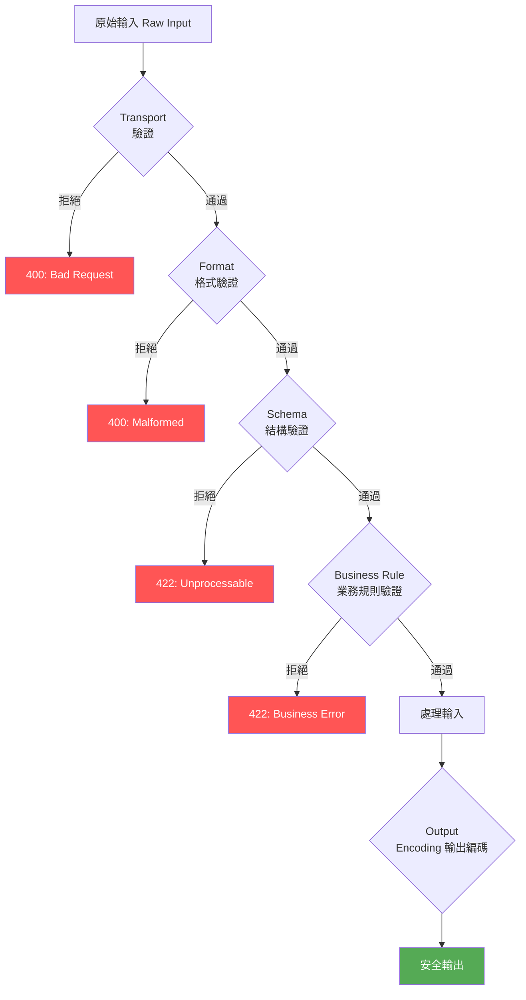

# [BEE-31] 輸入驗證與清理

:::info
在每個系統邊界進行驗證。永遠不要信任外部輸入。
:::

## 背景

每個接受外部輸入的系統——使用者、API、檔案、環境變數、上游服務——都是潛在的攻擊面。注入漏洞（SQL injection、XSS、command injection、path traversal）始終是生產環境中最常被利用的弱點之一。根本原因幾乎都一樣：應用程式信任了不該信任的輸入，或在確認資料安全之前就先進行處理。

CWE-20（Improper Input Validation，不當輸入驗證）是 MITRE 記錄的最普遍的根本原因弱點之一。OWASP 年復一年將注入攻擊列為最高風險。防禦方式已有定論；失敗幾乎都是實作疏失，而非尚未解決的問題。

本原則定義了所有後端服務在輸入驗證與清理方面的必要做法。

## 原則

**使用 allowlist（允許清單）方式，在每個系統邊界對所有輸入進行驗證。拒絕任何不符合規範的輸入。不要以 sanitization（清理）代替拒絕。**

### Validation（驗證）vs. Sanitization（清理）

這是兩種不同操作，目的各異。兩者有時都需要，但不可混淆：

| | Validation（驗證） | Sanitization（清理） |
|---|---|---|
| **目的** | 判斷輸入是否可接受 | 將輸入轉換為安全的形式 |
| **失敗時** | 拒絕並回傳錯誤 | 修改或剝除資料 |
| **使用時機** | 永遠，在邊界處 | 僅用於特定輸出（HTML 渲染、顯示） |
| **誤用風險** | 無——拒絕是安全的 | 可能掩蓋漏洞、隱藏攻擊意圖、損壞資料 |

Sanitization 有其合法用途：將使用者提供的內容渲染為 HTML 時，output encoding（輸出編碼，即 sanitization）可防止 XSS。但透過 sanitization 讓輸入「變得有效」而不是拒絕，是一個錯誤——這會隱藏有人傳送了不良資料的事實，並可能在下游產生非預期行為。

**規則：先驗證，失敗則拒絕。Sanitization 僅用於顯示用的輸出邊界。**

### Allowlist（允許清單）vs. Denylist（拒絕清單）

永遠優先使用 allowlist，而非 denylist。

**Denylist**（blocklist，封鎖清單）定義了不被允許的內容。它永遠不會完整。攻擊者會探測各種編碼、Unicode 變體、null byte 及其他能繞過清單的表示方式。維護 denylist 是一場你會輸掉的軍備競賽。

**Allowlist**（safelist，安全清單）精確定義了什麼是被允許的。其他一切都被拒絕。它的完整性是有定義保證的：如果沒有明確允許，就會被封鎖。

```
// Denylist -- 不完整，脆弱
if input.contains("'") || input.contains("--") || input.contains("DROP") {
    reject()
}

// Allowlist -- 定義上是完整的
if !input.matches(/^[a-zA-Z0-9_\-]{1,64}$/) {
    reject()
}
```

### 在系統邊界進行驗證

在資料跨越信任邊界的每個點都必須進行驗證：

- HTTP 請求參數、headers、cookies、body
- 從資料庫讀取的資料（在業務邏輯使用前）
- 從上游服務、message queue、event stream 接收的資料
- 檔案內容、環境變數、設定輸入
- CLI 參數與使用者提示

服務間的內部呼叫不能豁免。被入侵的上游服務、設定錯誤的生產者或資料遷移錯誤，都可能引入格式不良的資料。無論來源的可信程度如何，都必須在消費者邊界進行驗證。

## 驗證層次

輸入應依序通過一系列檢查，每層在下一層到達前拒絕不合規的資料。



**第一層——Transport 驗證：** Content-Type 符合宣告的格式。大小在限制內。編碼有效（UTF-8 或如宣告的格式）。在解析前拒絕過大的 payload。

**第二層——Format（格式）驗證：** Payload 可解析為宣告的格式（有效 JSON、有效 XML、有效 multipart）。欄位型別符合預期（string、integer、boolean）。

**第三層——Schema（結構）驗證：** 欄位符合定義的限制——長度限制、允許的字元、數值範圍、必填與選填、enum 成員。使用 schema 驗證函式庫（JSON Schema、Zod、Pydantic、Joi 等），而非自行撰寫檢查邏輯。

**第四層——業務規則驗證：** 跨欄位一致性（開始日期在結束日期之前）、參照完整性、授權層級檢查（此使用者是否擁有此資源）。

**Output encoding（輸出編碼）：** 寫入 HTML、SQL、shell 指令、檔案路徑、LDAP 查詢時，針對目標上下文進行編碼。這是最後一道防線，與輸入驗證分開處理。

## 注入攻擊類型與防禦

### SQL Injection（SQL 注入）

攻擊者將 SQL 語法插入直接被插補到查詢中的欄位。

**未進行驗證與參數化時：**
```python
# 危險：user_id 被直接插補
query = f"SELECT * FROM users WHERE id = '{user_id}'"
# user_id = "' OR '1'='1" → 傾倒整個 users 資料表
# user_id = "'; DROP TABLE users; --" → 銷毀資料
```

**使用 parameterized query（參數化查詢，主要防禦）：**
```python
# 安全：driver 將程式碼與資料分離
query = "SELECT * FROM users WHERE id = ?"
cursor.execute(query, (user_id,))
```

Parameterized query（也稱 prepared statement，預備語句）是防禦 SQL injection 的首要且強制性手段。輸入驗證是次要防禦——即使某個值通過了驗證，仍必須透過 parameterized query 處理。永遠不要用字串串接來建構 SQL。

### Cross-Site Scripting（XSS，跨站腳本攻擊）

攻擊者注入在其他使用者瀏覽器中執行的腳本內容。Stored XSS（儲存型 XSS）特別危險，因為 payload 會持久儲存在資料庫中，每位後續瀏覽者都會觸發。

**驗證層面：** 如果欄位不需要 HTML/script 語法，則拒絕包含此類語法的輸入。一個接受 `<script>alert(1)</script>` 作為有效值的「username」欄位，就是輸入驗證的失敗。

**Output encoding 層面（即使有輸入驗證也必須執行）：**
```python
# 輸入儲存：<script>alert(document.cookie)</script>
# 輸出未編碼渲染 -- stored XSS 觸發
html = f"<p>Hello, {username}</p>"

# 輸出使用上下文感知編碼 -- 安全
html = f"<p>Hello, {html_escape(username)}</p>"
```

永遠針對渲染上下文編碼輸出。HTML encoding、JavaScript encoding 和 URL encoding 是不同的操作，應用於不同的上下文中。

### Command Injection（命令注入）

使用者輸入被傳遞給 shell 指令。攻擊者使用 `;`、`&&`、`|` 或反引號附加額外指令。

```python
# 危險
os.system(f"convert {filename} output.png")
# filename = "foo.jpg; rm -rf /" → 災難性後果

# 安全：使用陣列形式，不對使用者輸入使用 shell=True
subprocess.run(["convert", filename, "output.png"])
```

優先使用接受參數陣列的 API，而非 shell 字串執行。如果 shell 執行無可避免，在使用前請嚴格以 allowlist 驗證輸入。

### Path Traversal（路徑遍歷）

攻擊者使用 `../` 序列存取預期目錄之外的檔案。

```python
# 危險
file_path = os.path.join(BASE_DIR, user_supplied_filename)
open(file_path)  # user_supplied_filename = "../../etc/passwd"

# 安全：規範化路徑並檢查是否在目錄內
resolved = os.path.realpath(os.path.join(BASE_DIR, user_supplied_filename))
if not resolved.startswith(os.path.realpath(BASE_DIR)):
    raise ValueError("Path traversal detected")
```

### LDAP Injection（LDAP 注入）

使用者輸入被插補到 LDAP filter（篩選器）中。攻擊者使用 `*`、`(`、`)`、`\` 和 null byte 來操控篩選邏輯。

```
# 危險
filter = f"(uid={username})"
# username = "*)(uid=*))(|(uid=*" → 繞過身份驗證

# 安全：依 RFC 4515 跳脫特殊字元
filter = f"(uid={ldap_escape(username)})"
```

## 結構化輸入的 Schema 驗證

對於 JSON API，請在邊界處使用驗證函式庫宣告並強制執行 schema。不要在解析後手動逐一檢查欄位——schema 函式庫應在請求到達業務邏輯之前就拒絕不符合規範的請求。

```python
# JSON Schema 範例
user_schema = {
    "type": "object",
    "required": ["username", "email", "age"],
    "properties": {
        "username": {
            "type": "string",
            "pattern": "^[a-zA-Z0-9_]{3,32}$"
        },
        "email": {
            "type": "string",
            "format": "email",
            "maxLength": 254
        },
        "age": {
            "type": "integer",
            "minimum": 0,
            "maximum": 150
        }
    },
    "additionalProperties": false
}

# 在任何業務邏輯之前進行驗證
errors = validate(request.json, user_schema)
if errors:
    return 422, {"errors": errors}
```

必須宣告的關鍵限制：字串的 `maxLength`、數字的 `minimum`/`maximum`、結構化字串的 `pattern`、用於封鎖未宣告欄位的 `additionalProperties: false`、必填欄位的 `required`。

## Content Type 與大小限制

在解析之前強制執行：

```python
MAX_BODY_SIZE = 1 * 1024 * 1024  # 1 MB

# 檢查 Content-Type
if request.content_type not in ALLOWED_CONTENT_TYPES:
    return 415, "Unsupported Media Type"

# 在讀取 body 前檢查大小
content_length = request.headers.get("Content-Length", 0)
if int(content_length) > MAX_BODY_SIZE:
    return 413, "Payload Too Large"

# 驗證編碼
try:
    body = request.data.decode("utf-8")
except UnicodeDecodeError:
    return 400, "Invalid encoding"
```

在強制大小限制之前永遠不要解析 body——一個 10 GB 的 JSON body 會在 schema 驗證有機會執行之前就耗盡記憶體。

## 縱深防禦：總結

沒有任何單一控制措施是足夠的。正確的做法是應用重疊的防禦措施：

| 層次 | 控制措施 | 防止 |
|---|---|---|
| Transport | 大小限制、Content-Type、編碼檢查 | 透過大型 payload 的 DoS 攻擊、編碼攻擊 |
| Format | Parser 驗證 | 格式不良的 payload 進入業務邏輯 |
| Schema | 帶 allowlist pattern 的 schema 函式庫 | 型別混淆、over-posting、範圍違規 |
| 業務規則 | 領域特定驗證 | 邏輯錯誤、參照違規 |
| 查詢層 | Parameterized query | SQL injection |
| 輸出 | 上下文感知編碼 | XSS、template injection |

如果一層被繞過或有漏洞，下一層會攔截。缺少單一層不意味著系統被入侵；同一路徑中多個層次同時缺失，才是漏洞得以成功的原因。

## 常見錯誤

**1. 僅依賴客戶端驗證。**
客戶端驗證改善了使用者體驗，但對安全毫無保障。攻擊者會直接發送原始 HTTP 請求，繞過你撰寫的所有 JavaScript 檢查。伺服器端驗證是必須的，不能因為有客戶端驗證就省略。

**2. 使用 denylist 而非 allowlist。**
Denylist 永遠不會完整。Unicode 正規化、雙重編碼、null byte 注入以及數十種其他技術的存在，就是專門為了繞過簡單的 denylist。定義什麼是被允許的；拒絕其他一切。

**3. 對無效輸入進行 sanitization 而非拒絕。**
當一個欄位包含 `<script>` 且你剝除標籤後儲存其餘內容，你已掩蓋了潛在的攻擊意圖，損壞了使用者的意圖，並製造了虛假的安全感。拒絕不符合 schema 的輸入，回傳 400 或 422，讓呼叫方修正他們的輸入。

**4. 驗證輸入但不編碼輸出。**
輸入驗證限制了什麼能進入系統。Output encoding 防止已儲存的內容在渲染時被執行。Stored XSS 需要兩者兼備：用驗證攔截明顯的注入，用 output encoding 防止任何漏網之魚執行。兩者都必要——沒有哪個能取代另一個。

**5. 信任內部服務的輸入。**
微服務透過網路通訊。上游服務可能被入侵、設定錯誤或在損壞的資料上運作。服務 A 的驗證繞過不意味著服務 B 可以跳過驗證。每個服務都必須在自己的邊界驗證輸入，無論來源的信任等級如何。

## 參考資料

- [OWASP Input Validation Cheat Sheet](https://cheatsheetseries.owasp.org/cheatsheets/Input_Validation_Cheat_Sheet.html)
- [OWASP Injection Prevention Cheat Sheet](https://cheatsheetseries.owasp.org/cheatsheets/Injection_Prevention_Cheat_Sheet.html)
- [OWASP SQL Injection Prevention Cheat Sheet](https://cheatsheetseries.owasp.org/cheatsheets/SQL_Injection_Prevention_Cheat_Sheet.html)
- [OWASP OS Command Injection Defense Cheat Sheet](https://cheatsheetseries.owasp.org/cheatsheets/OS_Command_Injection_Defense_Cheat_Sheet.html)
- [OWASP LDAP Injection Prevention Cheat Sheet](https://cheatsheetseries.owasp.org/cheatsheets/LDAP_Injection_Prevention_Cheat_Sheet.html)
- [CWE-20: Improper Input Validation](https://cwe.mitre.org/data/definitions/20.html)

## 相關 BEE

- [BEE-30](/zh-tw/Security%20Fundamentals/30) -- OWASP Top 10 概覽
- [BEE-75](/zh-tw/API%20Design/75) -- API 錯誤處理與回應結構
- [BEE-143](/zh-tw/Data%20Formats/143) -- 編碼格式與序列化
