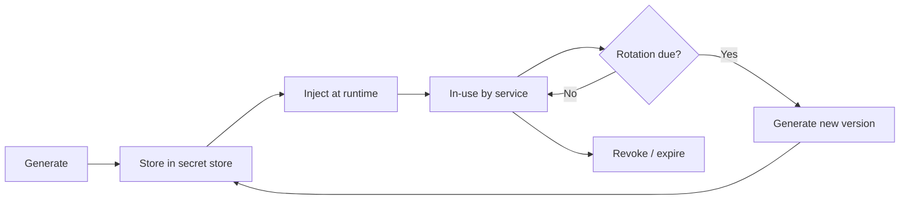

# [BEE-32] 密鑰管理

:::info
密鑰（secret）的定義、為何硬編碼密鑰危險、Vault 概念、輪換策略、最小權限原則、稽核日誌，以及防止密鑰洩漏至版本控制。
:::

## 背景

每個後端系統都依賴必須保密的憑證（credential）：資料庫密碼、第三方服務核發的 API key、TLS 私鑰（private key）、JWT 或 Cookie 的簽名金鑰（signing key）、靜態資料加密金鑰（encryption key），以及服務間通訊的 token。這些統稱為**密鑰（secrets）**。

密鑰與一般設定值的關鍵差異在於：一旦洩漏，攻擊者可直接取得未授權存取或造成資料外洩。功能旗標（feature flag）設錯是 bug；資料庫密碼洩漏則是資安事件。

參考標準：

- [OWASP Secrets Management Cheat Sheet](https://cheatsheetseries.owasp.org/cheatsheets/Secrets_Management_Cheat_Sheet.html)
- [12-Factor App — III. Config](https://12factor.net/config)
- [NIST SP 800-57 Part 1 Rev. 5, Recommendation for Key Management](https://csrc.nist.gov/pubs/sp/800/57/pt1/r5/final)

## 密鑰的範疇

| 類別 | 範例 |
|---|---|
| 憑證（Credentials） | 資料庫密碼、LDAP bind 密碼、OS 服務帳號密碼 |
| API key | 第三方服務金鑰、金流 token、簡訊服務金鑰 |
| 加密素材（Cryptographic material） | TLS 私鑰、簽名金鑰、加密金鑰、HMAC secret |
| 基礎設施 token | 雲端提供商 access key、容器倉庫 token、CI/CD deploy key |
| 服務間 token | Service account JWT、mTLS 憑證、OAuth client secret |

若其洩漏可讓攻擊者存取系統、讀取受保護資料或冒充合法行為者，即為密鑰，必須依此標準管理。

## 原則

**密鑰絕不能儲存於原始碼或版本控制中。必須集中管理、於執行期（runtime）注入、定期輪換，且存取行為必須可稽核。**

## 密鑰生命週期



每個階段都有對應的安全義務：

- **Generate（產生）**：使用密碼學安全的隨機來源。金鑰長度須符合現行標準（如 NIST SP 800-57）的最低建議。
- **Store（儲存）**：存放於專用的 secret store，而非應用程式設定檔、已提交至 git 的 `.env` 檔，或共享試算表。
- **Inject（注入）**：於服務啟動時透過 secret store 填入環境變數，或透過在程序內執行的 SDK 取得並快取。絕不將密鑰內嵌於容器映像（container image）中。
- **Rotate（輪換）**：定期更換密鑰，並於疑似或確認洩漏後立即輪換。輪換必須自動化才能確實執行。
- **Revoke（撤銷）**：當服務下線、開發人員離職，或金鑰疑似洩漏時，立即撤銷。支援版本管理的 secret store 可撤銷舊版本同時保留新版本運作。

## 演進：從最差到最佳實踐

以下以資料庫密碼為例，展示三種做法的風險由高至低排列。

### 做法一 — 硬編碼（Hard-coded，請勿使用）

```python
# Risk: CRITICAL
# 密鑰永遠留在版本歷史中，任何有 repo 存取權限的人都看得到。
DB_PASSWORD = "s3cr3tP@ssw0rd"
conn = connect(password=DB_PASSWORD)
```

**風險：** 密碼被提交至版本控制，每一位曾 clone 過此 repo 的人都可存取。輪換時需修改程式碼並重新部署。

### 做法二 — 環境變數（Environment variable，較佳但不完整）

```python
# Risk: MEDIUM
# 較佳：不在原始碼中。
# 剩餘風險：.env 檔可能被提交，secret 在 process list 中可見，
# 無稽核紀錄，無自動輪換。
import os
conn = connect(password=os.environ["DB_PASSWORD"])
```

**風險：** 環境變數明顯優於硬編碼 — 12-Factor App 方法論將其視為基準做法。然而它依賴操作紀律：值必須來自安全的來源，`.env` 檔絕不能提交，且沒有內建的輪換或稽核機制。

### 做法三 — Secret store 搭配自動輪換（建議做法）

```python
# Risk: LOW
# 密鑰於啟動時從集中式 secret store 取得。
# 輪換自動執行，無需修改程式碼。
# 存取受 IAM 政策管控，所有讀取操作均有日誌記錄。
import secret_client  # 抽象化的 secret store SDK

db_password = secret_client.get_secret("prod/db/password")
conn = connect(password=db_password)
```

**風險：** 應用程式不在程式碼或設定檔中儲存密鑰。Secret store 負責產生、版本管理、輪換及存取控制。每次讀取均記錄呼叫者身份。

## Vault / Secret Store 概念

Secret store 是專為以下特性設計的系統：

- **集中儲存（Centralized storage）**：所有密鑰集中於可稽核的單一位置，而非散落於設定檔、CI/CD 變數和開發人員筆電中。
- **存取控制（Access control）**：細粒度的政策管控哪個服務或人員身份可讀取哪個密鑰，落實最小權限原則（見下節）。
- **版本管理（Versioning）**：同一密鑰可同時存在多個版本，支援零停機輪換 — 先寫入新版本，再撤銷舊版本。
- **自動輪換（Automatic rotation）**：Store 可依排程自動重新產生並更新密鑰，同時更新後端服務（如資料庫）並以原子操作儲存新值。
- **稽核日誌（Audit log）**：每次讀取、寫入及刪除均記錄時間戳記與呼叫者身份。
- **靜態與傳輸中加密（Encryption at rest and in transit）**：密鑰在儲存和傳輸過程中均受加密保護。

評估或建構此類系統時，無論使用何種產品或實作，以上特性即為檢核清單。

## 密鑰的最小權限原則

在密鑰層級落實最小權限原則（principle of least privilege）：

- 金流服務需要金流 API key，不需要電子郵件服務的 SMTP 密碼。
- 唯讀報表服務需要唯讀資料庫憑證，不需要寫入憑證。
- 前端團隊的開發人員不需要正式環境的資料庫憑證。

做法：為每個服務指派唯一身份（service account、IAM role），並制定存取政策，僅授予該身份所需的特定密鑰。服務遭入侵時，爆炸半徑（blast radius）僅限於其被允許讀取的密鑰。

## 輪換策略

| 密鑰類型 | 建議輪換週期 | 備註 |
|---|---|---|
| 第三方服務 API key | 90 天以內 | 透過 secret store 自動化 |
| 資料庫憑證 | 90 天以內 | 需整合資料庫使用者管理 |
| TLS 憑證 | 到期前自動更新 | 盡可能使用短效憑證（≤90 天）|
| 簽名金鑰（JWT、Cookie） | 180 天或金鑰洩漏後 | 需要重疊期以處理進行中的 token |
| 加密金鑰 | 依政策；考慮金鑰版本管理 | 輪換加密金鑰需要重新加密資料 |

以下情況須立即輪換：

- 有存取權限的團隊成員離職。
- 疑似或確認發生資安事件。
- 憑證意外曝露（記錄於日誌、提交至 git、透過聊天傳送）。

## 稽核日誌

每次存取密鑰都必須留下日誌，日誌條目須包含：

- 時間戳記（UTC）
- 呼叫者身份（服務名稱、使用者、角色）
- 密鑰識別碼（非密鑰值本身）
- 操作類型（讀取、寫入、輪換、撤銷）
- 結果（成功、拒絕）

此日誌是事件回應（incident response）與合規的關鍵證據。**絕不記錄密鑰值本身** — 日誌條目中若含有明文憑證，等同將日誌聚合系統變成一個沒有存取控制的 secret store。

## 絕不記錄密鑰

密鑰洩漏到日誌的頻率遠超開發者預期：

```python
# 不良做法：記錄 Authorization header，可能包含 Bearer token
logger.debug(f"Outgoing request headers: {headers}")

# 不良做法：記錄完整 request body，可能包含 password 欄位
logger.info(f"Request body: {request.json()}")

# 良好做法：明確排除敏感欄位，只記錄所需資訊
logger.debug("Outgoing request to %s method=%s", url, method)
```

稽核所有會序列化 header、request body、環境變數或設定 dict 的日誌語句。在日誌處理器層級加入遮罩（scrubbing）作為縱深防禦（defense-in-depth）措施，但不能以此取代主要控制。

## 防止密鑰洩漏至版本控制

Git 歷史是永久性的。一旦密鑰被提交至 repo，即使後來從工作樹（working tree）中刪除，仍留存於歷史中，必須視為已洩漏並立即輪換。

### Pre-commit hook

使用 pre-commit 掃描工具，在提交前偵測常見的密鑰模式。將其設定為 repo 的強制 hook：

```yaml
# .pre-commit-config.yaml（結構範例）
repos:
  - repo: <secret-scanning-hook-source>
    hooks:
      - id: detect-secrets
        name: Detect secrets
        # 掃描已暫存的檔案，偵測 API key 模式、高熵字串等
```

### .gitignore

每個 repo 都必須包含防止常見密鑰檔案被暫存的條目：

```gitignore
# 環境變數檔
.env
.env.*
!.env.example

# 憑證檔案
*.pem
*.key
*.p12
*.pfx
credentials.json
secrets.yaml
```

### 提供安全範例

提交一份 `.env.example` 檔，列出所有必要的環境變數名稱及佔位值。這份文件說明了所需的設定，但不暴露真實密鑰。

```bash
# .env.example
DB_HOST=localhost
DB_PORT=5432
DB_PASSWORD=REPLACE_ME
API_KEY=REPLACE_ME
```

### CI 中的 repo 掃描

在 CI 中執行密鑰掃描作為第二道防線。這可以捕捉在 pre-commit hook 安裝之前引入的密鑰，或繞過本地 hook 的情況。

## 常見錯誤

1. **在原始碼中硬編碼密鑰。** 密鑰存在於 repo 的每一份 clone、每一個 CI 建置產物，以及版本歷史中。若已發生，請立即輪換。

2. **將 `.env` 檔提交至 git。** `.env` 檔通常包含開發或正式環境的真實憑證。在首次 `git add` 之前就將其加入 `.gitignore`。

3. **透過聊天或電子郵件分享密鑰。** 訊息平台和電子郵件並非有存取控制的 secret store，它們有日誌、備份，且可能被管理員搜尋。請使用 secret store 提供的安全分享機制。

4. **沒有輪換策略。** 從不輪換的密鑰會無限期累積風險。使用三年的密鑰，代表三年的潛在曝露期。請自動化輪換，確保其確實執行。

5. **記錄包含 auth token 的 request header。** `Authorization: Bearer <token>` 是密鑰。任何擷取完整 HTTP header 的日誌都會記錄憑證。合併前仔細審查 debug 日誌語句。

## 相關 BEE

- [BEE-15: API Keys](15.md) — 如何為外部使用者設計與核發 API key。
- [BEE-34: Cryptography](./34.md) — 金鑰長度、演算法選擇與靜態加密。
- [BEE-35: Dependency Security](./35.md) — 可能間接暴露密鑰的供應鏈風險。
