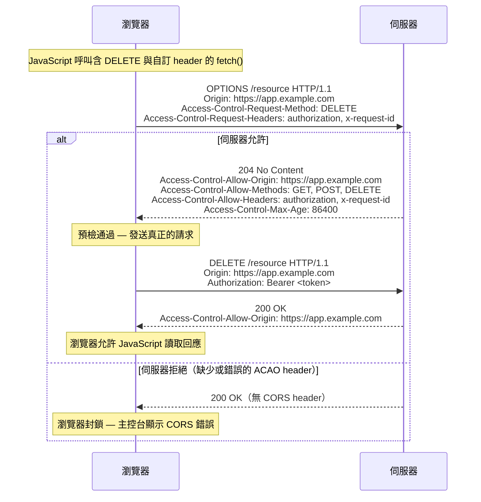

# [BEE-33] CORS 與同源政策

:::info
同源政策（Same-Origin Policy）是瀏覽器防禦跨站請求攻擊的主要機制。CORS（Cross-Origin Resource Sharing，跨來源資源共用）是有條件放寬該政策的標準化協議——而錯誤設定 CORS 是最常見的安全漏洞之一。
:::

## 背景

現代 web 應用程式經常從多個來源載入資源：不同子網域上的 API、第三方分析服務、CDN 資產。瀏覽器透過**同源政策（SOP）**防止惡意頁面讀取敏感回應。CORS 提供了一套結構化、以 HTTP header 為基礎的協議，讓伺服器宣告它信任哪些跨來源請求。

參考規格：
- MDN Web Docs — CORS: https://developer.mozilla.org/en-US/docs/Web/HTTP/CORS
- WHATWG Fetch Standard, CORS 章節: https://fetch.spec.whatwg.org/#http-cors-protocol
- RFC 6454 — The Web Origin Concept: https://datatracker.ietf.org/doc/html/rfc6454
- PortSwigger Web Security — CORS: https://portswigger.net/web-security/cors

## 原則

**實作應用程式所需最窄的 CORS 政策，在反射（reflect）任何 origin 前務必驗證，且絕不將 CORS 視為伺服器端的安全控制——它只限制瀏覽器端的讀取行為。**

---

## 同源政策（Same-Origin Policy）

瀏覽器對每一個由 JavaScript 發起的 HTTP 請求強制執行 SOP。兩個 URL 只有在以下三項**完全相符**時才算同源：

| 元件 | 範例 |
|------|------|
| Scheme（協定） | `https` |
| Host（主機） | `api.example.com` |
| Port（通訊埠） | `443`（HTTPS 預設值）|

任何差異——`http` vs `https`、`example.com` vs `api.example.com`、port `3000` vs `443`——都使請求成為跨來源（cross-origin），瀏覽器將封鎖 JavaScript 讀取回應，除非伺服器透過 CORS header 明確允許。

SOP 保護的情境：位於 `evil.com` 的惡意頁面無法靜默讀取 `bank.com/account` 的已驗證回應，即使使用者已登入，因為瀏覽器封鎖了讀取動作。

SOP **無法**保護的情境：瀏覽器仍然會*發送*請求。SOP 封鎖的是*讀取*，不是*發送*。這個區別對狀態變更端點（state-changing endpoint）至關重要（詳見預檢請求）。

---

## CORS 作為可控的放寬機制

CORS 在 SOP 之上加入了一層協商機制。瀏覽器在跨來源請求中加入 `Origin` header；伺服器以 `Access-Control-*` header 回應，宣告它允許的內容。若伺服器回應未授予權限，瀏覽器會封鎖 JavaScript 存取回應本體。

CORS 由**瀏覽器**代表使用者執行。非瀏覽器用戶端（curl、伺服器對伺服器呼叫）不受 CORS header 影響。CORS **不是**伺服器身份驗證機制。

---

## 簡單請求（Simple Request）vs 預檢請求（Preflighted Request）

### 簡單請求

滿足以下所有條件的請求屬於「簡單請求」（不觸發預檢）：
- 方法：`GET`、`HEAD` 或 `POST`
- Header：僅限 CORS 安全清單 header（`Accept`、`Accept-Language`、`Content-Language`、`Content-Type` 且 MIME 僅限 `application/x-www-form-urlencoded`、`multipart/form-data`、`text/plain`）
- 無 `ReadableStream` body，無 upload 事件監聽器

簡單請求直接發送，瀏覽器收到回應後才檢查 header。

### 預檢請求

不符合簡單請求條件的請求會觸發預檢（preflight）：在發送真正請求**之前**，先發一個 `OPTIONS` 請求詢問伺服器是否允許。觸發條件包括：
- 除 GET/HEAD/POST 以外的方法（例如 `PUT`、`DELETE`、`PATCH`）
- 自訂請求 header（例如 `Authorization`、`X-Request-ID`）
- `Content-Type: application/json`

### 預檢流程



預檢回應可由瀏覽器快取 `Access-Control-Max-Age` 秒（預設 5 秒；Firefox 上限 86400 秒，Chrome 上限 7200 秒）。

---

## Access-Control-* Header 參考

### 回應 Header（伺服器 → 瀏覽器）

| Header | 用途 |
|--------|------|
| `Access-Control-Allow-Origin` | 允許讀取回應的來源。可為 `*` 或明確指定的 origin。|
| `Access-Control-Allow-Methods` | 實際請求允許使用的 HTTP 方法。|
| `Access-Control-Allow-Headers` | 瀏覽器可發送的請求 header。|
| `Access-Control-Allow-Credentials` | 設為 `true` 允許攜帶 cookie、`Authorization` header 及 TLS 用戶端憑證。|
| `Access-Control-Expose-Headers` | JavaScript 可讀取的回應 header（超出預設安全清單的部分）。|
| `Access-Control-Max-Age` | 預檢回應可快取的秒數。|

### 請求 Header（瀏覽器 → 伺服器）

| Header | 用途 |
|--------|------|
| `Origin` | 發起請求的頁面來源。由瀏覽器自動附加。|
| `Access-Control-Request-Method` | （僅預檢）實際請求將使用的方法。|
| `Access-Control-Request-Headers` | （僅預檢）實際請求將使用的自訂 header。|

---

## 萬用字元（`*`）的限制

使用 `Access-Control-Allow-Origin: *` 表示任何來源都能讀取回應，僅適用於**真正公開且不需身份驗證**的資源。

`*` 萬用字元**不能**與 credentials 搭配使用。當請求包含 `credentials: 'include'`（cookie、`Authorization` header）時，瀏覽器**要求** `Access-Control-Allow-Origin` 必須是明確的 origin，而非 `*`。若將 `*` 與 `Access-Control-Allow-Credentials: true` 同時設定，瀏覽器會拒絕回應。

此限制同樣適用於其他萬用字元值：
- `Access-Control-Allow-Headers: *` 不涵蓋 `Authorization`，必須明確列出。
- 在有 credentials 的請求中，`Access-Control-Allow-Methods: *` 和 `Access-Control-Expose-Headers: *` 同樣受限。

---

## `Vary: Origin` Header

當伺服器動態選擇要反射哪個 origin（而非固定回傳 `*`）時，回應必須包含：

```http
Vary: Origin
```

若省略此 header，CDN 或共用快取可能將 origin A 的回應存起來，再提供給 origin B 的請求——可能造成資料外洩，或封鎖合法的跨來源存取。`Vary: Origin` 指示快取以 `Origin` 請求 header 的值作為快取鍵值。

---

## 設定範例

### 情境一 — 公開 API（萬用字元，無 credentials）

```http
# 請求
GET /public/data HTTP/1.1
Host: api.example.com
Origin: https://third-party-app.com

# 回應
HTTP/1.1 200 OK
Access-Control-Allow-Origin: *
Content-Type: application/json
```

適用於：公開資料端點（天氣、匯率、開放資料集），不需身份驗證且不回傳使用者特定資料。

### 情境二 — 帶 Credentials 的跨來源請求

```http
# 請求
GET /user/profile HTTP/1.1
Host: api.example.com
Origin: https://app.example.com
Cookie: session=abc123

# 回應
HTTP/1.1 200 OK
Access-Control-Allow-Origin: https://app.example.com
Access-Control-Allow-Credentials: true
Vary: Origin
Content-Type: application/json
```

伺服器必須回傳具體的請求 origin，而非 `*`。`Vary: Origin` 確保快取不會將此回應提供給其他 origin。

### 情境三 — 限制已知 Origin

伺服器端邏輯（虛擬碼）：

```python
ALLOWED_ORIGINS = {
    "https://app.example.com",
    "https://admin.example.com",
}

def add_cors_headers(request, response):
    origin = request.headers.get("Origin", "")
    if origin in ALLOWED_ORIGINS:
        response.headers["Access-Control-Allow-Origin"] = origin
        response.headers["Vary"] = "Origin"
    # 若 origin 不在允許清單：省略 header — 瀏覽器將封鎖
```

對應的預檢回應 header：

```http
HTTP/1.1 204 No Content
Access-Control-Allow-Origin: https://app.example.com
Access-Control-Allow-Methods: GET, POST, PUT, DELETE, OPTIONS
Access-Control-Allow-Headers: content-type, authorization, x-request-id
Access-Control-Allow-Credentials: true
Access-Control-Max-Age: 3600
Vary: Origin
```

---

## 常見錯誤設定

### 1. 未驗證就反射 `Origin`

```python
# 危險 — 不要這樣做
response.headers["Access-Control-Allow-Origin"] = request.headers.get("Origin")
```

位於 `evil.com` 的攻擊者發送帶有 `Origin: evil.com` 的請求，伺服器反射後授予 `evil.com` 讀取權限。若端點同時設定 `Access-Control-Allow-Credentials: true`，攻擊者可竊取已登入使用者的 session cookie 或 token。

反射前務必對照明確的允許清單驗證 origin。

### 2. 萬用字元搭配 Credentials

```http
# 瀏覽器會拒絕這個組合
Access-Control-Allow-Origin: *
Access-Control-Allow-Credentials: true
```

這違反 CORS 規格。瀏覽器會封鎖回應並顯示 CORS 錯誤。修正方式：指定明確的允許 origin。

### 3. 遺漏 `Vary: Origin`

當伺服器有條件地反射 origin 時，省略 `Vary: Origin` 會造成快取風險。CDN 可能快取允許 `https://app.example.com` 的回應，然後將其提供給 `https://attacker.com` 的請求——根據快取值的不同，可能造成資料外洩或封鎖合法使用者。

### 4. 只在部分方法上處理預檢

部分框架自動處理 `GET`/`POST` 的 `OPTIONS` 請求，卻忘記 `PUT`、`PATCH`、`DELETE`。若 `DELETE /resource` 的預檢收到 405 或無 CORS header，瀏覽器會封鎖真正的請求，即使伺服器本會接受。

確保 `OPTIONS` 處理器對 API 支援的所有方法都回傳 CORS header。

### 5. 誤以為 CORS 能防止伺服器端請求

CORS 由瀏覽器強制執行。任何伺服器對伺服器呼叫、`curl` 指令、Postman 請求，或在瀏覽器以外執行的攻擊者腳本，都完全繞過 CORS。CORS **不是**身份驗證或授權控制。無論 CORS 政策為何，都應以適當的身份驗證（Bearer token、mTLS）保護敏感端點。

### 6. 將 `null` Origin 加入白名單

某些設定允許 `null` origin 以支援本機檔案開發（`file://` 來源發送 `Origin: null`）。沙盒化的 iframe 與某些重新導向也會產生 `null` origin，這意味著攻擊者可以構造一個產生 `null` origin 請求的頁面，並收到寬鬆的回應。

### 7. 過於寬泛的網域比對

使用 regex 或字串比對（如 `endsWith("example.com")`）可能授權非預期的 origin：
- `evil-example.com` 符合 `endsWith("example.com")`
- `notexample.com` 符合 `includes("example.com")`

務必使用精確比對，對照已知正確 origin 的集合進行驗證。

---

## 相關 BEE

- **BEE-30** — OWASP Top 10 for Backend：CORS 錯誤設定屬於存取控制缺陷（A01）與安全性錯誤設定（A05）。
- **BEE-50** — Networking Fundamentals：TCP/IP 與 HTTP 請求路由背景。
- **BEE-51** — HTTP Semantics：支撐 CORS 行為的請求方法、狀態碼與 header 慣例。
