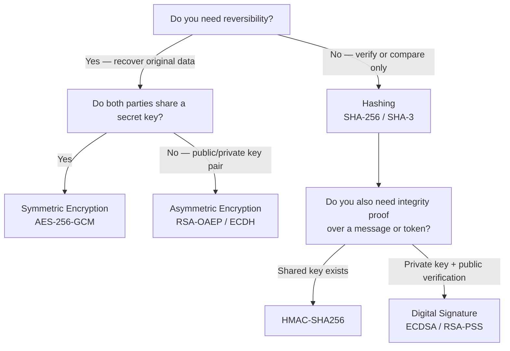

# [BEE-34] 工程師的密碼學基礎

:::info
密碼學（Cryptography）是安全通訊與資料儲存的根基。了解何時使用雜湊（hash）、何時加密，以及如何選擇演算法，能防止因誤用或自製密碼系統所產生的漏洞。
:::

## 背景

密碼學不只是學術理論——它存在於幾乎所有生產環境的後端：密碼儲存、token 簽署、API 金鑰產生、資料庫加密，以及 HTTPS。大多數密碼學錯誤並非數學問題，而是工程問題：為任務選錯了基礎元件（primitive）、使用了已被破解的演算法，或是疏忽了金鑰管理。

參考資料：
- OWASP Cryptographic Storage Cheat Sheet: https://cheatsheetseries.owasp.org/cheatsheets/Cryptographic_Storage_Cheat_Sheet.html
- OWASP Password Storage Cheat Sheet: https://cheatsheetseries.owasp.org/cheatsheets/Password_Storage_Cheat_Sheet.html
- NIST SP 800-175B Rev. 1 — Guideline for Using Cryptographic Standards: https://csrc.nist.gov/pubs/sp/800/175/b/r1/final
- Latacora — Cryptographic Right Answers: https://www.latacora.com/blog/2018/04/03/cryptographic-right-answers/

## 原則

**使用經過驗證的函式庫中已建立的演算法，且僅用於其設計的用途。選擇能解決問題的最簡單基礎元件，絕不自創協議，並將金鑰管理視為一等重要的工程課題。**

---

## 選擇正確的基礎元件

最常見的工程錯誤不是數學錯誤——而是選錯了工具。在寫任何程式碼之前，先回答兩個問題：

1. 你之後需要還原原始資料嗎？
2. 雙方共用同一把金鑰，還是需要交換金鑰？



以下各節詳細說明每個分支。

---

## 雜湊（Hashing）

**密碼學雜湊函式（Cryptographic Hash Function）**將任意輸入映射為固定長度的摘要（digest）。這是單向運算：給定摘要，無法還原輸入。不同輸入不得產生相同摘要（碰撞抵抗性，collision resistance）。

核准使用的演算法：
- **SHA-256** 和 **SHA-3** — 通用雜湊（內容校驗碼、承諾方案、雜湊資料結構）
- **SHA-384**、**SHA-512** — 協議需要較長輸出時使用

已被破解的演算法——任何安全用途皆不可使用：
- **MD5** — 自 2004 年起碰撞攻擊已被實證
- **SHA-1** — 自 2017 年起碰撞抵抗性實際上已被破解

### 雜湊不等於密碼儲存

純雜湊（即使是 SHA-256）不適合儲存密碼。密碼的熵值（entropy）偏低，容易遭受預先計算的彩虹表（rainbow table）攻擊與 GPU 暴力破解。密碼儲存需要**緩慢、加鹽（salted）、記憶體困難（memory-hard）**的演算法，詳見下方密碼雜湊章節。

---

## 對稱加密（Symmetric Encryption）

對稱加密（Symmetric Encryption）使用單一共用金鑰進行加密與解密。速度快，適合大量資料保護：加密檔案、資料庫欄位，或已共用密鑰的兩個服務之間的資料傳輸。

**推薦演算法：AES-256-GCM**

AES（Advanced Encryption Standard）搭配 256 位元金鑰，採用 **GCM（Galois/Counter Mode）**模式，提供：
- 機密性（Confidentiality）：密文不洩漏明文內容
- 完整性與真實性（Integrity & Authenticity）：被竄改的密文在解密時會失敗並產生錯誤（驗證加密，Authenticated Encryption）
- 效能：大多數現代 CPU 提供硬體加速

| 屬性 | 數值 |
|------|------|
| 金鑰長度 | 256 bits（32 bytes）|
| IV / Nonce 長度 | 96 bits（12 bytes），**每次加密必須唯一** |
| 認證標籤（Authentication Tag） | 128 bits（16 bytes）|

Nonce（一次性數值）絕不可以使用相同金鑰重複使用。在 GCM 中重複使用 Nonce 會同時破壞機密性與完整性。

### 區塊加密模式缺陷——ECB

ECB（Electronic Codebook）模式對每個區塊獨立加密。相同的明文區塊會產生相同的密文區塊，從而洩漏明文的結構性模式，不適合加密任何具有重複性的資料（圖片、結構化資料，甚至可預測的標頭）。

```
# ECB 洩漏結構
BLOCK 1: "Hello, World!!!" → C1
BLOCK 2: "Hello, World!!!" → C1  ← 相同密文揭露相同明文

# GCM 不洩漏結構
BLOCK 1: "Hello, World!!!" → R1
BLOCK 2: "Hello, World!!!" → R2  ← 每次產生不同密文
```

請務必使用驗證模式（GCM、CCM），或 CBC 搭配 HMAC（先加密再 MAC，Encrypt-then-MAC）。絕不使用 ECB。

---

## 非對稱加密（Asymmetric Encryption）

非對稱加密（Asymmetric Encryption，又稱公鑰加密，Public-Key Encryption）使用金鑰對（key pair）：公鑰（public key）用於加密（或驗證），私鑰（private key）用於解密（或簽署）。它解決了金鑰分發問題——公鑰可以公開分享。

### 加密——RSA-OAEP

用於將訊息加密給特定接收方：

- **RSA-OAEP** 搭配 SHA-256，使用 2048 位元（最低要求）或 4096 位元金鑰
- RSA 僅適合小型資料（一把 session key、一個 token）。對於大型資料，應採用混合加密（Hybrid Encryption）：以對稱加密加密資料，再用 RSA 加密 AES 金鑰

### 金鑰協商——ECDH / X25519

用於在不受信任的通道上建立共用秘密（Shared Secret）：

- **X25519**（Curve25519 ECDH）是目前的首選——速度快、不易產生常見的實作缺陷，且被廣泛支援
- **ECDH on P-256** 在需要 NIST 曲線的情境下可接受

### 金鑰長度與演算法選擇

| 演算法 | 最低金鑰 / 曲線 | 建議 |
|--------|----------------|------|
| RSA | 2048-bit | 3072-bit 或 4096-bit |
| ECDSA | P-256（256-bit）| P-256 或 P-384 |
| ECDH | P-256 | X25519 |
| AES | 128-bit | 256-bit |

---

## 密碼雜湊（Password Hashing）

密碼絕不能以明文儲存、使用可逆加密，或以通用雜湊演算法儲存。密碼需要專門設計為緩慢的演算法，以提高暴力破解的成本，並包含每個密碼獨有的鹽值（salt）以防範預先計算的表格攻擊。

**建議演算法（依優先順序）：**

1. **Argon2id** — 2015 年密碼雜湊競賽（Password Hashing Competition）冠軍；記憶體困難型（memory-hard），抵抗 GPU 與 ASIC 攻擊。新系統首選。
2. **scrypt** — 記憶體困難型；廣泛可用。在 argon2id 不可用時可接受。
3. **bcrypt** — 基於工作因子（work factor）；廣為了解；非記憶體困難型。向後相容的舊系統可接受。
4. **PBKDF2** — 僅在以上演算法皆不可用時使用（例如 FIPS 合規環境）。對 GPU 攻擊的抵抗力較弱。

### 密碼儲存流程（偽代碼）

```
function store_password(plaintext_password):
    salt = generate_random_bytes(16)          # 每個用戶、每個憑證唯一
    hash = argon2id(
        password = plaintext_password,
        salt     = salt,
        memory   = 64 MiB,                   # 依威脅模型調整
        iterations = 3,
        parallelism = 1
    )
    return encode_and_store(hash)             # 標準格式已包含 salt

function verify_password(plaintext_password, stored_hash):
    return argon2id_verify(stored_hash, plaintext_password)   # 常數時間比較
```

argon2id、scrypt 和 bcrypt 產生的雜湊格式已內嵌演算法、參數與 salt——不需要額外儲存 salt。

---

## 訊息認證碼（MAC / HMAC）

**MAC（Message Authentication Code，訊息認證碼）**用來證明訊息由知悉共用金鑰的一方產生，且訊息在傳輸過程中未被竄改。它提供完整性（integrity）與真實性（authenticity），但不提供機密性（confidentiality）。

**推薦：HMAC-SHA256**

HMAC 使用兩層巢狀雜湊操作，從雜湊函式建構 MAC，使其抵抗長度延伸攻擊（length-extension attack）。

常見用途：
- 簽署 API 請求參數以防止竄改（JWT 相關應用請見 [BEE-11](11.md)）
- 驗證 webhook 酬載（將收到的 body 的 HMAC 與預期值比較）
- 透過將酬載綁定到伺服器密鑰來產生安全的 session token

```
function sign_webhook_payload(payload_bytes, secret_key):
    return hmac_sha256(key=secret_key, message=payload_bytes)

function verify_webhook_payload(payload_bytes, received_signature, secret_key):
    expected = hmac_sha256(key=secret_key, message=payload_bytes)
    return constant_time_compare(expected, received_signature)   # 絕不使用 ==
```

驗證 MAC 時請使用常數時間比較（constant-time comparison）。一般的 `==` 運算子可能在第一個不匹配的 byte 就短路返回，洩漏時序資訊，使攻擊者可逐字節偽造簽章（時序攻擊，timing attack）。

---

## 數位簽章（Digital Signature）

**數位簽章（Digital Signature）**使用私鑰對訊息簽署，並使用公鑰驗證。擁有公鑰的任何人都可以驗證簽章，但只有持有私鑰的人才能產生簽章。

簽章提供：
- 真實性（Authenticity）——訊息由金鑰持有者產生
- 不可否認性（Non-repudiation）——簽署方無法否認曾簽署
- 完整性（Integrity）——訊息未被竄改

**推薦演算法：ECDSA（P-256）、Ed25519、RSA-PSS**

### 簽署流程（偽代碼）

```
# 簽署（持有私鑰的伺服器或用戶端）
function sign_payload(payload):
    digest = sha256(payload)
    signature = ecdsa_sign(private_key, digest)
    return base64url_encode(signature)

# 驗證（任何持有公鑰的一方）
function verify_payload(payload, signature_b64):
    digest = sha256(payload)
    signature = base64url_decode(signature_b64)
    return ecdsa_verify(public_key, digest, signature)
```

數位簽章是 JWT（JWS）、TLS 憑證、程式碼簽署，以及 HTTPS 憑證鏈的基礎。JWT 相關的具體指引請見 [BEE-11](11.md)。

---

## TLS 作為應用密碼學

TLS（Transport Layer Security）不是獨立的主題——它是上述基礎元件的實際應用：

- **金鑰交換**：ECDH 臨時金鑰交換建立共用的 session key
- **認證**：伺服器的 TLS 憑證包含公鑰；憑證授權機構（CA）的簽章證明其真實性
- **對稱加密**：session key 搭配 AES-GCM 用於大量資料加密
- **完整性**：每條 TLS 記錄上的 HMAC（或 AEAD 標籤）防止竄改

TLS 1.3（RFC 8446）是目前的標準。TLS 1.2 仍廣泛部署。TLS 1.0 和 1.1 已被廢棄，不可使用。

後端 TLS 設定請見 [BEE-53](53.md)。

---

## 編碼不等於加密

**Base64 是編碼（encoding），不是加密（encryption）。** 將 base64 編碼的資料視為已受保護是常見錯誤。Base64 將二進位資料編碼為可列印的 ASCII 字元，以供傳輸或儲存——它不提供任何保密性。任何人不需金鑰即可立即解碼。

| 操作 | 用途 | 可逆 | 需要金鑰 |
|------|------|------|----------|
| Base64 編碼 | 二進位轉文字傳輸 | 是 | 否 |
| 雜湊 | 指紋 / 驗證 | 否（單向）| 否 |
| 對稱加密 | 機密性 | 是 | 是（共用金鑰）|
| 非對稱加密 | 機密性 | 是 | 是（金鑰對）|

不要儲存加密資料後稱之為「base64 編碼」。不要把 base64 解碼後的內容稱為「解密」。

---

## 常見錯誤

### 1. 使用 MD5 或 SHA-1 儲存密碼

MD5 和 SHA-1 已被破解，任何安全敏感用途皆不可使用。即使完整的雜湊函式（如 SHA-256）也不適合儲存密碼——它們太快了。請使用 argon2id、scrypt 或 bcrypt。

### 2. 區塊加密使用 ECB 模式

ECB 對每個區塊獨立加密，洩漏結構性模式。[ECB 企鵝圖](https://en.wikipedia.org/wiki/Block_cipher_mode_of_operation#Electronic_codebook_(ECB))直觀地展示了這一點——用 ECB 模式加密點陣圖影像後，視覺結構仍然保留。請使用 GCM 或 CBC 搭配 HMAC。

### 3. 在程式碼中寫死加密金鑰

硬式編碼（hardcode）在原始碼中的金鑰會提交進版本控制系統、出現在建置產物中，並在所有部署環境中共用。請定期輪換金鑰，並使用密鑰管理器（secrets manager），詳見 [BEE-32](32.md)。

### 4. 自製密碼學協議

將正確的構建塊錯誤地組合在一起同樣會產生不安全的系統。以新穎方式鏈接 SHA-256、對資料 XOR 金鑰、或自行實作 HMAC 變體，都是常見例子。請使用經過稽核的函式庫與已建立的協議。

### 5. 混淆編碼與加密

如上所述，base64 和 hex 是編碼方案。將編碼後的資料稱為「已加密」是一種虛假的安全感。

### 6. 重複使用 Nonce / IV

在 AES-GCM 中，以相同金鑰重複使用 IV 會完全破壞機密性，並允許攻擊者還原金鑰。每次加密操作都必須產生全新的隨機 Nonce。

### 7. 使用 `==` 比較 MAC

字串或位元組陣列的相等運算子並非常數時間。驗證 MAC 和簽章時，請務必使用常數時間比較函式，以防止時序攻擊（timing attack）。

---

## 相關 BEE

- [BEE-11](11.md) — JWT 簽章：應用 HMAC-SHA256 和 ECDSA 產生並驗證 JSON Web Token。
- [BEE-32](32.md) — 密鑰管理（Secrets Management）：加密金鑰與密鑰的儲存、輪換與存取控制。
- [BEE-53](53.md) — TLS 設定：TLS 版本要求、加密套件選擇，以及憑證管理。
