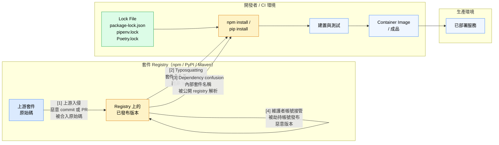

# [BEE-35] 依賴安全與供應鏈

:::info
第三方依賴（dependency）將你的攻擊面（attack surface）擴展到遠超你自己撰寫的程式碼。Lock file、弱點掃描、軟體物料清單（SBOM，Software Bill of Materials）與嚴謹的更新策略，是防範供應鏈（supply chain）攻擊的第一道防線。
:::

## 背景

現代後端服務不是從零開始建構的。一個典型的 Node.js 或 Python 服務可能直接宣告 30–80 個依賴，每個依賴又拉入自己的 transitive 依賴圖。最終整棵依賴樹可能包含數百乃至數千個套件，大多數由團隊從未見過的作者所撰寫，託管在團隊無法控制的 registry 上。

這就是供應鏈，也是一個攻擊面。

三個真實事件說明了失敗模式的範圍：

- **event-stream（2018）** — 攻擊者透過社交工程（social engineering）誘使原維護者將一個高下載量 npm 套件的所有權轉讓，隨後注入針對 `copay-dash` 函式庫的加密貨幣錢包憑證竊取程式碼。惡意版本在數週內未被偵測到。參考：https://es-incident.github.io/paper.html
- **ua-parser-js（2021）** — 攻擊者劫持了 `ua-parser-js` 維護者的 npm 帳號（每週 700 萬次下載），並發布三個惡意版本，在開發者機器和 CI runner 上安裝加密貨幣挖礦程式與憑證竊取程式。參考：https://www.truesec.com/hub/blog/uaparser-js-npm-package-supply-chain-attack-impact-and-response
- **colors.js（2022）** — 原始維護者本人故意在 1.4.44-liberty-2 版本中引入無限迴圈，作為政治抗議。這不是外部入侵，而是說明即使是合法、受信任的維護者也是單點失敗（single point of failure）。參考：https://www.rescana.com/post/in-depth-analysis-supply-chain-poisoning-of-popular-npm-packages-exploiting-event-stream-ua-parser

這些事件不是理論上的邊緣案例，它們影響的是每週數千萬次下載的套件。

相關授權框架：

- OWASP A06:2021 — Vulnerable and Outdated Components: https://owasp.org/Top10/A06_2021-Vulnerable_and_Outdated_Components/
- OWASP Component Analysis: https://owasp.org/www-community/Component_Analysis
- NIST SP 800-218 — Secure Software Development Framework (SSDF): https://csrc.nist.gov/projects/ssdf
- SLSA (Supply-chain Levels for Software Artifacts): https://slsa.dev/

## 原則

**將每個依賴視為你選擇在生產環境（production）中執行的不受信任程式碼。維護完整的清單，持續掃描已知弱點，鎖定或固定版本以確保可重現性（reproducibility），並套用最小依賴原則（minimal dependency principle）——只有當永久維護該套件的成本值得時才加入。**

---

## 攻擊向量

供應鏈攻擊在 pipeline 的不同階段進入。了解每個向量的落點有助於套用正確的控制措施。



**向量 1 — 上游入侵（Upstream compromise）：** 惡意程式碼被合入開源 repository 本身（透過受入侵的貢獻者帳號、被粗心維護者接受的惡意 PR，或建置系統入侵）。套件從被污染的原始碼正常發布。

**向量 2 — Typosquatting：** 攻擊者發布名稱與熱門套件高度相似的套件（`reqeusts`、`crypt0`、`lodahs`）。`requirements.txt` 中的拼寫錯誤或複製貼上失誤就會安裝攻擊者的套件。

**向量 3 — Dependency confusion（依賴混淆）：** 公司使用帶有私有套件名稱的內部 registry。攻擊者在公開 registry 上以相同名稱發布版本號更高的套件。套件管理器優先查詢公開 registry，解析到公開（惡意）版本而非內部版本。

**向量 4 — 維護者帳號接管（Maintainer takeover）：** 攻擊者取得合法套件維護者的憑證，發布帶有惡意新增內容的版本。套件名稱、發布者帳號與版本升號看起來都完全正常。

---

## Lock File 與可重現建置

Lock file 記錄了上次執行 `install` 時依賴樹中每個依賴（直接與 transitive）的精確解析版本和完整性雜湊（integrity hash）。沒有 lock file，一個月後重新執行 `install` 可能解析出不同的 transitive 版本，悄悄地改變了生產環境中執行的程式碼。

Lock file 必須：

1. **提交進 repository。** 只存在於單一開發者機器上的 lock file 對 CI 或生產環境毫無保護作用。
2. **在 CI 中被視為權威。** 使用 `npm ci`、`pip install --require-hashes -r requirements.txt` 或 `poetry install --no-root`——這些指令會*嚴格按照* lock file 安裝，若 lock file 缺失或不一致則失敗。
3. **在更新時被審查。** 修改 `package-lock.json` 或 `poetry.lock` 的 pull request 包含程式碼變更（新增或更改的 transitive 依賴）。應像審查應用程式碼一樣審查它。

Lock file 中的完整性雜湊（npm 中的 `integrity: sha512-...`、pip-tools 中的 `hash:`）讓安裝程式能驗證套件內容是否與 lock file 建立時記錄的一致。若攻擊者替換了 registry 上已發布版本的內容，雜湊檢查就會失敗。

---

## 弱點掃描（SCA）

軟體組成分析（SCA，Software Composition Analysis）工具將你的依賴清單與已知弱點資料庫（CVE / NVD、GitHub Advisory Database、OSV）比對。目標是在弱點發布後數小時內就知道你的服務是否受影響。

掃描必須在多個時間點進行：

| 階段 | 工具範例 | 偵測內容 |
|---|---|---|
| 開發者機器 | `npm audit`、`pip-audit`、`trivy fs` | 開發期間的已知 CVE |
| 每次 CI 建置 | `npm audit --audit-level=high`、Snyk、Dependabot | 新 PR 引入的 regression |
| 每日排程掃描 | Dependabot alerts、Renovate、Snyk monitor | 針對未更動程式碼的新 CVE |
| Container image 掃描 | Trivy、Grype、Snyk Container | OS 套件和語言 runtime layer 的 CVE |

弱點掃描器的好壞取決於其查詢的資料庫。使用從多個資料庫（NVD + GitHub Advisory + OSV）拉取資料的工具，並自動保持資料庫更新。

掃描產生的是發現（findings）；對發現採取行動才是實際工作。建立以嚴重程度驅動的 SLA：

- **Critical / CVSS ≥ 9.0** — 24 小時內修補或緩解
- **High / CVSS 7.0–8.9** — 7 天內修補
- **Medium / CVSS 4.0–6.9** — 30 天內修補
- **Low** — 追蹤並在下一次計劃性維護週期中處理

---

## 軟體物料清單（SBOM）

SBOM 是軟體成品中所有元件的正式、機器可讀清單——名稱、版本、授權、供應商與已知弱點。常見格式為 SPDX 和 CycloneDX。

SBOM 的重要性：

- 當新的重大 CVE 發布（例如另一個 Log4Shell 等級的事件），SBOM 讓你能立即查詢哪些服務受影響，而無需逐一審計每個 repo。
- SBOM 正成為合規要求。美國行政命令 14028（2021）要求向聯邦政府銷售的軟體提供 SBOM。企業客戶也越來越頻繁地要求提供。
- SBOM 提供了 OWASP A06 和 NIST SSDF 都要求的清單。

使用 `syft`（適用於 container image 和原始碼樹）或 `cdxgen`（適用於語言特定的 manifest）等工具，在建置 pipeline 中生成 SBOM，並將 SBOM 附加到發布成品中。

---

## Typosquatting 與 Dependency Confusion 防範

**Typosquatting 防範：**
- 在將套件加入 manifest 前仔細驗證套件名稱。
- 在新增依賴前使用 `npm info <package>` 或 `pip show <package>` 確認發布者身份。
- 啟用 registry 稽核工具，標記安裝名稱相對於現有 manifest 有可疑之處的套件。
- 用組織 scope 為內部 npm 套件加上前綴（`@mycompany/auth`）——帶 scope 的套件無法在未取得 scope 存取權的情況下在公開 registry 上被佔用。

**Dependency confusion 防範：**
- 在 `.npmrc` 或 `pip.conf` 中為所有內部套件名稱宣告明確的 registry URL，指向這些名稱的內部 registry。
- 使用私有 registry proxy（Artifactory、Nexus、AWS CodeArtifact），配置為針對符合內部套件模式的名稱封鎖公開解析。
- 確保內部套件版本始終高於公開 registry 上存在的任何版本。有些團隊使用語義上高於任何公開版本的內部版本前綴（例如 `1000.x.x`）。

---

## 最小依賴原則

每個新增的依賴都永遠成為你的責任。在新增套件之前，先問：

1. 這能用一個小型、易於理解的 utility 函式實作取代嗎？（"is-odd" / "left-pad" 問題）
2. 這個套件是否被積極維護？檢查最後 commit 日期、open issues，以及維護者是否有回應。
3. Transitive 依賴的代價是什麼？執行 `npm ls --all` 或 `pipdeptree` 查看實際拉入的內容。
4. 授權（license）是什麼？Copyleft 授權（GPL）可能與你的發布模式衝突。
5. 下載量和採用規模如何？下載量極少的套件受安全社群審查的程度也較少。

依賴不是免費的。它的維護成本、弱點曝露和授權義務，由你的團隊在它留在依賴樹中的期間持續承擔。

---

## 更新策略：固定版本 vs. 版本範圍

**版本範圍（version range）**（`^1.2.0`、`~1.2.0`、`>=1.0.0`）允許在 install 時自動解析較新的 patch 或 minor 版本。它們減少了手動更新工作，但在沒有 lock file 的情況下引入不確定性，也可能拉入破壞性變更（breaking changes）。

**版本固定（version pinning）**（`==1.2.3`、lock file 中的精確版本）保證每次 install 都解析出完全相同的結果。結合 lock file，可實現完全可重現的建置。

實務建議：

- **永遠使用 lock file** — 無論 manifest 中宣告什麼範圍，這都在解析層級提供固定版本。
- 在 `package.json` / `pyproject.toml` 中，對直接依賴使用 caret 範圍（`^`）。Lock file 固定實際解析的版本；範圍告訴自動化工具（Dependabot、Renovate）要為哪類更新開 PR。
- **永遠不要對生產依賴使用 `*` 或沒有上限的 `>=`。** 這些範圍表示「任何曾發布的版本」，包括帶有破壞性變更或注入惡意程式碼的未來版本。
- 對基礎設施關鍵套件（語言 runtime、web framework、ORM），考慮更嚴格的固定（`~1.2.0` 而非 `^1.0.0`）以降低自動更新的爆炸半徑（blast radius）。

**自動化 vs. 手動更新：**

| 方式 | 優點 | 缺點 |
|---|---|---|
| 自動 PR（Dependabot / Renovate） | 持續、低摩擦、快速捕捉 CVE | 需要 CI 紀律；若未調整則 PR 量龐大 |
| 手動排程更新 | 對每次變更完整人工審查 | 容易落後數月；CVE 遲遲未修補 |
| 建議：自動 PR + CI 必要檢查 | 兼具速度與安全性 | 需要投資測試覆蓋率 |

自動化更新工具開 PR；CI pipeline 才是驗證的機制。你的測試套件品質直接決定了你能以多大信心合併依賴更新。

---

## 範例：稽核工作流程與 Dependency Confusion

### 稽核工作流程

以下 pseudocode 描述 Node.js 服務的完整依賴稽核週期：

```
# 步驟 1：確保 lock file 具有權威性
npm ci                        # 嚴格按照 lock file 安裝
                              # 若 package-lock.json 遺失或不同步則失敗

# 步驟 2：掃描已知 CVE
npm audit --json > audit.json
# 或：npx better-npm-audit audit --level high

# 步驟 3：審查弱點公告
# 對 audit.json 中的每個發現：
#   - 檢查 CVSS 分數與受影響版本範圍
#   - 確認你的程式碼是否實際執行到有漏洞的程式碼路徑（可達性分析，reachability）
#   - 確認是否有可用的修復版本
#   - 檢查修復是否引入破壞性變更（semver major 升版）

# 步驟 4：更新受影響的套件
npm update <package>          # 解析到宣告範圍內的最新相容版本
npm install <package>@<safe>  # 若範圍不足則固定到特定安全版本

# 步驟 5：驗證測試通過
npm test
npm run integration-test      # SCA 發現在沒有 regression 驗證的情況下不完整

# 步驟 6：提交更新後的 lock file
git add package-lock.json
git commit -m "chore(deps): patch CVE-2024-XXXX in <package>"

# 步驟 7：重新執行掃描確認弱點已解決
npm audit --audit-level=high  # 應以 exit 0 結束（無達到或超過閾值的發現）
```

### Dependency Confusion 攻擊與防範

**情境：** 你的公司使用名為 `@myco/config-loader` 的內部 npm 套件。攻擊者從洩露的 `package.json` 或公開 GitHub repository 發現這個名稱，並在 `https://registry.npmjs.org/@myco/config-loader` 上發布版本 `99.0.0`（高於你的內部版本 `1.4.2`）。

```
# 有漏洞：.npmrc 沒有為 @myco 設定明確的 scope registry
# npm 從公開 registry 解析 @myco/config-loader
# 因為 99.0.0 > 1.4.2

# npm install 輸出：
# + @myco/config-loader@99.0.0  <-- 安裝了惡意的公開版本

# 防範：在 .npmrc 中將此 scope 固定到內部 registry
@myco:registry=https://npm.internal.mycompany.com/

# 加入此設定後，npm 只會從內部 registry 解析 @myco/* 套件，
# 完全忽略公開 registry。
# npm.org 上的 99.0.0 永遠不會被查詢。
```

額外防禦：設定內部 registry 封鎖對其擁有名稱的對外 proxy 請求。即使 `.npmrc` 設定錯誤，內部 registry 也會拒絕 proxy 抓取它所擁有的名稱。

---

## 常見錯誤

**1. 未將 lock file 提交進 repository。**

Lock file 不是應該加入 `.gitignore` 的生成成品，它是一個安全控制。沒有它，CI 中的 `npm install` 可能解析出與開發者本地測試時不同的（潛在惡意或有漏洞的）版本。

**2. 使用 `*` 或過於寬鬆的版本範圍。**

`"my-lib": "*"` 或 `"my-lib": ">=1.0.0"` 會安裝 install 時最新的版本。未來的惡意版本或帶有重大 CVE 的版本將自動被拉入，無需任何審查。

**3. 從未執行稽核。**

許多團隊在開發期間新增依賴，卻從未執行 `npm audit` 或等效工具。弱點不斷累積。團隊第一次執行掃描往往是在安全事件或合規稽核期間，此時積壓已相當龐大。

**4. 未審查 transitive 依賴就盲目信任。**

稽核結果清白的直接依賴可能拉入帶有重大 CVE 的 transitive 依賴。SCA 工具掃描完整的依賴樹，應審查所有層級的發現，而不只是直接依賴。

**5. 部署後不監控新弱點。**

部署時乾淨的依賴可能在隔週就有 CVE 被發布。弱點管理不是 CI 的一次性閘道——它需要在生產環境中持續監控已部署成品的 SBOM，貫穿其整個生命週期。

---

## 相關 BEE

- [BEE-30: OWASP Top 10 for Backend](/zh-tw/Security%20Fundamentals/30) — A06 Vulnerable and Outdated Components 在完整 Top 10 脈絡中的介紹
- [BEE-31: Secrets Management](/zh-tw/Security%20Fundamentals/31) — 透過受入侵依賴洩露的憑證
- [BEE-365: Pipeline Design](/zh-tw/pipelines/365) — CI/CD pipeline 安全控制與成品簽署

## 參考資料

- OWASP, "A06:2021 — Vulnerable and Outdated Components". https://owasp.org/Top10/A06_2021-Vulnerable_and_Outdated_Components/
- OWASP, "Component Analysis". https://owasp.org/www-community/Component_Analysis
- NIST, "Secure Software Development Framework (SSDF) — SP 800-218". https://csrc.nist.gov/projects/ssdf
- OpenSSF, "SLSA — Supply-chain Levels for Software Artifacts". https://slsa.dev/
- Truesec, "ua-parser-js npm Package Supply Chain Attack". https://www.truesec.com/hub/blog/uaparser-js-npm-package-supply-chain-attack-impact-and-response
- Rescana, "In-Depth Analysis: Supply Chain Poisoning of Popular npm Packages". https://www.rescana.com/post/in-depth-analysis-supply-chain-poisoning-of-popular-npm-packages-exploiting-event-stream-ua-parser
- GitHub, "A Systematic Analysis of the Event-Stream Incident". https://es-incident.github.io/paper.html
- Chainguard, "Implementing Secure Software Supply Chain Security Controls: Understanding NIST SSDF and SLSA Frameworks". https://blog.chainguard.dev/implementing-secure-software-supply-chain-security-controls-understanding-nist-ssdf-slsa-frameworks/
