# [BEE-494] 容器映像安全與供應鏈完整性

:::info
容器映像是嵌入完整軟體堆疊的不可變部署單元——保護映像建構管道、掃描漏洞、簽名以確保來源，以及在部署時驗證，是防止供應鏈攻擊進入生產環境的四項控制措施。
:::

## 背景

容器映像已成為軟體部署的通用單元。映像不僅是應用程式二進制檔案——它是一個完整的、分層的文件系統快照，包含容器所需的作業系統套件、語言執行環境、函式庫和應用程式代碼。這些組件中的每一個都可能攜帶漏洞，並且如果攻擊者獲得了建構管道或上游倉庫的存取權限，任何一個都可能被替換。

NIST SP 800-190（「應用程式容器安全指南」，Souppaya、Morello、Scarfone，2017 年 9 月）是容器安全的權威聯邦標準。它識別了五個主要的映像風險類別：映像漏洞（嵌入套件中的 CVE）、映像配置缺陷（Dockerfile 配置錯誤）、嵌入式惡意軟體、以明文嵌入的機密，以及使用不受信任的映像。這五類都已導致生產環境中的資安事件。

惡意映像問題的規模有文獻記錄。Palo Alto Networks 的 Unit 42 研究識別出 Docker Hub 上 30 個惡意映像，累計超過 2000 萬次拉取，透過嵌入的 XMRig 礦工產生了約 20 萬美元的門羅幣竊取。攻擊者使用仿冒熱門官方映像名稱的域名搶注、多架構標籤以最大化受害者範圍，以及部署後啟動的隱藏定時任務。Sysdig 對 Docker Hub 上 25 萬個 Linux 映像的獨立分析發現了 1,652 個惡意映像；其樣本中 61% 的映像拉取來自未進行簽名驗證的公共倉庫。

信任模型問題是結構性的。來自公共倉庫的容器映像隱含地聲稱：「這是發布者的意圖。」若沒有簽名驗證，這個聲明是無法驗證的。若沒有漏洞掃描，嵌入的 CVE 在被利用之前是不可見的。若沒有在部署時執行策略的准入控制器，則掃描和簽名都不提供任何保護，如果映像被直接拉取和運行的話。BEE-364（容器基礎）涵蓋了容器的工作原理；本文涵蓋如何信任其中的內容。

## 設計思維

容器映像安全是一個供應鏈問題。容器映像的每一層都是一個信任依賴：來自公共倉庫的基礎映像、安裝在該基礎中的作業系統套件、語言執行環境、應用程式的第三方函式庫以及應用程式代碼本身。攻擊者若入侵此鏈中的任何上游環節——基礎映像發布者、套件鏡像、CI 系統——可以向所有下游消費者交付惡意製品。

防禦架構有四個檢查點，每個都能捕捉其他的遺漏：

**建構時掃描**在映像建構時捕捉已知 CVE。它會遺漏建構後才披露的 CVE。

**倉庫時掃描**在映像被推送時捕捉 CVE。它為推送時的已儲存映像狀態提供乾淨的閘門。

**持續重新掃描**使用儲存的 SBOM 對照新發布的 CVE 重新評估映像，無需重新拉取映像。它填補了建構時間和發現新漏洞之間的空白。

**准入時驗證**強制要求只有來自授權倉庫的已簽名、已掃描映像才能進入叢集。它是當所有先前的控制措施通過但某個洩露的映像以某種方式被引入時的最後防線。

## 最佳實踐

### 在每個檢查點掃描映像

**MUST（必須）在部署到生產環境之前掃描容器映像的漏洞。** 建構時掃描預設應在 CRITICAL 嚴重性 CVE 上使管道失敗。在倉庫推送時的掃描提供第二個閘門。

兩個主要的開源掃描工具：

- **Trivy**（Aqua Security）：涵蓋作業系統套件、語言執行環境函式庫、IaC 檔案、機密和 SBOM 生成的全能掃描工具。使用廠商提供的 CVSS 嚴重性而非 NVD 分數，準確性更高。支援所有主要 OCI 倉庫和 CI 平台。
- **Grype**（Anchore）：專注的容器/製品掃描工具。每個發現都包括 **EPSS 分數**（未來 30 天被利用的概率，以百分位表示）和 **KEV 標記**（CVE 是否出現在 CISA 的已知被利用漏洞目錄中）。這些額外的信號大幅減少了來自高 CVSS 但從未被利用的 CVE 的警報疲勞。

**SHOULD（應該）結合 CVSS + EPSS 進行分類優先排序，而非單獨使用 CVSS。** 一個 CVSS 9.8 Critical 但 EPSS 0.1%（在現實中幾乎從未被利用）的 CVE，緊迫性低於一個 CVSS 7.5 High 但 EPSS 85%（被積極且廣泛利用）的 CVE。單純依據 CVSS 分數設定閘門的團隊，會將大類理論漏洞與被積極利用的漏洞視為同等緊迫——產生導致繞過掃描器的警報疲勞。

**MUST（必須）同時掃描基礎映像層和應用程式層。** Log4Shell（CVE-2021-44228）於 2021 年 12 月被發現，影響了所有將 log4j 作為依賴包含在內的 Java 應用程式——無論它們使用什麼基礎映像。僅檢查作業系統層的掃描會將這些映像報告為乾淨的。

### 生成並儲存 SBOM

**SHOULD（應該）在建構時生成軟體物料清單（SBOM）** 並將其與映像一起儲存在倉庫中。SBOM 是映像中嵌入的每個作業系統套件、語言函式庫及其版本的結構化清單。

SBOM 有兩個用途：它們允許在新 CVE 披露時進行離線漏洞重新評估（無需重新拉取映像），並滿足法規要求。美國行政命令 14028（2021 年 5 月，「改善國家網路安全」）要求向聯邦機構銷售軟體的供應商提供 SBOM。兩種標準格式：**CycloneDX**（OWASP 管理）和 **SPDX**（Linux Foundation ISO/IEC 5962:2021）。

```bash
# 使用 Trivy 從建構的映像生成 SBOM（CycloneDX 格式）
trivy image --format cyclonedx --output image.sbom.json myimage:v1.2.3

# 將 SBOM 作為 OCI 製品推送，附加到映像摘要
cosign attach sbom --sbom image.sbom.json --type cyclonedx myregistry.example.com/myimage@sha256:abc123

# 針對當前 CVE 資料庫重新評估儲存的 SBOM（無需重新拉取）
grype sbom:image.sbom.json
```

注意：一項 2024 年對 2,313 個 Docker 映像的研究發現，僅更換 SBOM 生成工具（保持容器和漏洞分析器不變）就使結果相差多達 **5,456 個 CVE**——這是由於套件檢測啟發式方法的差異。在 CI 中使用一致的工具鏈並固定其版本。

### 使用最小和 Distroless 基礎映像

**SHOULD（應該）使用 distroless 或基於 scratch 的映像** 作為執行環境基礎。標準基礎映像（ubuntu:22.04、debian:bookworm、python:3.12）包含 shell、套件管理器和除錯工具——在執行環境中均不需要，且都擴大了攻擊面和 CVE 數量。

Distroless 映像（由 Google 發起，Chainguard 也提供）僅包含應用程式執行環境及其最小必要依賴——沒有 `/bin/sh`、沒有 `apt`、沒有 `curl`。效果：基礎層的 CVE 大幅減少；沒有 shell 供攻擊者在後利用階段執行。

**MUST（必須）在使用 distroless 執行環境映像時使用多階段建構：**

```dockerfile
# 建構階段——包含編譯器和建構工具的完整映像
FROM golang:1.22 AS builder
WORKDIR /src
COPY go.mod go.sum ./
RUN go mod download
COPY . .
RUN CGO_ENABLED=0 go build -o /app ./cmd/server

# 執行環境階段——沒有 shell、沒有套件管理器的 distroless
FROM gcr.io/distroless/static-debian12:nonroot
# 僅複製編譯後的二進制檔案；建構工具不出現在此層
COPY --from=builder /app /app
ENTRYPOINT ["/app"]
```

**將基礎映像標籤固定到精確的摘要引用**，而非浮動標籤如 `latest` 或 `3.12`：

```dockerfile
# 不安全：latest 在沒有通知的情況下更改；無法重現
FROM python:latest
FROM python:3.12

# 安全：固定到精確的內容定址摘要
FROM python:3.12-slim@sha256:a3f4a5b9c2e1d6f8...
```

浮動標籤意味著從同一 Dockerfile 在週一建構的映像可能與週二建構的映像包含不同的套件和不同的漏洞。

### 以非 Root 使用者執行容器

**MUST NOT（不得）以 root 身份執行應用程式容器。** 除非明確配置，否則容器預設以 root 身份執行。以 root 身份執行的容器在透過漏洞被利用時，會讓攻擊者在容器內獲得 root 權限——在未修補的核心或執行環境漏洞中（參見 CVE-2024-21626），可能還會在主機上獲得 root 權限。

```dockerfile
# 添加非 root 使用者並在 ENTRYPOINT 之前切換到它
RUN adduser --disabled-password --no-create-home --uid 10001 appuser
USER appuser

# 或直接使用數字 UID（distroless nonroot 映像使用 UID 65532）
USER 65532
```

在 Kubernetes 層面，透過 pod 安全上下文強制執行非 root 執行：

```yaml
securityContext:
  runAsNonRoot: true
  runAsUser: 10001
  allowPrivilegeEscalation: false
  readOnlyRootFilesystem: true
  capabilities:
    drop: ["ALL"]
```

**MUST NOT（不得）在生產工作負載中使用 `--privileged` 旗標或添加 `SYS_ADMIN` 能力。** 特權容器對主機設備有完整存取權限，可以掛載主機文件系統，實際上是逃脫了容器邊界。

### 對映像簽名以確保來源和完整性

**SHOULD（應該）對所有生產容器映像進行簽名**，以便消費者可以驗證映像未被修改且來自授權的建構管道。未簽名的映像是無法驗證的：洩露的倉庫、中間人攻擊或仿冒的映像名稱可以替換不同的映像而不留任何明顯跡象。

**Sigstore**（Linux Foundation，最初由 Google 設計；Yahoo、Red Hat、Chainguard 已在生產中採用）提供了一種無需長期私鑰管理的無金鑰簽名模式：

- **Cosign**：簽署 OCI 映像；將簽名作為 OCI 製品儲存在倉庫中的映像旁邊
- **Fulcio**：一個短期憑證授權機構，簽發綁定到 OIDC 身份的 15 分鐘代碼簽名憑證（GitHub Actions 令牌、Google 帳號、Kubernetes 服務帳號）
- **Rekor**：一個記錄每個簽名事件的僅追加透明日誌；可獨立審核

「無金鑰」意味著 CI 管道從 CI 平台獲取 OIDC 令牌，Fulcio 簽發 15 分鐘憑證，Cosign 對映像簽名，Rekor 記錄事件——所有這些都不需要儲存、輪換或可能洩露的長期私鑰。

```bash
# 在 GitHub Actions 工作流程中——使用工作負載身份在推送後簽名
- name: Sign image with GitHub OIDC token
  env:
    COSIGN_EXPERIMENTAL: "true"    # 啟用無金鑰模式
  run: |
    cosign sign --yes \
      myregistry.example.com/myimage@${{ steps.build.outputs.digest }}
```

Yahoo 的安全團隊使用帶有內部 Fulcio CA 的 Sigstore，每天在 700 個叢集和 100,000 個 pod 中簽署約 5,000 個容器映像——在企業規模上展示了這個模式。

### 絕不在映像層中儲存機密

**MUST NOT（不得）在 Dockerfile 的 `ENV`、`ARG` 或 `RUN` 指令中儲存機密（API 金鑰、密碼、私鑰、令牌）。** 每個寫入文件系統的 `RUN` 指令都會創建一個新的映像層。即使後續的 `RUN rm secret.key` 刪除了文件，機密仍然可以透過 `docker history` 或提取映像壓縮檔訪問先前的層：

```dockerfile
# 不安全：機密被烘焙到映像層中
RUN curl -H "Authorization: Bearer ${API_KEY}" https://config.example.com > /config.json
ENV DATABASE_PASSWORD=mysecretpassword

# 安全：使用 BuildKit 機密掛載在建構時提供機密
# （從不寫入任何映像層）
RUN --mount=type=secret,id=api_key \
    curl -H "Authorization: Bearer $(cat /run/secrets/api_key)" \
         https://config.example.com > /config.json

# 在執行環境：透過機密管理器或掛載的機密卷注入機密
# 永遠不要將它們烘焙到映像中
```

在 CI 中執行機密掃描以捕捉無意中提交的機密：

```bash
# Trivy 對建構映像進行機密掃描
trivy image --scanners secret myimage:v1.2.3
```

### 在 Kubernetes 中強制執行准入策略

**SHOULD（應該）配置准入控制器以在叢集層面強制執行映像來源策略。** 准入控制器（OPA Gatekeeper、Kyverno、Connaisseur）攔截 pod 建立請求並可以驗證：

- 映像來自已批准的倉庫（不是 Docker Hub 公共或未知來源）
- 映像標籤是摘要引用，而非可變標籤
- 來自授權身份的有效 Cosign 簽名存在

```yaml
# Kyverno 策略：需要來自 CI 管道 OIDC 身份的有效 cosign 簽名
apiVersion: kyverno.io/v1
kind: ClusterPolicy
metadata:
  name: require-signed-images
spec:
  validationFailureAction: Enforce
  rules:
    - name: check-image-signature
      match:
        resources:
          kinds: [Pod]
      verifyImages:
        - image: "myregistry.example.com/*"
          attestors:
            - entries:
                - keyless:
                    subject: "https://github.com/myorg/myrepo/.github/workflows/build.yml@refs/heads/main"
                    issuer: "https://token.actions.githubusercontent.com"
```

若沒有准入控制器，CI 中的掃描和簽名對開發者手動從 Docker Hub 拉取和部署未掃描映像不提供任何保護。

## 視覺化

```mermaid
flowchart LR
    subgraph "建構階段"
        Code["源代碼"]:::src
        Build["Docker 建構\n多階段、非 root USER"]:::build
        Scan["漏洞掃描\nTrivy / Grype\nCVSS + EPSS 分類"]:::scan
        SBOM["SBOM 生成\nCycloneDX / SPDX"]:::scan
        Sign["映像簽名\nCosign + Sigstore\n無金鑰 OIDC"]:::sign
    end

    subgraph "倉庫"
        Reg["私有倉庫\n（非直接使用 Docker Hub）"]:::reg
        SigStore["簽名 + SBOM\n作為 OCI 製品附加"]:::reg
    end

    subgraph "部署階段"
        Admission["准入控制器\nKyverno / OPA Gatekeeper\n驗證簽名 + 倉庫策略"]:::gate
        Pod["Pod 執行中\nreadonlyRootFilesystem\nallowPrivilegeEscalation: false\n能力已丟棄"]:::run
    end

    Code --> Build --> Scan
    Scan -->|"CRITICAL 失敗"| Gate_fail["管道阻止"]:::fail
    Scan -->|"通過"| SBOM --> Sign --> Reg
    Sign --> SigStore --> Reg
    Reg --> Admission
    Admission -->|"無有效簽名或錯誤倉庫"| Denied["部署被拒絕"]:::fail
    Admission -->|"策略滿足"| Pod

    style Code fill:#7f8c8d,color:#fff
    style Build fill:#2980b9,color:#fff
    style Scan fill:#e67e22,color:#fff
    style SBOM fill:#e67e22,color:#fff
    style Sign fill:#8e44ad,color:#fff
    style Reg fill:#16a085,color:#fff
    style SigStore fill:#16a085,color:#fff
    style Admission fill:#c0392b,color:#fff
    style Pod fill:#27ae60,color:#fff
    style Gate_fail fill:#c0392b,color:#fff
    style Denied fill:#c0392b,color:#fff
```



## 常見錯誤

**直接從公共倉庫拉取映像並在生產環境中運行。** Docker Hub 是合法的分發渠道，但其中的映像預設未經驗證。攻擊者建立 `tensorflow-gpu` 而非合法的 `tensorflow/tensorflow:latest-gpu`，由於域名搶注，下載概率不為零。內部私有倉庫加上強制執行該倉庫的准入策略才是正確的模式。

**在生產環境中使用可變映像標籤（`latest`、`3.12`）。** 可變標籤意味著週一執行的映像摘要可能與週二執行的不同——沒有記錄什麼改變了。在所有部署清單中固定到摘要引用。

**將基礎映像掃描視為充分的。** Log4Shell 影響了數千個 distroless 和最小基礎容器，其應用程式 JAR 中包含了 log4j。MUST（必須）掃描包括應用程式層套件和傳遞依賴在內的完整映像。

**在 Dockerfile ENV 或 ARG 中儲存機密。** 即使 `ARG` 值未寫入最終文件系統，它也被記錄在建構歷史中，任何可以拉取映像的人都可以看到。在建構時使用 BuildKit 機密掛載；在執行環境透過機密管理器或掛載的卷注入機密。

**因為「我們有 CI 掃描」而跳過准入控制。** 需要緊急除錯的開發者總是可以直接拉取映像並用 `kubectl set image` 應用它。叢集層面的准入控制是唯一適用於所有代碼路徑（包括緊急手動操作）的強制措施。

**因為是預設而以 root 身份執行容器。** 大多數基礎映像中預設的 `USER` 是 root。若沒有明確的 `USER` 指令或 pod 安全上下文，叢集中的每個容器都以 root 身份執行。這是最常見的容器配置錯誤，也是最容易修復的。

## 相關 BEE

- [BEE-35](35.md) -- 依賴安全與供應鏈：應用層軟體供應鏈（npm/pip/Maven）；本文涵蓋同一問題的容器映像層
- [BEE-364](../CI,CD and DevOps/364.md) -- 容器基礎：容器和映像的工作原理；本文涵蓋如何保護它們
- [BEE-490](490.md) -- 密碼學金鑰管理與金鑰輪換：用於映像簽名的私鑰受所有金鑰管理要求約束
- [BEE-491](491.md) -- TLS 憑證生命週期與 PKI：Sigstore 的 Fulcio 簽發短期 X.509 憑證；PKI 概念直接適用

## 參考資料

- [NIST SP 800-190: Application Container Security Guide — NIST (2017)](https://csrc.nist.gov/pubs/sp/800/190/final)
- [Docker Security Cheat Sheet — OWASP](https://cheatsheetseries.owasp.org/cheatsheets/Docker_Security_Cheat_Sheet.html)
- [20 Million Miners: Finding Malicious Cryptojacking Images in Docker Hub — Unit 42, Palo Alto Networks](https://unit42.paloaltonetworks.com/malicious-cryptojacking-images/)
- [Analysis of Supply Chain Attacks Through Public Docker Images — Sysdig](https://www.sysdig.com/blog/analysis-of-supply-chain-attacks-through-public-docker-images)
- [Scaling Up Supply Chain Security: Implementing Sigstore — OpenSSF (2024)](https://openssf.org/blog/2024/02/16/scaling-up-supply-chain-security-implementing-sigstore-for-seamless-container-image-signing/)
- [CVE-2024-21626: runc Container Breakout (Leaky Vessels) — Snyk Labs](https://labs.snyk.io/resources/cve-2024-21626-runc-process-cwd-container-breakout/)
- [An Introduction to Hardening Docker Images — SEI/CMU](https://sei.cmu.edu/blog/an-introduction-to-hardening-docker-images/)
