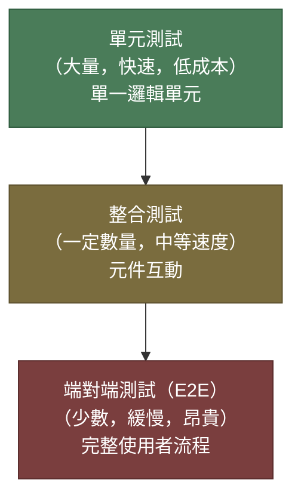

# [BEE-340] 測試金字塔

:::info
以金字塔的形狀建構測試套件：底層有大量快速的單元測試，中層有一定數量的整合測試，頂層只保留少數端對端測試。
:::

## 背景

自動化測試並非免費。你所撰寫的每一個測試都有成本：撰寫時間、執行時間、維護負擔，以及理解失敗原因的認知開銷。問題不在於是否要測試，而在於如何在不同種類的測試之間分配投入，以最大化信心同時控制成本。

缺乏明確策略的情況下，團隊往往會傾向於當下看起來最有成效的測試方式。結果是測試套件失去平衡：執行緩慢、脆弱，或存在大片覆蓋空白。

**測試金字塔**（Test Pyramid）由 Mike Cohn 在《Succeeding with Agile》（2009）中提出，並由 Martin Fowler 廣泛推廣。它提供了一個簡單的心智模型，用於平衡速度、信心與成本。金字塔將自動化測試分為三個層次，並規定底層測試應數量最多、中層次之、頂層最少。

## 原則

**以金字塔形狀建構測試套件：大量的單元測試、一定數量的整合測試，以及少量且經過篩選的端對端測試。**

金字塔的每一層服務於不同目的。較低層的測試更快、更便宜、更具隔離性；較高層的測試能提供更高的信心，但代價是速度較慢且更易產生不穩定性。健康的測試套件三層兼備，盡量在低層發現更多失敗，僅在高層測試那些只有它們才能驗證的場景。

## 三個層次



### 單元測試 — 底層

單元測試針對單一函式、類別或模組進行隔離測試。外部依賴（資料庫、網路呼叫、檔案系統）以測試替身（Test Double）取代（參見 BEE-344）。

| 屬性 | 說明 |
|---|---|
| 範圍 | 單一函式或類別 |
| 速度 | 每個測試數毫秒 |
| 隔離性 | 完整（無 I/O，無網路） |
| 數量 | 數百至數千 |
| 能發現什麼 | 邏輯錯誤、邊界條件、資料驗證錯誤 |
| 無法發現什麼 | 整合失敗、設定問題 |

單元測試是基礎，因為它們執行夠快，足以在每次存檔時於監看模式中全部跑完，且失敗時能精準指向單一單元，維護成本低。代價是：即使所有單元測試通過，系統在生產環境仍可能失敗——沒有任何東西驗證過各部件如何協作。

單元測試**必須**（MUST）測試行為，而非實作細節。每次重新命名內部變數就失敗的測試，毫無價值卻帶來高昂的維護成本。

### 整合測試 — 中層

整合測試驗證兩個或多個元件能正確協作。它們允許真實的 I/O：測試可能寫入真實資料庫（透過測試容器）、呼叫真實 HTTP 端點，或操作訊息佇列。

| 屬性 | 說明 |
|---|---|
| 範圍 | 多個互動元件 |
| 速度 | 數百毫秒至數秒 |
| 隔離性 | 部分（真實基礎設施，第三方服務使用 Mock） |
| 數量 | 數十至數百 |
| 能發現什麼 | ORM 映射錯誤、SQL 約束違反、序列化不符、服務間合約違規 |
| 無法發現什麼 | 完整使用者流程、多系統工作流程 |

整合測試填補了單元測試留下的空白。單元測試能驗證訂單驗證邏輯是否正確拒絕負數數量，但只有整合測試才能驗證該驗證錯誤是否透過 HTTP 層正確回傳，並寫入稽核日誌。

整合測試**應該**（SHOULD）使用輕量級基礎設施（如 Testcontainers、記憶體資料庫或本地 Docker Compose），使其快到足以在 CI 中執行，而不需要特殊的基礎設施。

### 端對端測試 — 頂層

端對端測試（E2E）以真實使用者或外部客戶端的方式驅動系統：HTTP 請求進入，流經所有服務，觸及真實資料庫，並產生可觀察的結果。一切都是真實的，沒有任何 Mock。

| 屬性 | 說明 |
|---|---|
| 範圍 | 完整系統或主要子系統 |
| 速度 | 每個測試數秒至數分鐘 |
| 隔離性 | 無（需要完整技術棧） |
| 數量 | 每條關鍵使用者流程少數幾個 |
| 能發現什麼 | 部署設定錯誤、跨服務資料合約中斷、完整流程回歸 |
| 無法發現什麼 | 邊界條件、失敗模式（速度太慢，無法全面測試） |

E2E 測試提供最高的信心，因為它們以系統實際執行的方式測試。但也帶來最高的成本：需要運行中的環境、速度慢，且最容易產生**不穩定性**（Flakiness）——由於時序問題、外部依賴或測試環境不穩定所造成的間歇性失敗（詳見下方不穩定測試章節）。

E2E 測試數量**必須**（MUST）保持精簡，且**必須**（MUST）只覆蓋關鍵的、高價值的使用者流程。不得使用 E2E 測試覆蓋屬於低層的各種排列情境。

## 實際範例：訂單建立

以一個訂單服務為例：接收 HTTP 請求、驗證訂單、寫入資料庫，並發布事件。

### 單元測試

```
測試：OrderValidator.validate() 應拒絕數量為負數的訂單
輸入：{ productId: "abc", quantity: -1, price: 10.00 }
斷言：拋出 ValidationError("quantity must be positive")
依賴：無（純函式）
能發現：驗證邏輯中的錯誤
無法發現：HTTP 層是否實際呼叫了 validate()
```

### 整合測試

```
測試：POST /orders 應將訂單寫入資料庫並回傳 201
設定：透過 Testcontainers 啟動測試資料庫
輸入：透過 HTTP 傳入有效的訂單 payload
斷言：回應為 201，DB 中存在正確欄位的訂單記錄
依賴：真實資料庫、真實 HTTP 處理器、Mock 事件發布者
能發現：ORM 映射錯誤、缺失的 DB 約束、錯誤的 HTTP 狀態碼
無法發現：發布的事件是否被下游正確消費
```

### 端對端測試

```
測試：下訂單後應更新庫存並觸發確認郵件
設定：完整服務技術棧運行中（訂單、庫存、通知服務）
步驟：POST /orders → 輪詢庫存服務確認庫存減少 → 確認郵件佇列
斷言：庫存依訂單數量減少，郵件佇列中有包含正確訂單 ID 的郵件
依賴：所有服務為真實服務，所有資料庫為真實資料庫
能發現：跨服務資料合約中斷、部署設定錯誤
無法發現：邊界條件（由單元/整合測試覆蓋）
```

每一層都能發現下面各層無法發現的問題。三者合力提供全面覆蓋，而不需要每個場景都跑過完整技術棧。

## 替代方案：測試獎盃（Test Trophy）

Kent C. Dodds 提出了**測試獎盃**（Testing Trophy）作為金字塔的改良版本，特別適用於 JavaScript 應用程式。獎盃的整合層較寬，並在底部增加了一層薄薄的**靜態分析**（型別檢查、Lint）。

核心原則：*「你的測試愈接近軟體實際被使用的方式，它們能給你的信心就愈高。」*（[kentcdodds.com](https://kentcdodds.com/blog/the-testing-trophy-and-testing-classifications)）

在獎盃模型中，整合測試是最厚的一層——而非單元測試——因為現代工具（Jest、Vitest、Testing Library）使整合風格的測試幾乎和純單元測試一樣快。

對於擁有真實 I/O 邊界的後端服務，金字塔模型仍是更常見的框架。獎盃更適用於前端情境，其中元件與其渲染 DOM 之間的「整合」是主要關注點。

## Google 的測試規模分類

Google 使用基於維度的分類法——**小（Small）、中（Medium）、大（Large）**——與金字塔模型有所重疊但不完全相同。Google 方法的關鍵洞察是：測試的*範圍*與測試的*速度*是兩個獨立的維度，兩者都很重要。

| Google 規模 | 允許的 I/O | 對應金字塔層次 |
|---|---|---|
| 小（Small） | 無（不允許網路、磁碟、sleep） | 單元測試 |
| 中（Medium） | 僅 localhost（資料庫、本地 HTTP） | 整合測試 |
| 大（Large） | 任何外部系統 | E2E / 系統測試 |

Google 的分類法在基礎設施層面強制執行約束：若「小」測試開啟了網路 socket，測試執行器會直接拒絕，而不只是靠慣例約束。這種嚴格性防止測試在悄悄加入依賴時變得越來越慢。（[testing.googleblog.com](https://testing.googleblog.com/2010/12/test-sizes.html)）

實務啟示：在自己的專案中為每個測試層次定義明確的約束——不只是測試做什麼，更包括它被允許接觸哪些基礎設施。

## 不穩定測試及其代價

**不穩定測試**（Flaky Test）是指在沒有任何程式碼變更的情況下，連續執行會產生不同結果的測試。不穩定性在 E2E 測試中最為常見，但在任何層次都可能出現。

不穩定測試不只是令人惱火——它們是危險的。當團隊學會重新執行失敗的測試直到通過，測試套件就失去了發出真實問題訊號的能力。一個充滿不穩定測試的套件，是一個沒有人信任的套件。

常見的不穩定性來源：

| 來源 | 常見層次 | 解決方式 |
|---|---|---|
| 非同步程式碼中的競態條件 | 單元、整合 | 使用正確的非同步斷言；避免任意 sleep |
| 依賴時序的斷言 | E2E | 斷言結果而非時序；使用帶逾時的重試 |
| 共用測試資料 | 整合、E2E | 使用每個測試獨立的資料建立與清除；避免共用狀態 |
| 測試間有順序依賴 | 任何層次 | 確保測試互相獨立；隨機化執行順序 |
| 外部服務可用性 | E2E | 在邊界處 Mock 或 Stub 第三方服務 |
| 非確定性資料（UUID、時間戳記） | 單元 | 注入時鐘與 ID 產生器；斷言形狀而非值 |

團隊**必須**（MUST）將不穩定測試視為 Bug，而非小麻煩。不穩定測試**應該**（SHOULD）被修復或刪除——而不是重新執行直到通過。每一個存活下來的不穩定測試都在侵蝕整個套件的信心。

## 決定你的測試分布

沒有普遍正確的比例，但一個有用的起點是：

- **單元測試**：約 70% 的套件
- **整合測試**：約 20%
- **E2E 測試**：約 10%

這些數字是指引，不是規則。正確的分布取決於你的系統架構、整合基礎設施的速度，以及不同失敗模式的風險輪廓。

在每一層都要問：**較低層的測試是否能以足夠的信心發現這個失敗？** 如果是，就往下推。如果否——因為這個失敗只有在真實系統互動時才會出現——就往上移。

## 常見錯誤

### 1. 冰淇淋甜筒反模式

金字塔的反面：大量 E2E 測試、少量整合測試、幾乎沒有單元測試。這是以手動方式測試、再將手動測試腳本自動化的團隊的自然形狀。套件緩慢、脆弱且維護成本高昂。症狀：CI 需要超過 30 分鐘、不穩定失敗是常態、開發者只在合併前才執行測試。

### 2. 測試實作細節而非行為

斷言內部狀態（`expect(validator._cache.size).toBe(1)`）或方法呼叫順序的單元測試，將測試耦合到實作而非行為。這些測試在重構時失敗，卻不代表真正的回歸。測試程式碼**做什麼**，而非**如何做**。

### 3. 跳過整合測試

「我所有的單元測試都通過了，所以系統沒問題。」單元測試通過只是因為你的 Mock 是正確的——它們無法證明你的資料庫查詢回傳你認為的結果、你的 HTTP client 正確序列化了請求體，或你的事件處理器以正確順序處理訊息。整合測試才能彌補這個缺口。

### 4. 大家都忽視的不穩定 E2E 測試

一個有已知不穩定測試的測試套件，是一個正在衰退的套件。一旦團隊學會重新執行直到綠燈，整個安全訊號就被破壞了。如果不穩定測試無法修復，就刪除它，並以針對性的整合測試替代，覆蓋相同的行為。

### 5. 以 100% 程式碼覆蓋率為目標

程式碼覆蓋率衡量的是測試期間是否執行了某些程式碼行，而非是否正確驗證了行為。一個執行了每一行但沒有任何斷言的測試可以達到 100% 覆蓋率。覆蓋率是找出**未測試程式碼**的有用訊號，不是測試品質的衡量標準。設定最低門檻（例如 80%）作為下限，而非目標。追求 100% 覆蓋率會驅使團隊撰寫毫無意義、增加不了任何信心的測試。

## 相關 BEE

- **BEE-341**（後端服務的整合測試）— 使用真實資料庫和測試容器撰寫整合測試的詳細指引
- **BEE-342**（合約測試）— 無需執行完整 E2E 套件即可驗證跨服務合約
- **BEE-343**（負載測試與基準測試）— 功能測試金字塔之外的效能驗證
- **BEE-344**（測試替身：Mock、Stub、Fake）— 如何隔離金字塔底層的單元，同時不損害測試價值

## 參考資料

- Mike Cohn, *Succeeding with Agile: Software Development Using Scrum*, Addison-Wesley (2009) — 測試金字塔原始描述
- Martin Fowler, *Test Pyramid*, martinfowler.com/bliki/TestPyramid.html (2012)
- Ham Vocke, *The Practical Test Pyramid*, martinfowler.com/articles/practical-test-pyramid.html (2018)
- Google Testing Blog, *Test Sizes*, testing.googleblog.com/2010/12/test-sizes.html (2010)
- Google Testing Blog, *Just Say No to More End-to-End Tests*, testing.googleblog.com/2015/04/just-say-no-to-more-end-to-end-tests.html (2015)
- Kent C. Dodds, *The Testing Trophy and Testing Classifications*, kentcdodds.com/blog/the-testing-trophy-and-testing-classifications
- Kent C. Dodds, *Write tests. Not too many. Mostly integration.*, kentcdodds.com/blog/write-tests
