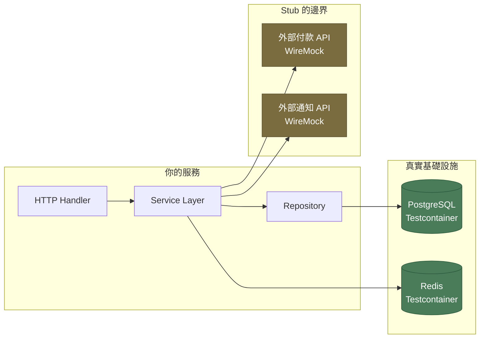

# [BEE-341] 後端服務的整合測試

:::info
整合測試驗證真實元件能否正確協同運作。透過 Testcontainers 使用真實資料庫、在邊界處 stub 外部 API，並在每次測試之間明確清理測試資料。
:::

## 情境

單元測試能快速驗證邏輯是否在隔離環境中正確運作。但單元測試無法告訴你程式碼是否能正確與資料庫、快取、訊息佇列或 HTTP client 整合。那些整合點才是線上環境 bug 的來源。

整合 bug 之所以棘手，正是因為它們對單元測試完全透明。一個 ORM mapping 可能語法上完全正確，但卻產生違反資料庫約束的查詢。序列化器可能序列化無誤，卻漏掉下游服務依賴的欄位。交易邊界若設置不當，服務呼叫所寫入的資料可能對後續讀取不可見。這些問題在單元測試中通通不會出現。

整合測試的存在就是為了捕捉這類失敗。它讓多個元件協同運作——應用程式碼、真實基礎設施，以及它們之間的邊界——在一個盡量貼近正式環境的受控環境中執行。

挑戰在於控制這個環境：如何在不變得緩慢、不穩定或需要手動設定的情況下，為每次測試執行啟動一個真實資料庫？如何隔離測試資料，讓測試之間不互相干擾？

現代工具——尤其是 [Testcontainers](https://testcontainers.com/guides/introducing-testcontainers/)——已大致解決了基礎設施的問題。剩下的挑戰是紀律：定義哪些要真實、哪些要 stub、管理測試資料的生命週期，以及以可在 CI 中擴展的方式執行測試。

## 原則

**整合測試必須對受測元件使用真實基礎設施，僅 stub 不在你控制範圍內的外部依賴，並在每次測試之間明確清理測試資料。**

## 整合測試驗證什麼

整合測試在測試金字塔（參見 [BEE-340](340.md)）中介於單元測試和端對端測試之間。它的範圍是刻意設定的：每次測試一個整合邊界，或構成有意義單元的一小群元件。

具體來說，後端服務的整合測試驗證：

- SQL 查詢在真實資料庫（具有真實 schema 和約束）上是否產生正確結果
- ORM entity mapping 是否與實際資料庫欄位一致
- HTTP request handler 是否正確反序列化輸入、傳遞給服務層，並回傳正確的狀態碼和回應主體
- 資料庫交易在正確條件下是否提交或回滾
- 發布到訊息佇列的事件是否包含預期的資料

整合測試**不**驗證：完整的多服務工作流程（那是端對端測試的範疇），或你的團隊不擁有的外部系統行為（那是契約測試的範疇——參見 [BEE-341](341.md)）。

## 整合測試的範圍



你的服務所擁有和控制的基礎設施（資料庫、快取、訊息佇列）是**真實的**。你的團隊不擁有或不控制的外部服務是**被 stub 的**。判斷準則：凡是測試環境與正式環境的行為差異會導致 bug 的，就用真實的；凡是測試重點不在該系統行為的，就 stub 掉。

## 使用真實資料庫測試：Testcontainers

[Testcontainers](https://testcontainers.com/guides/introducing-testcontainers/) 是一個在測試程式碼中以程式方式啟動 Docker 容器的函式庫。它讓你無需手動設定，即可在每次測試執行時獲得一個全新的真實資料庫——PostgreSQL、MySQL、MongoDB、Redis 等。

Testcontainers 管理的資料庫的關鍵特性：

- **與正式環境相同的資料庫引擎。** 消除了 PostgreSQL 與 H2（或 SQLite）之間的行為差異。約束、索引行為、JSON 運算子和交易隔離層級的表現都與正式環境完全一致。
- **每次測試執行獨立隔離。** 每次測試執行獲得一個全新容器（或在測試之間重置容器）。不會繼承前一次測試執行的狀態。
- **動態連接埠。** Testcontainers 指定隨機連接埠；連線字串在執行時從容器物件讀取。不要寫死連接埠。
- **固定版本。** 使用與正式環境相同的資料庫版本（`postgres:15.2`，而非 `postgres:latest`）。測試與正式環境之間的版本漂移是細微 bug 的來源。

### 為什麼記憶體資料庫很危險

H2、SQLite 等記憶體資料庫常被用作測試中真實資料庫的「快速替代品」。這是最常見的整合測試錯誤之一，會產生一類特定的 bug：在 CI 中針對記憶體 DB 的測試通過，但應用程式在正式環境的真實 DB 上卻失敗。

導致此問題的行為差異：

| 功能 | PostgreSQL | H2（記憶體） |
|---|---|---|
| JSON/JSONB 運算子 | 完整支援 | 有限 / 語法不同 |
| 視窗函數 | 完整支援 | 部分 |
| `ON CONFLICT DO UPDATE` | 支援 | 不支援 |
| 嚴格型別轉換 | 強制執行 | 較寬鬆 |
| 約束時序（`DEFERRABLE`） | 支援 | 不支援 |
| 識別碼大小寫敏感性 | 可設定 | 預設值不同 |

[testcontainers.com 的 H2 替換指南](https://testcontainers.com/guides/replace-h2-with-real-database-for-testing/)對此有詳細說明。請使用真實的資料庫引擎。

## Stub 外部服務：WireMock

對於外部 API——付款閘道、通知服務、第三方資料提供商——你不希望在測試中呼叫真實系統。目標不是測試付款提供商的 API 是否正常運作；而是測試你的程式碼是否正確處理它收到的回應。

[WireMock](https://wiremock.org/) 是在整合測試中 stub HTTP 外部服務的標準工具。它啟動一個 HTTP 伺服器，你可以設定它針對特定請求模式回傳特定回應。

```
WireMock 設定範例：
  POST /v1/payments/charge
    當請求主體符合 { "amount": 5000, "currency": "USD" }
    回傳 200 { "transactionId": "tx_abc123", "status": "approved" }

  POST /v1/payments/charge
    當請求主體符合 { "amount": 999999 }
    回傳 402 { "error": "insufficient_funds" }
```

這讓你可以測試錯誤處理路徑——網路逾時、4xx 錯誤、意外的回應格式——而無需依賴可能在 CI 中不可用或有速率限制的第三方沙箱環境。

WireMock 也用於**契約測試**（參見 [BEE-341](341.md)），其中 stub 是從共享契約派生，而非手動撰寫。

## 測試資料管理

測試資料的管理方式決定了整合測試是否可靠且相互獨立。

### Fixture 與 Factory

**Fixture** 是在測試執行前插入資料庫的預定義資料集。Fixture 簡單但脆弱：它們往往隨時間增長、在測試間共享，並在測試之間產生隱式依賴。

**Factory** 是一個建立領域物件並持久化的函數，具有合理的預設值但可覆寫：

```
OrderFactory.create()
  → 以預設值插入一個有效訂單

OrderFactory.create({ status: "cancelled", userId: "user-42" })
  → 插入一個屬於 user-42 的已取消訂單
```

Factory 是大多數整合測試的首選方法。每個測試只建立它需要的資料，僅此而已。沒有隱式共享狀態，撰寫新測試前也不需要了解共享 fixture 的內容。

### 測試隔離：交易回滾 vs. 截斷

每次測試後，資料庫必須恢復乾淨狀態。有兩種策略：

**交易回滾**：將每個測試包裝在一個資料庫交易中，執行測試，然後回滾。資料庫在幾毫秒內恢復到測試前的狀態。

- 優點：速度快（每次測試約 2–4ms 開銷，相比截斷的 20–50ms），不留殘餘狀態
- 缺點：當測試本身驗證提交行為時不適用。將測試包裝在始終回滾的父交易中，意味著服務的內部 `COMMIT` 實際上從未持久化——測試在交易上下文中通過，但從未測試到提交路徑。

**截斷**：每次測試後，截斷所有資料表（或定義的子集）並重置序列。

- 優點：無論受測程式碼是否提交交易都能運作；準確反映正式環境行為
- 缺點：較慢；需要追蹤哪些資料表需要截斷；外鍵約束需要謹慎排序

規則：僅在測試不驗證提交行為時使用交易回滾。對於測試交易程式碼路徑的情況，使用截斷（或刪除）。永遠不要讓清理工作依賴機率。

### 測試之間不共享測試資料

測試間共享資料庫狀態——即測試 B 依賴測試 A 建立的資料——是整合測試不穩定的主要原因。若測試以不同順序執行，或測試 A 失敗，測試 B 就會因無關原因而失敗。

每個測試必須在自己的設定階段建立所有需要的資料，並在自己的拆卸階段進行清理。測試不得依賴其他測試的執行順序。

## 實際範例：訂單建立端點

此範例展示 `POST /orders` 端點整合測試的完整生命週期，該端點在 PostgreSQL 中建立訂單並發布事件。

```
測試：POST /orders 建立訂單並發布事件

設定（SETUP）
  1. 啟動 PostgreSQL 容器（Testcontainers，postgres:15.2）
  2. 對容器執行 schema migrations
  3. 啟動 WireMock，設定付款 stub 回傳核准
  4. 植入前置資料：使用者 "user-42"、商品 "prod-99"（庫存充足）
  5. 在訊息佇列上註冊測試監聽器

執行（EXECUTE）
  6. POST /orders
     請求主體：{ userId: "user-42", productId: "prod-99", quantity: 2 }

驗證（ASSERT）
  7. 回應狀態碼：201
  8. 回應主體包含 orderId（UUID 格式）
  9. 資料庫：orders 資料表有一筆記錄，userId="user-42"，status="confirmed"
  10. 資料庫：inventory 資料表中商品 "prod-99" 的庫存減少 2
  11. 事件：OrderCreated 事件已發布，包含正確的 orderId、userId、productId
  12. WireMock：付款端點被呼叫一次，金額正確

清理（CLEANUP）
  13. 截斷 orders、inventory_reservations 資料表
  14. 重置序列
  （或：若未測試提交行為，回滾包裝交易）
```

測試範圍是精確的：一次 HTTP 呼叫、一個服務、一個資料庫、一個 stub 外部 API、一個事件驗證。不依賴庫存服務、通知服務或真實付款閘道的執行。

## CI Pipeline 整合

整合測試比單元測試需要更多基礎設施，執行速度也較慢。它們必須作為 CI pipeline 中的獨立階段處理，不能與單元測試混合。

建議的 CI 結構：

```
階段 1：unit-tests
  - 無 I/O，無容器，無網路
  - 跨所有模組並行執行
  - 必須在 2 分鐘內完成

階段 2：integration-tests
  - Testcontainers、WireMock
  - 可使用每次測試資料隔離並行執行
  - 中型服務應在 10 分鐘內完成

階段 3：e2e-tests（PR 可選，main 必須）
  - 完整堆疊，完整環境
  - 整合測試通過後才執行
```

階段 1 和階段 2 的失敗會阻擋合併。階段 3 可延遲到合併至 main 後執行，以避免阻擋短命的 PR。

### 並行測試執行

若每個測試都完全隔離，整合測試可以並行執行。並行執行的隔離要求：

- 每個並行 worker 必須使用獨立的資料庫 schema 或獨立容器
- 一個 worker 建立的測試資料不得對另一個 worker 可見
- 動態連接埠指定（Testcontainers 的預設行為）自動防止連接埠衝突

[Testcontainers 最佳實踐指南](https://www.docker.com/blog/testcontainers-best-practices/)建議在每個測試類別（而非每個測試方法）共享一個容器，並使用交易回滾或每次測試的 factory 來實現隔離，而無需承擔每次測試啟動新容器的開銷。

## 常見錯誤

### 1. 使用記憶體資料庫代替真實資料庫

H2、SQLite 等記憶體資料庫與 PostgreSQL 或 MySQL 的行為並不完全相同。針對 H2 通過的測試，在測試環境的 PostgreSQL 上往往會失敗。修復因約束差異或 JSON 運算子不相容導致的線上 bug，其代價遠遠超過 Testcontainers 帶來的較慢 CI 執行。

**修正方法**：使用 Testcontainers，搭配與正式環境相同的資料庫引擎和版本。在所有整合測試中用真實資料庫取代 H2。

### 2. 測試之間共享測試資料

讀取由其他測試建立的資料的測試，會依賴執行順序。當測試並行執行或順序改變時，會因與程式碼變更無關的原因而失敗。

**修正方法**：每個測試透過 factory 建立自己的資料。測試不讀取非自己建立的資料（不可變的參考資料除外，這類資料在套件設定時一次性植入）。

### 3. 測試之間沒有清理

一個測試寫入的資料洩漏到下一個測試。測試單獨執行時通過，但作為套件執行時失敗。

**修正方法**：實施明確的清理策略（交易回滾或截斷），在每次測試後執行，包括失敗的測試。使用無條件執行的 `afterEach` / `tearDown` 鉤子。

### 4. 整合測試在 CI 中過慢

需要 45 分鐘的測試套件不會有人執行。慢速測試在本地被跳過，CI 的回饋來得太晚。

**修正方法**：盡可能並行化；在同一類別的測試間共享容器；在安全的情況下使用交易回滾（而非截斷）；分析慢速測試並消除不必要的設定。

### 5. Mock 資料庫

Mock 資料庫的測試不是整合測試——它是加了多餘步驟的單元測試。你得不到 ORM 行為、SQL 查詢正確性、約束強制執行或連線池行為的覆蓋率。

**修正方法**：如果你發現自己在標記為「整合測試」的測試中 mock repository 層，要麼將測試移至單元測試套件，要麼移除 mock 並使用 Testcontainers。

## 相關 BEE

- [BEE-340](340.md)（測試金字塔）——整合測試在均衡測試策略中的角色
- [BEE-341](341.md)（外部服務的契約測試）——WireMock stub 如何連接到共享契約以捕捉 API 漂移
- [BEE-341](341.md)（測試替身：Mock、Stub、Fake）——何時在整合測試中使用測試替身，以及何時它們會損害測試價值

## 參考資料

- Martin Fowler，*Integration Test*，martinfowler.com/bliki/IntegrationTest.html
- Martin Fowler，*Testing Strategies in a Microservice Architecture*，martinfowler.com/articles/microservice-testing/
- Ham Vocke，*The Practical Test Pyramid*，martinfowler.com/articles/practical-test-pyramid.html（2018）
- Testcontainers，*Introducing Testcontainers*，testcontainers.com/guides/introducing-testcontainers/
- Testcontainers，*Replace H2 with a Real Database for Testing*，testcontainers.com/guides/replace-h2-with-real-database-for-testing/
- Docker，*Testcontainers Best Practices*，docker.com/blog/testcontainers-best-practices/
- Microsoft ISE Developer Blog，*Integration Testing with Testcontainers*，devblogs.microsoft.com/ise/testing-with-testcontainers/
- Gerard Meszaros，*Transaction Rollback Teardown*，xunitpatterns.com/Transaction%20Rollback%20Teardown.html
