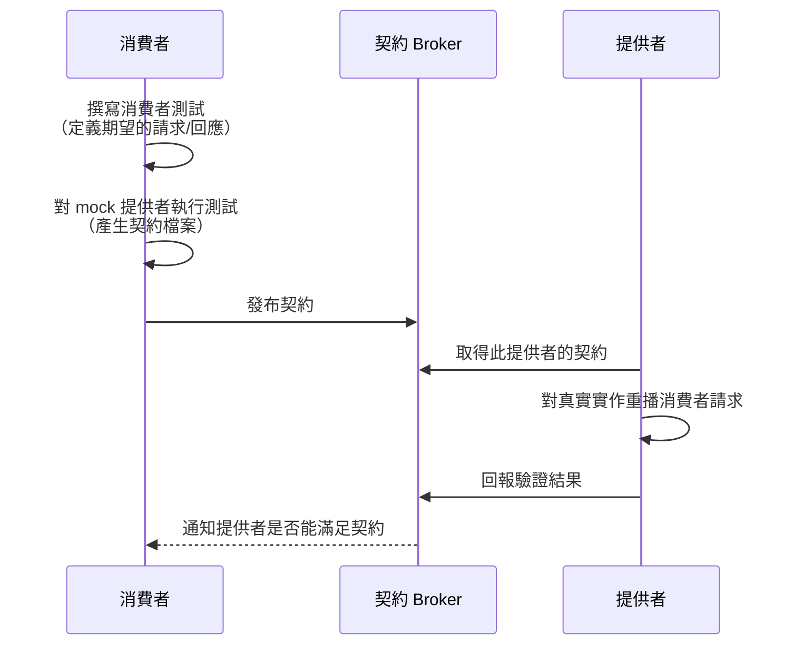

# [BEE-342] 契約測試

:::info
契約測試驗證消費者與提供者之間的通訊協議是否被遵守——無需同時部署兩個服務。用它來在進入生產環境前發現 API 的破壞性變更。
:::

## 背景

當系統拆分為多個服務後，生產環境中最常見的故障來源不是服務內部的邏輯錯誤，而是兩個服務之間邊界上的不匹配。一個團隊修改了回應的結構，改了欄位名稱，或是移除了某個端點。消費方服務因此中斷。沒有任何一個團隊預見到這個問題，因為各自的測試都是獨立執行的。

傳統的解決方案是整合測試：將兩個服務部署到共享環境中一起測試。但這種方式有自身的問題。共享環境部署緩慢、維護成本高、難以保持穩定。它需要跨團隊協調。當測試失敗時，通常難以判斷是哪個服務造成的。而且因為兩個服務都必須部署，回饋總是來得很晚——在程式碼已經通過多個 CI 階段之後。

契約測試解決的是一個更窄的問題：它驗證消費者對提供者的期望是否被滿足，以及提供者的實作是否能滿足所有消費者的期望——無需同時部署兩個服務，無需共享環境，並為兩個團隊提供快速、獨立的回饋。

關鍵洞察在於，大多數跨服務故障並不涉及複雜的業務邏輯——它們只是關於結構（shape）。一個欄位被改名了。一個狀態列舉值被移除了。一個必填參數被新增了。這些問題都可以透過比較契約（消費者期望的內容）與實作（提供者實際產出的內容）來發現，而無需執行任何業務邏輯。

## 原則

**在每個服務邊界定義明確的契約。消費者發布其期望。提供者在每次 CI 執行時驗證自己能滿足這些期望。任何違反契約的變更都會在部署前讓建置失敗。**

## 契約測試驗證什麼

契約測試驗證服務互動的**結構與語義**——而非業務行為。這個區別至關重要。

| 關注點 | 契約測試 | 整合測試 |
|---|---|---|
| 回應欄位名稱與型別 | 是 | 是 |
| 必填欄位存在 | 是 | 是 |
| HTTP 狀態碼 | 是 | 是 |
| 業務邏輯正確性 | 否 | 是 |
| 呼叫後的資料庫狀態 | 否 | 是 |
| 多服務編排 | 否 | 是（E2E） |

契約測試在測試金字塔中位於單元測試與整合測試之間（見 BEE-340）。它比整合測試更快、更便宜，因為它不需要共享環境。它涵蓋了單元測試無法處理的缺口：兩個獨立部署服務之間的通訊邊界。

## 消費者驅動契約

在消費者驅動契約中，**消費者**指定它需要從提供者取得什麼，並將該規格發布為契約。提供者隨後驗證自己是否能滿足這份契約。

這顛覆了傳統模式——過去是提供者發布完整的 API 規格，然後希望所有消費者都能正確使用。現在，每個消費者精確聲明它所使用的內容——且僅限於它實際使用的部分。提供者不會因為其 API 中沒有消費者依賴的部分發生變更而承擔額外負擔。

整體流程如下：



Broker 是協調的核心。它儲存所有契約，並追蹤哪些提供者版本已針對哪些消費者版本完成驗證。團隊可以向它查詢：「將消費者 v2.3 對照提供者 v1.7 部署是安全的嗎？」

### 為何採用消費者驅動

當提供者新增一個欄位時，現有的消費者契約不會被破壞——消費者只測試它們使用的欄位。當提供者移除或重命名一個欄位時，只有依賴該欄位的消費者才會在契約驗證中失敗。這給提供者提供了精確、可執行的回饋：「您無法從付款回應中移除 `amount`，因為訂單服務依賴它。」

## 提供者驅動契約：基於 Schema 的驗證

互補的模式是**提供者驅動**：提供者發布一個 schema（通常是 OpenAPI 文件），每個消費者驗證自己的使用方式是否符合該 schema。契約的流向是反向的——從提供者到消費者。

這比消費者驅動契約的粒度更粗，但在大規模採用時更容易推行。提供者的 OpenAPI 規格成為契約，消費者在測試套件中執行 schema 驗證，確保自己沒有以違反 schema 的方式使用 API。

基於 schema 的契約測試特別適用於：

- 消費者團隊不在您組織掌控範圍內的公開或合作夥伴 API
- 早期 API 設計回饋（先設計 schema，在程式碼存在前就對其進行驗證）
- 發現消費者使用了未記錄或已棄用的 API 功能

這兩種方式互為補充。消費者驅動契約讓提供者能細粒度地了解每個消費者的使用情況。基於 schema 的驗證讓消費者擁有清晰的機器可讀規格來進行驗證。團隊通常會同時使用兩者。

## Pact：消費者驅動契約的標準框架

[Pact](https://docs.pact.io/) 是消費者驅動契約測試的事實標準。它支援多種語言（Java、JavaScript、Python、Go、Ruby、.NET 等），並提供完整的工具鏈：消費者測試函式庫、契約檔案格式（JSON）、契約 broker（Pactflow 或自架）、以及提供者驗證工具。

Pact 引入的概念具有廣泛適用性，即使團隊使用的是不同的工具：

- **Pact 檔案**：一個描述一組互動的 JSON 文件。每個互動包含請求（方法、路徑、標頭、body）和期望的回應（狀態、標頭、body）。由消費者測試產生。
- **Pact broker**：儲存 pact 檔案、追蹤哪些提供者版本已驗證哪些消費者版本，並提供「可以部署嗎？」查詢的服務。
- **提供者驗證**：提供者 CI 任務取得 pact 檔案，並對真實的提供者實作重播每個請求，斷言回應是否符合契約。
- **Pending pacts**：一種讓新消費者契約不立即阻擋提供者 CI 的機制（提供者有時間在失敗前實作新需求）。
- **Webhooks**：broker 可以在新消費者契約發布時觸發提供者 CI，使驗證自動且快速。

這裡描述 Pact 是作為概念框架，而非商業推薦。這些模式適用於您團隊使用的任何工具。

## 實際範例：訂單服務與付款服務

訂單服務（消費者）呼叫付款服務（提供者）來為訂單收費。消費者需要知道付款 ID、狀態和實際收費金額。

### 消費者定義契約

訂單服務撰寫一個消費者測試，內容如下：

```
消費者: 訂單服務
提供者: 付款服務

互動: 為訂單收費
  前提: 付款服務可用
  請求:
    method: POST
    path: /payments
    headers: { Content-Type: application/json }
    body: { orderId: "ord-123", amount: 5000, currency: "USD" }
  期望回應:
    status: 200
    body:
      id: <字串，UUID 格式>
      status: "approved"
      amount: 5000
```

當此消費者測試執行時，它不會呼叫真實的付款服務。Pact 啟動一個 mock 提供者並回傳期望的回應，消費者測試驗證訂單服務是否正確處理此回應。這個互動被記錄到 pact 檔案中。

### 提供者驗證契約

付款服務 CI 取得 pact 檔案，並對真實的付款服務實作重播請求：

```
重播: POST /payments { orderId: "ord-123", amount: 5000, currency: "USD" }

實際回應:
  status: 200
  body: { id: "pay-abc", status: "approved", amount: 5000 }

契約要求:
  id: 字串 (UUID) -- 符合
  status: "approved" -- 符合
  amount: 5000 -- 符合

結果: 通過
```

### 當提供者移除 `amount` 時發生了什麼

一位新的付款服務開發者重構了回應，只回傳 `id` 和 `status`，將 `amount` 以「冗餘」為由移除（消費者已在請求中傳送了金額，為何要在回應中再傳回？）。

```
重播: POST /payments { orderId: "ord-123", amount: 5000, currency: "USD" }

實際回應:
  status: 200
  body: { id: "pay-abc", status: "approved" }

契約要求:
  amount: 5000 -- 期望存在，但實際回應中不存在

結果: 失敗 -- 契約要求欄位 "amount" 但回應中未包含此欄位
```

付款服務 CI 失敗。這個變更在部署前被阻擋。付款服務開發者現在知道訂單服務依賴 `amount`，必須在進行此變更前與該團隊協調。他們有兩個選項：保留該欄位，或與訂單服務協商一個新的契約版本（API 版本控制策略請見 BEE-71）。

這就是契約測試的核心價值：破壞性變更在被引入的那一刻就被發現了，在付款服務自己的 CI pipeline 中，無需將任何一個服務部署到共享環境。

## CI 中的契約測試

契約測試要發揮價值，就必須在 CI 中持續執行——而不是偶爾想到才檢查。

### 消費者 CI pipeline

```
消費者 CI（訂單服務）
  1. 執行單元測試
  2. 執行消費者契約測試
     -- 產生 pact 檔案
  3. 將 pact 檔案發布到 broker
     （附上分支名稱和版本標籤）
  4. 查詢 broker：「我能將此消費者
     部署到 main 上的提供者版本嗎？」
     （若提供者尚未驗證此消費者則失敗）
```

### 提供者 CI pipeline

```
提供者 CI（付款服務）
  1. 執行單元測試
  2. 執行整合測試
  3. 從 broker 取得消費者契約
     （此提供者的所有契約）
  4. 對真實實作執行契約驗證
     -- 每個消費者契約被重播
  5. 向 broker 回報驗證結果
  6. 若任何契約未被滿足則讓建置失敗
```

### 「可以部署嗎？」查詢

Broker 追蹤哪些消費者-提供者版本對已被驗證。在部署前，每個服務向 broker 查詢：

```
我能將訂單服務 v2.3 部署到生產環境
並對照 main 上的付款服務 v1.7 嗎？

Broker: 可以 -- 付款服務 v1.7 已在 commit abc123
驗證了訂單服務 v2.3 的契約。
```

這將部署決策從「我認為這應該可以運作」轉變為「系統已驗證它能運作」。

## 使用 OpenAPI 的基於 Schema 契約測試

當提供者發布 OpenAPI 規格時，消費者可以在不撰寫明確消費者測試的情況下，針對 schema 驗證自己的 API 使用方式。

在這種情況下，契約就是 OpenAPI 文件。消費者在測試套件中執行驗證步驟：

```
Schema 驗證：訂單服務 --> 付款服務
  載入付款服務的 OpenAPI 規格 (v1.7)
  針對訂單服務對付款服務的每個呼叫：
    驗證請求符合 POST /payments 的 schema
    驗證回應處理涵蓋必填回應欄位

  結果: 通過 或 違規列表
```

這能發現：

- 消費者程式碼傳送了未記錄的請求欄位
- 消費者程式碼存取 schema 標示為 optional 的回應欄位時沒有 null 檢查
- 消費者程式碼未處理已記錄的錯誤回應狀態碼

基於 schema 的契約測試與 API 優先開發（見 BEE-71）整合良好：先設計 schema，消費者和提供者團隊都依照它實作，schema 成為共同的信任來源。

## 契約測試 vs 整合測試

這兩者是互補的，而非競爭關係。

| 維度 | 契約測試 | 整合測試 |
|---|---|---|
| 驗證什麼 | API 結構與語義 | 行為、狀態與完整元件互動 |
| 需要兩個服務同時運行 | 否 | 是 |
| 回饋速度 | 快（在提供者自己的 CI 中執行） | 較慢（需要共享環境） |
| 能發現業務邏輯錯誤 | 否 | 是 |
| 能發現破壞性變更 | 是 | 有時（只有整合測試套件涵蓋該路徑時） |
| 適合用於 | 及早發現 API 漂移 | 驗證元件互動 |

使用契約測試來及早、持續地發現結構不匹配。使用整合測試來驗證元件連接後的正確行為（見 BEE-341）。使用 E2E 測試驗證完整的使用者旅程。

契約測試確認 API 契約被滿足。整合測試確認使用該 API 的應用邏輯產生正確的結果。兩者都是必要的。

## 常見錯誤

### 1. 將契約測試當作整合測試的替代品

契約測試驗證 API 結構。它不驗證付款服務是否實際收取了正確的金額、訂單服務是否正確處理了付款失敗，或資料是否正確持久化。如果契約測試通過但跳過了整合測試，業務邏輯錯誤將進入生產環境。

**修正方式**：契約測試和整合測試服務於不同目的。兩者都要執行。契約測試在每個服務的 CI 中執行；整合測試在有真實基礎設施的受控環境中執行。

### 2. 過度指定契約

一個斷言精確回應值而非結構的契約是脆弱的。如果消費者測試以字面值斷言 `status: "approved"`，那麼每當提供者在測試資料下回傳 `"declined"` 時，契約就會失敗。同樣地，斷言精確的 UUID 值或時間戳記會讓每次驗證執行都失敗。

**修正方式**：斷言結構和型別，而非精確值。斷言 `id` 是 UUID 格式的字串，而非它等於 `"pay-abc"`。斷言 `amount` 是一個數字，而非它等於 5000（除非你在測試特定資料下的特定互動）。使用 matcher 函式而非字面值。

### 3. 沒有契約版本控制

當消費者的需求改變時，必須發布新的契約版本。如果契約被原地覆寫，提供者就無法區分「此消費者需要新的結構」與「此消費者仍可使用舊的結構」。

**修正方式**：為每個發布的契約附上消費者版本和分支標籤。在 broker 中保留歷史版本，讓提供者能驗證向下相容性。使用 broker 的「可以部署嗎？」API，而非手動追蹤哪些版本已被驗證。

### 4. 提供者未在 CI 中執行契約驗證

如果提供者只是偶爾或手動執行契約驗證，契約就會變得過時。提供者的實作逐漸偏離契約，驗證積累失敗，最終團隊停止執行它。

**修正方式**：讓契約驗證成為提供者 CI pipeline 的強制步驟，在每個 pull request 和每次合併到 main 時執行。將契約驗證失敗視同測試失敗：建置不得通過。

### 5. 只測試正常路徑的契約

消費者的錯誤處理是其行為的一部分。如果消費者遇到 `402 Payment Required` 會重試，但契約只指定了 `200` 的互動，那麼提供者可以改變 `402` 回應的結構而不會導致任何契約失敗——即使消費者的重試邏輯將會中斷。

**修正方式**：針對所有相關的互動類型撰寫消費者測試，包括消費者明確處理的錯誤回應。消費者處理的 `404`、`422`、`429` 和 `503` 回應都應有對應的契約互動。

## 相關 BEE

- **BEE-71**（API 版本控制）——如何在不破壞消費者的前提下演進提供者 API；契約測試讓破壞性變更變得可偵測
- **BEE-142**（Schema 演進）——以保持向下相容性的方式演進資料 schema 的策略
- **BEE-340**（測試金字塔）——契約測試在整合測試與單元測試之間的位置
- **BEE-341**（後端服務整合測試）——在契約測試驗證結構的地方測試行為的互補層

## 參考資料

- Ian Robinson, *Consumer-Driven Contracts: A Service Evolution Pattern*, martinfowler.com/articles/consumerDrivenContracts.html (2006)
- Martin Fowler, *Contract Test*, martinfowler.com/bliki/ContractTest.html
- Martin Fowler, *Testing Strategies in a Microservice Architecture*, martinfowler.com/articles/microservice-testing/
- Pact Documentation, *Introduction*, docs.pact.io
- Pactflow, *What is Consumer-Driven Contract Testing?*, pactflow.io/what-is-consumer-driven-contract-testing/
- Pactflow, *Contract Testing vs Integration Testing*, pactflow.io/blog/contract-testing-vs-integration-testing/
- Microsoft ISE Developer Playbook, *Consumer-Driven Contract Testing*, microsoft.github.io/code-with-engineering-playbook/automated-testing/cdc-testing/
