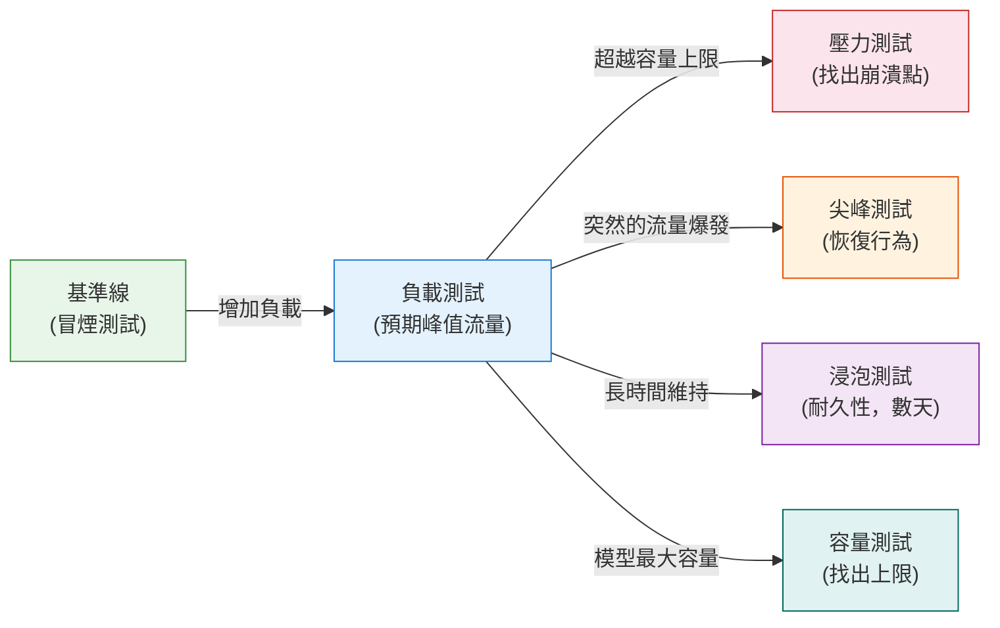

# [BEP-343] 負載測試與基準測試

:::info
負載測試用於驗證系統在真實流量下是否符合效能與可靠性目標。應使用百分位數而非平均值進行衡量，模擬接近生產環境的負載模式，並將測試整合至 CI 流程，以便在部署前發現效能退化。
:::

## 背景

一個通過所有單元測試、整合測試與契約測試的服務，在生產環境中仍可能出現災難性的失敗。一個全表掃描的資料庫查詢在測試資料只有 100 筆時無從察覺，但在 5000 萬筆資料時卻需要 8 秒。記憶體洩漏在 30 秒的測試執行中看不出來，卻會在持續 6 小時的流量後造成 OOM 崩潰。一個在 10 個並發使用者下平均 50ms 的 API 端點，在 500 個並發下可能變成 2 秒超時。

功能測試驗證的是正確性，負載測試驗證的是容量與韌性，兩者是不同的關注點，互不替代。

第二個問題是量測誤差。大多數團隊回報的是平均延遲，而平均延遲是一個危險的數字：它隱藏了回應時間的分佈、掩蓋了離群值，並製造出效能健康的假象。每一百個請求中有一個緩慢的請求，在平均值中看起來微不足道，但這代表著相當比例的真實使用者。當缺少百分位數指標時，團隊優化的數字並不反映使用者體驗。

## 原則

**在部署前以負載測試驗證效能目標。量測並執行百分位數延遲指標（P50、P95、P99）。模擬真實的流量模式。在專用的類生產環境中執行負載測試，作為效能敏感變更的部署門檻。**

## 負載測試類型

不同的系統行為問題需要不同的負載模式。混淆這些類型會導致過度自信（測試條件太溫和）或信心不足（測試情境不夠真實）。



| 測試類型 | 回答的問題 | 時間長度 |
|---|---|---|
| **冒煙測試** | 服務是否能在最低負載下啟動並回應？ | 1–5 分鐘 |
| **負載測試** | 服務是否在預期峰值流量下符合 SLO？ | 20–60 分鐘 |
| **壓力測試** | 服務在哪個點失敗，又如何失敗？ | 30–90 分鐘 |
| **尖峰測試** | 服務是否能處理突發流量並恢復？ | 15–30 分鐘 |
| **浸泡測試** | 服務是否會隨時間退化（記憶體洩漏、連線池耗盡）？ | 4–24 小時以上 |
| **容量測試** | 在效能超過 SLO 之前，最大吞吐量是多少？ | 30–90 分鐘 |

### 負載測試

負載測試模擬系統預期在生產環境中承受的流量水準——通常是預期的峰值，或目前峰值的某個倍數（1.5 倍或 2 倍以留有餘裕）。它回答的是：「系統在正常操作條件下是否符合其 SLO？」系統應能在無錯誤且在延遲目標內處理此負載。

### 壓力測試

壓力測試刻意超過系統預期容量，以找出系統在何處以及如何崩潰。問題不是「它能否承受負載？」而是「當它無法承受時會發生什麼？」一個設計良好的系統在壓力下應能優雅地降級——回傳錯誤而非掛起、卸載流量而非耗盡所有資源，並在負載降低後自動恢復。壓力測試揭示失敗模式是否安全。

### 尖峰測試

尖峰測試發送突然的、急劇的流量激增——遠超正常水準——然後迅速下降。這模擬的是如行銷電子郵件發送、電視廣告播出或產品發布時刻等事件。測試衡量系統在峰值時的行為（它能否處理尖峰？）以及恢復後的狀況（它是否恢復到基準效能，還是持續退化？）。

### 浸泡測試

浸泡測試（也稱為耐久性測試）在持續、具代表性的負載下運行數小時或數天。它是唯一能捕捉時間相依故障的測試類型：記憶體洩漏、連線池耗盡、日誌檔案增長撐滿磁碟、快取逐漸降級，或浮點數累積誤差。一個能完美通過一小時負載測試的系統，可能在運行六小時後在生產環境中失敗。

### 容量測試

容量測試找出理論上的上限：服務在維持 SLO 範圍內所能承受的最大吞吐量。這對於基礎設施規劃（3 倍目前流量需要多少實例？）和設定優化工作目標很有用（請參閱 BEP-303 的效能分析）。

## 為何平均延遲具有誤導性

大多數監控儀表板預設顯示平均（mean）延遲。平均延遲是後端工程中最常見的量測錯誤。

考慮以下來自真實 API 端點在中等負載下的分佈：

| 百分位數 | 延遲 |
|---|---|
| P50（中位數） | 45ms |
| P75 | 60ms |
| P95 | 310ms |
| P99 | 2,100ms |
| 平均值 | **87ms** |

平均值是 87ms。閱讀這個數字的開發者得出結論：效能沒問題——目標是 200ms。但每 100 個請求中有 1 個需要 2.1 秒。在一個發出 10 次 API 呼叫的頁面上，至少有一個呼叫落在 P99 尾部的機率大約是 `1 - (0.99)^10 ≈ 10%`。每十次頁面載入就有一次很慢，但平均指標顯示沒有問題。

**為何平均值說謊**：回應時間的分佈不是對稱的。少數非常緩慢的請求將平均值向上拉，但中位數（P50）保持低位。遇到緩慢請求的使用者體驗很差，但在聚合的平均指標中看不見他們。

### 應追蹤的正確指標

- **P50（中位數）**：典型使用者的體驗。適用於一般趨勢監控。
- **P95**：每 20 位使用者中有 1 位的體驗。適合作為非關鍵路徑 SLO 定義的目標。
- **P99**：每 100 位使用者中有 1 位的體驗。面向使用者的關鍵路徑 SLO 的正確目標。
- **P99.9**：每 1000 位使用者中有 1 位的體驗。適用於高流量服務或安全關鍵路徑。
- **錯誤率**：回傳錯誤的請求比例。必須與延遲分開量測。
- **吞吐量（RPS）**：系統每秒處理的請求數。在吞吐量的背景下理解延遲數字——10 RPS 下的 P99 與 1000 RPS 下的 P99 截然不同。

P99 是 SLO 驗證中最重要的單一延遲數字（請參閱 BEP-324）。將 SLO 設在 P99 而非平均值，並在 P99 超過閾值時觸發警報。

## 負載測試場景與流量模型

### 開放模型與封閉模型

這個區別是負載測試設計中最重要的概念選擇，也是最常被誤解的。

**封閉模型**：負載產生器維護一個固定的虛擬使用者池。只有在前一個請求完成後才發送新請求。如果伺服器變慢，有效的請求速率就會下降——負載產生器與伺服器同步「退縮」。

**開放模型**：負載產生器以固定速率發送請求，無論前一個請求是否已完成。如果伺服器變慢，請求就會排隊。這就是現實世界的運作方式：使用者不會因為伺服器在掙扎就停止到來。

這個差異在負載下至關重要。在封閉模型中，當伺服器退化時，負載測試會自動減輕對它的壓力。測試回報的延遲很好，因為緩慢的請求耗時更長，降低了有效吞吐量——但這掩蓋了真正的問題。在開放模型中，退化會複合：請求排隊，延遲攀升，測試如實回報使用者的實際體驗。

**對於 API 負載測試，請使用開放模型。** k6、Artillery、Gatling 和 Locust 等工具都支援開放工作負載模型。僅在模擬特定受限的消費者模式時才使用封閉模型（例如，具有固定執行緒池的批次工作程式）。

### 爬坡模式

從零開始急劇啟動——立即注入全量負載——會製造人為的尖峰，測試的是啟動行為，而非穩態效能。負載測試應逐步爬坡：

```
負載設定檔範例：API 端點負載測試
  第一階段（爬坡）：  0 RPS → 1000 RPS，歷時 5 分鐘
  第二階段（穩態）：1000 RPS，維持 10 分鐘
  第三階段（降坡）：1000 RPS → 0 RPS，歷時 2 分鐘

量測：每 30 秒間隔收集 P50、P95、P99、錯誤率
SLO 目標：P99 < 500ms，錯誤率 < 0.1%
```

在爬坡階段，需注意：
- 在達到穩態之前錯誤率上升：系統無法處理中間負載的跡象
- 爬坡期間 P99 飆升但在平穩期恢復：通常是連線池預熱效應，可以接受
- P99 在平穩期持續穩定攀升而不趨於平穩：系統正在退化，而非僅是暖機

### 測試場景設計

負載測試的代表性取決於場景設計。常見的場景設計錯誤：

1. **單一端點測試**：真實使用者依序存取許多端點。僅針對端點的測試無法揭露並發讀/寫模式下的資料庫鎖定或快取行為。應模擬真實的使用者旅程。

2. **均勻分佈**：真實流量不是均勻的。80% 的請求可能流向 20% 的端點。應模擬真實的流量比例。

3. **靜態測試資料**：如果測試總是請求相同的 `user_id=1`，快取會完美預熱，測試就錯過了冷路徑行為。應使用從大型、真實資料集中提取的參數化資料。

4. **無身份驗證開銷**：如果生產請求需要 JWT 驗證、Session 查詢或速率限制檢查，測試也必須包含這些。跳過身份驗證的測試量測的是與生產不同的系統。

## 基準測試與負載測試的區別

這兩個術語常被互換使用，但它們的意義不同。

| | 基準測試 | 負載測試 |
|---|---|---|
| **目標** | 建立效能基準線；比較實作 | 驗證系統在真實流量下符合 SLO |
| **範圍** | 通常是隔離的單一函式、演算法或端點 | 完整系統：服務、資料庫、網路、依賴項 |
| **流量模式** | 高度受控，通常是單執行緒、可重現 | 真實、多使用者、開放模型並發請求 |
| **問題** | 「這個實作比替代方案更快嗎？」 | 「這個系統能在 SLO 內處理生產流量嗎？」 |
| **使用時機** | 在演算法之間選擇；量測優化影響 | 驗證部署準備度；容量規劃 |

基準測試屬於單元測試和效能分析工作階段（請參閱 BEP-303）。負載測試屬於 CI/CD 流程，作為系統準備就緒的門檻。

使用微基準測試（例如 Go 的 `testing.B`、Java 的 JMH）時，請注意基準測試環境中的 JIT、CPU 快取和 GC 行為與生產行為有很大差異。基準測試結果是比較性的，而非預測性的。

## 在 CI 中進行負載測試

負載測試在自動執行且作為部署門檻時最有價值。只在重大發布前執行的負載測試無法防範增量式的效能退化。

### 整合策略

```
效能敏感服務的 CI 流程：

  PR：       冒煙測試（5 分鐘）——快速回饋，捕捉啟動失敗
  合併：     負載測試（30 分鐘）——驗證每次合併至 main 的 SLO
  夜間：     浸泡測試（6 小時以上）——捕捉記憶體洩漏和漂移
  每週：     壓力 + 容量測試——保持基礎設施規劃資料的更新
```

### 效能門檻

定義明確的閾值使建置失敗：

```
負載測試門檻（範例）：
  POST /api/orders：
    - 在 500 RPS 下 P99 < 500ms
    - 在 500 RPS 下錯誤率 < 0.1%
  GET /api/catalog：
    - 在 2000 RPS 下 P95 < 100ms
    - 在 2000 RPS 下錯誤率 < 0.01%

  若任何閾值被超過：建置失敗，部署被阻止
```

隨時間追蹤這些指標。每次部署 10ms 的效能退化在單次測試中看不出來，但在 10 次部署後就變成 100ms 的退化。趨勢與通過/失敗閾值同樣重要。

### 測試環境要求

負載測試在專用環境中執行，而非共享的測試環境，也絕對不在生產環境中執行（除非使用流量鏡像等生產流量塑形技術）。測試環境必須：

- 在配置上與生產環境完全相同的基礎設施上執行（相同的實例類型、相同的資料庫大小、相同的記憶體限制）
- 使用具代表性的資料集（與生產環境資料列數量級相同，而非生產環境有 5000 萬筆的表格只放 100 筆）
- 具有與生產環境匹配的網路拓撲（如果生產環境透過真實網路呼叫外部 API，測試環境也應如此——或者測試必須明確說明此差異）
- 與其他團隊的工作負載隔離（共享環境會產生不確定性的結果，因為其他團隊的測試會製造雜訊）

從與被測試服務相同的機器上執行負載測試是一個常見錯誤。影響真實使用者的網路往返時間不存在，延遲數字將會不切實際地低。

## 協調性遺漏

協調性遺漏（Coordinated Omission）是一個由 Gil Tene 首先命名的系統性量測誤差，影響大多數封閉模型負載測試工具，以及部分開放模型的實作。這是負載測試中最重要的概念之一，也是最鮮為人知的。

**問題所在**：假設負載產生器一次發送一個請求（封閉模型）。伺服器出現故障，停頓了 5 秒。在這 5 秒內，負載產生器正在等待停頓的請求——所以它沒有發送新請求。在停頓期間本應進行中的請求從未被發送。停頓結束後，負載產生器恢復，彷彿什麼都沒發生。

結果：負載測試量測的是它實際發送的請求的延遲，但遺漏了許多請求在被發送之前就已延遲的事實。回報的延遲直方圖顯示一個緩慢的請求（經歷了 5 秒停頓的那個），但實際上，在停頓期間本應到達的每個請求也都延遲了 5 秒——只是負載產生器從未發送它們。

**解決方案**：使用具有固定到達率的開放工作負載模型。請求按照固定間隔被排程到達，無論之前的請求是否已完成。如果某個時隙的請求因負載產生器仍在等待先前的回應而無法發送，該請求仍然會被記錄——其延遲包含了它等待被發送的時間。

wrk2（由 Gil Tene 專為解決此問題而設計）、k6（在開放工作負載模式下）和 Gatling（使用開放模型配置）等工具能正確處理這個問題。在信任延遲直方圖之前，請務必驗證您的負載測試工具使用的是開放工作負載模型。

## 透過負載測試驗證 SLO

負載測試是驗證服務的 SLO（請參閱 BEP-324）是否可實現而非僅是願景的主要機制。

流程：

1. 以明確的百分位數目標和負載條件定義 SLO：「在 1000 RPS 下 P99 延遲低於 500ms」是可測試的 SLO；「快速回應時間」則不是。
2. 撰寫產生 1000 RPS 並量測 P99 的負載測試。
3. 在任何可能影響效能的變更之前執行負載測試。
4. 如果 SLO 未達標，使建置失敗。

這創建了一個回饋循環：SLO 設定目標，負載測試驗證目標，建置失敗執行它。沒有負載測試，SLO 只是未經驗證的承諾。

相關用途：**容量規劃**。如果目前服務在 4 核心實例上以 1000 RPS 符合 SLO，負載測試可以確定 2000 RPS 是否需要 8 核心、2 個實例或資料庫索引變更。負載測試為估算（請參閱 BEP-300）提供定量基礎。

## 常見錯誤

### 1. 量測平均延遲而非百分位數

平均延遲是一個讓人舒服的數字，但它隱藏了效能問題。如果 99% 的請求很快，P99 為 2 秒的系統可以回報 80ms 的平均值。**修正方案**：始終回報 P50、P95 和 P99。在 P99 上設定 SLO。對 P99 發出警報。

### 2. 從與伺服器相同的網路測試

當負載產生器與服務在同一主機或本地網路上運行時，網路往返時間接近於零。真實的使用者延遲包含網路跳躍。測試結果不具代表性。**修正方案**：從近似使用者距離的網路位置執行負載產生器——或在分析中明確說明此網路缺失。

### 3. 未使用類生產環境的資料量

一個在 1,000 筆資料下耗時 5ms 的資料庫查詢，在 5000 萬筆資料下耗時 15 秒。使用小型資料集的測試完全錯過了這一點。**修正方案**：在執行負載測試之前，將測試資料庫載入具代表性的資料量。盡可能使用匿名化的生產資料快照。

### 4. 對共享環境執行負載測試

共享環境由於其他測試執行、CI 建置和開發者活動造成的資源競爭雜訊，會產生不確定性的結果。來自共享環境的負載測試結果不可靠。**修正方案**：在專為效能測試而配置的專用、隔離環境中執行負載測試。

### 5. 協調性遺漏（封閉模型測試）

使用封閉工作負載模型會透過在伺服器變慢時自動降低壓力來掩蓋退化問題。延遲直方圖看起來比現實好得多。**修正方案**：使用以固定速率發送請求、獨立於回應完成的開放工作負載模型。驗證您的負載測試工具的預設行為——許多工具預設使用封閉模型。

## 相關 BEP

- **BEP-300**（估算）——負載測試以量測數據驗證容量估算；使用測試結果來校準估算
- **BEP-303**（效能分析）——當負載測試揭露效能問題時，效能分析找出哪個程式碼路徑是瓶頸
- **BEP-324**（SLO）——負載測試是驗證 SLO 可實現並持續執行的主要機制

## 參考資料

- Gil Tene, *How NOT to Measure Latency*, Strange Loop 演講, 2015 — 協調性遺漏和百分位數量測的基礎性說明
- Grafana k6, *Types of load testing*, grafana.com/load-testing/types-of-load-testing/
- Aerospike, *What Is P99 Latency?*, aerospike.com/blog/what-is-p99-latency/
- Artillery.io, *Understanding workload models*, artillery.io/blog/load-testing-workload-models
- StormForge, *Choosing Open or Closed Workload Models for Performance Testing*, stormforge.io/blog/open-closed-workloads/
- ScyllaDB, *On Coordinated Omission*, scylladb.com/2021/04/22/on-coordinated-omission/
- LoadForge, *P50, P95, P99: Why Percentiles Matter More Than Averages*, loadforge.com/blog/response-time-percentiles-explained
- Locust Cloud, *Closed vs Open Workload Models in Load Testing*, locust.cloud/blog/closed-vs-open-workload-models/
