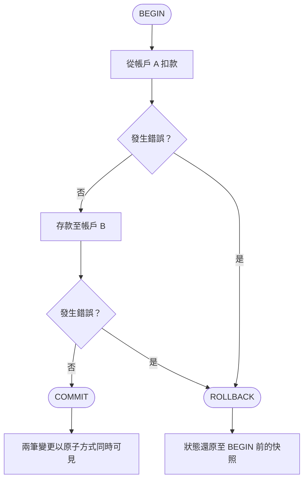

# [BEE-160] ACID 特性

:::info
ACID 不只是資料庫的功能——它是你的應用程式與資料庫之間的一份契約。理解它，將塑造你在資料一致性上的每一個設計決策。
:::

## 背景

1981 年，Jim Gray 在其論文 ["The Transaction Concept: Virtues and Limitations"](https://jimgray.azurewebsites.net/papers/thetransactionconcept.pdf) 中正式定義了交易（transaction）的概念。他所描述的四個特性——原子性（Atomicity）、一致性（Consistency）、隔離性（Isolation）、持久性（Durability）——至今仍是關聯式資料庫可靠資料管理的基礎。

對於應用程式工程師而言，ACID 並非學術議題。每當你寫入超過一筆資料、呼叫超過一個服務，或處理可能中途失敗的請求時，你都在對這些特性做出隱含的選擇。將這些選擇明確化，能讓系統更正確、更易維護。

:::tip Deep Dive
For database-level ACID implementation details, see [DDP-10: ACID Properties](https://alivedise.github.io/database-design-principles/10).
:::

## 四個特性

### 原子性（Atomicity）：全有或全無

一個交易是原子的，意指其所有操作必須一起成功，或一個都不生效。不存在部分成功的情況。

從應用程式的角度來看，原子性回答了一個問題：**如果我的操作在中途失敗，系統的狀態是什麼？**

若沒有原子性，網路逾時或伺服器在操作中途崩潰，會使資料庫停留在不一致的中間狀態——而你的應用程式無從得知哪些已寫入、哪些未寫入。

**交易生命週期：**



原子性不會幫你自動恢復——它幫你乾淨地失敗。ROLLBACK 之後，你確知資料庫處於一致狀態，應用程式可以安全地重試或回報錯誤。

### 一致性（Consistency）：維持應用程式的不變條件

一致性是 ACID 中的異類——它是唯一主要由**應用程式**負責的特性，而非資料庫。

一個交易讓資料庫保持一致，意指應用程式定義的不變條件（invariant）在交易前後都成立。資料庫可以透過約束（外鍵、NOT NULL、CHECK）強制執行部分條件，但像「帳戶餘額不得為負」或「訂單必須包含至少一個品項」這類商業規則，是你的責任。

**實務意涵：** 你不能只是開啟交易、寫入資料，就假設一致性有保障。你必須明確地編碼不變條件——能用資料庫約束的就用約束，不能的就用應用程式邏輯。

### 隔離性（Isolation）：並發交易互不干擾

隔離性控制一個交易能看到另一個進行中的交易的哪些內容。這是 ACID 中最微妙的特性，也最容易在生產環境中造成隱性 bug。

完整的隔離性（可序列化，Serializable）意指並發交易產生的結果，與它們依序逐一執行的結果相同。這是安全的，但代價高昂。大多數資料庫預設使用較弱的隔離層級（通常是 Read Committed），以允許某些異常現象來換取更高的吞吐量。

**選擇正確的隔離層級是應用程式設計決策**，而非一個可以盲目接受的資料庫預設值。完整的隔離層級與各自允許的異常現象，請參閱 [BEE-161](./161.md)。

### 持久性（Durability）：已提交的資料可以在崩潰後存活

一旦交易提交，資料庫保證變更是持久化的——能夠在斷電、崩潰和重啟後存活。實際上，這意味著資料庫在回傳成功回應之前，已完成寫入持久儲存（或確認同步副本）。

從應用程式的角度來看，持久性意味著：**如果 `COMMIT` 回傳成功，你可以信任資料已在那裡**。你不需要在啟動時重新驗證，也不需要自行實作預寫日誌（write-ahead log）。

## 銀行轉帳範例

這是最經典的範例，因為它讓破壞 ACID 的代價顯而易見。

**沒有原子性：**

```
BEGIN
  UPDATE accounts SET balance = balance - 100 WHERE id = 'A'
  -- 伺服器在此崩潰
  -- UPDATE accounts SET balance = balance + 100 WHERE id = 'B'  -- 從未執行
```

帳戶 A 損失了 100 元。帳戶 B 什麼都沒收到。100 元憑空消失。呼叫端沒有收到任何錯誤。

**有原子性：**

```
BEGIN
  UPDATE accounts SET balance = balance - 100 WHERE id = 'A'
  -- 伺服器在此崩潰
ROLLBACK（在崩潰或斷線時自動執行）
```

扣款被回滾。帳戶 A 仍保有 100 元。呼叫端收到錯誤，可以安全地重試。

**有隔離性（同一帳戶上的兩筆並發轉帳）：**

假設帳戶 A 有 150 元。兩筆各 100 元的並發轉帳：

```
T1: BEGIN
T2: BEGIN
T1: SELECT balance FROM accounts WHERE id = 'A'  -- 讀取到 150
T2: SELECT balance FROM accounts WHERE id = 'A'  -- 讀取到 150
T1: UPDATE accounts SET balance = 150 - 100 WHERE id = 'A'  -- 設為 50
T2: UPDATE accounts SET balance = 150 - 100 WHERE id = 'A'  -- 也設為 50（T1 的寫入遺失）
T1: COMMIT
T2: COMMIT
```

在 Read Committed 且未適當加鎖的情況下，兩個交易都讀取到原始餘額並且都成功——造成帳戶透支。Serializable 隔離層級或 `SELECT FOR UPDATE` 可以防止這種情況。

## 何時使用交易

並非每次寫入都需要交易。但在以下情況下，你應該總是使用交易：

- 你正在寫入超過一列、一張表或一份文件，且它們必須一起改變。
- 你實作了「先讀後寫」的模式，寫入依賴於同一操作中讀取的資料。
- 部分失敗會使資料進入難以偵測和修復的狀態。

## 當 ACID 代價太高時

完整的 ACID 交易有其代價：鎖爭用、協調開銷，以及有限的水平擴展能力。在某些情境下，這些代價超過了收益。

**最終一致性（Eventual Consistency）** 是常見的替代方案。系統不要求所有節點在寫入成功前達成一致，而是立即接受寫入，並以非同步方式傳播。這以暫時的不一致性換取了更高的可用性和寫入吞吐量。

在以下情況下考慮使用最終一致性：
- 資料不涉及財務或庫存等關鍵場景（例如：瀏覽計數、活動串流、搜尋索引）。
- 應用程式可以容忍讀取到略微過時的資料。
- 解決衝突的協調邏輯已被充分理解且可實作。

最終一致性的模式與取捨，請參閱 [BEE-165](./165.md)。

## 分散式系統中的 ACID

ACID 在單一資料庫內是直觀的。跨越多個資料庫或服務時，它變得顯著更難。

**核心問題：** 橫跨兩個資料庫的交易，無法依賴任何一個資料庫的 ACID 保證來涵蓋另一個。如果你的服務同時寫入關聯式資料庫和訊息佇列，你就擁有兩個獨立的系統，沒有共享的交易協調器。

常見的處理模式：

- **兩階段提交（Two-Phase Commit, 2PC）：** 協調器先讓所有參與者進入準備狀態，再提交。提供類 ACID 的保證，但速度慢、複雜，且在協調器失敗時會阻塞。請參閱 [BEE-162](./162.md)。
- **Saga 模式：** 將分散式操作拆解為一系列本地交易，並為失敗提供補償動作。請參閱 [BEE-163](./163.md)。
- **Outbox 模式：** 將訊息寫入與狀態變更在同一個資料庫交易中完成，再以非同步方式轉發。避免雙重寫入（dual-write）的問題。

**經驗法則：** 如果你需要跨多個資料儲存的強一致性，請重新審視你的服務邊界。這種需求往往意味著兩個服務應共用一個資料儲存，或者某個服務承擔了太多責任。

## 常見錯誤

**1. 未將相關操作包在交易中**

在沒有交易的情況下，以獨立的陳述式寫入多筆相關資料，是最常見的錯誤。任何陳述式之間的失敗都會導致資料不一致。

```python
# 錯誤：兩個獨立的陳述式，沒有交易
db.execute("UPDATE accounts SET balance = balance - 100 WHERE id = ?", [a_id])
db.execute("UPDATE accounts SET balance = balance + 100 WHERE id = ?", [b_id])

# 正確：兩個操作在一個原子交易中
with db.transaction():
    db.execute("UPDATE accounts SET balance = balance - 100 WHERE id = ?", [a_id])
    db.execute("UPDATE accounts SET balance = balance + 100 WHERE id = ?", [b_id])
```

**2. 交易範圍過大**

長時間執行的交易在整個持續期間都持有鎖，阻塞其他交易。保持交易盡可能短暫。將計算、外部 HTTP 呼叫和非必要的讀取移到交易邊界之外。

**3. 假設 ACID 跨越多個資料庫**

在兩個獨立資料庫中各自的 `BEGIN ... COMMIT` 是兩個獨立的交易。如果第一個提交了而第二個失敗，第一個不會自動回滾。

**4. 忽略隔離層級的選擇**

在不理解預設值的情況下接受它，是一個潛在的 bug。PostgreSQL 的預設值（Read Committed）在並發負載下允許不可重複讀取（non-repeatable reads）和遺失更新（lost updates）。請根據你的工作負載評估每個層級允許的異常現象。請參閱 [BEE-161](./161.md)。

**5. 吞掉交易錯誤**

在連線池環境中，捕獲例外而不回滾特別危險。未釋放的交易會持有鎖，並可能使連線進入損壞狀態。

```python
# 錯誤：例外被捕獲，交易既未提交也未回滾
try:
    db.execute("UPDATE ...")
    db.execute("UPDATE ...")
except Exception:
    pass  # 靜默失敗，連線狀態不明

# 正確：任何錯誤都明確回滾
try:
    with db.transaction():
        db.execute("UPDATE ...")
        db.execute("UPDATE ...")
except Exception as e:
    logger.error("Transfer failed, rolled back", exc_info=e)
    raise
```

## 原則

對任何必須作為一個單元成功或失敗的多步驟寫入，請使用資料庫交易。根據你的應用程式能夠和不能容忍的異常現象，審慎地選擇隔離層級。不要假設 ACID 保證可以跨越多個資料庫或服務延伸——請針對邊界處的失敗進行明確設計。

## 相關 BEE

- [BEE-161: 隔離層級與其異常現象](./161.md) -- 深入探討各隔離層級及其允許的異常現象
- [BEE-162: 分散式交易與兩階段提交](./162.md) -- 跨服務協調交易
- [BEE-163: Saga 模式](./163.md) -- 長時間執行的分散式工作流程的補償交易
- [BEE-165: 最終一致性模式](./165.md) -- 何時以可用性換取 ACID 保證

## 參考資料

- Jim Gray, ["The Transaction Concept: Virtues and Limitations"](https://jimgray.azurewebsites.net/papers/thetransactionconcept.pdf), Tandem Computers, 1981
- Martin Kleppmann, [*Designing Data-Intensive Applications*, Chapter 7: Transactions](https://www.oreilly.com/library/view/designing-data-intensive-applications/9781491903063/ch07.html), O'Reilly Media, 2017
- [PostgreSQL Documentation: 13.2 Transaction Isolation](https://www.postgresql.org/docs/current/transaction-iso.html)
