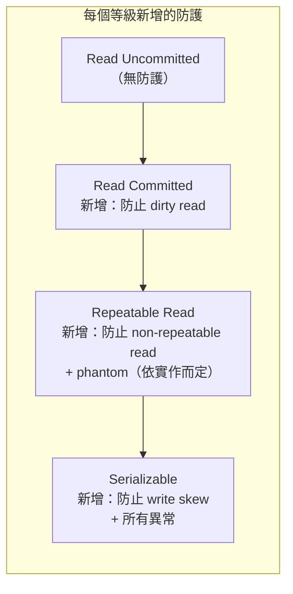

# [BEE-161] 隔離等級與其異常

:::info
隔離性是 ACID 中最微妙的特性。理解每個等級能防止哪些異常——以及允許哪些異常——是撰寫正確並行程式碼的前提。
:::

## 情境

SQL 標準定義了四種交易隔離等級。每個資料庫都有預設值。大多數工程師在不了解其並行行為含義的情況下接受預設值——然後花費數週除錯資料庫從未被要求防止的競態條件。

每個等級允許的異常並非理論問題。Dirty reads 造成過重複扣款；non-repeatable reads 造成庫存超賣；write skew 讓使用者執行了本應互斥的操作。理解「等級 vs. 異常」的矩陣不是學術準備——而是在並行環境下撰寫正確程式碼的前提。

:::tip 相關文章
ACID 基礎模型請見 [BEE-160](./160.md)。分散式交易協調請見 [BEE-162](./162.md)。並行控制策略請見 [BEE-245](../Concurrency/245.md)。
:::

## 四種 SQL 標準隔離等級

SQL-92 標準按隔離強度遞增定義四個等級：

1. **Read Uncommitted** -- 最弱；對任何異常都無防護
2. **Read Committed** -- 防止 dirty reads；PostgreSQL、Oracle 的預設值
3. **Repeatable Read** -- 防止 dirty reads 和 non-repeatable reads；MySQL InnoDB 的預設值
4. **Serializable** -- 最強；防止所有標準異常，包括 phantom reads

## 異常種類

### Dirty Read（髒讀）

某交易讀取了另一個尚未提交的並行交易所寫入的資料。若那個交易之後回滾，第一個交易讀到的是從未正式存在的資料。

**範例：**

```
T1: BEGIN
T1: UPDATE accounts SET balance = 0 WHERE id = 1   -- 尚未提交

T2: BEGIN
T2: SELECT balance FROM accounts WHERE id = 1
    -- 回傳 0（T1 未提交的寫入）
T2: -- 基於餘額 0 做出決策

T1: ROLLBACK  -- 餘額恢復原始值
-- T2 的決策是基於從未存在的資料
```

**風險等級：** 高。可能造成重複扣款、錯誤餘額顯示、錯誤商業決策。

### Non-Repeatable Read（不可重複讀）

某交易兩次讀取同一列，得到不同的值，因為另一個交易在兩次讀取之間提交了變更。

**範例：**

```
T1: BEGIN
T1: SELECT price FROM products WHERE id = 42
    -- 回傳 100

T2: BEGIN
T2: UPDATE products SET price = 200 WHERE id = 42
T2: COMMIT

T1: SELECT price FROM products WHERE id = 42
    -- 回傳 200（與第一次讀取不同）
T1: COMMIT
-- T1 對同一列使用了兩個不同的值
```

**風險等級：** 中。破壞「讀取前提」邏輯——先讀取值、做決策、再重新讀取以驗證的交易會遭遇意外結果。

### Phantom Read（幻讀）

某交易以範圍條件重新執行查詢，發現了另一個已提交交易插入的新列。

**範例：**

```
T1: BEGIN
T1: SELECT COUNT(*) FROM bookings WHERE room_id = 5 AND date = '2026-04-07'
    -- 回傳 0

T2: BEGIN
T2: INSERT INTO bookings (room_id, date, user_id) VALUES (5, '2026-04-07', 99)
T2: COMMIT

T1: SELECT COUNT(*) FROM bookings WHERE room_id = 5 AND date = '2026-04-07'
    -- 回傳 1（幻影列出現了）
T1: INSERT INTO bookings (room_id, date, user_id) VALUES (5, '2026-04-07', 42)
    -- 重複預訂！
T1: COMMIT
```

**風險等級：** 中至高。雙重預訂和庫存計數錯誤的典型來源。

### Write Skew（寫入偏斜）

兩個交易各自讀取一組重疊的列，根據讀取結果做出決策，然後寫入不重疊的列——產生的結果若任一交易先執行都不會被允許。由於兩個交易沒有覆寫彼此的資料，簡單的鎖定機制無法偵測此衝突。

**範例：** 系統要求至少一位醫生值班。目前兩位醫生都在值班。

```
T1（Alice 醫生）: BEGIN
T1: SELECT COUNT(*) FROM on_call WHERE shift = 'tonight'
    -- 回傳 2（Alice 和 Bob）
T1: -- "2 > 1，可以安全地下班"

T2（Bob 醫生）: BEGIN
T2: SELECT COUNT(*) FROM on_call WHERE shift = 'tonight'
    -- 回傳 2（Alice 和 Bob）
T2: -- "2 > 1，可以安全地下班"

T1: DELETE FROM on_call WHERE doctor = 'Alice' AND shift = 'tonight'
T2: DELETE FROM on_call WHERE doctor = 'Bob' AND shift = 'tonight'

T1: COMMIT
T2: COMMIT
-- 沒有醫生值班。不變量被破壞了。
-- 兩個交易都沒有寫入對方的列。
```

**風險等級：** 高且隱蔽。單純的列級鎖定無法防止。需要 Serializable 隔離等級或對所有影響決策的列使用 `SELECT FOR UPDATE`。

## 隔離等級 vs. 異常：矩陣

| 隔離等級         | Dirty Read  | Non-Repeatable Read | Phantom Read | Write Skew  |
|------------------|:-----------:|:-------------------:|:------------:|:-----------:|
| Read Uncommitted | 可能        | 可能                | 可能         | 可能        |
| Read Committed   | 防止        | 可能                | 可能         | 可能        |
| Repeatable Read  | 防止        | 防止                | 防止*        | 可能        |
| Serializable     | 防止        | 防止                | 防止         | 防止        |

\* PostgreSQL 的 Repeatable Read（快照隔離）可防止幻讀。MySQL 的 Repeatable Read 透過 gap locks 防止幻讀。SQL-92 標準在此等級並不強制要求此防護。



## 真實資料庫的實作方式

### PostgreSQL

PostgreSQL 全面使用**多版本並行控制（MVCC）**。它不對讀取加列鎖，而是為每列維護多個已提交版本，並給每個交易一個一致的快照視圖。

| SQL 等級         | PostgreSQL 內部行為                                                     |
|------------------|-------------------------------------------------------------------------|
| Read Uncommitted | 視同 Read Committed（PostgreSQL 永不顯示未提交資料）                   |
| Read Committed   | 預設值。每個語句取得最新已提交資料的快照。                             |
| Repeatable Read  | 快照隔離。交易看到 BEGIN 時已提交的資料。                              |
| Serializable     | 可序列化快照隔離（SSI）。偵測循環衝突。                               |

重點：
- PostgreSQL 的 **Repeatable Read 實際上是快照隔離**——比 SQL-92 規格要求的更強。不會發生幻讀。
- **Repeatable Read 仍可能發生 write skew**。兩個交易都可以讀取共用條件，然後寫入不重疊的列而不產生衝突。
- **Serializable 使用 SSI**（於 PostgreSQL 9.1 引入）：一種樂觀演算法，偵測危險的讀寫依賴循環並中止其中一個交易。讀取者不阻塞寫入者。

```sql
-- 為單個交易設定隔離等級
BEGIN ISOLATION LEVEL REPEATABLE READ;
-- 或
SET TRANSACTION ISOLATION LEVEL SERIALIZABLE;
```

### MySQL InnoDB

MySQL InnoDB 預設為 **Repeatable Read**，結合使用 MVCC 和鎖定。

| SQL 等級         | MySQL InnoDB 行為                                                            |
|------------------|------------------------------------------------------------------------------|
| Read Uncommitted | 讀取不加鎖；允許 dirty reads。                                               |
| Read Committed   | 每個語句讀取最新已提交的快照。                                               |
| Repeatable Read  | 預設值。從第一次讀取建立一致快照。Gap locks 防止幻讀。                      |
| Serializable     | 所有普通 SELECT 變成 `SELECT ... FOR SHARE`。完全鎖定。                      |

重點：
- MySQL 透過 **gap locks** 和 **next-key locks** 在 Repeatable Read 層級防止幻讀——鎖定索引值之間的間隙，而非僅鎖定個別列。這是鎖定方式而非純粹的 MVCC。
- Gap locks 在並行插入下可能造成**死鎖**，是 MySQL 工作負載中常見的生產事故來源。
- MySQL Serializable 使用兩階段鎖定（悲觀），而非 SSI。讀取者阻塞寫入者。

```sql
-- 檢查目前隔離等級
SELECT @@transaction_isolation;

-- 設定 session 等級
SET SESSION TRANSACTION ISOLATION LEVEL READ COMMITTED;
```

## 快照隔離與 MVCC

快照隔離並非 SQL 標準中的命名等級——在實務上它介於 Repeatable Read 和 Serializable 之間。大多數現代資料庫將其「Repeatable Read」實作為快照隔離。

**MVCC 運作方式：**

1. 每個列版本帶有建立交易 ID 和刪除交易 ID。
2. 交易開始時記錄快照邊界：此交易可見的最高已提交交易 ID。
3. 讀取回傳建立 ID 在快照內、刪除 ID（若有）在快照外的最新列版本。
4. 寫入建立新的列版本，而非原地覆寫。

**優點：**
- 讀取永不阻塞寫入；寫入永不阻塞讀取。
- 長時間運行的讀取（例如分析查詢）在不鎖定其他寫入者的情況下獲得穩定、一致的視圖。
- 無需獲取任何讀鎖即可消除 dirty reads 和 non-repeatable reads。

**限制：**
- Write skew 仍然可能（兩個交易讀取相同快照，然後寫入不重疊的列）。
- MVCC 需要定期垃圾回收舊版本列。在 PostgreSQL 中這是 `VACUUM`；在 MySQL 中是清除執行緒。在高寫入負載下疏忽維護會造成表格膨脹和效能下降。

## 可序列化快照隔離（SSI）

SSI 由 Cahill 等人於 2005 年在學術文獻中提出，並在 PostgreSQL 9.1（2011 年）中實裝，在不使用兩階段鎖定（2PL）重型鎖定的情況下將快照隔離擴展至完整可序列化。

**核心洞見：** 每種序列化異常（包括 write skew）都源於並行交易之間特定的讀寫依賴模式。SSI 追蹤這些依賴關係，並在偵測到危險循環時中止一個交易。

**與 2PL 的取捨：**
- 讀取者永不阻塞寫入者（比 2PL 有更好的讀取吞吐量）。
- 可能發生誤報中止——即使交易不會造成異常也可能被中止。應用程式必須重試。
- 在高衝突工作負載下，吞吐量低於快照隔離，但在讀取密集的負載下通常遠優於 2PL。

**何時使用 Serializable/SSI：**
- 正確性不容妥協的金融系統（帳戶轉帳、帳本操作）。
- 不能允許雙重分配的庫存或預訂系統。
- 任何「先查後寫」模式（讀取條件、做出決策、基於此寫入）。

## 選擇正確的隔離等級

| 情境                                                  | 建議等級                                      | 理由                                                           |
|-------------------------------------------------------|-----------------------------------------------|----------------------------------------------------------------|
| 讀取密集的分析、報表                                  | Read Committed                                | 讀取不關心異常；最小化開銷                                     |
| 使用者介面讀取、簡單 CRUD                             | Read Committed（預設值）                      | 大多數情況已足夠；PostgreSQL 和 Oracle 的預設值                |
| 針對相同列的先讀後寫（例如計數器）                    | Read Committed + `SELECT FOR UPDATE`          | 在特定列上防止更新遺失，無需完整 Serializable                  |
| 庫存查詢與預留                                        | Serializable 或 `SELECT FOR UPDATE`           | 防止幻讀和 write skew                                          |
| 金融轉帳（同一帳戶集的借貸）                          | Serializable                                  | 防止帳戶餘額不變量上的 write skew                              |
| 一致性報表快照（長時間讀取）                          | Repeatable Read                               | 快照隔離在多個語句間提供穩定視圖                               |

**實務原則：** 從 Read Committed 開始。對於讀取條件後根據結果寫入、且並行交易可能使該條件失效的任何交易，升級到 Serializable。

## 更強隔離的效能代價

隔離不是免費的。代價隨等級嚴格度增加。

| 等級               | 開銷          | 阻塞行為                                               | 中止率             |
|--------------------|---------------|--------------------------------------------------------|--------------------|
| Read Committed     | 低            | 寫入者只在相同列上阻塞寫入者                           | 極低               |
| Repeatable Read    | 中            | MySQL 的 gap locks；PostgreSQL 的快照追蹤              | 低                 |
| Serializable (SSI) | 中至高        | 讀取者永不阻塞寫入者（PostgreSQL）                     | 中等（需要重試）   |
| Serializable (2PL) | 高            | 讀取者阻塞寫入者，寫入者阻塞讀取者                     | 低但延遲高         |

**主要成本因素：**
- 在 Serializable 等級，SSI（PostgreSQL）的讀取吞吐量遠優於 2PL（MySQL）。
- 在任何等級，長時間運行的交易持有快照或鎖定更久，增加衝突概率。
- 在 Serializable 高並行下，預期有一定比例的交易收到序列化錯誤（`SQLSTATE 40001`），需要應用層重試。

## 常見錯誤

**1. 在不了解預設隔離等級的情況下接受它**

PostgreSQL 預設為 Read Committed。MySQL 預設為 Repeatable Read。這兩者有不同的異常特性。針對某個資料庫預設值編寫的程式碼，在遷移或切換資料庫時可能出現不同的錯誤。

```sql
-- 始終確認你在使用什麼
SHOW transaction_isolation;       -- PostgreSQL
SELECT @@transaction_isolation;   -- MySQL
```

**2. 假設 Repeatable Read 能防止所有異常**

Repeatable Read 防止 dirty reads 和 non-repeatable reads。它無法防止 write skew。兩個交易都可以讀取共用條件、認為可以安全執行，然後寫入不重疊的列——使兩者的不變量都失效。

```sql
-- 即使在 Repeatable Read，這種 write skew 也是可能的
BEGIN ISOLATION LEVEL REPEATABLE READ;
SELECT COUNT(*) FROM on_call WHERE shift = 'tonight';  -- 讀取到 2
-- 並行交易也讀取到 2 並移除另一位醫生
DELETE FROM on_call WHERE doctor = 'me' AND shift = 'tonight';
COMMIT;
-- 現在沒有醫生值班了
```

修復方式：對所有影響決策的列使用 `SELECT FOR UPDATE`，或升級到 Serializable。

**3. 到處使用 Serializable 卻沒有重試邏輯**

Serializable 防止所有異常，但引入了應用程式必須處理的序列化失敗。在高並行負載下，不實作 `SQLSTATE 40001` 重試的應用程式會將資料庫錯誤直接暴露給使用者。

```python
# Serializable 隔離所需的模式
import time

MAX_RETRIES = 3
for attempt in range(MAX_RETRIES):
    try:
        with db.transaction(isolation="serializable"):
            # ... 執行工作
        break
    except SerializationFailure:
        if attempt == MAX_RETRIES - 1:
            raise
        time.sleep(0.01 * (2 ** attempt))  # 指數退避
```

**4. 用單一連線測試而漏掉並行錯誤**

隔離異常只在多個並行交易下才會顯現。開啟一個連線並循序執行的單元測試，永遠無法重現 dirty reads、phantom reads 或 write skew——即使生產程式碼存在漏洞。並行錯誤需要並行測試客戶端。

**5. 不知道 ORM 使用的隔離等級**

ORM 通常透明地管理連線池和交易。有些 ORM 每次請求開啟一個新交易；有些則重用連線。隔離等級可能在連線、session 或交易層級設定，ORM 的預設值可能與資料庫的預設值不同。

## 原則

了解你的隔離等級，並了解它無法防止什麼。對於普通讀取，預設使用 Read Committed。對於讀取條件後根據結果做出寫入決策的任何交易，升級到 Serializable。在使用 Serializable 時始終實作重試邏輯，因為序列化失敗不是錯誤——那是機制在正確運作。

## 相關 BEE

- [BEE-160: ACID Properties](./160.md) -- 基礎交易模型
- [BEE-162: Distributed Transactions and Two-Phase Commit](./162.md) -- 跨服務協調
- [BEE-245: Optimistic vs. Pessimistic Concurrency](../Concurrency/245.md) -- 選擇鎖定策略

## 參考資料

- [PostgreSQL Documentation: 13.2 Transaction Isolation](https://www.postgresql.org/docs/current/transaction-iso.html) -- PostgreSQL 行為的權威來源，包含 SSI
- [MySQL 8.4 Reference Manual: 17.7.2.1 Transaction Isolation Levels](https://dev.mysql.com/doc/refman/8.4/en/innodb-transaction-isolation-levels.html) -- InnoDB 隔離與 gap locking
- Martin Kleppmann, [*Designing Data-Intensive Applications*, Chapter 7: Transactions](https://www.oreilly.com/library/view/designing-data-intensive-applications/9781491903063/ch07.html), O'Reilly Media, 2017 -- 弱隔離、快照隔離和 SSI 的全面介紹
- [Jepsen: Consistency Models](https://jepsen.io/consistency/models) -- 一致性和隔離模型的正式層次結構
- [Wikipedia: Isolation (database systems)](https://en.wikipedia.org/wiki/Isolation_(database_systems)) -- SQL 標準異常定義
- A. Fekete et al., ["Making Snapshot Isolation Serializable"](https://dl.acm.org/doi/10.1145/1071610.1071615), ACM TODS, 2005 -- SSI 演算法基礎
