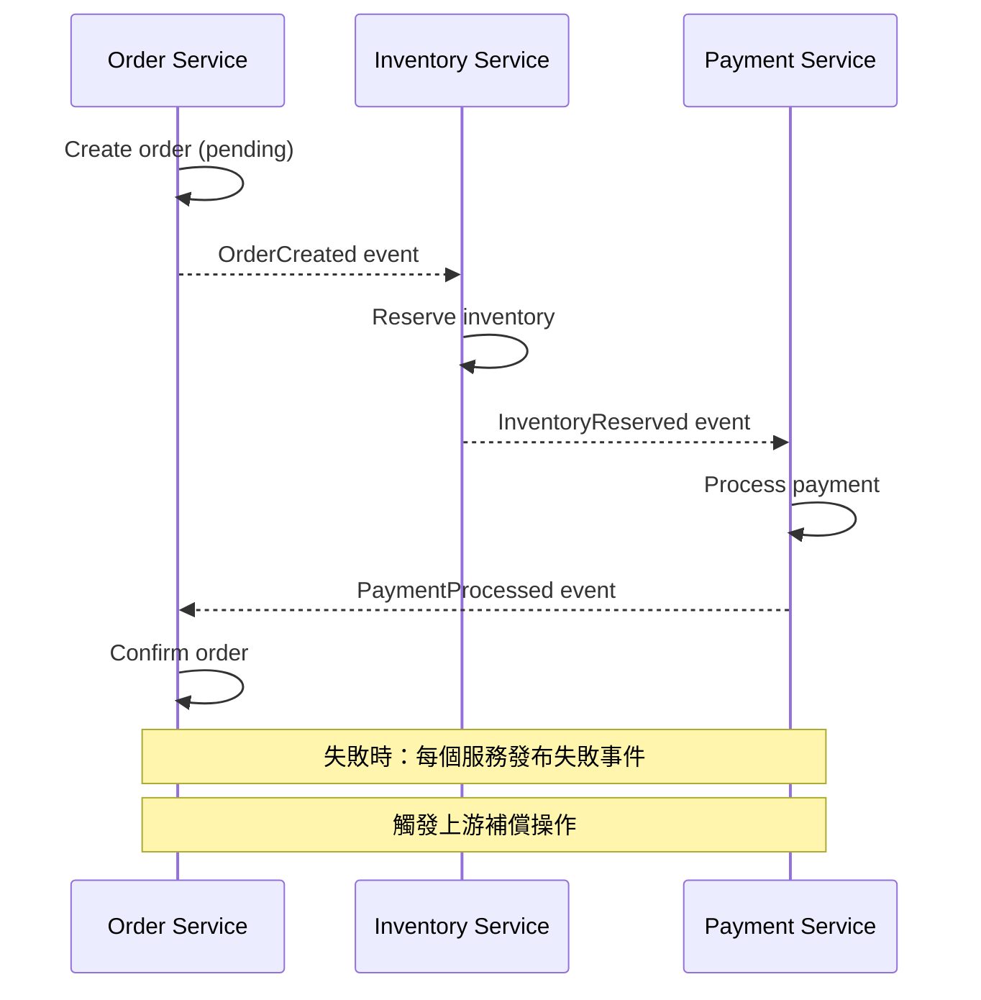
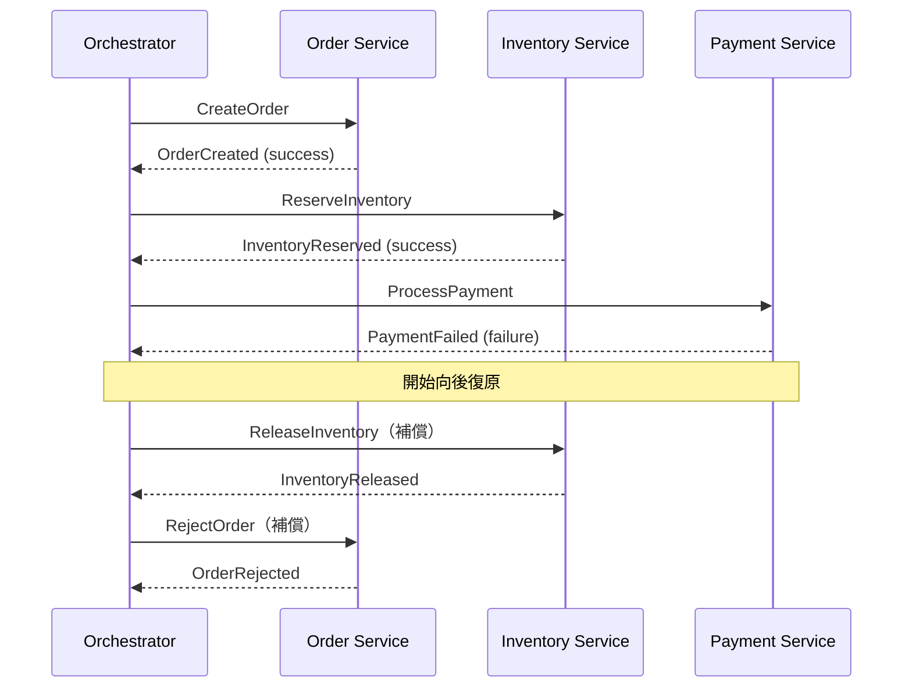
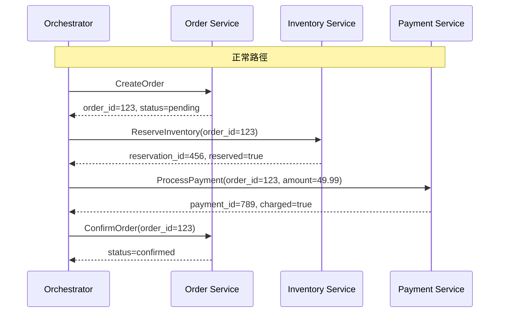
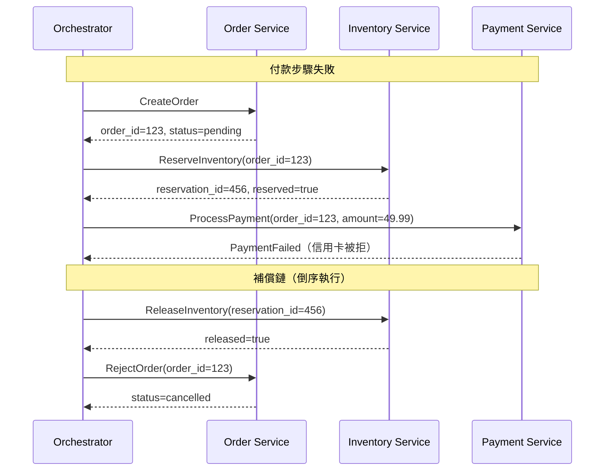

# [BEE-163] Saga 模式

:::info
當一個業務流程跨越多個服務時，你無法使用單一資料庫交易。Saga 模式將流程拆解為一連串本地交易，每個步驟都配備對應的補償動作，以便在後續步驟失敗時撤銷已完成的操作。你可以在不使用跨服務鎖定的情況下達到流程層級的一致性。
:::

## 情境

當一個服務執行業務操作時，ACID 屬性會免費提供原子性保證：所有變更要麼全部提交，要麼全部不生效。但一旦操作跨越兩個以上的獨立服務 — 每個服務各自擁有自己的資料庫 — 這個保證就不存在了。若不使用 2PC，就無法將多個自治資料庫納入同一個交易；而 2PC 帶來的阻塞、鎖定保留以及協調者崩潰風險，使其不適合大多數微服務工作流程（參見 [BEE-162](./162.md)）。

Saga 模式最早由 Hector Garcia-Molina 和 Kenneth Salem 在 1987 年的 ACM SIGMOD 論文 ["Sagas"](https://dl.acm.org/doi/10.1145/38713.38742) 中提出。原始問題是資料庫的長時間交易（LLT）：單一交易在完成複雜業務流程時，長時間持有鎖定。他們提出將 LLT 拆解為一連串較短的交易，每個交易在提交後立即釋放鎖定。如果序列必須在中途中止，補償交易（compensating transactions）會撤銷已提交的步驟。

在微服務情境下，Chris Richardson 在 [microservices.io](https://microservices.io/patterns/data/saga.html) 和其著作 *Microservices Patterns* 中正式化了此模式。Microsoft Azure Architecture Center 也將其記錄為一等的[雲端設計模式](https://learn.microsoft.com/en-us/azure/architecture/patterns/saga)。此模式已成為長時間跨服務工作流程的標準建議。

## 什麼是 Saga

Saga 是一連串本地交易，其中：

1. 每個本地交易更新自己服務的資料庫並立即提交。
2. 每個步驟透過事件或命令訊息觸發下一個步驟。
3. 每個本地交易都有對應的**補償交易**，可語義地撤銷其效果。
4. 如果第 N 步失敗，Saga 會依倒序執行第 N-1、N-2 … 1 步的補償交易。

與回滾（rollback）的關鍵差異：補償交易是新的向前推進的交易，用來逆轉前一步驟的業務效果。它們不會在資料庫層級撤銷變更 — 原始交易已經提交了。它們是寫入新資料，讓系統回到一致的業務狀態。

**Saga 的保證：** 系統最終會達到完全完成的狀態（所有步驟成功），或完全補償的狀態（所有已成功完成的步驟都已被撤銷）。不會有永久性的部分完成狀態。

**Saga 不提供的：** 隔離性。執行期間，其他交易可以觀察到中間狀態（例如，正在處理付款時，訂單處於 `pending` 狀態）。這對許多業務工作流程是可以接受的，但必須明確承認。

## 編排（Choreography）vs. 協作（Orchestration）

協調 Saga 有兩種結構性方式。

### 編排（Choreography）

每個服務在本地交易完成時發布事件。其他服務監聽這些事件，並透過執行自己的本地交易來回應。沒有中央協調者 — 工作流程從事件發布與反應的序列中自然涌現。



**編排的特性：**
- 協調過程沒有單點故障
- 服務透過事件鬆散耦合
- 工作流程邏輯分散在各服務中 — 難以在同一個地方看到完整全貌
- 當參與者數量增加時，事件鏈條變得難以追蹤
- 測試需要跨多個服務模擬事件序列

### 協作（Orchestration）

專屬的 **Saga 協作者**（orchestrator）向參與者發送命令訊息，告知其該執行什麼操作。協作者追蹤狀態並決定下一步，包括在失敗時要調用哪些補償交易。



**協作的特性：**
- 完整工作流程在一個地方可見且可測試（協作者）
- 無需更改現有服務即可新增參與者
- 協作者是必須高可用的中央元件
- 協作者有變成「上帝物件」的風險 — 擁有過多業務邏輯
- 補償交易被明確命令 — 更容易推理失敗處理

**選擇時機：**
- 參與者少（2-3 個）且失敗模式簡單：編排即可
- 複雜工作流程、多個參與者，或需要清晰稽核軌跡的工作流程：優先選擇協作
- 需要人工審批或外部系統回呼的工作流程：協作能更清晰地處理這些狀態

## 訂單建立 Saga：完整範例

電商訂單建立 Saga 跨越四個服務。正常路徑：

1. **Order Service** — 建立 `status=pending` 的訂單
2. **Inventory Service** — 預留商品
3. **Payment Service** — 向客戶收費
4. **Order Service** — 設定訂單 `status=confirmed`



現在付款失敗，協作者觸發向後復原：



補償鏈鏡像正向鏈但倒序執行，並在失敗的步驟處停止（因為付款未成功，所以不需要對其補償）。

### 每個補償交易的作用

| 正向步驟 | 補償交易 | 語義 |
|---|---|---|
| CreateOrder → `pending` | RejectOrder → `cancelled` | 標記訂單為不進行 |
| ReserveInventory | ReleaseInventory | 將預留商品歸還庫存 |
| ProcessPayment | RefundPayment | 若收費成功則發起退款 |
| ConfirmOrder → `confirmed` | （不需要 — 終止步驟） | 最終步驟無需補償 |

注意，如果付款成功但確認失敗，則需要 `RefundPayment`。補償交易集必須涵蓋在後續失敗前可能已提交的每個步驟。

## 補償交易

Garcia-Molina 的原始論文將補償交易稱為正向交易的語義逆操作。這與資料庫回滾有幾個重要差異：

**無鎖定保留：** 正向交易已提交並釋放鎖定。補償交易是必須獲取自己鎖定、觀察當前狀態並寫入新資料的新交易。

**語義撤銷，而非物理撤銷：** 付款收費無法在資料庫層級「回滾」— 收費請求已發送給付款處理商。補償操作是退款，這是一個新的業務操作，有其自身的副作用（通知郵件、費用影響、稽核記錄）。

**必須處理中間狀態變更：** 在正向交易和補償交易之間，其他操作可能已修改了相同的資料。補償交易必須處理這種情況：檢查當前狀態，而不是假設的先前狀態。

**必須是冪等的：** Saga 協調者在失敗或逾時時可能會重試補償交易。不冪等的補償交易（如重複退款或重複釋放庫存）會造成資料損毀。使用自然冪等鍵（例如，原始的 `reservation_id`）並在套用變更前檢查當前狀態來達到這一點。請參閱 [BEE-164](./164.md) 了解冪等性技巧。

## Saga 執行協調者

在基於協作的 Saga 中，協作者本身是一個有狀態的元件。它必須：

- 在發送每個命令前，將當前 Saga 狀態持久化到耐久儲存（以便在崩潰後恢復）
- 追蹤哪些步驟已完成，哪些補償已執行
- 處理無響應參與者的逾時和重試
- 偵測並處理補償交易也失敗的情況

[Eventuate Tram Sagas](https://eventuate.io/docs/javaspringeventsourcing/latest/getting-started-eventuate-tram-sagas.html)、[Temporal](https://temporal.io/) 和 [AWS Step Functions](https://aws.amazon.com/step-functions/) 等框架實現了這種持久化和重試邏輯。不依賴框架從頭建構 Saga 協調者是可行的，但需要謹慎處理命令傳遞的恰好一次語義和補償追蹤。

## 失敗處理：向後復原

Saga 的標準失敗處理策略是**向後復原**：當一個步驟失敗時，依倒序執行所有前面步驟的補償交易。

```
失敗前已完成的步驟：T1、T2、T3
失敗的步驟：T4

向後復原執行：C3、C2、C1（補償交易，倒序）
```

部分 Saga 設計也支援**向前復原**：如果步驟因暫時性錯誤（網路逾時、暫時不可用）而失敗，重試該步驟而不是進行補償。向前復原要求步驟是冪等的（安全可重試）。基於協作的 Saga 通常同時實現兩者：重試暫時性失敗最多 N 次，然後退回到向後復原。

**轉折點交易**（Pivot transactions）是 Microsoft 模式文件中的概念：Saga 中的某些步驟在實際中是不可逆的（例如，已由外部提供商處理的付款）。這些是轉折點交易。一旦轉折點交易提交，Saga 就必須向前完成 — 補償需要業務層級的逆轉（退款），而不是簡單的狀態重置。

## 語義鎖定

在 Saga 執行期間，中間狀態對其他交易可見。`status=pending` 的訂單是真實的資料庫列，其他程序可以讀取。這會造成異常：

- 客戶可能嘗試取消一個正在 Saga 中的訂單
- 報告查詢可能將待處理訂單計為不同的業務指標
- 兩個並發 Saga 可能都嘗試預留相同的庫存

**語義鎖定**透過使用明確的狀態欄位，將正在進行 Saga 修改的記錄標記為「髒」來解決這個問題。訂單上的 `status=pending` 就是一個語義鎖定：讀取此訂單的其他程式碼知道它處於 Saga 中間狀態，不應將其視為已確認的業務實體。業務邏輯必須明確處理這些過渡狀態：對 `pending` 訂單的取消請求可能需要排入取消請求佇列，而不是立即取消。

語義鎖定不由資料庫強制執行 — 它們是必須在應用程式碼中遵守的慣例。

## Saga vs. 2PC：權衡比較

| 維度 | 2PC | Saga |
|---|---|---|
| 一致性模型 | 強一致性（跨服務原子性） | 最終一致性（中間狀態可見） |
| 鎖定保留 | 在各階段間持有（失敗情況下可持續數分鐘） | 每個本地交易後立即釋放 |
| 可用性影響 | 協調者崩潰會阻塞所有參與者 | 無跨服務阻塞 |
| 失敗處理 | 自動回滾 | 明確的補償交易 |
| 實現複雜度 | 協調者的協議複雜度 | 每個步驟的補償邏輯 |
| 跨服務適用性 | 需要支援 XA 的參與者 | 透過 HTTP/事件運作 |
| 長時間工作流程 | 不實用（鎖定視窗太長） | 專為長時間工作流程設計 |

關鍵規則：**當需要原子性變更的所有資料都在同一個資料庫中時，使用資料庫交易。當工作流程跨越多個服務時，使用 Saga。** 除非你有支援 XA 的驅動程式且鎖定視窗非常短，否則不要跨獨立部署的微服務使用 2PC。

## 何時使用 Saga

以下情況 Saga 是合適的工具：

- 業務工作流程涉及兩個以上獨立服務擁有的資料
- 工作流程包含長時間運行的步驟（數秒到數分鐘），持有資料庫鎖定不實際
- 最終一致性可接受：系統可以容忍中間狀態短暫可見的時間窗口
- 每個步驟都存在補償動作：每個正向操作都有語義上有意義的撤銷方式

以下情況 Saga 是錯誤的工具：

- 所有資料都在同一個資料庫中 — 使用資料庫交易
- 需要強隔離性 — 如果中間狀態絕對不能被其他交易觀察到，Saga 在沒有額外並發控制的情況下無法提供此保證
- 不存在有意義的補償 — 如果正向步驟根本無法撤銷，Saga 設計必須重新考慮（也許該步驟應該是最後一個，或者不變量需要不同的方法）

## 常見錯誤

**1. 未定義補償交易**

只實現正常路徑而不定義補償交易，使 Saga 沒有恢復機制。當步驟失敗時，系統會永久卡在部分狀態。在 Saga 上線前，每個可能在後續失敗前提交的步驟都必須有已定義且經過測試的補償交易。

**2. 補償交易不是冪等的**

Saga 協調者在失敗時會重試補償交易。不冪等的補償交易（如兩次退款或兩次釋放庫存）會造成資料損毀。每個補償交易必須對相同輸入多次調用都產生相同結果。使用冪等鍵（原始預留 ID、原始交易 ID）並在套用變更前檢查當前狀態來達到這一點。

**3. 編排模式參與者過多**

三四個服務時，編排是可管理的。七八個服務時，透過相關 ID 跨多個服務日誌追蹤單一工作流程變得極為困難。除錯需要跨多個服務日誌關聯事件。在這種規模下，缺乏中央協調者 — 編排的主要優勢 — 成為嚴重的運維負擔。一旦參與者數量超過四五個，優先選擇協作模式。

**4. 未處理補償失敗**

如果補償交易也失敗了怎麼辦？補償的補償？在實際中，這意味著系統卡住了：正向交易已提交，向後補償失敗，且沒有自動的前進路徑。生產環境的 Saga 必須具備：暫時性補償失敗的重試邏輯、持續失敗補償的死信佇列或警報，以及人工介入的運維手冊。忽視這一點是基於 Saga 的系統中永久性資料不一致的首要原因。

**5. 對需要強一致性的操作使用 Saga**

如果業務規則要求付款和庫存預留要麼都可見要麼都不可見，中間沒有可觀察的狀態，Saga 無法滿足這個要求。Saga 提供最終一致性，中間狀態可見。如果不變量確實不能容忍中間狀態，重新考慮資料是否應該在同一個資料庫中，或者一致性要求在分析後是否實際上比看起來更弱。

**6. 忘記補償交易會觀察到新狀態**

補償交易在其他交易提交後執行。它必須讀取當前狀態並據此行動，而不是假設狀態與正向交易留下的完全相同。假設 `reserved=true` 而不檢查的庫存釋放操作，在另一個程序已釋放或修改預留的情況下會失敗。

## 原則

當業務工作流程跨越多個服務時，使用 Saga：一連串本地交易，每個步驟立即提交，且每個步驟都有對應的補償交易，可語義地逆轉其效果。工作流程複雜或參與者眾多時使用協作模式；簡單、低參與者的流程使用編排模式。在上線前定義並測試補償交易。確保所有補償交易都是冪等的。接受中間狀態可見的事實，並明確設計應用程式邏輯來處理 Saga 進行中的狀態。當所有相關資料都在同一個地方時，不要用 Saga 取代資料庫交易。

## 相關 BEE

- [BEE-160: ACID Properties](./160.md) — 為何單一資料庫交易是優先基準
- [BEE-162: Distributed Transactions and Two-Phase Commit](./162.md) — Saga 所取代的方案及其原因
- [BEE-164: Idempotency and Exactly-Once Semantics](./164.md) — 讓 Saga 步驟和補償操作可安全重試
- [BEE-220: Messaging Patterns for Microservices](./220.md) — 基於編排的 Saga 的事件基礎設施

## 參考資料

- Hector Garcia-Molina and Kenneth Salem, ["Sagas"](https://dl.acm.org/doi/10.1145/38713.38742), ACM SIGMOD 1987
- Chris Richardson, ["Pattern: Saga"](https://microservices.io/patterns/data/saga.html), microservices.io
- Microsoft Azure Architecture Center, ["Saga Design Pattern"](https://learn.microsoft.com/en-us/azure/architecture/patterns/saga)
- Microsoft Azure Architecture Center, ["Compensating Transaction Pattern"](https://learn.microsoft.com/en-us/azure/architecture/patterns/compensating-transaction)
- Chris Richardson, *Microservices Patterns*, Manning, 2018, Chapter 4
