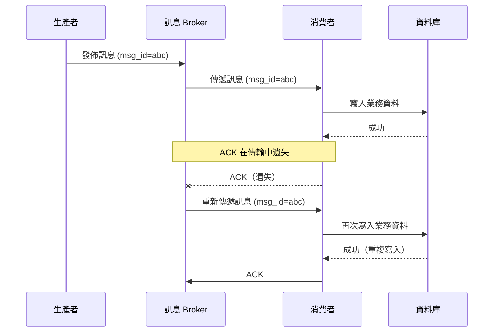
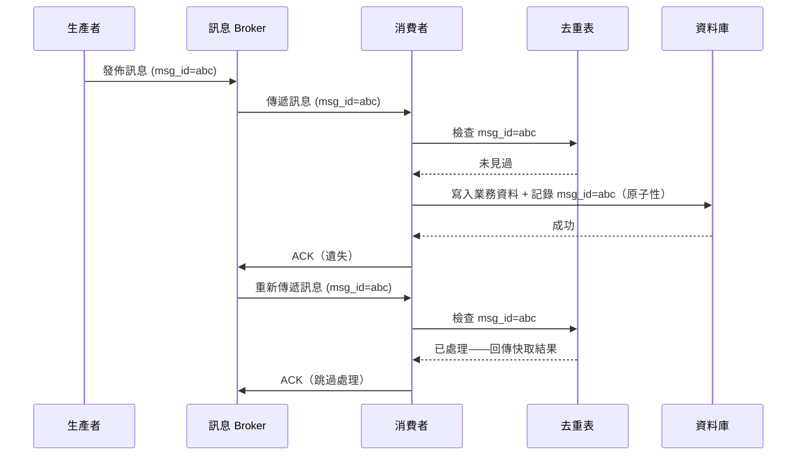
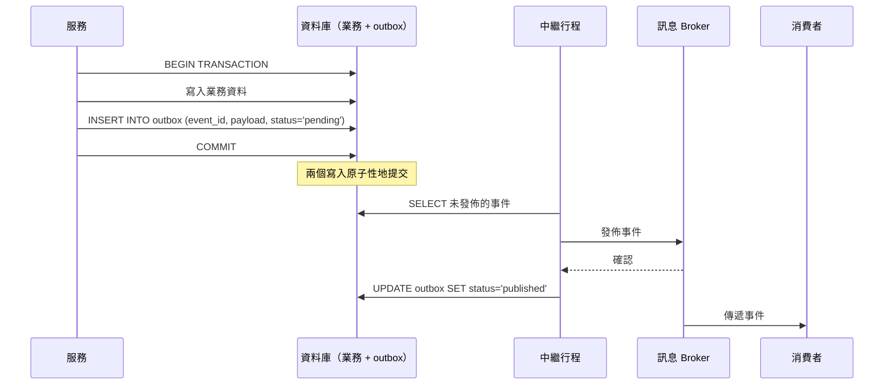

# [BEE-164] 冪等性與恰好一次語義

:::info
在分散式系統中，網路故障會迫使重試，而重試會產生重複訊息。唯一持久的解法是讓每個操作具備冪等性：多次套用同一操作的結果必須與套用一次相同。「恰好一次」處理不是靠消除傳輸中的重複來達成，而是結合至少一次傳遞與冪等消費者。
:::

## 背景

在單一行程系統中，一個函式呼叫不是成功就是失敗，沒有歧義。在分散式系統中，第三種結果永遠存在：呼叫端不知道操作是否成功。網路呼叫逾時了——伺服器在逾時前有收到請求嗎？它處理了請求但未能送出回應嗎？還是根本沒收到請求？

面對這種不確定性，安全的做法就是重試。但重試一個非冪等的操作會導致操作執行兩次，可能產生錯誤結果——客戶被扣款兩次、訂單下了兩次、庫存數量被減了兩次。

這不是邊緣案例。網路逾時、連線重置、broker 重啟和消費者崩潰都是任何生產分散式系統中的正常事件。無法正確處理這些情況的系統，在正常操作條件下就會產生錯誤資料。

## 冪等性的定義

若對同一輸入多次套用一個操作所得結果與套用一次相同，則該操作具有**冪等性**。其形式定義來自數學：若對所有 `x` 而言 `f(f(x)) = f(x)`，則操作 `f` 具有冪等性。

在 HTTP 語義上，`PUT` 和 `DELETE` 被定義為冪等，`GET` 既安全又冪等，`POST` 兩者皆非。這些是規範——實作必須遵守。

冪等性適用於業務操作層，而不僅是 HTTP 方法層。一個建立付款的 `POST /payments` 端點，可以透過接受**冪等性金鑰**來達到冪等：若相同金鑰被提交兩次，伺服器回傳第一次請求的快取結果，而不是建立第二筆付款。

**冪等性 vs. 安全性：** 這是兩個不同屬性。安全的操作沒有副作用（唯讀）。冪等的操作可以有副作用，但無論執行一次還是多次，那些副作用是相同的。`DELETE /items/42` 是冪等的（刪除已被刪除的項目仍然是已刪除的狀態），但不是安全的（第一次呼叫確實刪除了某個東西）。所有安全操作都是冪等的；並非所有冪等操作都是安全的。

## 傳遞保證

訊息 broker 和 RPC 系統提供三種傳遞保證，各有不同的故障特性：

| 保證 | 含義 | 風險 |
|---|---|---|
| 至多一次 | 訊息被傳遞零次或一次 | 故障時資料遺失 |
| 至少一次 | 訊息被傳遞一次或多次 | 重試時出現重複 |
| 恰好一次 | 訊息恰好被處理一次 | 無資料遺失，無重複 |

**至多一次**容易實作：發出後不管，永不重試。代價是當消費者或 broker 崩潰時訊息可能遺失。僅在遺失個別事件無關緊要時才可接受（例如遺失少數資料點無妨的遙測資料）。

**至少一次**是大多數系統的標準選擇：broker 保留訊息直到消費者確認。若確認遺失，broker 重新傳遞。這保證不會遺失訊息，但消費者可能看到同一訊息不止一次。

**恰好一次**聽起來理想，但是最難提供的保證。真正的恰好一次傳遞需要生產者、broker 和消費者之間昂貴且脆弱的協調。實務做法是：**至少一次傳遞 + 冪等消費者 = 有效的一次處理**。訊息可能被傳遞不止一次，但消費者的處理在第一次之後不會有額外效果。

## 重複傳遞問題

以下序列展示在正常的至少一次系統中重複是如何發生的：



沒有冪等性，消費者處理訊息兩次並寫入重複資料。

使用冪等消費者搭配去重表：



第二次傳遞被偵測並跳過。業務資料恰好寫入一次。

## 去重策略

### 冪等性金鑰

**冪等性金鑰**是呼叫端附加到操作上的唯一識別碼。伺服器將金鑰與結果一起儲存。後續使用相同金鑰的請求，伺服器回傳已儲存的結果而不重新執行操作。

```
POST /payments
Idempotency-Key: pay_req_7f3a9b2c

{
  "amount": 49.99,
  "currency": "USD",
  "customer_id": "cust_123"
}
```

伺服器的行為：
1. 在去重表中查找 `pay_req_7f3a9b2c`。
2. 若未找到：執行付款，儲存 `(pay_req_7f3a9b2c, result, expires_at)`，回傳結果。
3. 若找到且仍有效：回傳已儲存的結果，不再次扣款。

冪等性金鑰必須由**呼叫端**在送出請求前產生，使用 UUID 或類似的高熵值。不要使用伺服器回傳的資源 ID——那只有在第一次成功呼叫後才能取得。

### 自然冪等性

某些操作本身就具有冪等性，不需要明確的去重。例如：

- `SET account_balance = 100.00 WHERE account_id = 42`——設定一個值是冪等的
- `INSERT ... ON CONFLICT DO NOTHING`——upsert 模式容許重複執行
- `DELETE FROM reservations WHERE reservation_id = 456`——刪除已刪除的列是無操作

自然冪等性在可用時是最穩健的做法。不需要去重表、不需要金鑰管理、不需要過期邏輯。盡可能設計資料模型來支援它。

### 去重表

**去重表**（也稱為收件匣或已處理訊息表）記錄所有已處理訊息或請求的 ID。處理前，消費者檢查該表。處理後，消費者與業務寫入一起原子性地寫入去重表。

```sql
-- 去重表結構
CREATE TABLE processed_messages (
    message_id   VARCHAR(128) PRIMARY KEY,
    processed_at TIMESTAMP NOT NULL DEFAULT NOW(),
    result       JSONB,        -- 冪等 API 的快取回應
    expires_at   TIMESTAMP NOT NULL
);

CREATE INDEX ON processed_messages (expires_at);
```

**關鍵要求：** 去重檢查和業務寫入必須是**原子性的**。若它們是分開的操作：

```
-- 錯誤：check 和 act 之間存在 race condition
1. 檢查：未找到 message_id
2.（另一個行程也檢查：未找到）
3. 寫入業務資料
4.（其他行程也寫入業務資料——重複）
5. 插入 message_id
```

正確做法將兩者包在單一資料庫交易中：

```sql
BEGIN;
  -- 嘗試插入去重記錄
  INSERT INTO processed_messages (message_id, expires_at)
  VALUES ('msg_abc', NOW() + INTERVAL '24 hours')
  ON CONFLICT (message_id) DO NOTHING;

  -- 檢查插入是否實際發生
  -- （affected rows = 0 表示是重複）
  IF affected_rows > 0 THEN
    -- 在此執行業務邏輯
    UPDATE accounts SET balance = balance - 49.99 WHERE id = 42;
  END IF;
COMMIT;
```

`ON CONFLICT DO NOTHING` 結合檢查受影響列數，在一個交易內原子性地實作了 check-then-act，消除了 race condition。

**去重條目的 TTL 是必要的。** 沒有過期，去重表會無限增長，最終成為效能瓶頸或耗盡磁碟空間。根據重試的最大預期時間窗口設定 TTL：API 冪等性金鑰通常為 24 小時至 7 天，訊息 broker 去重則更短。

## Outbox 模式

常見的可靠性問題：你需要同時更新資料庫並向訊息 broker 發佈事件。將它們作為兩個獨立操作會造成雙重寫入問題：

```
1. 更新資料庫——成功
2. 發佈至訊息 broker——崩潰

結果：資料庫已更新，事件從未發佈
```

或以另一個順序：

```
1. 發佈至訊息 broker——成功
2. 更新資料庫——崩潰

結果：事件已發佈，資料庫未更新
```

**交易性 outbox 模式**透過將事件發佈視為資料庫寫入來解決此問題。服務不直接發佈至 broker，而是將事件寫入與業務資料變更同一資料庫交易中的 `outbox` 表。一個獨立的中繼行程從 outbox 讀取未傳遞的事件並發佈至 broker。



中繼行程提供**至少一次**傳遞：若它在發佈後但標記為已發佈前崩潰，重啟時會重新發佈。因此消費者必須具有冪等性。

中繼可透過輪詢實作（較簡單，有小延遲）或 CDC（Change Data Capture）使用 Debezium 等工具追蹤資料庫交易日誌，提供近即時發佈而無需輪詢開銷。

**Outbox 模式保證：**
- 事件若且唯若業務交易提交時才被發佈（無雙重寫入問題）
- 即使 broker 暫時無法使用，事件最終也會被發佈（中繼重試）
- 事件可能被發佈不止一次（至少一次），因此消費者必須具有冪等性

## Kafka 的恰好一次語義

Kafka 透過兩個協同運作的機制提供恰好一次語義：

### 冪等生產者

透過 `enable.idempotence=true` 啟用。每個生產者被分配一個唯一的生產者 ID（PID）。每個訊息批次被分配一個單調遞增的序號。broker 使用 (PID, 序號) 對來偵測並丟棄因網路故障或 broker 重啟後生產者重試而產生的重複批次。

這在單一會話中為**單一 partition** 提供恰好一次保證。

### 交易

Kafka 交易允許原子性地寫入多個 partition 並提交消費者偏移量。這讓消費-轉換-生產管線能夠做到恰好一次處理：

```
consumer.poll() → 處理 → producer.send() → consumer.commitSync()
```

這三個步驟都包在一個交易中。要麼全部完成，要麼全部不做。

```java
producer.initTransactions();
try {
    producer.beginTransaction();
    ConsumerRecords<String, String> records = consumer.poll(Duration.ofMillis(100));
    for (ConsumerRecord<String, String> record : records) {
        // 處理記錄
        producer.send(new ProducerRecord<>("output-topic", transformedValue));
    }
    // 將偏移量提交作為交易的一部分
    producer.sendOffsetsToTransaction(currentOffsets, consumer.groupMetadata());
    producer.commitTransaction();
} catch (Exception e) {
    producer.abortTransaction();
}
```

### Kafka EOS 的限制

Kafka 的恰好一次語義適用於 **Kafka 生態系統內**（broker 間、消費者偏移量提交）。它不延伸至外部系統：

- 在 Kafka 處理過程中寫入資料庫不在 Kafka 交易範圍內
- 發送電子郵件或呼叫第三方 API 與 Kafka 不是交易性的

對於外部系統整合，Kafka EOS 必須與冪等消費者模式和去重表結合使用。請參閱 [Confluent 部落格文章](https://www.confluent.io/blog/exactly-once-semantics-are-possible-heres-how-apache-kafka-does-it/)以了解 Kafka EOS 實作的完整說明。

## 付款處理：完整範例

付款服務透過訊息佇列接收付款請求。

**沒有冪等性：**

```
1. 訊息「向客戶 X 收取 $49.99，request_id=req_001」被傳遞
2. 消費者透過付款處理器向客戶 X 收取 $49.99
3. 消費者在提交偏移量前崩潰
4. 訊息重新傳遞
5. 消費者再次向客戶 X 收取 $49.99
6. 客戶被扣款兩次
```

**使用冪等性金鑰和去重表：**

```sql
-- 當訊息「request_id=req_001」到達時：
BEGIN;

INSERT INTO processed_requests (request_id, expires_at)
VALUES ('req_001', NOW() + INTERVAL '24 hours')
ON CONFLICT (request_id) DO NOTHING;

-- 第一次傳遞：影響 1 列，繼續執行
-- 後續傳遞：影響 0 列，跳過

IF rows_affected = 1 THEN
    -- 以 request_id 作為冪等性金鑰呼叫付款處理器
    -- （付款處理器在其端也進行去重）
    charge = payment_processor.charge(
        customer_id = 'cust_X',
        amount = 49.99,
        idempotency_key = 'req_001'  -- 向下游傳播金鑰
    );
    INSERT INTO charges (charge_id, customer_id, amount, request_id)
    VALUES (charge.id, 'cust_X', 49.99, 'req_001');
END IF;

COMMIT;
-- 向 broker 確認訊息
```

冪等性金鑰被傳播至付款處理器，後者也進行去重。即使消費者在扣款和提交偏移量之間崩潰，重新傳遞的訊息也會跳過業務邏輯，因為 `req_001` 已在 `processed_requests` 中，且付款處理器也會拒絕使用相同冪等性金鑰的重複扣款。

## 常見錯誤

**1. 假設網路是可靠的**

沒有重試邏輯意味著對重複沒有防禦——但也意味著任何暫時性故障都會造成資料遺失。兩個問題都需要冪等性。在生產分散式系統中，重試不是可選的。

**2. 冪等性金鑰在錯誤的層**

HTTP 請求標頭上的冪等性金鑰保護 API 閘道層。若付款處理器在內部為每次呼叫產生新的交易 ID，則即使 API 呼叫是冪等的，下游費用也不是冪等的。在具有副作用的呼叫鏈的每一層傳播冪等性金鑰。

**3. 去重表沒有 TTL**

沒有過期的去重表是一個緩慢引爆的定時炸彈。每天 10,000 則訊息，每年增長 360 萬列。查詢效能下降，備份增大，儲存成本增加。務必定義 `expires_at` 並執行定期清理工作。

**4. Check-then-act 沒有原子性**

在一個語句中檢查去重表，在另一個語句中寫入業務資料，中間沒有包圍交易，會在同時處理同一訊息的並發消費者之間產生 race condition。檢查和寫入必須是原子性的。使用資料庫交易或防止第二次寫入成功的唯一約束。

**5. 混淆冪等性與安全性**

`DELETE /resources/42` 是冪等的（呼叫兩次的可觀察狀態與呼叫一次相同），但不是安全的（第一次呼叫確實銷毀了某個東西）。安全意味著沒有副作用；冪等意味著可重複的副作用。不要將 `DELETE` 記錄為「安全呼叫」——它不是。不要假設冪等操作在第一次呼叫時沒有後果。

**6. 僅依賴 Kafka EOS 提供端到端保證**

Kafka 的恰好一次適用於 Kafka 內部。一旦處理涉及資料庫寫入、出站 HTTP 呼叫或任何其他外部系統，Kafka 的交易邊界就不涵蓋它。對於在 Kafka 外部寫入的任何管線，務必將 Kafka EOS 與冪等消費者模式結合使用。

## 原則

將每個有副作用的操作設計為冪等的。在分散式系統中，重試是不可避免的，而重試非冪等操作會產生錯誤資料。對 API 呼叫使用冪等性金鑰，對訊息消費者使用帶 TTL 的去重表，在資料模型允許的情況下使用自然冪等性（upsert、基於集合的寫入）。在單一資料庫交易中原子性地實作 check-then-act。使用交易性 outbox 模式消除發佈事件時的雙重寫入問題。接受恰好一次傳遞實際上是有效的一次處理：結合至少一次傳遞與冪等消費者。在具有外部副作用的呼叫鏈的每一層傳播冪等性金鑰。

## 相關 BEE

- [BEE-72: API 冪等性](../API%20Design/72.md) -- HTTP API 設計中的冪等性金鑰
- [BEE-163: Saga 模式](./163.md) -- Saga 補償交易必須具有冪等性
- [BEE-222: 傳遞保證](./222.md) -- 訊息系統中的至多一次、至少一次、恰好一次
- [BEE-226: 冪等訊息處理](./226.md) -- 事件驅動系統中冪等消費者的模式

## 參考資料

- Jay Kreps, Neha Narkhede, Jun Rao, ["Kafka: a Distributed Messaging System for Log Processing"](https://dl.acm.org/doi/10.1145/2187836.2187852), LinkedIn / ACM 2011
- Confluent Engineering, ["Exactly-once Semantics is Possible: Here's How Apache Kafka Does It"](https://www.confluent.io/blog/exactly-once-semantics-are-possible-heres-how-apache-kafka-does-it/)
- Chris Richardson, ["Pattern: Transactional Outbox"](https://microservices.io/patterns/data/transactional-outbox.html), microservices.io
- Oskar Dudycz, ["Outbox, Inbox Patterns and Delivery Guarantees Explained"](https://event-driven.io/en/outbox_inbox_patterns_and_delivery_guarantees_explained/), event-driven.io
- Pradeep Loganathan, ["Idempotent Consumer Pattern"](https://pradeepl.com/blog/patterns/idempotent-consumer-pattern/)
- Strimzi, ["Exactly-once Semantics with Kafka Transactions"](https://strimzi.io/blog/2023/05/03/kafka-transactions/)
