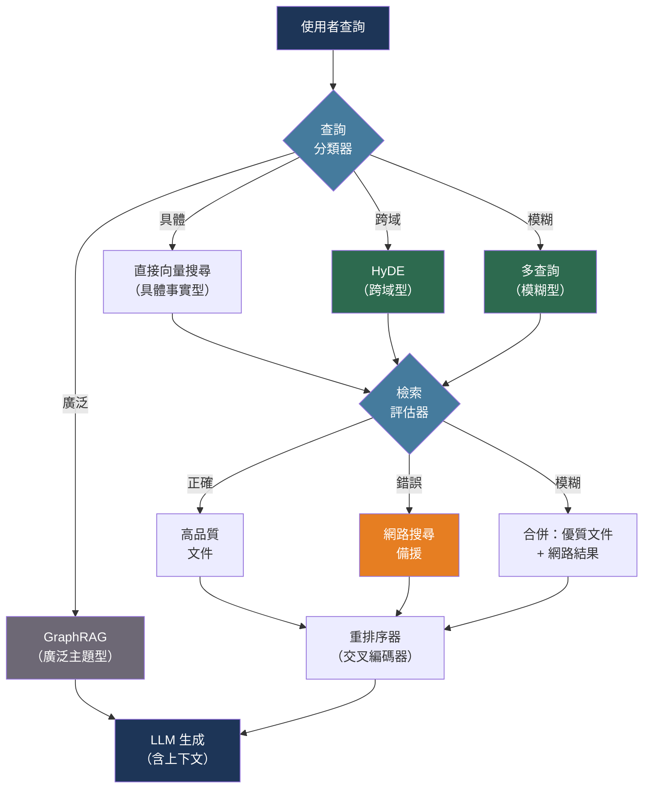

# [BEE-30029] 進階 RAG 與智能檢索模式

:::info
標準 RAG——嵌入查詢、檢索前 k 個、生成——在查詢不明確、檢索文件不相關，或答案需要跨多份文件綜合資訊時會失敗；進階檢索模式針對每種失敗模式，在查詢、檢索和索引層面提供精準干預。
:::

## 背景

基本 RAG（BEE-30007）建立了一條流程：分塊文件、嵌入、儲存於向量資料庫、嵌入查詢、以餘弦相似度檢索前 k 個、注入上下文、生成。這條流程對結構良好語料庫的窄域事實查找效果良好，但在四種可識別的情境下會退化。

第一，使用者查詢與相關文件之間存在語意落差。使用者問「為什麼我的 Python 腳本卡住了？」，但相關文件描述的是「CPython GIL 中的執行緒死鎖」。查詢向量與文件向量在嵌入空間中並不接近。Gao 等人（arXiv:2212.10496，ACL 2023）引入了 HyDE——假設文件嵌入（Hypothetical Document Embeddings）——來橋接這個落差：生成一份假設性的文件作為查詢答案，嵌入該文件，然後使用假設文件的向量（而非查詢向量）進行檢索。

第二，查詢不夠明確。模糊的查詢會帶來模糊的結果。多查詢檢索（Multi-query retrieval）通過生成同一查詢的多個改寫版本並合併檢索結果集來解決此問題，在不改變索引的情況下提高召回率。

第三，不相關的檢索文件悄悄污染上下文。Yan 等人（arXiv:2401.15884，2024）將此形式化為修正性 RAG（Corrective RAG，CRAG）問題：輕量級評估器對檢索文件相關性評分，當分數低於閾值時觸發網路搜尋備援，而非將劣質文件傳給生成器。

第四，扁平索引無法回答需要跨多份文件綜合或在不同抽象層次理解的問題。Sarthi 等人（arXiv:2401.18059，ICLR 2024）以 RAPTOR 解決此問題——一棵遞迴的叢集摘要樹，可在任意抽象層次進行檢索。微軟的 GraphRAG（Edge 等人，arXiv:2404.16130，2024）更進一步：提取實體與關係以建構知識圖譜，偵測社群，對社群進行層次化摘要，並使用社群層級摘要回答廣泛的主題性查詢。

## 設計思維

進階檢索模式可以組合使用。生產系統通常依序應用多個模式：

1. **查詢轉換**（HyDE、多查詢、逐步後退）——改善檢索什麼
2. **檢索**——核心向量/關鍵字/混合搜尋（BEE-30015）
3. **檢索評估與修正**（CRAG）——驗證所檢索的內容是否相關
4. **重排序**（BEE-30015）——以交叉編碼器重新排序檢索文件
5. **生成**——將已驗證、已排序的上下文注入 LLM

每一層都會增加延遲和成本。問題在於根據主要失敗模式決定投資哪些層次。在增加複雜性之前，應先對檢索品質進行剖析——在黃金查詢集上測量 recall@k 和 MRR。

## 最佳實踐

### 當查詢與文件措辭不同時應用 HyDE

**SHOULD**（應該）在使用者查詢以自然語言表達、但文件以技術或領域特定語言撰寫的事實問答工作負載中使用 HyDE。核心洞察是：假設性答案在嵌入空間中比問題本身更接近真實答案：

```python
from openai import OpenAI
import numpy as np

client = OpenAI()

def hyde_retrieve(query: str, vector_db, k: int = 5) -> list:
    """
    步驟 1：生成一份假設性的文件來回答查詢。
    步驟 2：嵌入假設文件（而非查詢本身）。
    步驟 3：使用假設文件的嵌入進行檢索。
    """
    # 步驟 1：生成簡潔的假設性答案
    hypothetical = client.chat.completions.create(
        model="gpt-4o-mini",
        messages=[{
            "role": "user",
            "content": (
                f"Write a short passage that would directly answer this question. "
                f"Be factual and concise. Do not say you don't know.\n\n"
                f"Question: {query}"
            ),
        }],
        max_tokens=200,
        temperature=0,
    ).choices[0].message.content

    # 步驟 2：嵌入假設文件，而非查詢
    embedding = client.embeddings.create(
        model="text-embedding-3-small",
        input=hypothetical,
    ).data[0].embedding

    # 步驟 3：使用假設向量對語料庫進行檢索
    return vector_db.search(embedding, k=k)
```

**MUST NOT**（不得）在查詢已使用與文件相同的領域語言時使用 HyDE（例如，以程式碼片段查詢程式碼搜尋索引）。HyDE 需要額外的 LLM 呼叫；若嵌入落差本身不大，延遲開銷是不值得的。

### 對不明確的查詢使用多查詢檢索

**SHOULD** 在查詢簡短、模糊，或可能以不同措辭出現在來源文件中時，生成使用者查詢的多個改寫版本並合併檢索結果集：

```python
from langchain.retrievers.multi_query import MultiQueryRetriever
from langchain_openai import ChatOpenAI

llm = ChatOpenAI(model="gpt-4o-mini", temperature=0)

# MultiQueryRetriever 在內部生成 3 個替代措辭，
# 分別進行檢索，並返回去重後的聯集。
retriever = MultiQueryRetriever.from_llm(
    retriever=vector_db.as_retriever(search_kwargs={"k": 5}),
    llm=llm,
)

# 等同於：生成變體 → 每個變體檢索 k 個 → 去重 → 返回
docs = retriever.invoke("How do I handle connection timeouts in Python?")
```

若需要自訂變體數量和日誌記錄：

```python
from langchain_core.prompts import PromptTemplate
from langchain_core.output_parsers import BaseOutputParser

QUERY_PROMPT = PromptTemplate(
    input_variables=["question"],
    template="""Generate 4 alternative phrasings of this search query. 
Return only the queries, one per line.

Original: {question}
Alternatives:""",
)

def multi_query_retrieve(query: str, retriever, n: int = 4) -> list:
    variants = llm.invoke(QUERY_PROMPT.format(question=query)).content.strip().splitlines()
    seen_ids = set()
    all_docs = []
    for variant in [query] + variants[:n]:
        for doc in retriever.invoke(variant.strip()):
            doc_id = doc.metadata.get("id", doc.page_content[:80])
            if doc_id not in seen_ids:
                seen_ids.add(doc_id)
                all_docs.append(doc)
    return all_docs
```

### 實作 CRAG 以從劣質檢索中恢復

**SHOULD** 在語料庫可能無法回答每一個可能查詢時，加入檢索評估步驟。CRAG 的三動作決策邏輯可防止不相關文件悄悄污染生成上下文：

```python
def evaluate_retrieval(query: str, docs: list[str]) -> str:
    """
    返回："correct" | "ambiguous" | "wrong"
    使用 LLM 作為輕量級相關性評審員。
    生產環境建議使用微調分類器以降低延遲。
    """
    scores = []
    for doc in docs:
        judgment = llm.invoke(
            f"Is this passage relevant to answering the query?\n\n"
            f"Query: {query}\n\nPassage: {doc[:500]}\n\n"
            f"Answer with just: relevant / irrelevant"
        ).content.strip().lower()
        scores.append(1 if "relevant" in judgment else 0)

    ratio = sum(scores) / len(scores) if scores else 0
    if ratio >= 0.7:
        return "correct"
    elif ratio >= 0.3:
        return "ambiguous"
    return "wrong"

def crag_retrieve(query: str, vector_db, web_search_fn) -> list[str]:
    """
    CRAG 檢索：評估相關性，必要時備援至網路搜尋。
    """
    docs = vector_db.search(query, k=5)
    doc_texts = [d.page_content for d in docs]
    action = evaluate_retrieval(query, doc_texts)

    if action == "correct":
        return doc_texts
    elif action == "wrong":
        # 完全備援至網路搜尋
        return web_search_fn(query)
    else:  # "ambiguous"
        # 合併高品質的檢索文件與網路搜尋結果
        good_docs = [doc_texts[i] for i, s in enumerate(scores) if s == 1]
        return good_docs + web_search_fn(query)
```

**SHOULD** 快取網路搜尋結果（以查詢為鍵），以避免對相同問題的多次請求產生重複搜尋。

### 對長文件語料庫使用 RAPTOR 處理多層次問題

**SHOULD** 在語料庫由長文件（書籍、技術規範、研究論文）組成，且使用者在不同特定程度提問——從具體事實到廣泛主題問題——時，建構 RAPTOR 樹狀索引：

```
RAPTOR 樹建構（於索引時一次性完成）：

第 0 層（葉節點）：[chunk₁] [chunk₂] [chunk₃] ... [chunkN]
                      ↓ 依嵌入相似度叢集化 ↓
第 1 層：      [叢集 A 的摘要] [叢集 B 的摘要] ...
                      ↓ 再次叢集化 ↓
第 2 層：      [{A,B} 的摘要] [{C,D} 的摘要] ...
                      ↓
第 k 層：      [整個語料庫的根摘要]
```

查詢時，從匹配查詢抽象層次的層級進行檢索：
- 「乙醇的沸點是多少？」→ 第 0 層（具體事實，葉節點塊）
- 「這份文件的主要主題是什麼？」→ 第 2 層以上（抽象摘要）

**MUST NOT** 對小型語料庫（少於 100 份文件）或查詢始終具體的語料庫建構 RAPTOR。樹的建構在每一層的每個叢集摘要都需要 LLM 呼叫，對於小型或同質性語料庫而言，成本相對於收益過高。

### 對實體豐富語料庫使用 GraphRAG 進行深度理解

**SHOULD** 在語料庫具有密集實體關係（新聞檔案、法律文件、產品生態系統），且使用者提出廣泛問題（如「主要主題是什麼？」或「這些實體如何關聯？」）時使用 GraphRAG：

GraphRAG 建構流程（離線執行）：

```
文件
   ↓  LLM 實體 + 關係提取
知識圖譜（實體為節點，關係為邊）
   ↓  萊登社群偵測演算法
社群（密集連接的子圖）
   ↓  LLM 逐社群摘要
社群報告（層次化：葉節點 → 中間層 → 全局）
```

查詢時：
- **本地搜尋**：查詢特定實體及其鄰域 → 快速、精準
- **全局搜尋**：查詢社群摘要 → 全面、廣泛

**MUST NOT** 在對延遲敏感的應用中使用 GraphRAG 而未預先快取社群摘要。全局搜尋需要讀取並推理可能數百份社群報告；這是適合批次處理的操作，而非秒以內的互動式操作。預先計算預期廣泛問題的社群層級答案並從快取提供服務。

### 將查詢路由至適當的檢索策略

**SHOULD** 在系統服務於多種查詢類型（各自受益於不同檢索策略）時，加入輕量級查詢路由器：

```python
from enum import Enum

class RetrievalStrategy(Enum):
    DIRECT = "direct"         # 標準向量搜尋：具體事實型查詢
    HYDE = "hyde"             # HyDE：跨域或技術型查詢
    MULTI_QUERY = "multi"     # 多查詢：模糊或不明確的查詢
    GRAPH = "graph"           # GraphRAG：廣泛的主題性查詢

def classify_query(query: str) -> RetrievalStrategy:
    """使用廉價 LLM 呼叫或啟發式規則對查詢分類。"""
    word_count = len(query.split())
    q_lower = query.lower()

    # 簡短、具體的查詢 → 直接檢索
    if word_count <= 6 and any(q_lower.startswith(w) for w in ["what is", "what are", "when", "who"]):
        return RetrievalStrategy.DIRECT

    # 廣泛的主題性問題 → GraphRAG
    if any(kw in q_lower for kw in ["main themes", "overall", "broadly", "summarize", "overview"]):
        return RetrievalStrategy.GRAPH

    # 模糊或複合問題 → 多查詢
    if word_count >= 15 or " and " in q_lower or " or " in q_lower:
        return RetrievalStrategy.MULTI_QUERY

    return RetrievalStrategy.HYDE  # 預設：跨域落差很常見

def adaptive_retrieve(query: str, indexes: dict) -> list:
    strategy = classify_query(query)
    if strategy == RetrievalStrategy.HYDE:
        return hyde_retrieve(query, indexes["vector"])
    elif strategy == RetrievalStrategy.MULTI_QUERY:
        return multi_query_retrieve(query, indexes["vector"])
    elif strategy == RetrievalStrategy.GRAPH:
        return indexes["graph"].global_search(query)
    return indexes["vector"].search(query, k=5)
```

## 視覺圖



## 複雜度與效益

| 模式 | 索引成本 | 查詢延遲增加 | 最適合 |
|---|---|---|---|
| HyDE | 無 | +1 次 LLM 呼叫（約 200 ms） | 跨域事實問答 |
| 多查詢 | 無 | +N × 檢索（約 100–300 ms） | 模糊/複合查詢 |
| CRAG | 無 | +LLM 評審（約 200 ms），觸發時加網路搜尋 | 語料庫覆蓋不確定時的健壯性 |
| RAPTOR | 高（每叢集需 LLM） | 極小（從樹中檢索） | 長文件、混合抽象層次查詢 |
| GraphRAG | 極高（實體提取 + 社群偵測） | 本地：低；全局：高（適合批次） | 對實體豐富語料庫進行廣泛理解 |

## 相關 BEE

- [BEE-30007](rag-pipeline-architecture.md) -- RAG 流程架構：這些進階模式所延伸的基準檢索流程
- [BEE-30015](retrieval-reranking-and-hybrid-search.md) -- 檢索重排序與混合搜尋：位於所有這些檢索策略下游的重排序步驟
- [BEE-30026](vector-database-architecture.md) -- 向量資料庫架構：檢索層所查詢的 HNSW 索引與過濾配置
- [BEE-30010](llm-context-window-management.md) -- LLM 上下文視窗管理：RAPTOR 與多查詢會擴展檢索到的上下文；上下文打包與截斷策略因此更加重要

## 參考資料

- [Gao et al. Precise Zero-Shot Dense Retrieval without Relevance Labels (HyDE) — arXiv:2212.10496, ACL 2023](https://arxiv.org/abs/2212.10496)
- [Asai et al. Self-RAG: Learning to Retrieve, Generate, and Critique through Self-Reflection — arXiv:2310.11511, ICLR 2024](https://arxiv.org/abs/2310.11511)
- [Yan et al. Corrective Retrieval Augmented Generation (CRAG) — arXiv:2401.15884, 2024](https://arxiv.org/abs/2401.15884)
- [Sarthi et al. RAPTOR: Recursive Abstractive Processing for Tree-Organized Retrieval — arXiv:2401.18059, ICLR 2024](https://arxiv.org/abs/2401.18059)
- [Edge et al. From Local to Global: A Graph RAG Approach to Query-Focused Summarization — arXiv:2404.16130, 2024](https://arxiv.org/abs/2404.16130)
- [Microsoft GraphRAG — github.com/microsoft/graphrag](https://github.com/microsoft/graphrag)
- [LangChain. MultiQueryRetriever — python.langchain.com](https://python.langchain.com/docs/how_to/MultiQueryRetriever/)
