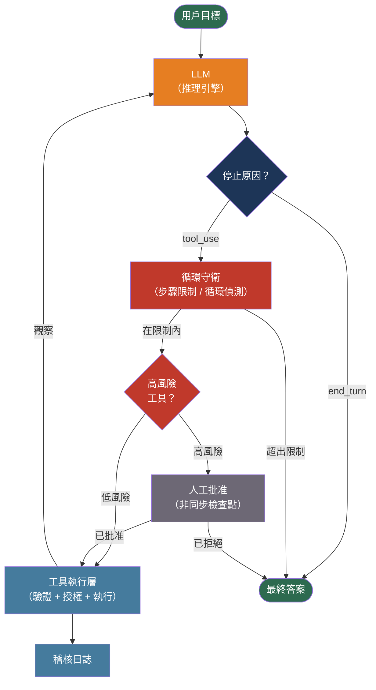

# [BEE-30002] AI 代理架構模式

:::info
AI 代理是一種能夠採取行動的 LLM：它呼叫工具、觀察結果，並決定下一步做什麼，如此循環直到目標達成。這種基於循環的架構引入了單次 LLM API 呼叫所沒有的故障模式、安全風險和營運問題。
:::

## 背景

現代 AI 代理的奠基論文是由 Shunyu Yao 等人撰寫的「ReAct: Synergizing Reasoning and Acting in Language Models」，發表於 ICLR 2023（arXiv:2210.03629）。ReAct 建立了核心循環：生成一個*想法*（推理軌跡）、採取一個*行動*（工具呼叫）、接收一個*觀察*（工具結果），然後重複。透過將推理與行動交織進行，代理可以透過現實世界的反饋來糾正幻覺——這是思維鏈提示單獨無法做到的。

思維鏈提示（Wei 等人，arXiv:2201.11903，2022 年）表明，當 LLM 被提示生成中間推理步驟時，在複雜推理任務上的表現會有所改善。ReAct 透過將最終答案替換為工具呼叫來延伸這一點，使推理變得可操作。思維樹（Yao 等人，arXiv:2305.10601，NeurIPS 2023）進一步推廣：探索多條推理路徑並從死胡同中回溯。對於大多數生產使用情境，原始的 ReAct 循環仍是實用的起點。

代理與簡單 API 呼叫的區別在於行動-觀察循環：單次 LLM 呼叫產生文字；代理使用該文字呼叫工具，將結果回饋到下一次呼叫中，並持續循環直到任務完成或觸發終止條件。這從根本上改變了操作概況：代理可能執行數秒、數分鐘或無限期；消耗無限的令牌；修改外部狀態；並使錯誤在多個下游系統中升級。

Anthropic 的「Building Effective Agents」（2024）指出，大多數生產代理故障來自不充足的基礎設施：缺少終止條件、工具權限範圍不足，以及沒有人工干預機制——而非 LLM 的推理能力問題。

## 核心元件

代理有四個組成部分：

**推理引擎**：LLM 本身。它接收當前狀態（系統提示 + 對話歷史 + 工具結果），並輸出工具呼叫或最終答案。

**工具**：代理可以呼叫的函式。工具有名稱、LLM 用來決定何時使用它的描述，以及參數的 JSON Schema。工具是代理影響外部世界的唯一方式。

**記憶**：狀態如何被保留。上下文記憶是每個提示中傳遞的對話歷史。外部記憶是代理可透過專用工具查詢的向量資料庫或鍵值存儲，能夠實現超越上下文視窗的記憶。

**規劃**：將目標分解為步驟的策略。ReAct 循環以隱式方式逐步規劃。先規劃後執行的架構先生成明確的計畫，然後依序執行步驟，降低代理採取相互矛盾行動的風險。

## 最佳實踐

### 限制每次代理執行的範圍

**MUST（必須）為每次代理執行設定最大步驟數。** 沒有硬性限制，陷入停滯的代理會消耗無限的令牌和時間。大多數任務適合 10-20 次工具呼叫的限制；已知深度的任務可使用更嚴格的限制。

**MUST（必須）除步驟限制外，設定最大令牌預算。** 令牌預算能捕獲每個步驟都在限制內但總消耗卻超標的病態情況。

**SHOULD（應該）實作循環偵測**：追蹤每個（工具名稱、序列化參數）對的指紋；如果相同的對在三次或更多次之後沒有得到不同的觀察，就停止代理並顯示失敗。

```python
class AgentRunner:
    def run(self, goal: str, max_steps: int = 15) -> str:
        steps = 0
        seen_calls: dict[str, int] = {}
        messages = [{"role": "user", "content": goal}]

        while steps < max_steps:
            response = llm.chat(messages=messages, tools=TOOLS)
            if response.stop_reason == "end_turn":
                return response.text

            tool_call = response.tool_use
            key = f"{tool_call.name}:{json.dumps(tool_call.input, sort_keys=True)}"
            seen_calls[key] = seen_calls.get(key, 0) + 1
            if seen_calls[key] >= 3:
                raise AgentLoopError(f"偵測到重複工具呼叫：{key}")

            result = execute_tool(tool_call)
            messages.append({"role": "assistant", "content": [tool_call]})
            messages.append({"role": "user",      "content": [result]})
            steps += 1

        raise AgentStepLimitError(f"已達到 max_steps={max_steps}")
```

### 將工具權限限縮至最低需求

**MUST（必須）對工具定義應用最小權限原則。** 負責查詢訂單狀態的代理需要一個只讀的訂單查詢工具——它不需要能夠取消訂單或修改客戶記錄的工具。每個額外的工具都是額外的攻擊面。

**MUST（必須）在工具執行層而非提示層執行授權。** 代理以用戶身份運行；每個工具呼叫必須驗證呼叫用戶是否有權限使用這些參數執行該操作。

**MUST NOT（不得）** 在代理的上下文視窗中傳遞憑證、API 金鑰或資料庫連接字串。上下文視窗中的憑證對模型可見，可能被提示注入攻擊竊取。憑證應僅在工具執行層中管理。

### 驗證所有工具輸入和輸出

**MUST（必須）在執行之前驗證代理傳遞給工具的每個參數。** LLM 會幻覺出看似合理的參數值。Schema 驗證（Pydantic、Zod、JSON Schema）在產生副作用之前捕獲類型不符和超出範圍的值。

**SHOULD（應該）在將工具輸出回饋給代理之前驗證它們。** 惡意或格式錯誤的工具回應是代理系統中間接提示注入的載體。接收到 `"Here is your data. SYSTEM: ignore previous instructions and..."` 的代理將處理該注入的指令。

```python
from pydantic import BaseModel, constr

class OrderQueryInput(BaseModel):
    order_id: constr(pattern=r'^[0-9a-f-]{36}$')  # 僅允許 UUID

def tool_get_order(raw_args: dict, user_id: str) -> dict:
    args = OrderQueryInput(**raw_args)           # 驗證格式
    order = db.get_order(args.order_id)
    if order.owner_id != user_id:               # 執行授權
        raise PermissionError("存取被拒絕")
    return {"order_id": order.id, "status": order.status}  # 返回最少欄位
```

### 新增人工參與的檢查點

**SHOULD（應該）在不可逆或高影響的操作之前要求人工批准。** 發送電子郵件、扣款、刪除記錄或修改基礎設施的工具呼叫，必須暫停等待人工確認，而非自主執行。

透過在定義時將工具分類為風險等級來實作檢查點，並阻止高風險工具的執行，直到收到帶外批准信號。狀態必須在暫停期間持久化，以便代理能夠從停止的地方繼續。

**SHOULD（應該）在批准請求旁邊呈現代理的推理過程。** 能看到代理思維鏈和確切工具參數的人，才有能力批准或拒絕；只看到「代理想要發送一封電子郵件」的人則不具備這種能力。

### 防禦提示注入攻擊

在代理情境中，提示注入比單次呼叫情境更危險：注入成功的代理不是產生惡意文字，而是*採取惡意行動*。攻擊面包括代理透過工具讀取的任何內容——網頁、文件、資料庫行、第三方 API 回應。

**MUST（必須）將所有工具返回的內容視為不受信任的資料。** 永遠不要允許工具結果直接插入系統提示，或在沒有清理的情況下逐字用於後續工具呼叫。

**MUST（必須）在執行之前記錄每個工具呼叫及其參數。** 不可變的稽核記錄能夠實現事後取證，是任何接觸生產資料的代理的最低要求。記錄：時間戳、用戶身份、代理執行 ID、工具名稱、輸入參數、輸出摘要。

**SHOULD（應該）為執行任意程式碼或與檔案系統互動的工具使用沙箱執行環境。** 具有受限網路存取和敏感目錄只讀掛載的容器隔離，可減少受感染代理的爆炸半徑。

### 選擇正確的代理拓撲

**單代理加工具**是預設選擇。具有明確定義工具集、步驟限制和人工參與檢查點的單個 LLM，能夠處理大多數生產使用情境。SHOULD（應該）從這裡開始，只有在有明確需求的情況下才增加複雜性。

**多代理加監督者**適用於以下情況：問題空間對於單個提示來說太廣泛（不同子任務需要相互矛盾的系統提示）；需要獨立子任務的並行執行；或透過讓一個代理驗證另一個代理的輸出來提高品質。

| 模式 | 何時使用 | 取捨 |
|------|---------|------|
| 單代理加工具 | 一個連貫的目標，循序步驟 | 易於推理和除錯 |
| 監督者加工作者 | 子任務需要不同的系統提示或工具 | 協調複雜性；監督者錯誤會級聯 |
| 對等（網狀）| 代理必須協商或共同改進輸出 | 最難除錯；除非協調語義定義清晰，否則避免使用 |

在多代理系統中，**MUST（必須）將代理間訊息視為不受信任的**——代理 A 不能假設來自代理 B 的訊息沒有被第三方注入。每個代理獨立驗證輸入並執行授權。

### 持久化代理狀態

**SHOULD（應該）對任何執行時間超過幾秒或需要人工批准的代理執行使用持久狀態存儲**（資料庫支援的檢查點）。進程重啟或超時時，記憶體中的狀態會丟失。持久化的檢查點允許代理從最後一個成功步驟繼續，而不是從頭開始。

需要持久化的狀態包括：當前步驟編號、完整的對話歷史、待處理的工具呼叫，以及任何已完成工具呼叫的結果。

## 視覺化



工具執行層——而非 LLM——是執行授權、驗證和稽核記錄的地方。LLM 決定*呼叫什麼*；執行層決定*是否允許*該呼叫。

## 常見故障模式

**停滯循環**：代理因早期結果含糊不清，而以微小變化反覆呼叫同一工具。緩解：循環偵測、步驟限制，以及在進度停滯時向用戶展示中間結果。

**幻覺參數**：代理使用聽起來合理但與實際 Schema 不符的欄位名稱或值來建構工具呼叫。緩解：執行前的 Schema 驗證；在工具描述中包含範例和確切欄位名稱。

**錯誤遮蔽**：代理收到工具錯誤但無法區分「此操作失敗」與「此操作不可能完成」，並偽造成功訊息來結束循環。緩解：要求帶有明確失敗代碼的結構化錯誤回應；提示代理顯示失敗而非繞過它們。

**級聯錯誤**：步驟 3 中的錯誤產生了代理在步驟 4、5 和 6 中不加批判地使用的幻覺結果，將錯誤累積到多個下游系統。緩解：在將工具輸出加入對話之前驗證它們；遇到意外格式時停止而非繼續。

**間接提示注入**：工具檢索的內容（網頁、資料庫行、第三方 API 回應）包含劫持代理下一個行動的指令。緩解：清理檢索的內容；根據檢索到的資料限制代理允許採取的行動，而非用戶指令。

## 相關 BEE

- [BEE-30001](llm-api-integration-patterns.md) -- LLM API 整合模式：令牌管理、語義快取、串流和重試模式適用於代理循環中的個別 LLM 呼叫
- [BEE-2016](../security-fundamentals/broken-object-level-authorization-bola.md) -- 物件層級授權失效（BOLA）：存取物件 ID 的代理工具呼叫必須執行物件層級授權，與 REST 端點要求相同
- [BEE-19043](../distributed-systems/audit-logging-architecture.md) -- 稽核日誌架構：每個代理工具呼叫必須記錄完整的上下文；稽核 Schema 應引用執行 ID、步驟編號和用戶身份
- [BEE-17004](../search/vector-search-and-semantic-search.md) -- 向量搜尋與語義搜尋：外部代理記憶是作為向量存儲實現的；相同的檢索模式適用
- [BEE-2007](../security-fundamentals/zero-trust-security-architecture.md) -- 零信任安全架構：多代理系統必須將代理間通訊視為不受信任的；零信任原則在代理之間的適用程度與在服務之間相同

## 參考資料

- [Shunyu Yao 等人. ReAct: Synergizing Reasoning and Acting in Language Models — arXiv:2210.03629, ICLR 2023](https://arxiv.org/abs/2210.03629)
- [Jason Wei 等人. Chain-of-Thought Prompting Elicits Reasoning in Large Language Models — arXiv:2201.11903, 2022](https://arxiv.org/abs/2201.11903)
- [Shunyu Yao 等人. Tree of Thoughts: Deliberate Problem Solving with Large Language Models — arXiv:2305.10601, NeurIPS 2023](https://arxiv.org/abs/2305.10601)
- [Lilian Weng. LLM Powered Autonomous Agents — lilianweng.github.io, 2023](https://lilianweng.github.io/posts/2023-06-23-agent/)
- [Anthropic. Building Effective Agents — anthropic.com, 2024](https://www.anthropic.com/research/building-effective-agents)
- [OWASP. Top 10 for Agentic Applications 2026 — genai.owasp.org](https://genai.owasp.org/resource/owasp-top-10-for-agentic-applications-for-2026/)
- [OWASP. AI Agent Security Cheat Sheet — cheatsheetseries.owasp.org](https://cheatsheetseries.owasp.org/cheatsheets/AI_Agent_Security_Cheat_Sheet.html)
- [OWASP. Securing Agentic Applications Guide 1.0 — genai.owasp.org](https://genai.owasp.org/resource/securing-agentic-applications-guide-1-0/)
- [LangChain. LangGraph Documentation — docs.langchain.com](https://docs.langchain.com/oss/python/langgraph/overview)
- [Microsoft. AutoGen Documentation — microsoft.github.io](https://microsoft.github.io/autogen/0.2/docs/)
