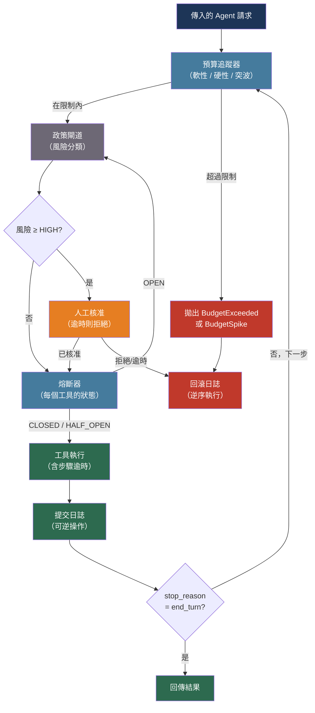

# [BEE-30035] AI Agent 安全性與可靠性模式

:::info
在真實部署環境中，LLM Agent 的失敗率高達 41–87%，失敗原因涵蓋 Token 超支失控、工具呼叫逾時引發的連鎖崩潰、協作死鎖，以及無法復原的副作用。防範這些問題需要預算控管、多層逾時保護、以可逆性為優先的工具設計、自動化政策閘道，以及 Schema 驗證的跨 Agent 訊息傳遞。
:::

## 背景

Wirfs-Brock 等人提出的 MAST 分類法（arXiv:2503.13657，NeurIPS 2025）分析了七個多 Agent 系統框架的逾 1,600 筆標注軌跡，發現實際部署中失敗率介於 41% 至 86.7%。14 種失敗模式分為三大類：規格與系統設計失敗（Agent 違反自身角色描述，或無法辨識終止條件而持續循環）、跨 Agent 協作失調（Agent 隱瞞資訊、重置對話狀態，或忽略同伴輸出），以及任務驗證失敗（過早終止或缺乏驗證步驟）。

相較於無狀態的 REST 處理器，LLM Agent 每次迭代都會累積成本。一個正常執行的程式碼 Agent 每任務約消耗 $5–8；但設定錯誤的迴圈使用相同工具組，可能在數分鐘內達到同等消耗。僅追蹤 Token 的預算設計會漏算這類風險——外部工具 API 呼叫產生的費用不會出現在模型的 Token 計數中。Anthropic 的可信任 Agent 框架明確回應此問題：Agent 應維持最小足跡（minimal footprint），優先採取可逆行動，範圍不明確時應傾向少做並主動確認。

工程挑戰在於這些原則必須以機械方式強制執行，而非仰賴模型自我判斷。失控狀態的 Agent 無法自我回報；依賴 Agent 進程觸發的核准閘道，在該進程本身就是故障來源時也會失效。

## 設計思考

Agent 安全失敗沿三個向量組合發生：

**資源耗盡** — Token 或工具呼叫無限制消耗。正確的防禦應分層：軟性限制在預算 50–80% 時觸發告警；硬性限制強制終止；變化率偵測器在超過絕對閾值之前就能提前發現指數級迴圈。

**執行邊界違規** — 工具呼叫掛起、外部服務失敗，或重試風暴將單一故障放大為連鎖崩潰。正確的防禦分層使用逾時（中止單次呼叫）、熔斷器（在閾值後阻止重試浪潮）以及艙壁隔離（將失敗的工具執行緒池與健康的隔離）。

**協作失效** — 跨 Agent 訊息語意模糊、Agent 相互等待形成死鎖，或透過 Agent 委派鏈進行權限升級。正確的防禦使用 Schema 驗證的訊息契約、位於 Agent 環外的看門狗進程，以及能力委派中的範圍縮減。

## 最佳實踐

### 以軟性與硬性限制強制執行預算上限

**必須（MUST）** 追蹤每個 Agent 會話的累計 Token 與工具呼叫成本，並至少執行兩道閾值：觸發告警的軟性限制，以及終止 Agent 的硬性限制。**應該（SHOULD）** 同時偵測變化率異常，在絕對預算耗盡之前提前發現失控迴圈：

```python
import anthropic
import time
import logging

logger = logging.getLogger(__name__)
client = anthropic.Anthropic()

class AgentBudget:
    """
    每個會話的預算追蹤器，結合絕對閾值與變化率異常偵測。
    """
    def __init__(
        self,
        soft_limit_tokens: int = 40_000,
        hard_limit_tokens: int = 80_000,
        spike_multiplier: float = 3.0,    # 若單步成本 > 滾動平均的 3 倍則告警
        window_steps: int = 5,            # 變化率計算的滾動視窗大小
    ):
        self.soft_limit = soft_limit_tokens
        self.hard_limit = hard_limit_tokens
        self.spike_multiplier = spike_multiplier
        self.window_steps = window_steps

        self.total_input_tokens = 0
        self.total_output_tokens = 0
        self.step_costs: list[int] = []

    @property
    def total_tokens(self) -> int:
        return self.total_input_tokens + self.total_output_tokens

    def record_step(self, input_tokens: int, output_tokens: int) -> None:
        """記錄已完成的步驟。超過限制時拋出例外。"""
        step_cost = input_tokens + output_tokens
        self.total_input_tokens += input_tokens
        self.total_output_tokens += output_tokens
        self.step_costs.append(step_cost)

        # 軟性限制：告警但繼續執行
        if self.total_tokens >= self.soft_limit:
            logger.warning(
                "agent_budget_soft_limit",
                extra={"total_tokens": self.total_tokens, "soft_limit": self.soft_limit},
            )

        # 硬性限制：強制終止
        if self.total_tokens >= self.hard_limit:
            raise AgentBudgetExceeded(
                f"Hard budget exceeded: {self.total_tokens} >= {self.hard_limit} tokens"
            )

        # 變化率：提前發現指數級迴圈
        if len(self.step_costs) >= self.window_steps:
            window = self.step_costs[-self.window_steps:]
            rolling_avg = sum(window[:-1]) / (len(window) - 1)
            if rolling_avg > 0 and step_cost > rolling_avg * self.spike_multiplier:
                raise AgentBudgetSpike(
                    f"Cost spike: step={step_cost}, avg={rolling_avg:.0f} "
                    f"({step_cost / rolling_avg:.1f}x > threshold={self.spike_multiplier}x)"
                )

class AgentBudgetExceeded(RuntimeError): pass
class AgentBudgetSpike(RuntimeError): pass
```

**必須不（MUST NOT）** 在多個並發 Agent 會話之間共享單一 Token 池而不設置每個會話上限。共用池允許一個失控會話耗盡所有並發使用者的配額。

### 以熔斷器實作多層逾時

**必須（MUST）** 在三個獨立層級套用逾時：單次工具呼叫、完整的 Agent 步驟（一次 LLM 回應內的所有工具呼叫），以及整個 Agent 會話。某一層的逾時不能取代其他層的保護：

```python
import asyncio
from dataclasses import dataclass, field
from enum import Enum

class CircuitState(Enum):
    CLOSED = "closed"       # 正常運作
    OPEN = "open"           # 失敗中；立即拒絕請求
    HALF_OPEN = "half_open" # 恢復逾時後進行探測

@dataclass
class CircuitBreaker:
    """
    每個工具的熔斷器。防止重試風暴將單一工具故障
    連鎖放大為整個會話失敗。
    """
    failure_threshold: int = 3
    recovery_timeout: float = 30.0
    call_timeout: float = 10.0

    _state: CircuitState = field(default=CircuitState.CLOSED, init=False)
    _failures: int = field(default=0, init=False)
    _opened_at: float = field(default=0.0, init=False)

    @property
    def state(self) -> CircuitState:
        if self._state == CircuitState.OPEN:
            if time.monotonic() - self._opened_at >= self.recovery_timeout:
                self._state = CircuitState.HALF_OPEN
        return self._state

    async def call(self, fn, *args, **kwargs):
        if self.state == CircuitState.OPEN:
            raise ToolCircuitOpen(f"Circuit open")

        try:
            result = await asyncio.wait_for(
                asyncio.to_thread(fn, *args, **kwargs),
                timeout=self.call_timeout,
            )
            self._failures = 0
            self._state = CircuitState.CLOSED
            return result
        except Exception:
            self._failures += 1
            if self._failures >= self.failure_threshold:
                self._state = CircuitState.OPEN
                self._opened_at = time.monotonic()
            if self._state == CircuitState.HALF_OPEN:
                self._state = CircuitState.OPEN
            raise

class ToolCircuitOpen(RuntimeError): pass
```

**應該（SHOULD）** 將熔斷器觸發視為優雅失敗，而非會話終止。向模型回傳結構化錯誤結果，讓它決定是否稍後重試、改用替代工具，或直接停止：

```python
{
    "tool_use_id": "toolu_01Xyz",
    "type": "tool_result",
    "content": '{"error": "Database circuit open — retry in 30s or proceed without this data"}',
    "is_error": True,
}
```

### 以可逆性為優先設計工具

**應該（SHOULD）** 為每個提供給 Agent 的工具設計明確的復原路徑。沒有回滾機制的工具會使部分執行無法復原：

```python
from abc import ABC, abstractmethod
from typing import Any

class ReversibleTool(ABC):
    """可回滾 Agent 工具的基礎類別。"""

    @abstractmethod
    def execute(self, **kwargs) -> dict[str, Any]:
        """執行操作，回傳結果與回滾 token。"""
        ...

    @abstractmethod
    def rollback(self, token: str) -> None:
        """還原由 token 識別的操作。"""
        ...

class SendEmailTool(ReversibleTool):
    """
    電子郵件排程於 60 秒後發送；回滾在發送前取消。
    這是「暫存環境」模式：真實後果被延遲。
    """

    def execute(self, to: str, subject: str, body: str) -> dict[str, Any]:
        scheduled_id = email_service.schedule(
            to=to, subject=subject, body=body,
            send_at=datetime.utcnow() + timedelta(seconds=60),
        )
        return {"status": "scheduled", "rollback_token": scheduled_id, "send_at": "+60s"}

    def rollback(self, token: str) -> None:
        email_service.cancel(token)

class DeleteRowTool(ReversibleTool):
    """軟刪除：標記 deleted_at；回滾清除該標記。"""

    def execute(self, table: str, row_id: str) -> dict[str, Any]:
        db.execute(
            f"UPDATE {table} SET deleted_at = NOW() WHERE id = %s",
            (row_id,),
        )
        return {"status": "soft_deleted", "rollback_token": f"{table}:{row_id}"}

    def rollback(self, token: str) -> None:
        table, row_id = token.split(":", 1)
        db.execute(
            f"UPDATE {table} SET deleted_at = NULL WHERE id = %s",
            (row_id,),
        )
```

**應該（SHOULD）** 為每個 Agent 會話維護提交日誌（commit journal）。若會話異常終止——預算超支、熔斷器觸發、未捕獲的例外——編排器以逆序回滾所有未提交的操作：

```python
class CommitJournal:
    def __init__(self):
        self._entries: list[tuple[ReversibleTool, str]] = []

    def record(self, tool: ReversibleTool, token: str) -> None:
        self._entries.append((tool, token))

    def rollback_all(self) -> None:
        for tool, token in reversed(self._entries):
            try:
                tool.rollback(token)
            except Exception as exc:
                logger.error("rollback_failed", extra={"token": token, "error": str(exc)})
```

### 以政策層攔截高風險操作

**必須（MUST）** 在執行前對工具呼叫進行風險分類。政策閘道攔截每次工具呼叫，判斷其語意意圖，並選擇允許、修改、拒絕或升級處理：

```python
from enum import Enum

class RiskLevel(Enum):
    LOW = "low"         # 自動執行
    MEDIUM = "medium"   # 記錄並執行
    HIGH = "high"       # 需要人工核准
    CRITICAL = "critical"  # 拒絕或需要多人核准

RISK_PATTERNS: dict[str, RiskLevel] = {
    "delete_": RiskLevel.HIGH,
    "drop_": RiskLevel.CRITICAL,
    "truncate_": RiskLevel.CRITICAL,
    "send_email": RiskLevel.HIGH,
    "send_sms": RiskLevel.HIGH,
    "post_webhook": RiskLevel.MEDIUM,
    "search_": RiskLevel.LOW,
    "get_": RiskLevel.LOW,
    "list_": RiskLevel.LOW,
}

def classify_tool_risk(tool_name: str, tool_input: dict) -> RiskLevel:
    for prefix, level in RISK_PATTERNS.items():
        if tool_name.startswith(prefix):
            return level
    return RiskLevel.MEDIUM  # 保守預設值

def policy_gate(
    tool_name: str,
    tool_input: dict,
    require_approval_fn=None,
) -> bool:
    risk = classify_tool_risk(tool_name, tool_input)

    if risk == RiskLevel.LOW:
        return True
    if risk == RiskLevel.MEDIUM:
        logger.info("tool_gate_medium", extra={"tool": tool_name})
        return True
    if risk == RiskLevel.HIGH:
        if require_approval_fn is None:
            return False
        return require_approval_fn(tool_name, tool_input, timeout_seconds=300)
    if risk == RiskLevel.CRITICAL:
        raise ToolPolicyDenied(f"Tool '{tool_name}' classified as CRITICAL; denied")
    return False

class ToolPolicyDenied(RuntimeError): pass
```

**必須不（MUST NOT）** 設定無限等待時間的核准閘道。未獲回應的核准請求在期限到期後**必須**預設為**拒絕**，而非繼續執行。一個永遠不會觸發的待決核准，等同於未受檢查的工具呼叫：

```python
def require_human_approval(tool_name: str, tool_input: dict, timeout_seconds: int = 300) -> bool:
    ticket = approval_service.create(tool_name, tool_input)
    try:
        return approval_service.wait(ticket.id, timeout=timeout_seconds)
    except TimeoutError:
        approval_service.cancel(ticket.id)
        return False  # 逾時則拒絕
```

### 以 JSON Schema 驗證跨 Agent 訊息

**必須（MUST）** 為多 Agent 系統中跨 Agent 傳遞的訊息定義明確的 JSON Schema。自由格式的自然語言 Agent 間訊息是跨 Agent 協作失調的主要驅動因素（MAST 分類法中最大的失敗類別）：

```python
from pydantic import BaseModel, Field
from typing import Literal
import uuid
from datetime import datetime

class AgentTaskRequest(BaseModel):
    """上級 Agent 向工作 Agent 委派任務的型別契約。"""
    request_id: str = Field(default_factory=lambda: str(uuid.uuid4()))
    issuing_agent_id: str
    task_type: Literal["summarize", "search", "code_review", "data_extraction"]
    payload: dict
    max_tokens_budget: int              # 預算委派：子 Agent 不得超過此值
    deadline_utc: datetime
    allowed_tools: list[str]            # 範圍縮減：子 Agent 繼承父 Agent 工具的子集
    require_structured_output: bool = True

class AgentTaskResult(BaseModel):
    """工作 Agent 向上級 Agent 回報結果的型別契約。"""
    request_id: str                     # 必須對應原始請求
    responding_agent_id: str
    status: Literal["completed", "failed", "partial", "needs_clarification"]
    output: dict | None = None
    error: str | None = None
    tokens_consumed: int                # 實際消耗的成本
    confidence: float = Field(ge=0.0, le=1.0)  # 自我評估的信心度
```

**應該（SHOULD）** 在委派中強制執行範圍縮減：子 Agent 的 `allowed_tools` 必須是父 Agent 工具集的嚴格子集。這可防止透過 Agent 鏈進行權限升級——即便是行為異常的子 Agent 也無法取得其父 Agent 未明確授予的能力：

```python
def delegate_task(
    parent_allowed_tools: list[str],
    child_task: AgentTaskRequest,
) -> AgentTaskRequest:
    """在委派子 Agent 之前強制執行範圍縮減。"""
    granted = set(child_task.allowed_tools) & set(parent_allowed_tools)
    return child_task.model_copy(update={"allowed_tools": list(granted)})
```

## 視覺化



## MAST 失敗分類（精選模式）

| 類別 | 失敗模式 | 機械防禦措施 |
|---|---|---|
| 規格 | 步驟重複（FM-1.3） | 單調遞增步驟計數器 + 狀態雜湊去重 |
| 規格 | 上下文截斷（FM-1.4） | 在視窗限制前摘要；使用視窗外的持久化記憶體存儲 |
| 跨 Agent | 資訊隱瞞（FM-2.4） | 結構化 `AgentTaskResult` Schema；`output` 欄位為必填 |
| 跨 Agent | 忽略同伴輸入（FM-2.5） | Agent 環外的看門狗進程偵測死鎖循環 |
| 跨 Agent | 範圍升級 | 委派中強制執行範圍縮減（allowed_tools 取交集） |
| 驗證 | 過早終止（FM-3.1） | 接受 `end_turn` 前的強制驗證步驟 |
| 驗證 | 缺乏驗證（FM-3.2） | `AgentTaskResult` 中要求 `confidence` 欄位；低信心輸出路由至人工審核 |

## 相關 BEE

- [BEE-30002](ai-agent-architecture-patterns.md) -- AI Agent 架構模式：這些安全層所包裹的 Agent 迴圈設計
- [BEE-30018](llm-tool-use-and-function-calling-patterns.md) -- LLM 工具使用與函數呼叫模式：熔斷器與政策閘道攔截的工具調度機制
- [BEE-30022](human-in-the-loop-ai-patterns.md) -- 人機協作 AI 模式：政策層觸發的核准閘道機制與基於信心度的路由
- [BEE-12001](../resilience/circuit-breaker-pattern.md) -- 熔斷器模式：此處套用於每個工具可靠性的通用熔斷器模式
- [BEE-19042](../distributed-systems/n-plus-1-query-batching.md) -- N+1 查詢問題與批次載入：Agent 工具呼叫中的重試風暴是 N+1 查詢問題的 Agentic 類比

## 參考資料

- [Wirfs-Brock et al. Why Do Multi-Agent LLM Systems Fail? MAST Taxonomy — arXiv:2503.13657, NeurIPS 2025](https://arxiv.org/abs/2503.13657)
- [Anthropic. Our Framework for Developing Safe and Trustworthy Agents — anthropic.com, 2025](https://www.anthropic.com/news/our-framework-for-developing-safe-and-trustworthy-agents)
- [Chen et al. Sherlock: Reliable and Efficient Agentic Workflow Execution — arXiv:2511.00330, 2025](https://arxiv.org/abs/2511.00330)
- [Microsoft. Agent Governance Toolkit Architecture Deep Dive — techcommunity.microsoft.com, 2025](https://techcommunity.microsoft.com/blog/linuxandopensourceblog/agent-governance-toolkit-architecture-deep-dive-policy-engines-trust-and-sre-for/4510105)
- [Liu et al. Budget-Aware Tool-Use Enables Effective Agent Scaling (BATS) — arXiv:2511.17006, 2025](https://arxiv.org/abs/2511.17006)
- [Portkey. AI Cost Observability: A Practical Guide — portkey.ai, 2025](https://portkey.ai/blog/ai-cost-observability-a-practical-guide-to-understanding-and-managing-llm-spend/)
