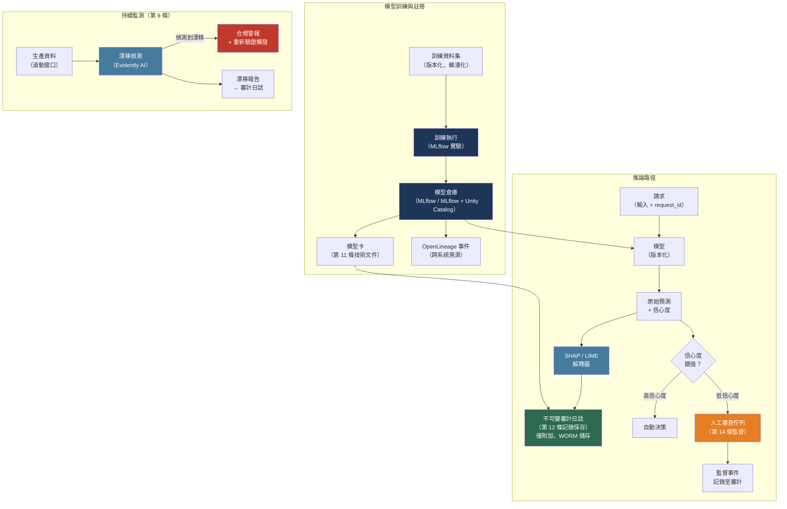

# [BEE-30079] AI 合規與治理工程

:::info
AI 合規工程是建構可審計、可解釋、且具備完整決策記錄的 AI 系統後端的工程學科。這不是事後補填的勾選清單流程。歐盟 AI 法案（Regulation EU 2024/1689，2024 年 8 月 1 日生效）對高風險 AI 系統施加具法律約束力的義務——具體包括：風險管理系統、資料治理、技術文件、自動事件記錄、透明度、人工監督，以及穩健性。滿足這些義務需要具備持久性的後端基礎設施：不可竄改的審計日誌、具備完整溯源的模型倉庫、結構化模型卡、可解釋性管線，以及漂移監測器。在模型上線後才建立這套基礎設施，所付出的代價遠高於從第一天就將其納入設計。
:::

## 情境

AI 系統的監管已從自願性指引發展為具約束力的法律。歐盟 AI 法案（Regulation (EU) 2024/1689，2024 年 7 月 12 日發布於歐盟官方公報，2024 年 8 月 1 日生效）是主要經濟體中第一部具效力的全面性 AI 專項法規。美國則制定了 NIST AI 風險管理框架（AI RMF 1.0，NIST.AI.100-1，2023 年 1 月 26 日發布）作為自願但廣泛採納的治理結構。其他司法管轄區也陸續跟進：英國發布了 AI 安全研究所指引、加拿大發布了演算法影響評估、巴西則提出了 AI 法案草案。

歐盟 AI 法案採用基於風險的分層方法：

- **不可接受風險**（禁止）：公共機構用於社會評分的 AI 系統、在公共場所進行即時遠端生物特徵監控（僅有極少例外）、利用脆弱性操縱人類行為的系統，以及在工作場所或學校推斷情緒的系統。這些系統自 2025 年 2 月 2 日起全面禁止。
- **高風險**：對健康、安全或基本權利有重大傷害潛力的系統。涵蓋兩類：(1) 嵌入現有歐盟產品安全法規範之受管制產品（醫療器材、機械、車輛）中的 AI，以及 (2) 附件三所列系統——包括用於關鍵基礎設施、教育、就業、基本私人與公共服務、執法、移民及司法的 AI。完整義務自 2026 年 8 月 2 日起適用。
- **有限風險**：具有特定透明度義務的系統（例如聊天機器人必須揭露其為 AI；深度偽造內容必須標示）。自 2026 年 8 月 2 日起適用。
- **最低風險**：其他一切。無強制性義務；鼓勵自願性行為準則。

通用 AI（GPAI）模型有其專屬義務（模型評估、對抗性測試、技術文件），自 2025 年 8 月 2 日起適用。嵌入受管制產品的高風險系統有延長過渡期至 2027 年 8 月 2 日。

NIST AI RMF 圍繞四個相互關聯的功能組織治理：

- **GOVERN（治理）**：建立 AI 風險管理的組織政策、角色、責任與文化。治理必須在任何 AI 系統部署前建立。
- **MAP（映射）**：識別並分類情境中的 AI 風險。需要編目使用中的 AI 系統、其預期目的及受影響者。
- **MEASURE（衡量）**：運用量化、定性或混合方法評估和監測已識別的風險。包含偏差測試、準確率基準測試，以及漂移偵測。
- **MANAGE（管理）**：透過緩解措施、事件回應及持續改進來優先處理並回應風險。

NIST 框架與歐盟法案相輔相成：GOVERN 和 MAP 對應法案的風險分類與文件要求；MEASURE 對應準確率、穩健性與偏差義務；MANAGE 對應上市後監控與記錄保存。

對後端工程師而言，關鍵洞察是：歐盟 AI 法案對高風險系統的大多數義務，最終歸結為四個具體的技術產出物：**不可竄改的審計日誌**、**具備完整溯源的模型倉庫**、**模型卡**，以及**即時的可解釋性與漂移管線**。正確建構這些產出物是後端基礎設施問題。

## 高風險 AI 的技術義務（第 9 至 15 條）

歐盟 AI 法案在第 9 至 15 條中定義了高風險 AI 系統的七個技術義務類別：

| 條文 | 義務 | 後端意涵 |
|---|---|---|
| 第 9 條 | 風險管理系統——識別可預見風險的持續生命週期流程 | 部署時的自動化風險評分；事件工單整合 |
| 第 10 條 | 資料治理——訓練/驗證資料必須相關、有代表性、無誤差 | 資料集版本控制；Schema 驗證；訓練前偏差掃描 |
| 第 11 條 | 技術文件——依附件四，涵蓋設計、訓練資料、測試方法 | 在模型註冊時生成模型卡 |
| 第 12 條 | 記錄保存——自動事件記錄、防竄改、適當保留期 | 每次推論、配置變更、人工覆蓋的僅附加審計日誌 |
| 第 13 條 | 透明度——使用者必須獲得關於預期目的、限制、準確率的資訊 | 結構化揭露端點；模型卡發布 |
| 第 14 條 | 人工監督——設計必須支援有效的人工監督與干預 | 覆蓋 API；觸發人工審查的信心閾值；人工決策的審計追蹤 |
| 第 15 條 | 準確率、穩健性、資安——維持效能；抵禦對抗性攻擊 | 漂移偵測；影子模式評估；對抗性測試套件 |

第 12 條在操作上要求最為嚴苛。它要求 AI 系統自動記錄（至少包含）：每筆交易的使用期間、系統用於核對輸入的參考資料庫、輸入資料，以及驗證結果。對於基於 LLM 的系統，這還延伸至提示詞版本、抽樣輸出、Token 計數、模型版本，以及延遲時間。

## 審計追蹤架構

AI 審計追蹤是 AI 系統產生或影響的所有事件的僅附加、防竄改日誌。它與標準應用程式日誌的差異在於兩點：事件一旦寫入即不可變，且事件包含 AI 特定的上下文（模型版本、輸入雜湊、輸出、信心度、特徵歸因）。

### 事件 Schema

每個 AI 推論事件**MUST**（必須）至少發出以下欄位：

```python
from dataclasses import dataclass, field
from datetime import datetime, timezone
from uuid import uuid4
import hashlib, json

@dataclass
class AIAuditEvent:
    event_id: str = field(default_factory=lambda: str(uuid4()))
    event_type: str = ""            # "inference", "override", "config_change", "model_deploy"
    timestamp: str = field(
        default_factory=lambda: datetime.now(timezone.utc).isoformat()
    )
    # 系統識別
    model_id: str = ""              # 已註冊的模型名稱
    model_version: str = ""        # 例如 "v2.3.1" 或 git SHA
    model_registry_uri: str = ""   # MLflow 執行 URI 或等效項

    # 請求上下文
    request_id: str = ""           # 呼叫服務的追蹤 ID
    session_id: str = ""           # 使用者 Session（如含個人資料則假名化）
    user_id: str = ""              # 假名化的主體識別符

    # AI 特定酬載
    input_hash: str = ""           # 輸入的 SHA-256；絕不儲存原始個人資料
    output_hash: str = ""          # 輸出的 SHA-256
    confidence_score: float = 0.0  # 模型回報的信心度或機率
    decision: str = ""             # 離散輸出 / 標籤 / 採取的行動
    feature_attribution: dict = field(default_factory=dict)  # SHAP 或 LIME 前 k 項

    # 人工監督
    human_reviewed: bool = False
    human_override: bool = False
    override_reason: str = ""
    reviewer_id: str = ""          # 假名化

    # 效能
    latency_ms: float = 0.0
    tokens_input: int = 0          # 用於 LLM 系統
    tokens_output: int = 0

    def to_json_line(self) -> str:
        return json.dumps(self.__dict__)

    @staticmethod
    def hash_content(content: str) -> str:
        return hashlib.sha256(content.encode()).hexdigest()
```

### 不可變儲存

審計日誌**MUST** 寫入僅附加儲存。三種常見模式：

**預寫日誌（WAL）寫入物件儲存並附帶完整性清單：**

```python
import boto3, hashlib, json
from datetime import datetime, timezone

class ImmutableAuditLog:
    """
    將 NDJSON 日誌行寫入 S3，並附帶物件層級完整性檢查。
    S3 Object Lock（WORM 模式）在保留期間內防止刪除或覆寫。
    """
    def __init__(self, bucket: str, prefix: str, retention_days: int = 730):
        self.s3 = boto3.client("s3")
        self.bucket = bucket
        self.prefix = prefix
        self.retention_days = retention_days

    def write(self, event: AIAuditEvent) -> str:
        """寫入單一事件。返回 S3 物件鍵。"""
        line = event.to_json_line()
        key = (
            f"{self.prefix}/"
            f"{datetime.now(timezone.utc).strftime('%Y/%m/%d')}/"
            f"{event.event_id}.jsonl"
        )
        # Content-MD5 確保原子完整性——S3 拒絕損毀的寫入
        md5 = hashlib.md5(line.encode()).digest()
        import base64
        self.s3.put_object(
            Bucket=self.bucket,
            Key=key,
            Body=line.encode(),
            ContentMD5=base64.b64encode(md5).decode(),
            # Object Lock 保留：WORM 持續所需期間
            ObjectLockMode="COMPLIANCE",
            ObjectLockRetainUntilDate=(
                datetime.now(timezone.utc).replace(
                    year=datetime.now(timezone.utc).year + (self.retention_days // 365)
                )
            ),
        )
        return key
```

**PostgreSQL 搭配行層級安全性與觸發器為基礎的竄改偵測：**

```sql
-- 僅附加表：允許 INSERT，RLS 拒絕 UPDATE/DELETE
CREATE TABLE ai_audit_log (
    event_id        UUID PRIMARY KEY DEFAULT gen_random_uuid(),
    event_type      TEXT NOT NULL,
    ts              TIMESTAMPTZ NOT NULL DEFAULT now(),
    model_id        TEXT NOT NULL,
    model_version   TEXT NOT NULL,
    request_id      TEXT,
    user_id         TEXT,         -- 假名化
    input_hash      TEXT NOT NULL,
    output_hash     TEXT NOT NULL,
    confidence      FLOAT,
    decision        TEXT,
    feature_attribution JSONB,
    human_reviewed  BOOLEAN DEFAULT FALSE,
    human_override  BOOLEAN DEFAULT FALSE,
    override_reason TEXT,
    latency_ms      FLOAT,
    row_hash        TEXT          -- 所有欄位的雜湊，用於竄改偵測
);

-- 透過政策拒絕更新和刪除
ALTER TABLE ai_audit_log ENABLE ROW LEVEL SECURITY;
CREATE POLICY no_update ON ai_audit_log FOR UPDATE USING (FALSE);
CREATE POLICY no_delete ON ai_audit_log FOR DELETE USING (FALSE);

-- 竄改偵測觸發器：插入時對所有欄位進行雜湊
CREATE OR REPLACE FUNCTION set_row_hash() RETURNS TRIGGER AS $$
BEGIN
    NEW.row_hash := encode(
        sha256((row_to_json(NEW)::text)::bytea),
        'hex'
    );
    RETURN NEW;
END;
$$ LANGUAGE plpgsql;

CREATE TRIGGER audit_row_hash
BEFORE INSERT ON ai_audit_log
FOR EACH ROW EXECUTE FUNCTION set_row_hash();
```

## 模型倉庫與溯源

第 11 條（技術文件）與第 12 條（記錄保存）共同要求操作者能夠回答：是哪些訓練資料產生了這個模型、執行了哪些實驗產生這個版本，以及這個模型版本被哪些推論事件使用。這是模型溯源問題。

MLflow Model Registry 是主要的開源解決方案。當從實驗執行中註冊模型時，它會自動捕捉溯源：

```python
import mlflow
import mlflow.sklearn
from sklearn.ensemble import GradientBoostingClassifier
import pandas as pd

# 每次訓練執行自動記錄：
# - 參數（超參數）
# - 指標（準確率、F1、AUC）
# - 產出物（模型二進位、混淆矩陣）
# - 資料集元資料（名稱、摘要、Schema）
# - 訓練程式碼的 git commit SHA

mlflow.set_experiment("credit-risk-v3")

with mlflow.start_run(run_name="gbm-balanced-2024-q2") as run:
    # 記錄訓練使用的資料集（建立溯源連結）
    training_data = pd.read_parquet("s3://datasets/credit/train-v3.parquet")
    dataset = mlflow.data.from_pandas(
        training_data,
        source="s3://datasets/credit/train-v3.parquet",
        name="credit-train-v3",
        targets="default_flag",
    )
    mlflow.log_input(dataset, context="training")

    # 分開記錄驗證資料集
    val_data = pd.read_parquet("s3://datasets/credit/val-v3.parquet")
    val_dataset = mlflow.data.from_pandas(val_data, source="s3://datasets/credit/val-v3.parquet", name="credit-val-v3")
    mlflow.log_input(val_dataset, context="validation")

    # 訓練
    params = {"n_estimators": 200, "max_depth": 5, "learning_rate": 0.05}
    mlflow.log_params(params)
    model = GradientBoostingClassifier(**params)
    model.fit(training_data.drop("default_flag", axis=1), training_data["default_flag"])

    # 記錄指標
    mlflow.log_metrics({"accuracy": 0.882, "auc": 0.934, "f1_minority": 0.71})

    # 註冊模型——建立與此執行的溯源連結
    mlflow.sklearn.log_model(
        model,
        artifact_path="model",
        registered_model_name="credit-risk-classifier",
    )

    run_id = run.info.run_id
    print(f"執行 ID（溯源錨點）：{run_id}")

# 註冊後，"credit-risk-classifier" 的模型版本 1 連結至：
# - run_id（上述實驗執行）
# - 訓練資料集（s3://datasets/credit/train-v3.parquet + 其雜湊）
# - 驗證資料集
# - 所有參數和指標
# - git commit（從環境自動捕捉）
```

### OpenLineage 用於跨系統溯源

MLflow 捕捉實驗內部的溯源。當 AI 管線跨越多個系統（Airflow 資料管線饋入訓練任務，再饋入部署目標）時，OpenLineage 提供了一個開放標準（LF AI & Data Foundation 畢業專案，目前 v1.x），用於跨系統溯源元資料收集。

OpenLineage 對三個實體建模：**Jobs**（流程定義）、**Runs**（任務執行）和 **Datasets**（輸入與輸出）。事件以 JSON 格式按照文件化的 Schema 發出，並透過 HTTP 或訊息佇列傳輸至相容後端（Apache Atlas、Marquez、Atlan 或其他）。

```python
from openlineage.client import OpenLineageClient
from openlineage.client.run import RunEvent, RunState, Run, Job, Dataset
from openlineage.client.facet import (
    DatasetVersionDatasetFacet,
    SchemaDatasetFacet, SchemaField,
)
from datetime import datetime, timezone
from uuid import uuid4

client = OpenLineageClient.from_environment()  # 讀取 OPENLINEAGE_URL 環境變數

run_id = str(uuid4())
job_name = "credit-feature-engineering"
namespace = "ml-platform"

# 任務開始時發出 START 事件
start_event = RunEvent(
    eventType=RunState.START,
    eventTime=datetime.now(timezone.utc).isoformat(),
    run=Run(runId=run_id),
    job=Job(namespace=namespace, name=job_name),
    inputs=[
        Dataset(
            namespace="s3://raw-data",
            name="credit/applications/2024-q2.parquet",
            facets={
                "version": DatasetVersionDatasetFacet(datasetVersion="sha256:a1b2c3..."),
                "schema": SchemaDatasetFacet(fields=[
                    SchemaField("application_id", "STRING"),
                    SchemaField("credit_score", "INTEGER"),
                    SchemaField("default_flag", "BOOLEAN"),
                ]),
            },
        )
    ],
    outputs=[
        Dataset(namespace="s3://features", name="credit/features/2024-q2.parquet")
    ],
)
client.emit(start_event)
```

## 模型卡

Mitchell 等人（2019）在論文 arXiv:1810.03993（FAT* 2019）中提出了模型卡（model cards）——一種隨發布模型附帶的簡短文件，在各種條件下提供基準評估結果，特別強調跨人口統計子群體和交叉群體的效能。模型卡現在既是最佳實踐，也在第 11 條（技術文件）和第 13 條（透明度）下成為高風險 AI 系統的法規期望。

完整的模型卡**MUST**（必須）包含以下部分：

```python
from dataclasses import dataclass, field
from typing import Optional
import json

@dataclass
class ModelCard:
    # 識別
    model_name: str = ""
    model_version: str = ""
    model_type: str = ""            # "gradient-boosted-classifier"、"llm" 等
    created_date: str = ""          # ISO 8601
    registry_uri: str = ""         # MLflow 或等效項的連結
    license: str = ""
    contact: str = ""              # 團隊或角色，非個人姓名

    # 預期用途
    intended_use: str = ""         # 主要目的
    intended_users: list = field(default_factory=list)
    out_of_scope_use: list = field(default_factory=list)  # 禁止用途

    # 訓練資料
    training_data_description: str = ""
    training_data_sources: list = field(default_factory=list)   # URI
    training_data_size: str = ""
    training_data_time_range: str = ""
    known_data_limitations: list = field(default_factory=list)

    # 評估結果
    primary_metrics: dict = field(default_factory=dict)   # {"accuracy": 0.88}
    disaggregated_metrics: dict = field(default_factory=dict)
    # 例如 {"age_group_18_25": {"accuracy": 0.81}, "age_group_50_plus": {"accuracy": 0.91}}
    evaluation_dataset: str = ""

    # 限制與倫理考量
    known_limitations: list = field(default_factory=list)
    fairness_considerations: str = ""
    privacy_considerations: str = ""
    recommendations: list = field(default_factory=list)

    # 法規
    risk_tier: str = ""            # "high-risk"、"limited-risk"、"minimal-risk"
    applicable_regulations: list = field(default_factory=list)
    human_oversight_required: bool = False
    override_mechanism: str = ""

    def to_json(self) -> str:
        return json.dumps(self.__dict__, indent=2)
```

分群指標部分是歐盟 AI 法案合規最關鍵的部分。第 10 條要求訓練資料具有代表性，第 15 條要求各條件下的準確率。如果信用風險模型的整體準確率為 88%，但在少數類別（違約）上的準確率為 71%，這種差距必須在文件中記錄——隱匿此差距是合規失敗，而非文件選擇。

MLflow 在 Databricks Unity Catalog 環境中於模型註冊時自動生成模型卡。對於獨立的 MLflow，模型卡生成**SHOULD**（建議）實作為後註冊鉤子：

```python
def generate_and_attach_model_card(
    run_id: str,
    model_name: str,
    version: str,
    card: ModelCard,
    client: mlflow.MlflowClient,
) -> None:
    """將模型卡 JSON 附加到已註冊的模型版本。"""
    card_json = card.to_json()
    import tempfile, os
    with tempfile.NamedTemporaryFile(
        mode="w", suffix=".json", delete=False
    ) as f:
        f.write(card_json)
        tmp_path = f.name
    try:
        client.log_artifact(run_id, tmp_path, artifact_path="model_card")
        client.update_model_version(
            name=model_name,
            version=version,
            description=f"已附加模型卡。風險層級：{card.risk_tier}",
        )
        client.set_model_version_tag(
            name=model_name,
            version=version,
            key="model_card_uri",
            value=f"mlflow:/{model_name}/{version}/model_card",
        )
    finally:
        os.unlink(tmp_path)
```

## 可解釋性管線

第 13 條（透明度）和第 14 條（人工監督）共同要求 AI 輸出必須具備足夠的可解釋性，以便人工操作員能夠評估並在必要時覆蓋決策。這需要將每次預測的解釋附加到審計事件中。

### SHAP（SHapley Additive exPlanations）

SHAP（Lundberg & Lee，「模型預測的統一解釋方法」，NeurIPS 2017，arXiv:1705.07874）為每次個別預測中的每個特徵分配一個重要性值，基礎是合作博弈論中的 Shapley 值。SHAP 解釋具有一致性且局部準確——SHAP 值的總和等於模型輸出減去預期輸出。

```python
import shap
import numpy as np
import mlflow.sklearn

def build_shap_explainer(model_uri: str, background_data: np.ndarray):
    """
    載入已註冊的模型並建構 SHAP TreeExplainer（用於樹型模型）
    或 KernelExplainer（模型無關，但較慢）。
    """
    model = mlflow.sklearn.load_model(model_uri)
    # TreeExplainer 適用於 GBM、RandomForest、XGBoost、LightGBM
    # background_data 應為代表性樣本（100–1000 行）
    explainer = shap.TreeExplainer(model, data=background_data)
    return explainer

def explain_prediction(
    explainer: shap.TreeExplainer,
    input_features: np.ndarray,
    feature_names: list[str],
    top_k: int = 5,
) -> dict:
    """
    計算單次預測的 SHAP 值。
    返回按 SHAP 絕對值排序的前 k 個特徵，用於審計附件。
    """
    shap_values = explainer.shap_values(input_features)
    # 二元分類中，shap_values[1] 是正類
    if isinstance(shap_values, list):
        sv = shap_values[1][0]
    else:
        sv = shap_values[0]

    # 建構排序歸因字典
    pairs = sorted(zip(feature_names, sv.tolist()), key=lambda x: abs(x[1]), reverse=True)
    return {
        "method": "shap_tree",
        "expected_value": float(explainer.expected_value[1] if isinstance(explainer.expected_value, list) else explainer.expected_value),
        "top_features": [
            {"feature": name, "shap_value": round(val, 6)}
            for name, val in pairs[:top_k]
        ],
    }

# 在推論路徑中使用
def predict_with_explanation(
    model_uri: str,
    explainer: shap.TreeExplainer,
    features: np.ndarray,
    feature_names: list[str],
    audit_log: ImmutableAuditLog,
    request_id: str,
    user_id: str,
) -> dict:
    model = mlflow.sklearn.load_model(model_uri)
    proba = model.predict_proba(features)[0]
    decision = "approve" if proba[1] < 0.5 else "decline"
    explanation = explain_prediction(explainer, features, feature_names)

    event = AIAuditEvent(
        event_type="inference",
        model_id="credit-risk-classifier",
        model_version="v2.3.1",
        request_id=request_id,
        user_id=user_id,
        input_hash=AIAuditEvent.hash_content(str(features.tolist())),
        output_hash=AIAuditEvent.hash_content(decision),
        confidence_score=float(proba[1]),
        decision=decision,
        feature_attribution=explanation,
    )
    audit_log.write(event)

    return {
        "decision": decision,
        "confidence": float(proba[1]),
        "explanation": explanation,
        "audit_event_id": event.event_id,
    }
```

### LIME（局部可解釋的模型無關解釋）

LIME（Ribeiro、Singh、Guestrin，「你為什麼信任你？」arXiv:1602.04938，KDD 2016）透過擾動輸入並觀察輸出如何變化，以局部忠實的線性模型近似任何黑盒模型。對於樹型模型，LIME 比 SHAP 慢，但適用於任何模型類型，包括神經網路、圖像分類器和文本分類器。

```python
import lime.lime_tabular
import numpy as np

def build_lime_explainer(
    training_data: np.ndarray,
    feature_names: list[str],
    class_names: list[str],
    categorical_features: list[int] = None,
) -> lime.lime_tabular.LimeTabularExplainer:
    return lime.lime_tabular.LimeTabularExplainer(
        training_data=training_data,
        feature_names=feature_names,
        class_names=class_names,
        categorical_features=categorical_features or [],
        mode="classification",
    )

def explain_with_lime(
    explainer: lime.lime_tabular.LimeTabularExplainer,
    predict_fn,   # 可呼叫：ndarray -> 機率的 ndarray
    instance: np.ndarray,
    top_k: int = 5,
) -> dict:
    explanation = explainer.explain_instance(
        instance,
        predict_fn,
        num_features=top_k,
        num_samples=1000,  # 擾動 1000 次；越高越穩定，但越慢
    )
    return {
        "method": "lime",
        "top_features": [
            {"feature": feat, "weight": round(weight, 6)}
            for feat, weight in explanation.as_list()
        ],
    }
```

## 漂移偵測與持續監測

第 9 條（風險管理系統）要求持續的生命週期流程——而非一次性評估。隨著資料分佈改變（資料漂移）或特徵與目標之間的關係變化（概念漂移），模型效能會下降。如果未能偵測到，兩者都是合規失敗。

Evidently AI（https://www.evidentlyai.com，Apache 2.0 授權）是一個開源 ML 和 LLM 可觀測性框架，內建 100+ 個指標，涵蓋資料漂移、模型效能、資料品質和偏差：

```python
from evidently.report import Report
from evidently.metric_preset import DataDriftPreset, ClassificationPreset
from evidently.metrics import (
    DatasetDriftMetric,
    DatasetMissingValuesMetric,
    ColumnDriftMetric,
)
import pandas as pd

def run_drift_check(
    reference_data: pd.DataFrame,   # 訓練分佈
    current_data: pd.DataFrame,     # 近期生產窗口
    target_column: str,
    feature_columns: list[str],
    drift_threshold: float = 0.1,   # PSI 或 Wasserstein 閾值
) -> dict:
    """
    執行資料漂移和效能檢查。
    返回包含 drift_detected 標誌和每列結果的字典。
    """
    report = Report(metrics=[
        DatasetDriftMetric(stattest_threshold=drift_threshold),
        DatasetMissingValuesMetric(),
        ClassificationPreset(),
    ])
    report.run(reference_data=reference_data, current_data=current_data)

    result_dict = report.as_dict()
    drift_detected = result_dict["metrics"][0]["result"]["dataset_drift"]

    if drift_detected:
        # 寫入合規事件到審計日誌
        # 觸發人工審查或模型重新驗證工作流程
        pass

    return {
        "drift_detected": drift_detected,
        "metrics": result_dict["metrics"],
    }

# 排程此檢查每日或每次部署時執行
# 為符合歐盟 AI 法案第 9 條，結果必須保留
# 並作為風險管理系統的一部分進行審查
```

## 人工監督整合

第 14 條要求 AI 系統的設計必須支援有效的人工監督——具體而言，人類必須能夠理解、監控並覆蓋 AI 輸出。這不僅是 UI 問題；它也對後端 API 有所影響。

```python
from enum import Enum

class OversightAction(str, Enum):
    APPROVED = "approved"       # 人類同意 AI 決策
    OVERRIDDEN = "overridden"  # 人類更改了 AI 決策
    ESCALATED = "escalated"   # 人類將案例升級至資深審查員
    DEFERRED = "deferred"     # 決策暫緩，待更多資訊

def record_human_oversight(
    original_event_id: str,
    reviewer_id: str,          # 假名化
    action: OversightAction,
    new_decision: str | None,
    reason: str,
    audit_log: ImmutableAuditLog,
) -> str:
    """
    記錄連結至原始推論事件的人工監督行動。
    返回監督事件 ID。
    歐盟 AI 法案第 14 條合規必要項目。
    """
    oversight_event = AIAuditEvent(
        event_type="human_oversight",
        model_id="credit-risk-classifier",
        model_version="n/a",
        request_id=original_event_id,  # 連結至原始推論事件
        reviewer_id=reviewer_id,
        human_reviewed=True,
        human_override=(action == OversightAction.OVERRIDDEN),
        override_reason=reason,
        decision=new_decision or "",
    )
    return audit_log.write(oversight_event)

# 基於信心度的路由：自動將低信心度預測路由至人工審查
def route_decision(
    prediction: dict,
    confidence_threshold: float = 0.75,
) -> str:
    """
    返回高信心度決策的 'auto'，低信心度的 'human_review'。
    這實作了第 14 條要求的「人工在回路之上」模式。
    """
    if prediction["confidence"] < confidence_threshold:
        return "human_review"
    if prediction["confidence"] > (1 - confidence_threshold):
        return "auto"
    return "human_review"
```

## 視覺化



## 最佳實踐

### 在模型上線前建構審計日誌，而非事後補建

**MUST**（必須）在部署高風險 AI 系統之前實作不可竄改的審計日誌（第 12 條合規），而非事後補建。事後補建的審計追蹤必然不完整：它們遺漏了監管機構首先審查的確切事件（最早的決策、上線時的配置變更，以及頭幾週的任何事故）。從部署中期才開始的審計追蹤是一個缺口——而非部分記錄。

### 在審計日誌中儲存輸入雜湊，而非原始輸入

**MUST** 記錄輸入的加密雜湊（SHA-256），而非輸入本身。儲存原始輸入通常違反 GDPR 的資料最小化要求（GDPR 與 AI 法案並行運作），並造成難以接受的資料保留範圍。雜湊值能唯一識別輸入，以便日後在受控環境中重現，同時不儲存任何個人資料。如果輸入必須可重現用於調查，請以加密方式儲存在單獨的高安全性儲存中，審計日誌中只包含雜湊值和指標。

### 在推論時附加 SHAP 或 LIME 解釋，而非事後回溯

**SHOULD**（建議）在推論時計算並儲存特徵歸因，作為審計事件的一部分。針對舊模型版本和重建輸入的事後解釋生成是不可靠的：模型更新、特徵工程變更或缺少輸入上下文可能產生與原始決策不一致的解釋。在決策時計算解釋可確保歸因準確反映模型實際使用的內容。

### 每次部署前針對子群體分群評估指標

**MUST** 在任何模型版本獲准投入生產前，產生分群準確率指標（按人口統計群體、資料來源、地理區域，或模型卡中定義的其他相關分區）。第 15 條要求適當的準確率水準。隱藏少數子群體顯著退化效能的整體準確率是透明度違規。如果任何子群體指標低於模型卡中定義的閾值，應透過 CI/CD 閘道封鎖部署：

```python
def check_subgroup_thresholds(
    metrics: dict[str, dict],      # {"subgroup_name": {"accuracy": 0.X, "f1": 0.X}}
    thresholds: dict[str, float],  # 每個指標的最低可接受值
) -> list[str]:
    """返回失敗的子群體列表。空列表 = 部署通過。"""
    failures = []
    for group, group_metrics in metrics.items():
        for metric_name, threshold in thresholds.items():
            actual = group_metrics.get(metric_name, 0.0)
            if actual < threshold:
                failures.append(
                    f"{group}: {metric_name}={actual:.3f} < threshold={threshold:.3f}"
                )
    return failures
```

### 對每個進入生產的模型使用具備溯源的模型倉庫

**MUST** 在部署前將每個對使用者做出決策的模型在模型倉庫（MLflow 或等效項）中進行註冊。從 Jupyter Notebook 直接部署而未經註冊的模型是無法審計的：產生它的訓練資料、參數和實驗無法被追蹤。依據第 11 條，無法按要求提供技術文件是法律缺失。倉庫是將運行中的模型與其完整溯源連結的唯一可靠機制。

### 將模型卡視為每次版本更新時都需更新的活文件

**SHOULD** 每次新模型版本被註冊時，更新模型卡——特別是評估結果和已知限制部分。描述 v1.0 的模型卡仍附加在 v3.2 上，會錯誤陳述系統的實際效能特性和預期用途，同時產生法規和責任風險。將模型卡生成自動化為 CI/CD 管線中的後訓練產出物。

## 常見錯誤

**將應用程式日誌與 AI 審計日誌混淆。** 標準請求/回應日誌（nginx、CloudWatch、Datadog）記錄了端點被呼叫以及返回了什麼 HTTP 狀態。AI 審計日誌還必須額外捕捉模型版本、決策、信心度分數、特徵歸因，以及任何人工監督行動。依賴標準應用程式日誌進行 AI 合規，產生的記錄在技術上是真實的，但在資訊上對於監管調查毫無用處。

**對審計日誌使用可竄改的儲存。** 將審計事件寫入沒有行層級安全性和僅附加強制執行的標準資料庫表，或寫入可寫入磁碟區上的日誌文件，意味著操作員或攻擊者可以修改歷史記錄。對於聲稱符合第 12 條的系統，WORM 儲存（S3 Object Lock、Azure 不可變 Blob 儲存、僅附加資料庫政策）並非可選項。

**僅在模型部署時執行漂移偵測，而非持續執行。** 在部署時通過所有檢查的模型，如果輸入資料分佈改變，可能在數週內就會退化。第 9 條要求持續的風險管理流程。只執行一次或只在有人想到時才執行的漂移檢查，不能滿足這一要求。漂移偵測必須被排程、結果必須保留在審計日誌中，且偵測到超過閾值的漂移必須觸發自動審查工作流程。

**只產生整體性的模型卡。** 記錄在平衡測試集上 88% 的整體準確率是必要的，但還不夠。如果系統將被用於對不同人口統計群體的人做出決策，準確率必須按這些群體分解並記錄在模型卡中。在知情子群體差異存在的情況下只發布整體數字，是第 13 條下的透明度違規。

**將「內部」模型的模型倉庫視為可選項。** 如果 AI 系統對個人做出決策——即使是內部的，例如 HR 使用的招聘篩選工具——如果它屬於附件三的類別，並不因為內部使用而豁免歐盟 AI 法案的義務。「內部使用」不會消除高風險分類或文件要求。每個做出影響性決策的模型**MUST** 進行完整溯源的註冊，無論是否面向客戶。

## 相關 BEE

- [BEE-30042](ai-red-teaming-and-adversarial-testing.md) -- AI 紅隊測試與對抗性測試：對抗性測試是第 15 條（準確率、穩健性、資安）的要求；BEE-30042 涵蓋饋入第 9 條風險管理系統的測試方法論
- [BEE-30077](llm-output-watermarking-and-ai-content-provenance.md) -- LLM 輸出浮水印與 AI 內容溯源：C2PA 內容憑證和浮水印處理第 50 條（AI 生成內容的透明度義務），補充了第 12 條的審計追蹤義務
- [BEE-30008](llm-security-and-prompt-injection.md) -- LLM 安全性與提示注入：第 15 條要求資安；提示注入是基於 LLM 的高風險系統的主要資安攻擊面
- [BEE-14003](../observability/distributed-tracing.md) -- 分散式追蹤：穿插在 AI 審計事件中的 request_id 應與分散式追蹤系統使用的追蹤 ID 相同，以實現 AI 決策與完整系統行為的關聯

## 參考資料

- [Regulation (EU) 2024/1689——歐盟 AI 法案 EUR-Lex 官方文本](https://eur-lex.europa.eu/legal-content/EN/TXT/?uri=OJ:L_202401689)
- [歐盟 AI 法案生效——歐洲委員會，2024 年 8 月 1 日](https://commission.europa.eu/news-and-media/news/ai-act-enters-force-2024-08-01_en)
- [歐盟 AI 法案高層次摘要——artificialintelligenceact.eu](https://artificialintelligenceact.eu/high-level-summary/)
- [歐盟 AI 法案實施時程——artificialintelligenceact.eu/implementation-timeline/](https://artificialintelligenceact.eu/implementation-timeline/)
- [第 9 條：風險管理系統——artificialintelligenceact.eu/article/9/](https://artificialintelligenceact.eu/article/9/)
- [第 12 條：記錄保存——artificialintelligenceact.eu/article/12/](https://artificialintelligenceact.eu/article/12/)
- [第 14 條：人工監督——artificialintelligenceact.eu/article/14/](https://artificialintelligenceact.eu/article/14/)
- [NIST AI 風險管理框架（AI RMF 1.0），NIST.AI.100-1，2023 年 1 月——nist.gov/itl/ai-risk-management-framework](https://www.nist.gov/itl/ai-risk-management-framework)
- [NIST AI RMF 文件（PDF）——nvlpubs.nist.gov/nistpubs/ai/nist.ai.100-1.pdf](https://nvlpubs.nist.gov/nistpubs/ai/nist.ai.100-1.pdf)
- [Mitchell 等人，「模型卡：模型報告」（FAT* 2019）——arXiv:1810.03993](https://arxiv.org/abs/1810.03993)
- [Lundberg & Lee，「模型預測的統一解釋方法」（NeurIPS 2017）——arXiv:1705.07874](https://arxiv.org/abs/1705.07874)
- [Ribeiro、Singh、Guestrin，「你為什麼信任你？」LIME（KDD 2016）——arXiv:1602.04938](https://arxiv.org/abs/1602.04938)
- [MLflow Model Registry 文件——mlflow.org/docs/latest/ml/model-registry/](https://mlflow.org/docs/latest/ml/model-registry/)
- [OpenLineage 規格與文件——openlineage.io/docs/](https://openlineage.io/docs/)
- [OpenLineage GitHub（LF AI & Data Foundation）——github.com/OpenLineage/OpenLineage](https://github.com/OpenLineage/OpenLineage)
- [Evidently AI 開源 ML 可觀測性——evidentlyai.com](https://www.evidentlyai.com/)
- [AI Fairness 360（AIF360）——Trusted-AI/AIF360 on GitHub](https://github.com/Trusted-AI/AIF360)
