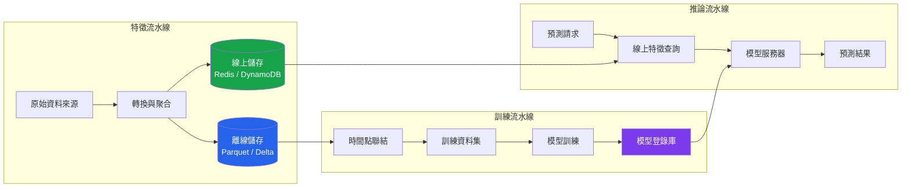

# [BEE-583] AI 機器學習特徵倉庫

:::info
特徵倉庫（Feature Store）是將特徵計算與模型訓練及推論分離的共享基礎設施。它提供用於訓練資料集的離線儲存（Offline Store）和用於低延遲服務的線上儲存（Online Store）——並保證兩條路徑中的特徵值相同。若缺乏此分離，重複的轉換邏輯會導致訓練-服務偏差（Train-Serve Skew），這是生產環境 ML 系統中靜默準確率下降的首要原因。
:::

## 背景

生產環境中的機器學習模型依賴特徵（Feature）——原始資料的轉換、聚合或聯結表示。在專用特徵倉庫基礎設施出現之前，每個團隊需要撰寫兩次轉換程式碼：一次用 Python 供訓練流水線使用，另一次用服務語言（Java、Go、SQL）供即時推論使用。這兩套實作會隨時間分歧，造成訓練-服務偏差：模型在推論時遇到的特徵分佈與訓練時不同，卻不會產生任何可觀察的錯誤。

Uber 的 Michelangelo 平台於 2017 年 9 月的工程部落格文章中正式確立了特徵倉庫的概念。Michelangelo 解決了跨團隊特徵重用問題，並建立了離線/線上二元性作為核心架構抽象。Airbnb 於 2018 年（Strata NY 發表）推出 Zipline，報告稱該工具將特徵生成時間從數月縮短至約一天。

第一篇重要的學術論文出現在 VLDB 2021（Orr 等人，《管理 ML 流水線：特徵倉庫與嵌入生態系統的浪潮》，https://dl.acm.org/doi/10.14778/3476311.3476402）。Hopsworks 在 SIGMOD 2024 發表了特徵倉庫論文（https://dl.acm.org/doi/10.1145/3626246.3653389），是頂級資料庫會議上的首篇特徵倉庫論文。

LinkedIn 於 2022 年 4 月開源了 Feathr（https://github.com/feathr-ai/feathr），該工具自 2017 年起即在生產環境運行。Feast（https://github.com/feast-dev/feast）成為主要的開源選擇，擁有約 7,000 個 stars 和 Apache 2.0 授權。頂尖商業特徵倉庫 Tecton 由原 Michelangelo 團隊創立，並於 2025 年 8 月被 Databricks 收購（https://www.databricks.com/blog/tecton-joining-databricks-power-real-time-data-personalized-ai-agents）。

## 訓練-服務偏差問題

訓練-服務偏差（Train-Serve Skew）源於四種根本原因：

**重複的轉換程式碼。** 同一個特徵——例如 30 天滾動平均值——在離線訓練中用 PySpark 實作一次，在服務層中再實作一次。細微的實作差異（空值處理、時區處理、浮點數捨入）會產生不同的值。

**資料來源分歧。** 訓練從歷史資料倉庫快照讀取。推論從事務性資料庫或串流讀取。兩個來源具有不同的結構、更新頻率或延遲特性。

**空值（Null）與零的不匹配。** 缺失值在一條路徑中被視為零，在另一條路徑中被視為空值。對於樹模型，空值的傳播方式與零不同。對於神經網路，零插補會改變輸入分佈。

**結構漂移（Schema Drift）。** 在訓練流水線更新之前，上游資料結構在服務路徑中已更改，反之亦然。

特徵倉庫透過將每個特徵定義一次——作為單一 Python 函式或 SQL 表達式——並從相同的程式碼路徑將其物化到離線和線上儲存來消除偏差。

```python
from feast import FeatureView, Feature, FileSource, ValueType
from feast.types import Float64, Int64
import pandas as pd
from datetime import timedelta

# 定義一次特徵邏輯——用於訓練和服務
user_metrics_source = FileSource(
    path="s3://data-lake/user_metrics/",
    timestamp_field="event_timestamp",
)

user_metrics_view = FeatureView(
    name="user_metrics",
    entities=["user_id"],
    ttl=timedelta(days=1),
    schema=[
        Feature(name="purchase_count_30d", dtype=Int64),
        Feature(name="avg_session_duration_7d", dtype=Float64),
        Feature(name="days_since_last_login", dtype=Int64),
    ],
    source=user_metrics_source,
)
```

## 架構：FTI 三流水線

業界標準的分解方式使用三個解耦的流水線，稱為 FTI（Feature-Training-Inference）：



**特徵流水線：** 讀取原始資料，應用轉換，並將結果寫入離線儲存（供訓練使用）和線上儲存（供服務使用）。這是特徵邏輯執行的唯一位置。物化（Materialization）通常是針對歷史特徵的批次作業（每小時或每天），輔以即時特徵的串流計算。

**訓練流水線：** 使用時間點聯結（Point-in-Time Join，下文說明）從離線儲存讀取，生成無標籤洩漏的訓練資料集。

**推論流水線：** 在預測時，透過實體鍵（例如 `user_id`）從線上儲存查詢當前特徵值。線上儲存返回最近物化的值。

## 時間點正確性

歷史訓練資料集必須反映在預測時實際可用的特徵值——而非事後才知曉的值。用精確時間戳記聯結的特徵會使用事件時間戳記的特徵值，但在生產環境中，特徵可能要等到數秒或數分鐘後才完成計算。

As-of 聯結（向後查找聯結）返回在事件時間戳記當時或之前可用的最近特徵值：

```python
import pandas as pd

def point_in_time_join(
    entity_df: pd.DataFrame,
    feature_df: pd.DataFrame,
    entity_col: str,
    timestamp_col: str,
    feature_timestamp_col: str,
) -> pd.DataFrame:
    """
    對於 entity_df 中的每一行，在 feature_df 中找到
    在 entity_df[timestamp_col] 當時或之前最近的特徵值。

    透過排除在預測時間戳記之後計算的特徵值來防止標籤洩漏。
    """
    entity_df = entity_df.sort_values(timestamp_col)
    feature_df = feature_df.sort_values(feature_timestamp_col)

    result = pd.merge_asof(
        entity_df,
        feature_df,
        left_on=timestamp_col,
        right_on=feature_timestamp_col,
        by=entity_col,
        direction="backward",  # as-of：時間戳記之前的最近值
    )
    return result


# 使用範例
entity_df = pd.DataFrame({
    "user_id": [101, 101, 202],
    "event_timestamp": pd.to_datetime(
        ["2024-01-15 10:00", "2024-01-20 14:00", "2024-01-18 09:00"]
    ),
    "label": [1, 0, 1],
})

feature_df = pd.DataFrame({
    "user_id": [101, 101, 101, 202],
    "feature_timestamp": pd.to_datetime(
        ["2024-01-10 00:00", "2024-01-17 00:00", "2024-01-22 00:00", "2024-01-15 00:00"]
    ),
    "purchase_count_30d": [5, 8, 12, 3],
})

training_data = point_in_time_join(
    entity_df, feature_df, "user_id", "event_timestamp", "feature_timestamp"
)
# 第 1 行（1 月 15 日）：取得 1 月 10 日的特徵（值=5），而非 1 月 17 日
# 第 2 行（1 月 20 日）：取得 1 月 17 日的特徵（值=8），而非 1 月 22 日
```

## 線上服務

線上儲存必須在生產查詢速率下以不超過 10ms 返回特徵向量。Tecton 指定的目標是在每秒 100,000 個請求下低於 5ms。

```python
import redis
import json
import time
from dataclasses import dataclass
from typing import Optional

@dataclass
class FeatureVector:
    entity_id: str
    features: dict[str, float | int | str]
    materialized_at: float  # Unix 時間戳記
    age_seconds: float      # 自物化以來的時間


class OnlineFeatureStore:
    def __init__(self, redis_url: str, ttl_seconds: int = 86400):
        self.client = redis.Redis.from_url(redis_url, decode_responses=True)
        self.ttl_seconds = ttl_seconds

    def get_features(
        self,
        feature_view: str,
        entity_id: str,
        feature_names: list[str],
    ) -> Optional[FeatureVector]:
        key = f"fv:{feature_view}:{entity_id}"
        data = self.client.hgetall(key)
        if not data:
            return None

        materialized_at = float(data.get("_ts", 0))
        features = {
            name: json.loads(data[name])
            for name in feature_names
            if name in data
        }

        return FeatureVector(
            entity_id=entity_id,
            features=features,
            materialized_at=materialized_at,
            age_seconds=time.time() - materialized_at,
        )

    def materialize(
        self,
        feature_view: str,
        entity_id: str,
        features: dict[str, float | int | str],
    ) -> None:
        key = f"fv:{feature_view}:{entity_id}"
        payload = {name: json.dumps(val) for name, val in features.items()}
        payload["_ts"] = str(time.time())
        self.client.hset(key, mapping=payload)
        self.client.expire(key, self.ttl_seconds)


# 具備資料新鮮度檢查的推論呼叫
def get_features_with_freshness_check(
    store: OnlineFeatureStore,
    feature_view: str,
    entity_id: str,
    feature_names: list[str],
    max_age_seconds: float = 3600,
) -> dict[str, float | int | str]:
    fv = store.get_features(feature_view, entity_id, feature_names)

    if fv is None:
        # 實體不在線上儲存中——使用預設值或觸發按需計算
        return {name: 0.0 for name in feature_names}

    if fv.age_seconds > max_age_seconds:
        # 記錄資料陳舊——不要失敗，帶警告繼續服務
        import logging
        logging.warning(
            "特徵資料陳舊 %s/%s：已有 %.0f 秒（最大 %s 秒）",
            feature_view, entity_id, fv.age_seconds, max_age_seconds,
        )

    return fv.features
```

## 物化策略

| 策略 | 延遲 | 新鮮度 | 使用情境 |
|---|---|---|---|
| 批次（每小時/每天） | 無 | 分鐘至小時 | 用戶級聚合、緩慢變化的特徵 |
| 微批次（1–5 分鐘） | 無 | 分鐘 | 會話聚合、近期事件計數 |
| 串流（Kafka + Flink） | 即時 | 秒 | 即時信號：點擊、加入購物車、詐欺 |
| 按需（請求時間） | 增加 p99 | 始終最新 | 需要請求上下文的特徵 |

串流物化需要一個消費事件並原子性寫入線上儲存的串流處理作業：

```python
from pyflink.datastream import StreamExecutionEnvironment
from pyflink.table import StreamTableEnvironment

env = StreamExecutionEnvironment.get_execution_environment()
t_env = StreamTableEnvironment.create(env)

# 串流特徵：1 小時滾動購買次數
t_env.execute_sql("""
    CREATE TABLE purchases (
        user_id BIGINT,
        amount DECIMAL(10,2),
        event_time TIMESTAMP(3),
        WATERMARK FOR event_time AS event_time - INTERVAL '5' SECOND
    ) WITH (
        'connector' = 'kafka',
        'topic' = 'purchases',
        'format' = 'json'
    )
""")

t_env.execute_sql("""
    CREATE TABLE user_purchase_features (
        user_id BIGINT,
        purchase_count_1h BIGINT,
        window_end TIMESTAMP(3),
        PRIMARY KEY (user_id) NOT ENFORCED
    ) WITH (
        'connector' = 'redis',
        'host' = 'redis.internal',
        'ttl' = '7200'
    )
""")

t_env.execute_sql("""
    INSERT INTO user_purchase_features
    SELECT
        user_id,
        COUNT(*) AS purchase_count_1h,
        TUMBLE_END(event_time, INTERVAL '1' HOUR) AS window_end
    FROM purchases
    GROUP BY user_id, TUMBLE(event_time, INTERVAL '1' HOUR)
""")
```

## 常見錯誤

**跳過離線儲存。** 有些團隊只建立線上儲存（用於特徵的 Redis 快取）。若沒有離線儲存，訓練流水線無法重現歷史特徵值——時間點聯結變得不可能，訓練-服務偏差也就無可避免。

**用掛鐘時間進行 as-of 聯結。** 使用精確時間戳記聯結而非 as-of 聯結所組裝的訓練資料集，會靜默地包含在預測時尚未可用的特徵。模型從未來學習。歷史評估的準確率被誇大；線上準確率則較低。

**在未治理的情況下跨流水線共用轉換程式碼。** 如果特徵流水線和手動資料科學 notebook 以略微不同的方式轉換相同的原始欄位，notebook 版本會累積並訓練出特徵倉庫無法重現的模型。所有轉換必須源自特徵倉庫定義。

**在服務時忽略特徵新鮮度。** 線上儲存返回最近物化的值。如果物化是每小時一次，但特徵在您的使用場景中（例如詐欺評分）30 分鐘後就會過時，服務 59 分鐘前的值會產生比預設回退值更差的預測。務必追蹤 `age_seconds` 並為每個特徵視圖定義最大陳舊度閾值（MUST）。

**過度偏重即時特徵。** 串流計算比批次計算複雜且昂貴得多。用戶級模型的大多數特徵——30 天聚合、隊列成員資格、累計消費——變化緩慢。僅對特徵新鮮度直接改變預測的情況保留串流：詐欺信號、會話級上下文、庫存可用性。

## 相關 BEE

- [BEE-503 LLM API 整合模式](503) — 從線上儲存消費特徵用於提示詞增強的 LLM 推論流水線
- [BEE-509 RAG 流水線架構](509) — 向量檢索作為一種按需特徵計算形式
- [BEE-529 AI 工作流程編排](529) — 將特徵流水線與訓練和服務工作流程一起編排
- [BEE-126 資料庫遷移](126) — 離線儲存中的結構演化（Parquet/Delta 結構更改）
- [BEE-437 變更數據捕獲](437) — CDC 作為即時特徵物化的來源串流

## 參考資料

- Uber Engineering，《Meet Michelangelo: Uber's Machine Learning Platform》，2017 年 9 月 5 日。https://www.uber.com/blog/michelangelo-machine-learning-platform/
- Airbnb Engineering，《Zipline: Airbnb's Machine Learning Data Management Platform》，Strata NY 2018。https://conferences.oreilly.com/strata/strata-ny-2018/public/schedule/detail/68114.html
- Orr, L. 等人，《Managing ML Pipelines: Feature Stores and the Coming Wave of Embedding Ecosystems》，VLDB 2021。https://dl.acm.org/doi/10.14778/3476311.3476402
- Hopsworks，《A Feature Store for AI》，SIGMOD 2024。https://dl.acm.org/doi/10.1145/3626246.3653389
- Feast 文件。https://docs.feast.dev/
- Databricks，《Tecton Joining Databricks》，2025 年 8 月。https://www.databricks.com/blog/tecton-joining-databricks-power-real-time-data-personalized-ai-agents
- AWS SageMaker Feature Store 概念。https://docs.aws.amazon.com/sagemaker/latest/dg/feature-store-concepts.html
- Vertex AI Feature Store 概覽。https://cloud.google.com/vertex-ai/docs/featurestore/latest/overview
