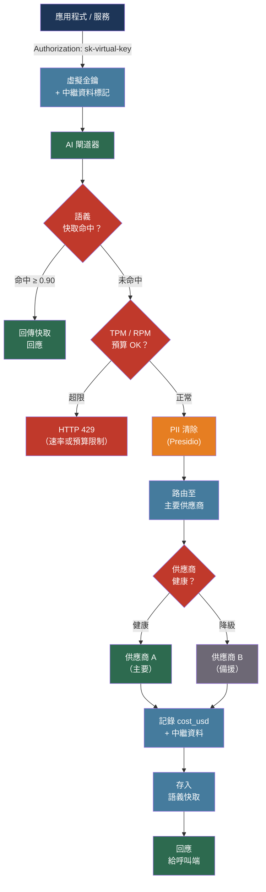

# [BEE-515] AI 閘道器模式

:::info
AI 閘道器是專為 LLM 流量設計的反向代理，集中處理以 Token 為基礎的速率限制、多供應商故障切換、費用歸因、語義快取與 PII 清除 —— 這些問題一般的 API 閘道器處理不當，因為 LLM 請求與回應的大小、費用和延遲具有 HTTP 層級原語無法建模的非對稱性。
:::

## 背景

標準 API 閘道器在 HTTP 層級處理請求：依請求數量進行速率限制、依路徑進行路由，並記錄標頭和狀態碼。這個模型對 LLM 流量會失效。一個 LLM 請求的回應可能消耗 50 個到 50,000 個 Token 不等。依請求數量進行速率限制，讓單一客戶端只需少量觸發長篇生成的請求，就能耗盡供應商的每分鐘 Token 配額（TPM）。HTTP 層級的日誌對模型選擇、Token 消耗或費用一無所知。供應商 API 金鑰分散在應用程式碼中，而非集中管理。

到 2024 年，出現的操作模式是 AI 閘道器：一個理解 LLM 請求/回應格式、從回應中擷取 Token 計數、並強制執行應用層不應各自獨立實作的政策的代理層。AI 閘道器不是 API 閘道器的替代品 —— 它位於處理 TLS 終止、身份驗證和粗粒度路由的 API 閘道器之後，以及 LLM 供應商之前。

主要的開源實作是 LiteLLM Proxy（BerriAI），它將 OpenAI API 介面標準化至 100+ 個模型供應商，並增加了虛擬金鑰管理、預算執行、語義快取和故障切換路由。商業版本包括 Portkey、Cloudflare AI Gateway、Kong AI Gateway，以及 Azure API Management 的 AI 閘道器功能。

## 設計思維

AI 閘道器解決五個應用程式無法獨立妥善處理的問題：

**Token 層級的速率限制**：供應商配額以每分鐘 Token 數計，而非每分鐘請求數。執行 RPM 限制而非 TPM 限制的應用程式，會不可預測地遭遇供應商的 429 錯誤。閘道器從回應中繼資料追蹤 Token 消耗，在請求離開資料中心前執行 TPM 限制。

**多供應商故障切換**：任何單一供應商都有區域性停機、特定模型的上下文視窗限制，以及隨帳戶層級不同的速率限制。維護供應商健康模型的閘道器，無需更改應用程式碼即可繞過故障。

**費用歸因**：沒有歸因的 LLM API 支出沒有負責人，會靜默增長直到出現在月度帳單上。閘道器是所有 LLM 呼叫都必須經過的唯一地方 —— 使它成為在費用到達供應商前，按團隊、功能或租戶標記費用的正確位置。

**集中式憑證管理**：當金鑰嵌入許多服務時，輪替供應商 API 金鑰非常痛苦。閘道器向服務發行虛擬金鑰，集中保管真實供應商金鑰；輪替只在一處發生。

**合規強制執行**：PII 清除和用於稽核的 Prompt/回應日誌必須可靠執行，而非作為盡力而為的應用層關切。閘道器在網路層強制執行。

## 最佳實踐

### 使用虛擬金鑰進行存取控制與預算執行

**MUST**（必須）向 AI 閘道器的每個消費者發行虛擬金鑰，而非散布真實的供應商 API 金鑰。虛擬金鑰將閘道器憑證與供應商憑證解耦：供應商金鑰輪替時，只有閘道器設定需要更改。

**SHOULD**（應該）依反映消費者角色的方式，為每個金鑰指定預算和速率限制：

```yaml
# LiteLLM Proxy：虛擬金鑰設定
model_list:
  - model_name: "gpt-4o"
    litellm_params:
      model: openai/gpt-4o
      api_key: os.environ/OPENAI_API_KEY
  - model_name: "claude-sonnet"
    litellm_params:
      model: anthropic/claude-sonnet-4-6
      api_key: os.environ/ANTHROPIC_API_KEY

general_settings:
  master_key: sk-gateway-master   # 管理員金鑰；絕不分發給消費者

# 虛擬金鑰屬性透過 API 設定：
# POST /key/generate
# {
#   "models": ["gpt-4o", "claude-sonnet"],
#   "max_budget": 50.00,           # 美元硬性限制；超出後回傳 429
#   "tpm_limit": 100000,           # 每分鐘 Token 數
#   "rpm_limit": 100,              # 每分鐘請求數
#   "budget_duration": "1d",       # 每日重置
#   "team_id": "search-team",
#   "metadata": {"feature": "semantic-search"}
# }
```

**SHOULD** 以三層階層組織金鑰：組織 → 團隊 → 金鑰。上層的預算限制向下層級聯，防止單一團隊耗盡組織的月度預算。

**MUST NOT**（不得）在生產環境和非生產環境之間共用虛擬金鑰。金鑰帶有預算；在真實流量高峰前耗盡生產預算的負載測試就是服務中斷。

### 強制執行 Token 速率限制，而非僅請求速率限制

**MUST** 在閘道器強制執行每分鐘 Token 數（TPM）速率限制，獨立於 RPM 限制。單獨的 RPM 無法限制 Token 消耗：

```python
# 沒有 TPM 限制：5 RPM 允許無限 Token 消耗
# 請求 1：50 個 Token（簡單分類）
# 請求 2：48,000 個 Token（長文件分析）
# 兩者都通過 RPM 檢查；第二個耗盡 50K TPM 配額

# 在閘道器執行 TPM：
# 閘道器從供應商回應讀取 usage.total_tokens
# 從每個金鑰的 TPM 計數器中扣除
# 達到限制時回傳帶有 Retry-After 的 HTTP 429
```

**SHOULD** 設定 TPM 限制時為並行請求留有餘裕。擁有 100K TPM 限制的金鑰應在 80K 使用率時發出警報 —— 最後 20% 可能已是飛行中但 Token 計數尚未知曉的請求。

**SHOULD** 設定供應商層級的故障切換（供應商回傳 429 時）和先發制人的路由（金鑰的 TPM 使用率超過閾值時，主動路由到次要供應商而非等待 429）：

```yaml
# LiteLLM 路由器：速率限制時的供應商層級故障切換
router_settings:
  routing_strategy: "usage-based-routing-v2"
  model_group_alias:
    gpt-4o-primary:
      - model: openai/gpt-4o
        tpm: 500000
        rpm: 1000
    gpt-4o-fallback:
      - model: azure/gpt-4o-eastus
        tpm: 500000
        rpm: 1000

  fallbacks:
    - gpt-4o-primary: ["gpt-4o-fallback"]
  context_window_fallbacks:
    - gpt-4o-mini: ["gpt-4o"]   # 上下文超過 mini 限制時升級
```

### 以熔斷器實作多供應商故障切換

**SHOULD** 設定閘道器將供應商健康狀態視為第一等關切。健康的故障切換鏈對每個模型層級至少有兩個獨立供應商：

| 層級 | 主要 | 次要 | 第三 |
|------|-----|-----|-----|
| 輕量 | OpenAI gpt-4o-mini | Anthropic Haiku | Google Gemini Flash |
| 標準 | OpenAI gpt-4o | Anthropic Sonnet | Azure gpt-4o |
| 重型 | Anthropic Opus | OpenAI gpt-4 | — |

**SHOULD** 在觸發故障切換前，對供應商錯誤使用帶有抖動的指數退避。短暫的速率限制（429）在幾秒內恢復；在第一個 429 就熔斷會造成不必要的供應商切換：

```python
# LiteLLM 重試與故障切換設定
import litellm

litellm.set_verbose = False
response = litellm.completion(
    model="gpt-4o",
    messages=messages,
    num_retries=3,
    # 觸發故障切換前先對這些狀態碼重試
    retry_on=[429, 500, 503],
    fallbacks=[
        {"gpt-4o": ["azure/gpt-4o", "anthropic/claude-sonnet-4-6"]}
    ],
    context_window_fallbacks=[
        {"gpt-4o-mini": ["gpt-4o"]}  # ContextWindowExceededError 時升級
    ],
    timeout=30,
)
```

**SHOULD** 在閘道器追蹤供應商延遲和錯誤率，並將其作為指標公開。每個供應商的 P95 TTFT（首 Token 時間）是供應商降級的領先指標，在硬性錯誤出現之前就能偵測。

### 在每個請求中進行費用歸因

**MUST** 為通過閘道器的每個請求記錄 `cost_usd`、`input_tokens`、`output_tokens`、`model`，以及至少一個業務維度（`team_id`、`feature`、`tenant_id`）。這份資料是判斷首先應用哪種優化的前提條件（見 BEE-513）。

**SHOULD** 在閘道器層強制標記，而非信任應用層：

```bash
# 消費者在請求中傳遞中繼資料；閘道器記錄它
curl https://ai-gateway.internal/v1/chat/completions \
  -H "Authorization: Bearer sk-virtual-key-abc" \
  -H "X-Gateway-Metadata: {\"feature\":\"doc-search\",\"tenant\":\"acme\"}" \
  -d '{"model": "gpt-4o", "messages": [...]}'

# 閘道器從回應中擷取費用，寫入費用帳本：
# {
#   "key_id": "sk-virtual-key-abc",
#   "team_id": "search-team",
#   "feature": "doc-search",
#   "tenant": "acme",
#   "model": "openai/gpt-4o",
#   "input_tokens": 1240,
#   "output_tokens": 380,
#   "cost_usd": 0.004700,
#   "timestamp": "2026-04-15T03:22:11Z"
# }
```

**SHOULD** 在月度預算的 50% 和 80% 設置每日預算警報，並在 100% 設置硬性限制。閘道器的硬性限制回傳帶有預算耗盡錯誤碼的 HTTP 429 —— 這優於月度帳單上的意外驚喜。

### 在閘道器層應用語義快取

閘道器層級的語義快取獨立於應用快取運作，無需每個應用各自實作即可使所有消費者受益：

**SHOULD** 為查詢分布集中在常見問題的工作負載，在閘道器啟用語義快取。知識庫和支援工作負載的快取命中率通常在 30–70%：

```yaml
# LiteLLM：使用 Redis 向量儲存的語義快取
cache:
  type: "redis-semantic"
  redis_url: "redis://cache.internal:6379"
  similarity_threshold: 0.90   # 餘弦相似度；超過此值回傳快取回應
  ttl: 3600                    # 1 小時 TTL；依工作負載新鮮度需求調整
  # 快取鍵：模型 + 正規化訊息列表雜湊
  # 近似重複查詢無需訪問供應商即回傳相同回應
```

**MUST NOT** 快取包含即時上下文的查詢回應（當前時間、即時價格、用戶特定狀態）。在應用層為這些請求模式標記 `Cache-Control: no-store`，並在閘道器層遵守此標頭。

### 在請求離開邊界前清除 PII

**MUST** 為任何處理發送至第三方供應商的用戶提交文字的閘道器，設定 PII 清除。Prompt 中的 PII 會被傳送至供應商，並可能被供應商記錄。

**SHOULD** 在網路層而非應用層清除，使政策統一適用於所有消費者：

```python
# LiteLLM：在供應商呼叫前基於回調的 PII 清除
import litellm
from presidio_analyzer import AnalyzerEngine
from presidio_anonymizer import AnonymizerEngine

analyzer = AnalyzerEngine()
anonymizer = AnonymizerEngine()

def scrub_pii(messages: list[dict]) -> list[dict]:
    scrubbed = []
    for msg in messages:
        if msg["role"] == "user":
            results = analyzer.analyze(text=msg["content"], language="en")
            anonymized = anonymizer.anonymize(text=msg["content"], analyzer_results=results)
            scrubbed.append({**msg, "content": anonymized.text})
        else:
            scrubbed.append(msg)
    return scrubbed

# 在 LiteLLM 中註冊為前置呼叫鉤子
litellm.pre_call_hook = lambda kwargs, **_: {
    **kwargs,
    "messages": scrub_pii(kwargs["messages"])
}
```

**SHOULD** 記錄清除事件（偵測到的實體類型，而非實體值）以供合規稽核追蹤。這可證明 PII 控制正在運作，而不會將 PII 重新引入日誌。

### 謹慎選擇部署拓撲

兩種部署拓撲涵蓋大多數團隊設定：

**集中式閘道器** —— 單一閘道器部署處理跨服務的所有 LLM 流量：

```
服務 → [AI 閘道器] → [LLM 供應商]
           |
        [費用資料庫]
        [快取]
        [稽核日誌]
```

優點：政策的單一入口、單一稽核追蹤、單一費用儀表板。適用於消耗 LLM 的服務少於 10 個的團隊。

**每命名空間 Sidecar** —— 每個產品命名空間執行自己的閘道器實例，共享後端儲存：

```
[團隊 A 服務] → [閘道器 A] ─┐
[團隊 B 服務] → [閘道器 B] ─┤→ [LLM 供應商]
[團隊 C 服務] → [閘道器 C] ─┘
                    |
          [共享費用資料庫 / 快取]
```

優點：資料駐留合規、每團隊政策自主性、故障隔離。當不同團隊有不同法規要求（HIPAA 與非法規）時需要此配置。

**SHOULD** 從集中式閘道器開始。Sidecar 部署的操作複雜性 —— 每個閘道器實例有自己的設定、升級週期和故障模式 —— 只有在有具體的合規或隔離需求時才值得。

## 視覺圖



## 相關 BEE

- [BEE-19036](../distributed-systems/api-gateway-patterns.md) -- API 閘道器模式：AI 閘道器所在的通用閘道器模式之後；TLS 終止、身份驗證和路徑路由仍在那裡處理
- [BEE-30011](ai-cost-optimization-and-model-routing.md) -- AI 成本優化與模型路由：閘道器是成本優化中描述的模型路由層級和每功能費用預算的執行點
- [BEE-30009](llm-observability-and-monitoring.md) -- LLM 可觀測性與監控：閘道器發出的 TTFT、Token 吞吐量和 cost_usd 指標，供應可觀測性儀表板和警報規則使用
- [BEE-30008](llm-security-and-prompt-injection.md) -- LLM 安全與 Prompt 注入：在閘道器設定的 PII 清除和輸出護欄，實現了 LLM 安全縱深防禦策略的一部分
- [BEE-12007](../resilience/rate-limiting-and-throttling.md) -- 速率限制與節流：每分鐘 Token 數執行是其中涵蓋的通用速率限制模式的領域特定應用

## 參考資料

- [BerriAI. LiteLLM Proxy — Simple Proxy Server — docs.litellm.ai](https://docs.litellm.ai/docs/simple_proxy)
- [BerriAI. LiteLLM Virtual Keys — docs.litellm.ai](https://docs.litellm.ai/docs/proxy/virtual_keys)
- [BerriAI. LiteLLM Router — Load Balancing — docs.litellm.ai](https://docs.litellm.ai/docs/routing)
- [Portkey. AI Gateway Documentation — portkey.ai/docs](https://portkey.ai/docs/product/ai-gateway)
- [Kong Inc. AI Gateway — developer.konghq.com](https://developer.konghq.com/ai-gateway/)
- [Cloudflare. AI Gateway — developers.cloudflare.com](https://developers.cloudflare.com/ai-gateway/)
- [Microsoft. GenAI Gateway Capabilities in Azure API Management — learn.microsoft.com](https://learn.microsoft.com/en-us/azure/api-management/genai-gateway-capabilities)
- [OWASP. GenAI Security Project — genai.owasp.org](https://genai.owasp.org/)
- [Redis. What Is Semantic Caching? Guide to Faster, Smarter LLM Apps — redis.io](https://redis.io/blog/what-is-semantic-caching/)
- [Anthropic. Building Effective Agents — anthropic.com/research](https://www.anthropic.com/research/building-effective-agents)
